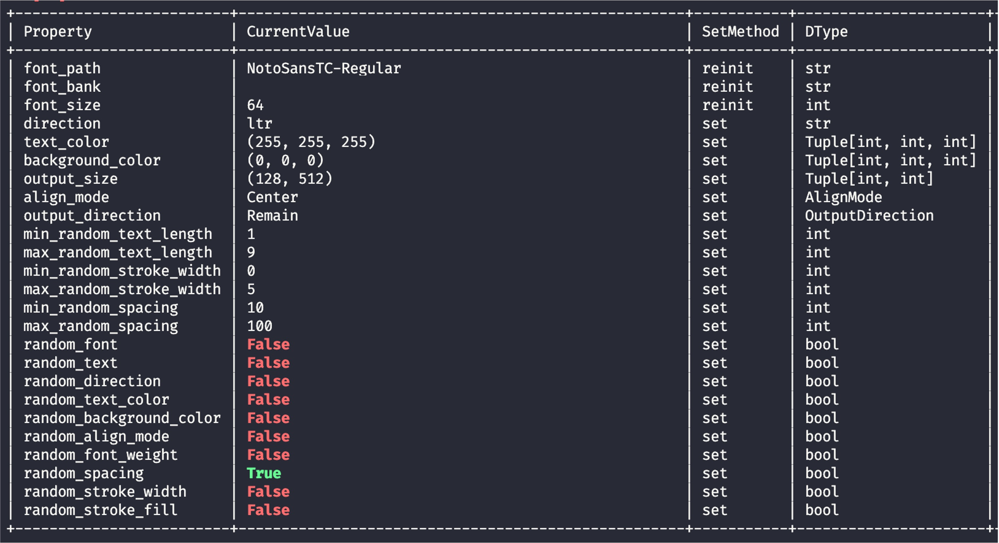

# 高度な使い方

基本的な使用方法に加えて、出力する文字や画像を柔軟に制御できる高度な設定を提供しています。ここではランダム性の設定を導入し、これらの特性は主にモデルのトレーニングで使用されます。

ランダム機能を利用するには、`RandomWordCanvas` クラスを使用してください。

## ランダムフォント

`random_font` パラメータを設定することでランダムフォント機能を有効にできます。`random_font` が `True` に設定されている場合、`font_bank` パラメータが有効になり、`font_path` は無視されます。

`font_bank` パラメータをフォントライブラリに指定する必要があります。デフォルト値はパッケージ内の `fonts` ディレクトリで、サンプルとしてこのディレクトリに 2 つのフォントを配置しています。そのため、`font_bank` を変更しない場合、この 2 つのフォントからランダムに選択されます。

```python
import numpy as np
from wordcanvas import RandomWordCanvas

gen = RandomWordCanvas(
    random_font=True,
    output_size=(64, 512),
    # font_bank="path/to/your/font/bank"
)

imgs = []
for _ in range(8):
    text = 'Hello, World!'
    img = gen(text)
    imgs.append(img)

# 全画像を結合して出力
img = np.concatenate(imgs, axis=0)
```


## ランダムテキスト内容

生成する文字が不明な場合は、`random_text` パラメータを使用します。

`random_text` を `True` に設定すると、入力された `text` は無視されます。

```python
import numpy as np
from wordcanvas import RandomWordCanvas

gen = RandomWordCanvas(
    random_text=True,
    output_size=(64, 512),
)

imgs = []
for _ in range(8):
    text = 'Hello!World!' # この入力は無視されます
    img = gen(text)
    imgs.append(img)

# 全画像を結合して出力
img = np.concatenate(imgs, axis=0)
```


## 文字列の長さ指定

`random_text` を有効にすると、以下のパラメータで文字列の長さ範囲を指定できます：

- `min_random_text_length`: 最小文字数
- `max_random_text_length`: 最大文字数

```python
import numpy as np
from wordcanvas import RandomWordCanvas

# 5文字固定で生成
gen = RandomWordCanvas(
    random_text=True,
    min_random_text_length=5,
    max_random_text_length=5,
    output_size=(64, 512),
)

imgs = []
for _ in range(8):
    img = gen()
    imgs.append(img)

# 全画像を結合して出力
img = np.concatenate(imgs, axis=0)
```


## ランダム背景色

`random_background_color` パラメータを設定してランダム背景色機能を有効にできます。

```python
import numpy as np
from wordcanvas import RandomWordCanvas

gen = RandomWordCanvas(
    random_background_color=True,
    output_size=(64, 512),
)

imgs = []
for _ in range(8):
    text = 'Hello, World!'
    img = gen(text)
    imgs.append(img)

# 全画像を結合して出力
img = np.concatenate(imgs, axis=0)
```


## ランダム文字色

`random_text_color` パラメータを使用して、ランダムな文字色の機能を有効にできます。

```python
import numpy as np
from wordcanvas import RandomWordCanvas

gen = RandomWordCanvas(
    random_text_color=True,
    output_size=(64, 512),
)

imgs = []
for _ in range(8):
    text = 'Hello, World!'
    img = gen(text)
    imgs.append(img)

# 全画像を結合して出力
img = np.concatenate(imgs, axis=0)
```


## ランダム文字揃え

`random_align_mode` パラメータを使用してランダムな文字揃えを有効にできます。

```python
import numpy as np
from wordcanvas import RandomWordCanvas

gen = RandomWordCanvas(
    random_align_mode=True,
    output_size=(64, 512),
)

imgs = []
for _ in range(8):
    text = 'Hello, World!'
    img = gen(text)
    imgs.append(img)

# 全画像を結合して出力
img = np.concatenate(imgs, axis=0)
```


## ランダム文字方向

`random_direction` パラメータを使用して、ランダムな文字方向を有効にできます。

このパラメータを使用する際は、`output_direction` を組み合わせると出力が便利です。

```python
import numpy as np
from wordcanvas import RandomWordCanvas, OutputDirection

gen = RandomWordCanvas(
    random_direction=True,
    output_direction=OutputDirection.Horizontal,
    output_size=(64, 512),
)

imgs = []
for _ in range(8):
    text = 'こんにちは、またはこんばんは。'
    img = gen(text)
    imgs.append(img)

# 全画像を結合して出力
img = np.concatenate(imgs, axis=0)
```


## ランダム文字の外枠

`random_stroke_width` パラメータを使用してランダムな文字外枠を有効にできます。また、`min_random_stroke_width` と `max_random_stroke_width` で外枠の幅を指定できます。

外枠の色は `stroke_fill` で指定可能ですが、`random_stroke_fill` を使用してランダム外枠色を有効にすることも可能です。

```python
import numpy as np
from wordcanvas import RandomWordCanvas

gen = RandomWordCanvas(
    random_stroke_width=True,  # ランダム外枠幅を有効化
    random_stroke_fill=True,   # ランダム外枠色を有効化
    min_random_stroke_width=1, # 最小外枠幅
    max_random_stroke_width=5, # 最大外枠幅
    output_size=(64, 512),
)

imgs = []
for _ in range(8):
    text = 'Hello, World!'
    img = gen(text)
    imgs.append(img)

# 全画像を結合して出力
img = np.concatenate(imgs, axis=0)
```


:::warning
`random_stroke_width` を使用すると、以下の警告が表示される場合があります：

```python
Using `random_stroke_width` may cause an OSError: array allocation size too large error with certain text.
This is a known issue with the `Pillow` library (see https://github.com/python-pillow/Pillow/issues/7287) and cannot be resolved directly.
```

`Pillow` ライブラリにおける既知の問題で、外枠幅が原因でエラーが発生する可能性があります。関連する issue のリンクを参照してください。
:::

## ランダムな行間

`random_spacing` パラメータを使用して、ランダムな行間を有効にできます。`min_random_spacing` と `max_random_spacing` で行間の範囲を指定できます。

```python
import numpy as np
from wordcanvas import RandomWordCanvas, AlignMode

gen = RandomWordCanvas(
    random_spacing=True,
    min_random_spacing=10,
    max_random_spacing=100,
    align_mode=AlignMode.Center,
    output_size=(128, 512),
)

imgs = []
for _ in range(2):
    img = gen('こんにちは！\nHello, World!')
    imgs.append(img)

# 全画像を結合して出力
img = np.concatenate(imgs, axis=1)
```


## フォントの重み付け

フォントごとにサポートする文字数が異なるため、モデルのトレーニング時にフォントの重み付けが不均等になる場合があります。これを軽減するために、`random_font_weight` パラメータを使用できます。

:::tip
簡単に言えば、すべてのフォントが同じ確率で選択されますが、特定の文字をサポートするフォントが少ない場合、その文字がトレーニングされる頻度が低くなります。
:::

```python
from wordcanvas import RandomWordCanvas

gen = RandomWordCanvas(
    random_font=True,
    random_font_weight=True,
    output_size=(64, 512),
)
```

このパラメータを有効にすると、`RandomWordCanvas` はフォントがサポートする文字数に応じて選択確率を調整します。サポートする文字数が少ないフォントの選択確率が低くなり、均等な分布が得られます。

## 除外リスト

フォントを使用する際、一部のフォントで正しくレンダリングされないケースが発生することがあります。この問題を解決するため、`block_font_list` パラメータで除外リストを設定できます。

```python
import numpy as np
from wordcanvas import WordCanvas, RandomWordCanvas

gen = WordCanvas(
    block_font_list=['AABB']
)

gen_random = RandomWordCanvas(
    block_font_list=['AABB'],
)
```

設定後、`*AABB*.(ttf|otf)` を含むフォントが選択されなくなります。

## ダッシュボード

ダッシュボードでは、`RandomWordCanvas` の詳細情報が表示されます：



ランダム性に関連するパラメータが有効の場合は緑、無効の場合は赤で表示されます。

## まとめ

このツールの開発目標は、深層学習モデルのトレーニングに特化した柔軟な文字画像生成ツールを作成することです。ランダム性を導入することで、現実世界のさまざまな状況を模倣し、モデルの適応性と汎化能力を向上させます。これらの機能をぜひお試しください。
