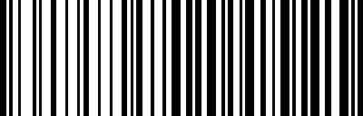

# バーコード生成

:::tip
この機能はバージョン 0.5.0 で追加されました。
:::

この機能は日常の実装で使う小さな機能であり、独立したプロジェクトとして公開するのは適切でないと感じたため、ここにまとめました。

Code 39 と Code 128 の 2 種類のバーコードジェネレーターを実装しました。

## Code 39

Code 39（別名 Alpha39、Code 3 of 9、Code3/9、Type 39、USS Code39 または USD-3）は、ISO/IEC 16388:2007 に定義された可変長のバーコードです。43 の文字を表現でき、これには大文字のラテンアルファベット（A〜Z）、数字（0〜9）、およびいくつかの特殊文字（-、.、$、/、+、％、空白）が含まれます。終端記号として「\*」という外部シンボルがあります。各文字は 9 つの部分で構成され、5 本の線と 4 つの空白があります。その中で 3 つの部分が広く（バイナリ 1）、6 つの部分が狭いです。狭いと広いの比率は重要ではなく、1:2 から 1:3 の範囲であれば問題ありません。

:::info
上記の情報は [**Wikipedia: Code39**](https://zh.wikipedia.org/wiki/Code39) から抜粋したものです。
:::

使用方法は以下の通りです：

```python
import docsaidkit as D
from wordcanvas import Code39Generator

gen = Code39Generator(
    width_rate=2,
    color=(0, 0, 0)
)

img = gen('123456789', w=400, h=128)
D.imwrite(img)
```

- `width_rate` は、狭い部分と広い部分の比率を設定します。デフォルトは 2 で、1:2 から 1:3 の範囲が推奨されます。
- `color` はバーコードの色を設定します。デフォルトは黒です。

生成されたバーコードの画像は次のようになります：


## Code 128

Code 128 は高密度の 1 次元バーコードで、1981 年に Computer Identics 社によって開発され、さまざまな文字セットをエンコードするために設計されました。Code 39 と比べて、Code 128 はより高いエンコード効率と大きなデータ容量を持ち、長いデータと多様な文字をエンコードするアプリケーションに適しています。

Code 128 はすべての 128 の ASCII 文字をエンコードでき、数字、大文字・小文字のアルファベット、さまざまな特殊文字を含みます。Code 128 には 3 つのサブセットがあり、それぞれ A、B、C です。サブセット A は制御文字と大文字のアルファベット、サブセット B は大小文字のアルファベットと特殊文字、サブセット C は主に数字データを圧縮して、2 桁の数字を 1 文字でエンコードします。

Code 128 は Code 39 と比べて、より少ない要素で多くの文字を表現するため、同じデータ量の場合、バーコードがより短くコンパクトになります。Code 128 バーコードは特定の開始文字で始まり、その使用サブセット（A、B、C）を示し、特殊な終了文字で終了します。各 Code 128 バーコードにはチェックコードが含まれており、データの正確性を保証します。このチェックコードはバーコード内容に基づいて計算され、読み取りエラーを検出するために使用されます。

使用方法は以下の通りです：

```python
import docsaidkit as D
from wordcanvas import Code128Generator, CodeType

# デフォルトの設定を使用
gen = Code128Generator(
    code_type=CodeType.Code128_B,
    color=(0, 0, 0)
)

barcode_img = gen("ABCD1234", w=400, h=128)
D.imwrite(barcode_img)
```



## 高度な描画

次に、より複雑なシナリオを想定してみましょう：

200 x 600 のサイズで、128 x 400 の Code39 バーコードを描画し、その位置を(36, 100)に設定し、背景色を(200, 200, 0)に設定します。次のコードを参考にしてください：

```python
import numpy as np
import docsaidkit as D
from wordcanvas import Code39Generator

gen = Code39Generator()

# 出力画像のサイズと背景色を設定
output_img = np.zeros((200, 600, 3), dtype=np.uint8) + (200, 200, 0)

# バーコードのサイズを設定
x, y, w, h = np.array([100, 36, 400, 128])

# バーコードを生成（サイズは400 x 128）
barcode_img = gen("ABCD1234", w=400, h=128)

# バーコードを背景画像上に配置
slice_x = slice(x, x+w)
slice_y = slice(y, y+h)
output_img[slice_y, slice_x] = \
np.where(barcode_img > 0, output_img[slice_y, slice_x], barcode_img)
```


同様に、Code128 を使っても同じ結果が得られます：

```python
from wordcanvas import Code128Generator

gen = Code128Generator()

# ... 以下同様
```


## 結論

この機能を使うことで、バーコードの位置検出や解析のモデルをトレーニングすることができます。

この機能は一見地味に見えますが、手を慣らすには良い練習になります。
