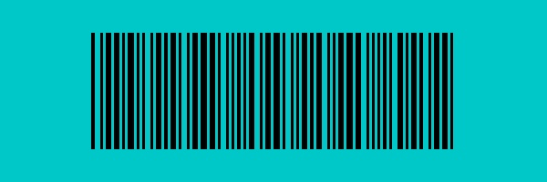

# バーコード生成

この機能は日常的な小規模な実装の一つであり、単独のプロジェクトとしては適さないため、ここに組み込みました。

Code 39 と Code 128 の 2 つのフォーマットのバーコードジェネレーターを実装しました。

## Code 39

Code39（Alpha39、Code 3 of 9、Code3/9、Type 39、USS Code39、USD-3 とも呼ばれる）は、ISO/IEC 16388:2007 で定義されている長さが可変のバーコードです。大文字のラテン文字（A から Z）、数字（0 から 9）、特殊文字（-、.、$、/、+、％、スペース）を含む 43 文字を表現できます。さらに、終端記号として「\*」が追加されます。各文字は 9 つの部分（5 本の線と 4 つの空白）で構成され、そのうち 3 つが太線（二進数で 1）、6 つが細線です。太線と細線の比率は重要ではなく、1:2 から 1:3 の範囲内で設定可能です。

:::info
上記の情報は [**Wikipedia: Code39**](https://zh.wikipedia.org/wiki/Code39) より引用しています。
:::

使用方法は以下の通りです：

```python
from wordcanvas import Code39Generator

gen = Code39Generator(
    width_rate=2,
    color=(0, 0, 0)
)

img = gen('123456789', w=400, h=128)
```

- `width_rate`：太線と細線の比率を設定（デフォルト値は 2）。1:2 から 1:3 の範囲を推奨。
- `color`：バーコードの色を設定（デフォルトは黒）。

生成されたバーコードは以下のようになります：


## Code 128

Code 128 は 1981 年に Computer Identics 社が開発した高密度な 1 次元バーコードで、多様な文字セットをエンコードするために設計されています。Code 39 と比べてエンコード効率が高く、データ容量も大きいため、長いデータや多様な文字のエンコードが必要な場面に適しています。

Code 128 は、数字、大文字小文字のアルファベット、特殊文字を含む ASCII 文字全 128 個をエンコードできます。サブセット A、B、C の 3 種類があり、A は制御文字と大文字、B は大文字小文字と特殊文字、C は数字データを圧縮するために使用されます。

Code 39 と比較して、Code 128 はより少ない要素で多くの文字を表現できるため、同じデータ量でもバーコードが短くなります。Code 128 バーコードは、使用されるサブセット（A、B、C）を示す開始文字で始まり、特定の停止文字で終了します。さらに、データの正確性を確認するためのチェックサムが含まれます。

使用方法は以下の通りです：

```python
from wordcanvas import Code128Generator, CodeType

# デフォルト値を使用
gen = Code128Generator(
    code_type=CodeType.Code128_B,
    color=(0, 0, 0)
)

barcode_img = gen("ABCD1234", w=400, h=128)
```


## 高度な描画

次に、より複雑な状況を考えてみます：

200 x 600 のキャンバス上に、128 x 400 の Code39 バーコードを描画し、それを (36, 100) の位置に配置し、背景色を (200, 200, 0) に設定します。この場合のコードは以下の通りです：

```python
import numpy as np
from wordcanvas import Code39Generator

gen = Code39Generator()

# キャンバスのサイズと背景色を設定
output_img = np.zeros((200, 600, 3), dtype=np.uint8) + (200, 200, 0)

# バーコードのサイズを設定
x, y, w, h = np.array([100, 36, 400, 128])

# 400 x 128 のバーコードを生成
barcode_img = gen("ABCD1234", w=400, h=128)

# バーコードをキャンバスに配置
slice_x = slice(x, x+w)
slice_y = slice(y, y+h)
output_img[slice_y, slice_x] = \
np.where(barcode_img > 0, output_img[slice_y, slice_x], barcode_img)
```



---

同様に、Code128 に切り替えることで同じ結果を得ることができます：

```python
from wordcanvas import Code128Generator

gen = Code128Generator()

# ... 以下同じ

```


## まとめ

この機能を活用することで、バーコードの位置特定と解析モデルをトレーニングすることが可能になります。

この機能自体は目立った用途は少ないかもしれませんが、スキルの練習には非常に有用です。
