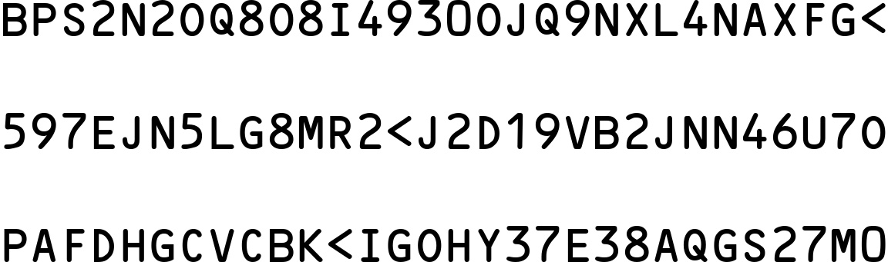
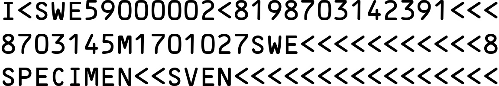

# MRZ 生成

`WordCanvas` の開発が完了した後、このツールを使って他のことを行うことができます。

この章では、「指定された入力テキスト」から「MRZ画像」をレンダリングする機能を開発します。

:::info
この機能は主に、私たちの [**MRZScanner**](https://docsaid.org/ja/docs/mrzscanner) モデルのトレーニングをサポートするために使用されます。

興味のある読者は、私たちが提供するモデルを試すことができます：[**MRZScanner Demo**](https://docsaid.org/ja/playground/mrzscanner-demo)
:::

## MRZ とは？

MRZ（Machine Readable Zone, 機械可読ゾーン）は、パスポート、ビザ、身分証明書などの旅行書類に含まれる特定の領域で、この領域の情報は機械で迅速に読み取ることができます。MRZ は国際民間航空機関（ICAO）の第 9303 号文書の規定に基づき設計および生成されており、国境検査の迅速化や情報処理の正確性向上を目的としています。

- [**ICAO Doc9309**](https://www.icao.int/publications/Documents/9303_p1_cons_en.pdf)

MRZ の構造は書類の種類によって異なり、主に以下の種類があります：

1. **TD1（身分証など）：**

   - 3 行、各行 30 文字、合計 90 文字。
   - 含まれる情報：書類種別、国コード、書類番号、生年月日、性別、有効期限、国籍、姓、名、任意データ 1、任意データ 2。

2. **TD2（パスポートカードなど）：**

   - 2 行、各行 36 文字、合計 72 文字。
   - 含まれる情報：書類種別、国コード、姓、名、書類番号、国籍、生年月日、性別、有効期限、任意データ。

3. **TD3（パスポートなど）：**

   - 2 行、各行 44 文字、合計 88 文字。
   - 含まれる情報：書類種別、国コード、姓、名、書類番号、国籍、生年月日、性別、有効期限、任意データ。

4. **MRVA（ビザタイプ A）：**

   - 2 行、各行 44 文字、合計 88 文字。
   - 含まれる情報：書類種別、国コード、姓、名、書類番号、国籍、生年月日、性別、有効期限、任意データ。

5. **MRVB（ビザタイプ B）：**

   - 2 行、各行 36 文字、合計 72 文字。
   - 含まれる情報：書類種別、国コード、姓、名、書類番号、国籍、生年月日、性別、有効期限、任意データ。

## 合成画像

MRZ 検出モデルを訓練する際、大量のデータセットが必要ですが、これらのデータには個人情報が含まれるため、収集が難しい場合があります。この問題を解決するために、`WordCanvas` を利用して MRZ 画像を合成します。

関連機能はすでに完成しており、以下のサンプルコードを参照して `MRZGenerator` を使用できます：

```python
from wordcanvas import MRZGenerator

mrz_gen = MRZGenerator(
    text_color=(0, 0, 0),
    background_color=(255, 255, 255),
)

output_infos = mrz_gen()
img = output_infos['image']
```

この設定では、文字色、背景色、区切り文字を手動で指定できます。MRZ の文字は 2 ～ 3 行で構成されており、区切り文字は一律で`\n`に設定されています。

設定後、関数として呼び出すだけで済みます。`__call__` メソッドはすでに実装済みです：

```python
output_infos = mrz_gen()
```

これにより、合成された MRZ 画像を取得できます。データの出力形式は以下の通りです：

- `typ`：MRZ の種類。
- `text`：MRZ の文字。
- `points`：MRZ 内の各文字の座標。
- `image`：MRZ 画像。

出力時、パラメータを指定しない場合は、MRZ の種類（TD1、TD2、TD3）がランダムに決定されます。その後、MRZ 文字をランダムに生成し、画像を合成します。

以下は出力画像の例です：


## 各文字の座標を表示

文字ごとの位置に興味がある場合、文字検出モデルの訓練に役立ちます。この機能はすでに実装済みで、`points` 属性を呼び出すだけで取得可能です。以下のように描画して確認できます：

```python
import cv2
from capybara import draw_points
from wordcanvas import MRZGenerator

mrz_gen = MRZGenerator(
    text_color=(0, 0, 0),
    background_color=(255, 255, 255),
)

output_infos = mrz_gen()

img = output_infos['image']
points = output_infos['points']
points_img = draw_points(img, points, scales=5)
```


## 文字背景色と間隔の変更

`text_color` と `background_color` パラメータを使用して、文字と背景の色を変更できます：

```python
mrz_gen = MRZGenerator(
    text_color=(255, 0, 0),
    background_color=(0, 127, 127),
)

output_infos = mrz_gen()
img = output_infos['image']
```


---

`spacing` パラメータを使用して文字間隔を調整できます：

```python
mrz_gen = MRZGenerator(
    spacing=100,
)

output_infos = mrz_gen()
img = output_infos['image']
```



## MRZ 文字の指定

MRZ 文字を指定したい場合、呼び出し時に `mrz_type` と `mrz_text` パラメータを渡すことができます。関数内部で基本的なチェック（文字長さや種類との一致など）は実施済みです。

:::warning
注意：ハッシュチェックは実施していません。この機能は画像の合成を目的としており、有効な MRZ 文字である必要はありません。
:::

```python
mrz_gen = MRZGenerator(spacing=32)

output_infos = mrz_gen(
    mrz_type='TD1',
    mrz_text=[
        "I<SWE59000002<8198703142391<<<",
        "8703145M1701027SWE<<<<<<<<<<<8",
        "SPECIMEN<<SVEN<<<<<<<<<<<<<<<<"
    ]
)

img = output_infos['image']
```



## 関連資料

- [**Arg0s1080/mrz**](https://github.com/Arg0s1080/mrz)
- [**Detecting machine-readable zones in passport images**](https://pyimagesearch.com/2015/11/30/detecting-machine-readable-zones-in-passport-images/)
- [**ultimateMRZ-SDK**](https://github.com/DoubangoTelecom/ultimateMRZ-SDK)
- [**QKMRZScanner**](https://github.com/Mattijah/QKMRZScanner)
- [**PassportScanner**](https://github.com/evermeer/PassportScanner)
