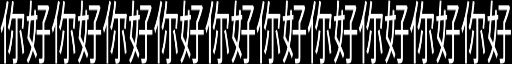
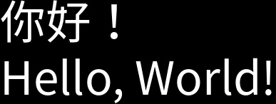

# クイックスタート

初めの一歩が最も難しいものです。ここでは簡単なスタート方法をご紹介します。

## 文字列から始める

まず、基本的な宣言を行い、使用を開始します。

```python
from wordcanvas import WordCanvas

gen = WordCanvas(return_infos=True)
```

デフォルト設定を使用して、関数を直接呼び出すことで文字画像を生成できます。

```python
text = "你好！Hello, World!"
img, infos = gen(text)

print(img.shape)
# >>> (67, 579, 3)

print(infos)
# {'text': '你好！Hello, World!',
#  'bbox(xyxy)': (0, 21, 579, 88),
#  'bbox(wh)': (579, 67),
#  'offset': (0, -21),
#  'direction': 'ltr',
#  'background_color': (0, 0, 0),
#  'text_color': (255, 255, 255),
#  'spacing': 4,
#  'align': 'left',
#  'stroke_width': 0,
#  'stroke_fill': (0, 0, 0),
#  'font_path': 'fonts/NotoSansTC-Regular.otf',
#  'font_size_actual': 64,
#  'font_name': 'NotoSansTC-Regular',
#  'align_mode': <AlignMode.Left: 0>,
#  'output_direction': <OutputDirection.Remain: 0>}
```


:::tip
デフォルトモードでは、出力画像のサイズは以下に依存します：

1. **フォントサイズ**：デフォルトは 64 です。フォントサイズが大きくなると、画像サイズも大きくなります。
2. **文字列の長さ**：文字列が長いほど、画像の幅も広くなります（具体的な長さは `pillow` が決定）。
3. 出力情報 `infos` には、テキスト、背景色、文字色など、すべての描画パラメータが含まれます。
4. 単純に画像を出力したい場合は、`return_infos=False` を設定してください（デフォルト値）。
   :::

## 特定のフォントを指定する

`font` パラメータを使用して、好きなフォントを指定できます。

```python
from wordcanvas import WordCanvas

# return_infos を指定しない場合、デフォルトで False となり、infos は返されません
gen = WordCanvas(
    font_path="/path/to/your/font/OcrB-Regular.ttf"
)

text = 'Hello, World!'
img = gen(text)
```


フォントが入力文字をサポートしていない場合、「豆腐字」が表示されます。

```python
text = 'Hello, 中文!'
img = gen(text)
```


:::tip
**フォントが文字をサポートしているか確認する方法：**

現在、私自身にはこのニーズはありませんが、基本的な方法を以下に示します。この方法は 1 回に 1 文字のみ確認できるため、全ての文字をループ処理で確認する必要があります。他の要件がある場合は、自由に拡張してください。

```python title="check_font.py"
from wordcanvas import is_character_supported, load_ttfont

target_text = 'Hello, 中文!'

font = load_ttfont("/path/to/your/font/OcrB-Regular.ttf")

for c in target_text:
    status = is_character_supported(font, c)

# >>> Character '中' (0x4e2d) is not supported by the font.
# >>> Character '文' (0x6587) is not supported by the font.
```

:::

## 設定画像サイズ

`output_size` パラメータを使用して、画像サイズを調整できます。

```python
from wordcanvas import WordCanvas

gen = WordCanvas(output_size=(64, 1024))  # 高さ64、幅1024
img = gen(text)
print(img.shape)
# >>> (64, 1024, 3)
```


指定したサイズが文字画像のサイズより小さい場合、自動的に文字画像が縮小されます。つまり、文字が詰まって細長い長方形になります。例：

```python
from wordcanvas import WordCanvas

text = '你好' * 10
gen = WordCanvas(output_size=(64, 512))  # 高さ64、幅512
img = gen(text)
```



## 背景色を変更する

`background_color` パラメータを使用して背景色を変更できます。

```python
from wordcanvas import WordCanvas

gen = WordCanvas(background_color=(255, 0, 0))  # 青色の背景
img = gen(text)
```


## 文字色を変更する

`text_color` パラメータを使用して文字色を変更できます。

```python
from wordcanvas import WordCanvas

gen = WordCanvas(text_color=(0, 255, 0))  # 緑色の文字
img = gen(text)
```


## 文字の整列を調整する

:::warning
先ほどの画像サイズ設定を覚えていますか？

デフォルトでは、**文字の整列設定は意味を持ちません**。画像を描画する際、文字画像に余白が必要で、整列の効果を確認するには十分なスペースを確保する必要があります。
:::

`align_mode` パラメータを使用して文字の整列モードを調整できます。

```python
from wordcanvas import AlignMode, WordCanvas

gen = WordCanvas(
    output_size=(64, 1024),
    align_mode=AlignMode.Center
)

text = '你好！ Hello, World!'
img = gen(text)
```

- **中央揃え：`AlignMode.Center`**

  

- **右揃え：`AlignMode.Right`**

  

- **左揃え：`AlignMode.Left`**

  

- **分散揃え：`AlignMode.Scatter`**

  

  :::tip
  分散揃えモードでは、すべての文字が均等に分散されるわけではなく、単語単位で分散されます。中国語では単語の単位は 1 文字、英語では単語の単位はスペースです。

  上図の場合：入力文字列は "你好！ Hello, World!" です。この文字列は以下のように分割されます：

  - ["你", "好", "！", "Hello,", "World!"]

  スペースを無視した後に分散揃えを適用します。

  さらに、入力文字列が 1 つの単語しか含まない場合、中国語では分散揃えが中央揃えと同等になり、英語では単語を文字ごとに分割してから分散揃えを適用します。

  この部分のロジックは以下のように実装されています：

  ```python
  def split_text(text: str):
      """ 文字列を分割してリストに変換 """
      pattern = r"[a-zA-Z0-9\p{P}\p{S}]+|."
      matches = regex.findall(pattern, text)
      matches = [m for m in matches if not regex.match(r'\p{Z}', m)]
      if len(matches) == 1:
          matches = list(text)
      return matches
  ```

  :::warning
  これは単純な実装であり、すべてのニーズを満たすわけではありません。より完全な文字列分割ソリューションがあれば、ぜひご提案ください。
  :::

## 文字方向を調整する

`direction` パラメータを使用して、文字の方向を調整できます。

- **横書き文字**

  ```python
  from wordcanvas import AlignMode, WordCanvas

  text = '你好！'
  gen = WordCanvas(direction='ltr')  # 左から右への横書き文字
  img = gen(text)
  ```

  

- **縦書き文字**

  ```python
  from wordcanvas import AlignMode, WordCanvas

  text = '你好！'
  gen = WordCanvas(direction='ttb')  # 上から下への縦書き文字
  img = gen(text)
  ```

  

- **縦書き文字で分散揃え**

  ```python
  from wordcanvas import AlignMode, WordCanvas

  text = '你好！'
  gen = WordCanvas(
      direction='ttb',
      align_mode=AlignMode.Scatter,
      output_size=(64, 512)
  )
  img = gen(text)
  ```

  

## 出力方向を調整する

`output_direction` パラメータを使用して出力方向を調整できます。

:::tip
**このパラメータの使用シナリオ**：縦書き文字を出力したいが、水平方向で文字画像を確認したい場合などに役立ちます。
:::

- **縦書き文字を水平に出力**

  ```python
  from wordcanvas import OutputDirection, WordCanvas

  gen = WordCanvas(
      direction='ttb',
      output_direction=OutputDirection.Horizontal
  )

  text = '你好！'
  img = gen(text)
  ```

  

- **横書き文字を垂直に出力**

  ```python
  from wordcanvas import OutputDirection, WordCanvas

  gen = WordCanvas(
      direction='ltr',
      output_direction=OutputDirection.Vertical
  )

  text = '你好！'
  img = gen(text)
  ```

  

## 文字を圧縮する

特定のシナリオでは文字が非常に圧縮されている場合があります。この場合は `text_aspect_ratio` パラメータを使用します。

```python
from wordcanvas import WordCanvas

gen = WordCanvas(
    text_aspect_ratio=0.25,  # 文字の高さ / 文字の幅 = 1/4
    output_size=(32, 1024),
)  # 文字を圧縮

text = "圧縮テスト"
img = gen(text)
```


:::info
注意点として、圧縮後の文字サイズが `output_size` を超える場合、自動的に画像がスケールダウンされます。そのため、圧縮したつもりが元のサイズに戻ることがあります。
:::

## 文字の外枠

`stroke_width` パラメータを使用して文字の外枠の幅を調整できます。

```python
from wordcanvas import WordCanvas

gen = WordCanvas(
    font_size=64,
    text_color=(0, 0, 255),  # 青色の文字
    background_color=(255, 0, 0),  # 赤色の背景
    stroke_width=2,  # 外枠の幅
    stroke_fill=(0, 255, 0),  # 緑色の外枠
)

text = "外枠テスト"
img = gen(text)
```


:::warning
`stroke_width` を使用すると以下のような警告が表示される場合があります：

```python
Using `stroke_width` may cause an OSError: array allocation size too large error with certain text.
This is a known issue with the `Pillow` library (see https://github.com/python-pillow/Pillow/issues/7287) and cannot be resolved directly.
```

`Pillow` ライブラリ内で `stroke_width` を使用すると、特定の条件下で `OSError` エラーが発生する可能性があります。これは `Pillow` の既知の問題であり、警告内に関連する issue リンクを記載してあります。詳しくはリンク先をご参照ください。
:::

## 複数行テキスト

`\n` 改行文字を使用することで、複数行テキストを実現できます。

```python
from wordcanvas import WordCanvas

gen = WordCanvas()

text = '你好！\nHello, World!'
img = gen(text)
```



複数行テキストの場合、先述のほとんどの機能と組み合わせることができます。例えば：

```python
from wordcanvas import WordCanvas, AlignMode

gen = WordCanvas(
  text_color=(0, 0, 255),  # 青色の文字
  output_size=(128, 512),  # 高さ128、幅512
  background_color=(0, 0, 0),  # 黒色の背景
  align_mode=AlignMode.Center,  # 中央揃え
  stroke_width=2,  # 外枠の幅
  stroke_fill=(0, 255, 0),  # 緑色の外枠
)

text = '你好！\nHello, World!'
img = gen(text)
```


:::warning
以下の条件では複数行テキストはサポートされません：

1. **`align_mode` が `AlignMode.Scatter` の場合**

   ```python
   gen = WordCanvas(align_mode=AlignMode.Scatter)
   ```

2. **`direction` が `ttb` の場合**

   ```python
   gen = WordCanvas(direction='ttb')
   ```

これらの機能が必要な場合は、複数行テキストを使用しないでください。
:::

## ダッシュボード

基本機能は以上です。

最後に、ダッシュボード機能について紹介します。

```python
from wordcanvas import WordCanvas

gen = WordCanvas()
print(gen)
```

`print` を使用しなくても、直接出力することが可能です。これは、`__repr__` メソッドが実装されているためです。

出力すると、シンプルなダッシュボードが表示されます。


ダッシュボードでは以下の内容が確認できます：

- **Property**：すべての設定パラメータ。
- **Current Value**：パラメータの「現在の値」。
- **SetMethod**：パラメータの設定方法。
  - `set` のパラメータは直接変更可能。
  - `reinit` のパラメータは、`WordCanvas` オブジェクトの再初期化が必要。
- **DType**：パラメータのデータ型。
- **Description**：パラメータの説明。（図には省略）

ほとんどのパラメータは直接変更可能で、出力特性を変更する際に新しいオブジェクトを作成する必要がありません。ただし、`reinit` が必要なパラメータ（例：`font_size`）については、フォントの初期化が関係するため、直接変更することはできません。

```python
gen.output_size = (64, 1024)
gen.text_color = (0, 255, 0)
gen.align_mode = AlignMode.Center
gen.direction = 'ltr'
gen.output_direction = OutputDirection.Horizontal
```

設定後、すぐに呼び出して新しい文字画像を生成できます。ただし、`reinit` が必要なパラメータを直接変更しようとすると、以下のようなエラーが発生します：

- **AttributeError: can't set attribute**

  ```python
  gen.font_size = 128
  # >>> AttributeError: can't set attribute
  ```

:::danger
強引にパラメータを変更することもできますが、後の画像生成でエラーが発生する可能性があります：

```python
gen._font_size = 128
```

この場合、エラーを回避するために新しいオブジェクトを再初期化することをお勧めします。
:::

## まとめ

ここでは基本的な機能について説明しました。他にも多くの機能がありますが、基本的な使用方法は以上です。

次の章では、さらに高度な機能について説明します。
