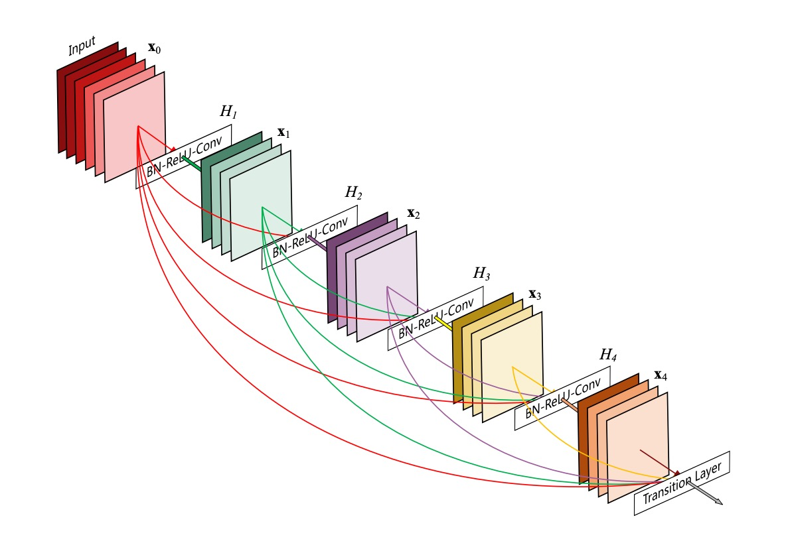
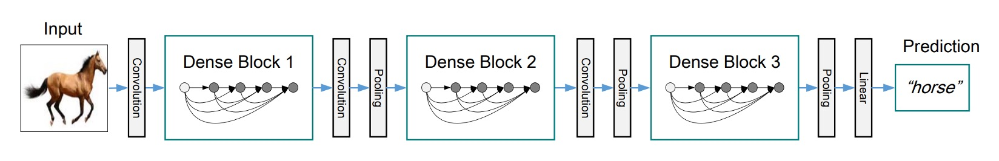
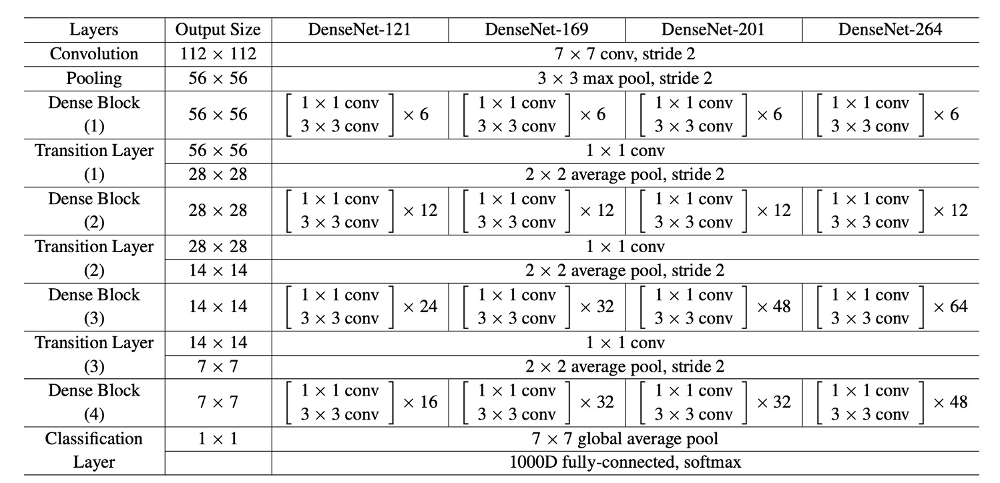
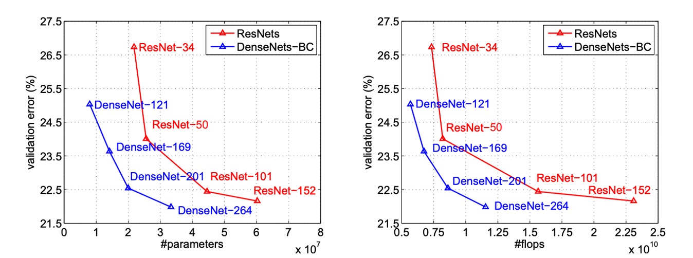
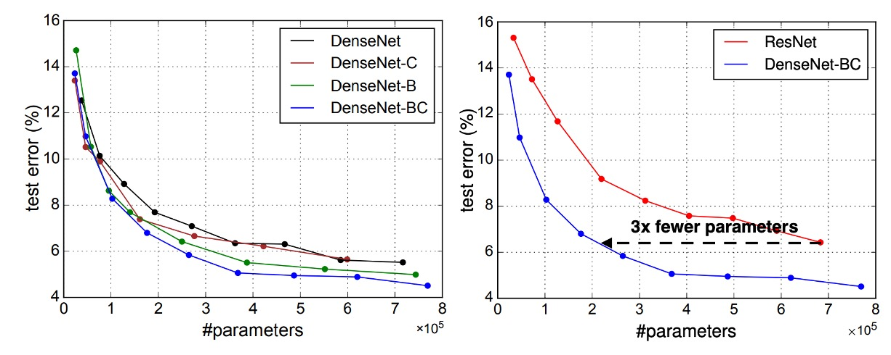
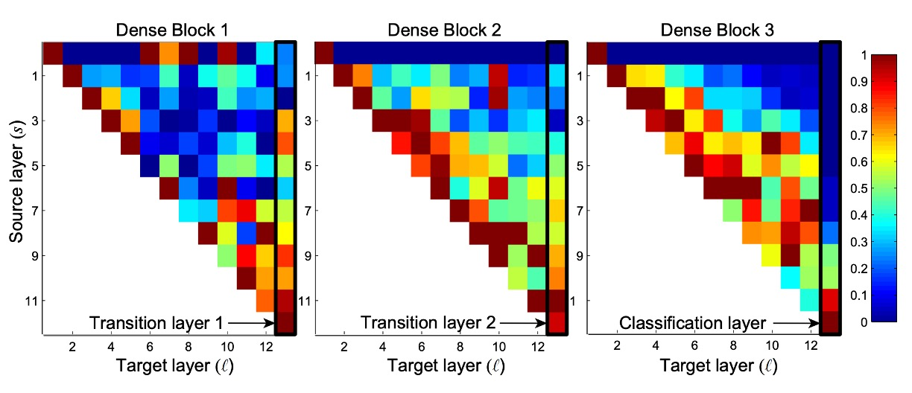

# [16.08] DenseNet

## 全部連起來

[**Densely Connected Convolutional Networks**](https://arxiv.org/abs/1608.06993)

---

隨著 CNN 變得愈來愈深，輸入影像的梯度資訊常會消失，使得訓練變得困難。

於是各種研究開始探討如何讓資訊在深度網路中更好地流動，其中一篇大作就是：ResNet。

- [**Deep Residual Learning for Image Recognition**](https://arxiv.org/abs/1512.03385)

## 定義問題

ResNet 透過加性恆等使資訊保存變得明確，但其實很多層的貢獻很小：

- [**Deep networks with stochastic depth**](https://arxiv.org/abs/1603.09382)

:::tip
這個問題在 MobilenetV2 中會再次提到，我們讀到那篇論文再來詳談。

- [**Mobilenet-V2: 瓶頸內的淬煉**](../1801-mobilenet-v2/index.md)
  :::

除了 ResNet 之外，另外一個有名的方法是高速公路網路：

- [**Highway Networks**](https://arxiv.org/abs/1505.00387)

這篇論文不是想要否定上述的研究，而是想提出一個新的連接方式，讓資訊可以更有效率地在網路中流動。

## 解決問題

### 網路架構

這個圖畫得非常淺顯易懂，但容易讓人誤會：

這不是一整個網路架構，這裡描述的是一個 Dense Block 的結構。

在這個結構中，每一層的輸入都是前面所有層的輸出的串接，然後這裡沒有降採樣的操作。

作者提出這種連接方式，就是為了解決 ResNet 的末尾層貢獻過小的問題：

- 既然資訊流不到末尾，那就讓每一層都串再一起吧！

### 平均池化

如上圖所示。

在卷積神經網路（CNN）中，下採樣層（例如池化層）是改變特徵圖大小的重要組成部分。

為了有效地進行下採樣，作者將網路劃分為多個密集連接的密集塊（Dense Block）。

在每個密集塊之間存在過渡層，這些過渡層執行卷積和池化操作。

整個過渡層由 Batch Normalizatio 和 1×1 卷積層組成，接著是 2×2 平均池化層。

### Growth Rate

DenseNet 的一個重要特點是成長率（Growth Rate）。

在 DenseNet 中，如果每個函數 $ H_l $ 產生 k 個特徵圖，則第 $ l $ 層有 $ k_0 + k \times (l - 1) $ 個輸入特徵圖，其中 $ k_0 $ 是輸入層中的通道數。

DenseNet 與其他網路架構的一個重要區別在於它可以具有非常窄的層，例如 k = 12。這個超參數 k 被稱為網路的成長率。

研究表明，相對較小的成長率已足以在測試的資料集上獲得最先進的結果。這是因為每一層都可以訪問其區塊中所有先前的特徵圖，從而獲取網路的「集體知識」。成長率控制了每一層為全局狀態貢獻的新資訊量，而全局狀態一旦寫入，便可從網路中的任何位置訪問，無需逐層複製它。

### Bottleneck Layers

儘管每一層僅產生 k 個輸出特徵圖，但它通常具有更多的輸入。

研究指出，可以在每個 3×3 卷積之前引入 1×1 卷積作為瓶頸層，以減少輸入特徵圖的數量，從而提高計算效率。

這種設計對於 DenseNet 特別有效，因此作者將這樣的網路稱為具有瓶頸層的 DenseNet-B。

瓶頸層的結構為：BN-ReLU-Conv(1×1)-BN-ReLU-Conv(3×3)。在實驗中，每個 1×1 卷積產生 4k 個特徵圖。

### Compression

為了進一步提高模型的緊湊性，作者設計了一種減少過渡層特徵圖數量的方法。

如果一個密集塊包含 m 個特徵圖，接下來的過渡層將產生 $ bθmc $ 個輸出特徵圖，其中 $ 0 < θ ≤ 1 $ 被稱為壓縮因子。當 $ θ = 1 $ 時，過渡層的特徵圖數量保持不變。

作者將 $ θ < 1 $ 的 DenseNet 稱為 DenseNet-C，並在實驗中設定 $ θ = 0.5 $。當同時使用 $ θ < 1 $ 的瓶頸層和過渡層時，這樣的模型被稱為 DenseNet-BC。

### 實作細節

在除 ImageNet 之外的所有資料集上，作者使用了具有三個密集區塊（Dense Block）的 DenseNet 進行實驗。

每個密集區塊包含相同數量的層。在進入第一個密集區塊之前，對輸入影像進行 16 個（或 DenseNet-BC 成長率的兩倍）輸出通道的捲積。對於內核大小為 3×3 的捲積層，輸入的每一側都進行零填充，以保持特徵圖大小固定。

在兩個連續的密集區塊之間，作者使用了 1×1 卷積，然後使用 2×2 平均池化作為過渡層。在最後一個密集區塊的結尾，進行全域平均池化，然後附加一個 softmax 分類器。三個密集區塊中的特徵圖大小分別為 32×32、16×16 和 8×8。

作者在實驗中使用了以下基本 DenseNet 結構配置：

- L = 40, k = 12
- L = 100, k = 12
- L = 100, k = 24

對於 DenseNet-BC，評估的配置為：

- L = 100, k = 12
- L = 250, k = 24
- L = 190, k = 40

在 ImageNet 資料集上的實驗中，作者使用了具有 4 個密集區塊的 DenseNet-BC 結構，並在 224×224 的輸入影像上進行實驗。

初始卷積層包含 2k 個大小為 7×7、步幅為 2 的捲積。

所有其他層中的特徵圖數量也取決於 k 的設定。

## 討論

### 實驗結果

上圖將 DenseNets 和 ResNets 的單作物 top-1 驗證誤差分別繪製為參數數量和 FLOPs 數量的函數，展示了兩者在性能和計算資源使用方面的差異。

在左圖中，我們可以看到 DenseNet 和 ResNet 的驗證誤差與參數數量之間的關係，DenseNet-201 具有約 20M 的參數，其驗證誤差與具有超過 40M 參數的 ResNet-101 相似。這表明 DenseNet 能夠在使用更少參數的情況下實現與 ResNet 類似的性能。

右圖展示了驗證誤差與 FLOPs 數量之間的關係。在這個圖中，我們看到需要與 ResNet-50 相同計算量的 DenseNet 其性能與 ResNet-101 相當，而 ResNet-101 需要兩倍的計算量。這進一步證實了 DenseNet 在計算效率方面的優勢，能夠在相對較少的計算資源下達到高性能。

### 緊湊模型

DenseNet 層學習的任何特徵圖都可以被所有後續層存取，這是輸入串聯的直接結果。

這鼓勵了整個網路中的功能重複使用，並導致模型更加緊湊。

上圖左側的兩張圖顯示了一項比較 DenseNet 所有變體（左）和類似 ResNet 架構（右）的參數效率的實驗結果。作者在 C10+ 上訓練了多個不同深度的小型網絡，並將它們的測試精度繪製為網絡參數的函數。結果顯示，DenseNet-BC 是所有 DenseNet 變體中參數效率最高的。

此外，為了達到相同的精度，DenseNet-BC 僅需 ResNet 約三分之一的參數。

僅具有 0.8M 可訓練參數的 DenseNet-BC 能夠達到與 1001 層 ResNet（10.2M 參數）相當的精度。

### 特徵重用

DenseNet 設計允許各層從其前面的所有層訪問特徵圖（透過過渡層）。

作者進行了一項實驗，以調查經過訓練的網路是否利用了這一特性。他們訓練了 DenseNet（L=40，k=12），並計算了區塊內每個卷積層分配給其他層的權重。

上圖顯示了所有三個密集區塊的熱圖。這張圖的閱讀方式是：橫軸代表 Target 層，縱軸代表 Source 層，顏色表示權重大小，顏色愈深，表示權重愈大。

從圖中可以看出幾個特點：

- 所有層將其權重分佈在同一塊內的多個輸入上，表明早期層提取的特徵被深層直接使用。
- 過渡層的權重分佈在前面的密集塊內的所有層上，資訊通過少量間接路徑從第一層流到最後一層。
- 第二個和第三個密集區塊內的層一致為過渡層的輸出分配最小權重（三角形的最上方的 Row），表明過渡層輸出許多冗餘特徵。
- 最終分類層集中使用最終特徵圖，這表明網路在後期產生了一些更高級別的特徵。

:::tip
看完這一段我們完全不能理解：

**為什麼「第二個和第三個密集區塊內的層一致為過渡層的輸出分配最小權重」？**

Block2 和 Block3 的最上面那個 Row，看起來完全等於零啊？這不合理。

因為不同的 Dense Block 之間只能依靠過渡層來傳遞資訊，如果這裡的權重都是零，那不就沒有資訊傳遞了嗎？仔細看看過渡層之後的下一層，也就是第二個 Row，這裡的權重看起來就正常多了，雖然不是很大，但至少高高低低，多少有個數值。

照理說第二層也就是第一層加上一組卷積然後 Concat 起來，不應該有這麼懸殊（完全為零）的差距。

所以有一個猜測是可視化的部分程式寫錯了。

如果你知道真正原因，歡迎告訴我們！
:::

## 結論

DenseNet 結合了恆等映射、深度監督和多樣化深度的特性，允許在整個網路中重複使用特徵，從而學習出更緊湊且更準確的模型。由於其緊湊的內部表示和減少的特徵冗餘，DenseNet 展示了其作為基於卷積特徵的各種電腦視覺任務良好特徵提取器的潛力。

未來的工作將探討 DenseNet 在特徵轉移方面的應用，進一步擴展其在電腦視覺領域的實用性。
