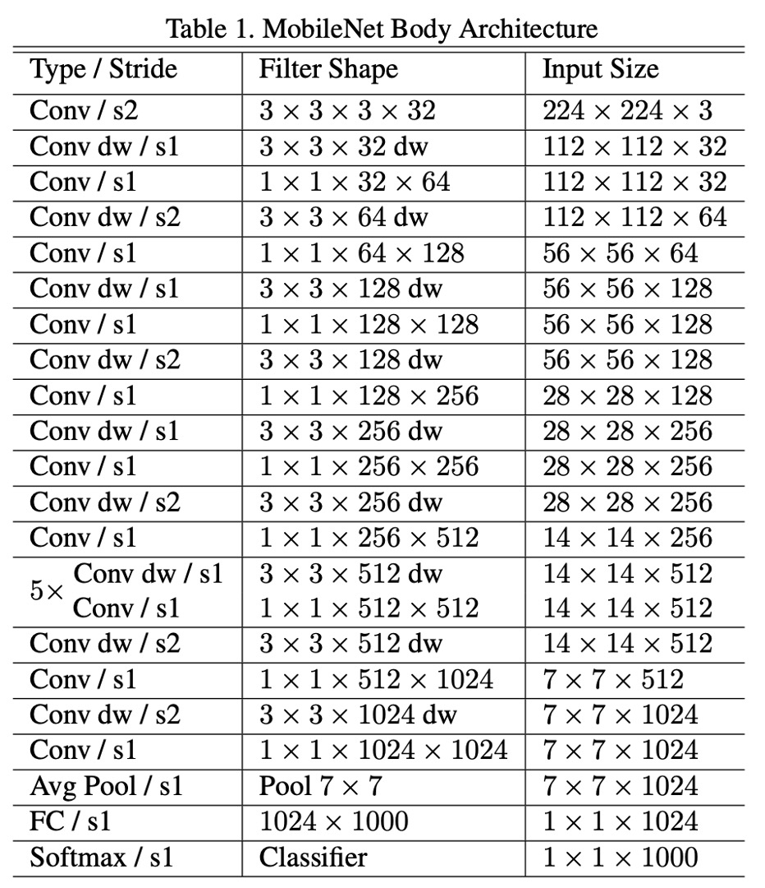
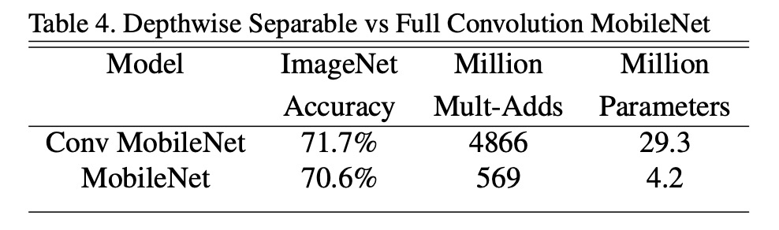
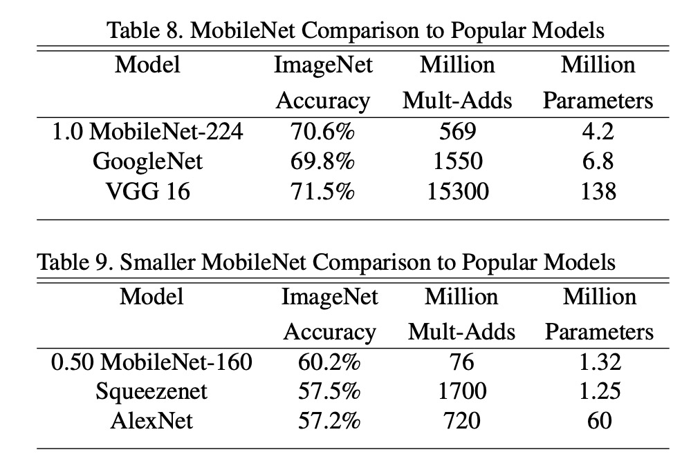

# [17.04] MobileNet-V1

## 深度可分離卷積的發揚者

[**MobileNets: Efficient Convolutional Neural Networks for Mobile Vision Applications**](https://arxiv.org/abs/1704.04861)

---

:::info
以下內容由 ChatGPT-4 彙整，並經過人工校對編輯與補充說明。
:::

---

深度可分離卷積是一種卷積神經網絡的結構，它將標準卷積分解為兩個獨立的層：深度卷積和逐點卷積。

這種結構可以減少模型的參數數量和計算量，從而使得模型更加輕量化，這對於移動設備等資源受限的場景非常有用。

雖然這篇論文通篇在講深度可分離卷積，但實際上這個結構的創始者卻是另有其人：

- [**Rigid-motion scattering for image classification**](https://arxiv.org/abs/1403.1687)

MobileNets 的作者也提到，他們的主要貢獻在於將「深度可分離卷積」這個結構，系統性的應用到了卷積神經網絡中，並且在 ImageNet 上取得了不錯的效果。

也就是現在赫赫有名的： **MobileNet-V1**。

## 定義問題

在這幾年的發展中，人們對於建構小型且高效的神經網路愈來愈感興趣。

但是，許多關於小型網度的論文「只關注大小而不考慮效率」。

顯然地，又小又快的網路架構，才是我們真正需要的。

:::tip
雖然在論文中沒有明確提到，但我們猜測這句話指的是 [**SqueezeNet**](https://arxiv.org/abs/1602.07360)。
:::

## 解決問題

### 深度可分離卷積


傳統卷積層將輸入的特徵圖通過一個多通道的卷積核過濾並結合，生成新的特徵圖。這個過程在每個輸出通道上都會考慮所有輸入通道的信息，計算成本很高。而深度可分離卷積則將此過程分解為兩個階段，先進行深度卷積，即每個輸入通道獨立應用一個濾波器，只處理輸入資料的一個通道，然後透過逐點卷積將這些輸出通道的結果進行組合。

具體來說，深度卷積不會改變輸入特徵圖的通道數，只對每個通道進行空間上的過濾操作。每個通道使用一個獨立的卷積核，這意味著如果輸入特徵圖有 M 個通道，那麼就有 M 個深度卷積核。逐點卷積則是使用 1×1 的卷積核來對這些過濾後的通道進行線性組合，產生最終的輸出通道。這種分解方式的主要優勢是顯著降低了計算量。

對於每個深度卷積，其計算成本為$DK \times DK \times M \times DF \times DF$，其中$DK$ 是卷積核的空間尺寸，$DF$ 是輸入特徵圖的尺寸，$M$ 是輸入通道數。

對於逐點卷積，計算成本則為$M \times N \times DF \times DF$，其中$N$ 是輸出通道數。

將這兩個步驟的成本相加，仍然遠低於傳統卷積的$DK \times DK \times M \times N \times DF \times DF$。

因此，使用深度可分離卷積可以在保持相對較高準確度的同時，顯著減少模型的計算需求和參數量，非常適合需要在計算資源有限的設備上運行的應用。

:::info

我們可以順手用 PyTorch 實現一下深度可分離卷積：

```python
import torch
import torch.nn as nn
import torch.nn.functional as F

class DepthwiseSeparableConv(nn.Module):

    def __init__(self, n_in, n_out, kernel_size, padding=0, stride=1):
        super(DepthwiseSeparableConv, self).__init__()
        self.depthwise = nn.Conv2d(n_in, n_in, kernel_size=kernel_size, padding=padding, stride=stride, groups=n_in)
        self.pointwise = nn.Conv2d(n_in, n_out, kernel_size=1)

    def forward(self, x):
        out = self.depthwise(x)
        out = self.pointwise(out)
        return out
```

在這篇論文的實作中，有提到每個卷積層後面都接了 Batch Normalization 和 ReLU 激活函數，如下圖：


所以實作方式可以改成這樣：

```python
import torch
import torch.nn as nn
import torch.nn.functional as F

class DepthwiseSeparableConv(nn.Module):

    def __init__(self, n_in, n_out, kernel_size, padding=0, stride=1):
        super(DepthwiseSeparableConv, self).__init__()
        self.depthwise = nn.Conv2d(n_in, n_in, kernel_size=kernel_size, padding=padding, stride=stride, groups=n_in)
        self.pointwise = nn.Conv2d(n_in, n_out, kernel_size=1)
        self.depth_bn = nn.BatchNorm2d(n_in)
        self.depth_relu = nn.ReLU()
        self.point_bn = nn.BatchNorm2d(n_out)
        self.point_relu = nn.ReLU()

    def forward(self, x):
        x = self.depthwise(x)
        x = self.depth_bn(x)
        x = self.depth_relu(x)
        x = self.pointwise(x)
        x = self.point_bn(x)
        x = self.point_relu(x)
        return x
```

:::

## 網路架構

根據論文，MobileNet-V1 的網路架構，「**只有第一層的 3x3 是一般卷積核**」之外，其他都是由深度可分離卷積堆疊而成。

> The MobileNet structure is built on depthwise separable convolutions as mentioned in the previous section except for the first layer which is a full convolution.

整體結構如下表：



## 訓練技巧

MobileNet-V1 的作者在訓練過程中使用了一些技巧來提高模型的性能：

- 使用較少的正則化和資料增強，因為小模型的過擬合問題較少。
- 在深度可分離卷積的濾波器上，放置很少或不放置任何權重衰減（L2 正則化）。
- 使用 RMSprop 作為優化器，並使用較小的學習率。
- 採用類似 Inception-V3 的非同步梯度下降。

:::tip
非同步梯度下降（Asynchronous Gradient Descent）是一種用於深度學習訓練中的優化技術，特別適用於分布式計算環境。在傳統的同步梯度下降中，所有計算節點（或工作器）必須完成它們的梯度計算後，才能進行模型更新。這意味著整個訓練過程的速度受到最慢節點的限制。相比之下，非同步梯度下降允許每個計算節點獨立地計算梯度並更新共享模型，而不需要等待其他節點的計算結果。
:::

## 討論

在整體的實驗設計中，上述提到的網路架構做為 Baseline，作者另外引入兩個常數的超參數：

- **Width Multiplier $\alpha$**：用來控制網路的寬度，即每一層的輸出通道數。
- **Resolution Multiplier $\rho$**：用來控制輸入圖像的解析度。

### 深度可分離卷積的效能



與全卷積相比，使用深度可分離卷積在 ImageNet 上僅降低了 1% 的準確度，並且大大節省了乘法和參數數量。

### 要深度還是要寬度？


降低模型寬度，正確率降低 2.2%；降低模型深度，正確率降低 5.3%。

這表示當算力受限時，請選擇降低模型寬度而不是深度。

### 和其他模型比較



將完整的 MobileNet 與原始的 GoogleNet 和 VGG16 進行了比較。

MobileNet 幾乎與 VGG16 一樣準確，同時體積小 32 倍，計算強度降低 27 倍。

MobileNet 比 GoogleNet 更準確，同時體積更小，計算量減少 2.5 倍以上。

在大約相同的大小和減少 22 倍的計算量的情況下，MobileNet 也比 Squeezenet 的效果提升了約 4%。

## 結論

MobileNet-V1 的推出，將深度可分離卷積技術正式地帶入了大眾的視野。這種結構在保持相對高準確度的同時，大幅降低了模型的大小和計算需求，從而解決了在資源受限的環境上運行複雜深度學習模型的挑戰。

這篇論文不僅提供了一種在資源有限環境中部署深度學習模型的有效方案，而且其設計理念啟發了後續多種輕量級深度學習架構的開發，進一步推動了深度學習架構在行動裝置和邊緣計算中的應用。

---

MobileNet 在後續也推出 V2、V3 和 V4 版本，進一步改進了模型的性能和效率。

這一系列的研究成果在實際應用中取得了廣泛的成功，成為了輕量級深度學習模型的經典之作。
