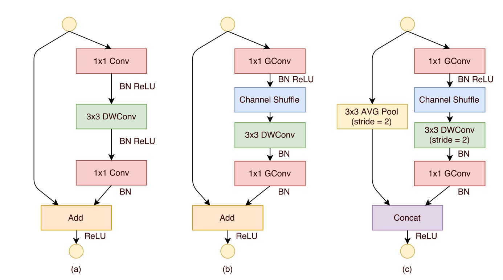
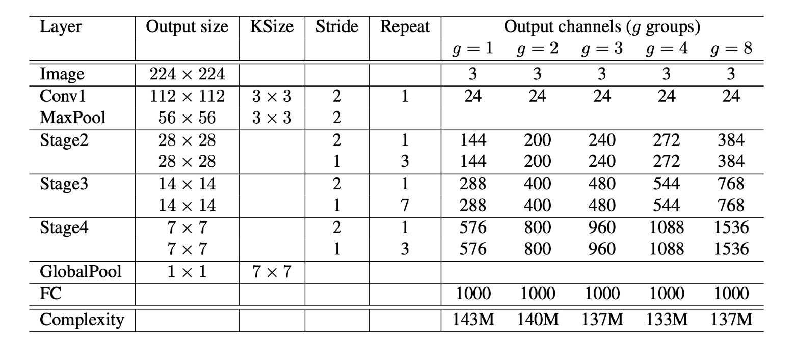
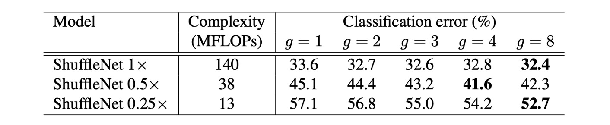
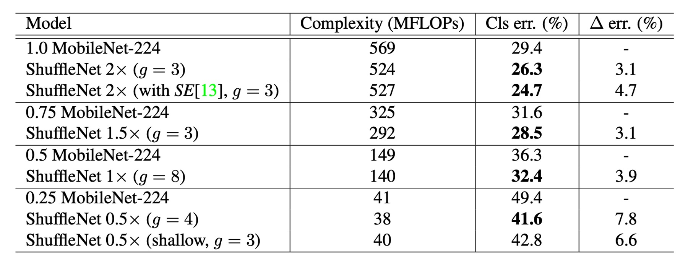

# [17.07] ShuffleNet

## 通道洗牌網路

[**ShuffleNet: An Extremely Efficient Convolutional Neural Network for Mobile Devices**](https://arxiv.org/abs/1707.01083)

---

:::info
以下內容由 ChatGPT-4 彙整，並經過人工校對編輯與補充說明。
:::

---

輕量網路的競賽才剛開始。

ShuffleNet 也在這個時候加入戰局。

## 定義問題

### 計算量與速度不一致

在本研究中，作者和之前研究一樣，想解決的還是同一件事：

- **如何在保持高精度的同時，為運算能力非常有限的移動設備設計一個高效的神經網路？**

雖然如 MobileNet 和 SENet 等模型已向低計算成本方向邁出了一步，但這些模型在非常低的計算預算下（例如小於 150 MFLOPs）的性能仍有提升空間。

作者指出，現有的高效模型「**在實際硬體上的實際推理時間和預期性能之間常常存在較大差距**」。

### 大量 1x1 卷積


在 MobileNet-V1 中，作者有對整個網路架構的計算量進行分析，如上表。

本篇論文的作者認為大量的 1x1 卷積是計算量的主要來源，應該要從這個角度著手，縮減計算量。

## 解決問題

### 組卷積


一個主要的挑戰是如何減少 1x1 卷積的計算量，作者認為提高分組數量是解決問題的辦法。

假設輸入和輸出的通道數都為 128。在不使用分組的情況下，1x1 卷積需要對每個輸出通道的每個輸入通道進行計算，因此乘法運算的總數為 $128 \times 128 = 16,384$ 次。然而，如果設定分組數量為 8，則每個分組所包含的通道數變成 $128 / 8 = 16$。在這種情況下，每組內部的捲積計算僅涉及 16 個輸入通道與 16 個輸出通道之間的乘法，因此每個分組的計算量為 $16 \times 16 = 256$ 次乘法。由於共有 8 個這樣的分組，總的乘法運算數為 $256 \times 8 = 2,048$ 次。

透過比較，可以看出分組卷積可以將計算量減少到原始 1x1 卷積的大約 12.5%，從 16,384 次降低到 2,048 次。

但是天下沒有白吃的午餐。

分組卷積的確可以減少計算量，但也會帶來一個問題：**分組卷積會破壞通道之間的關聯性**，如上圖 (a) 所示。

最終使整個網路的表現會大幅降低。

### 通道洗牌

為了解決分組卷積帶來的問題，作者提出了一個新的操作：**通道洗牌**，如上圖 (b) 所示。

概念是：既然分組限制了通道間互相流通信息的能力，那麼我們可以在分組內部引入一個操作，將不同分組的通道進行混合，以保持通道間的關聯性。

這個操作看似不好理解，但是我們可以直接實作洗牌的函數，就能理解這個操作的意義。

```python
import torch

def shuffle_channel(x: torch.Tensor, groups: int) -> torch.Tensor:
    batch_size, num_channels, height, width = x.size()
    channels_per_group = num_channels // groups

    x = x.view(batch_size, groups, channels_per_group, height, width)
    x = x.permute(0, 2, 1, 3, 4).contiguous()
    x = x.view(batch_size, num_channels, height, width)
    return x
```

如上述函數，首先把通道數量分成幾個組，然後移動通道的位置，這樣就可以實現通道洗牌的效果。舉例來說，如果原本的通道是：AAA,BBB,CCC，經過洗牌後變成：ABC,ABC,ABC。

雖然說是洗牌，但不是隨機的洗牌，而是有規則的洗牌，反正就是要讓不同組的通道能夠互相交流信息就對了。

### 洗牌模組放置位置



最後是洗牌模組的放置位置，如上圖所示。

ShuffleNet 單元的設計起源於對殘差塊瓶頸單元的借鑒，特別是在其殘差路徑中，運用了計算效率較高的$3 \times 3$深度卷積來處理瓶頸特徵圖。在這個基礎上，透過使用分組逐點卷積代替傳統的$1 \times 1$卷積，並結合通道洗牌操作，形成了 ShuffleNet 單元的核心結構（如上圖（b）所示）。

為了匹配快捷路徑並恢復通道維度，單元中的第二個逐點卷積也是分組的，但在此之後並沒有添加額外的通道洗牌操作，以保持操作的簡潔性。在這種結構中，批量歸一化（BN）和非線性活化的應用與其他研究中的使用相似，不過不採用在深度卷積後立即使用 ReLU 的常規建議。

另外，當涉及到步長（stride）的使用時，ShuffleNet 單元進行了兩項主要的調整，如上圖（c）所示：

- 首先，在快捷路徑上引入了$3 \times 3$的平均池化操作
- 其次，透過通道串聯代替逐元素加法，有效地擴展了通道維度而幾乎不增加計算成本。

這種設計使得單元中的所有組件都可以有效地計算，特別是在分組逐點卷積中實現了通道洗牌。

### 模型架構



基於上述的所有模組，最終組成了 ShuffleNet 的整體架構，如上表所示。到右邊有一個 $g=1$ 到 $g=8$ 的表格，這個 $g$ 就是分組數量。

作者在這裡考慮到提高分組數量會減少計算量，而為了讓每個模型能夠有一致的計算量（一致的比較基準），因此提升分組數量的同時，也同時提升網路的每層的通道數量。

## 討論

### 組卷積的效果



1. **模型大小和組數影響**：

   實驗比較了不同組數（從 1 到 8）的 ShuffleNet 模型，同時考慮了不同的網絡複雜度（1x, 0.5x, 0.25x）。在相同的複雜度下，分組卷積（特別是較大的組數如 g=8）通常會提高模型的分類效能。對於最基本的 ShuffleNet 1x 模型，最大組數提高了效能 1.2%；而對於較小的模型 ShuffleNet 0.5x 和 0.25x，效能提升分別為 3.5%和 4.4%。

2. **性能飽和和下降**：

   對於某些模型，如 ShuffleNet 0.5x，當組數較大（例如 g=8）時，分類性能可能會達到飽和甚至下降，因為每個卷積濾波器的輸入通道數減少，可能損害了表示能力。

3. **小模型更大的組數效果更佳**：

   對於較小的模型，如 ShuffleNet 0.25x，較大的組數通常能帶來更好的結果，這表明更寬的特徵圖為這些較小的模型帶來更多的好處。

### 通道洗牌的效果


很明顯，通道洗牌始終可以提高不同設定的分類分數。

### 與其他模型的比較



在各種複雜度等級上，ShuffleNet 在效能上皆優於 MobileNet。

- ShuffleNet 1× 的準確率比 MobileNet 高 3.1%，儘管其運算成本更高（增加了 500 MFLOPs）
- 在約 40 MFLOP 的較小網路中，ShuffleNet 的效能優於 MobileNet 7.8%。
- ShuffleNet 在精確度相當的情況下，展現了比其他流行網絡模型更高的效率。例如：相較於 AlexNet，ShuffleNet 理論上快 18 倍。

:::tip
特別注意到整合 SE 模組的 ShuffleNet 2× 在 top-1 錯誤率上達到 24.7%。

儘管理論複雜性增加不大，但在論文中，作者提到實際上這種配置的 ShuffleNet 在移動設備上運行速度比原始版本慢 25%到 40%。
:::

### 真實推論速度評估


作者評估了 ShuffleNet 在 ARM 行動裝置上的推論速度，並與其他模型進行了比較。

1. **組數與效率**：在 ShuffleNet 模型中，雖然較大的組數（如 g=4 或 g=8）通常能提供更好的性能，但在當前實現中它們的效率較低。經驗表明，g=3 在準確性和實際推理時間之間提供了適當的平衡。

2. **理論與實際表現差異**：實際加速與理論複雜度之間有顯著差異。理論上每降低 4 倍的複雜度，實際實現通常會帶來約 2.6 倍的加速。

3. **與 AlexNet 的比較**：儘管理論加速比為 18 倍，ShuffleNet 0.5× 模型在與 AlexNet 相當的分類精度下，實現了約 13 倍的實際加速比。這顯示 ShuffleNet 相對於傳統的 AlexNet 及其他舊有模型或加速方法具有顯著的速度優勢。

## 結論

許多專注於移動設備的輕量模型，在硬體上的實際推理時間和預期性能常存在非常大的差距。

ShuffleNet 通過引入分組卷積和通道洗牌操作，有效地減少了計算量，並在保持高精度的同時，為運算能力非常有限的移動設備設計了一個高效的神經網路。這種設計思路值得我們深入思考，或許我們也可以從這個角度出發，設計出更加高效的神經網路模型。
