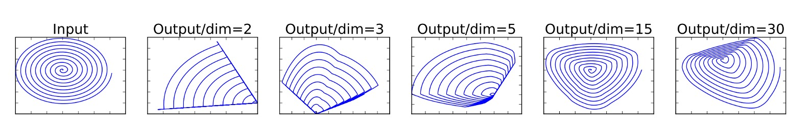
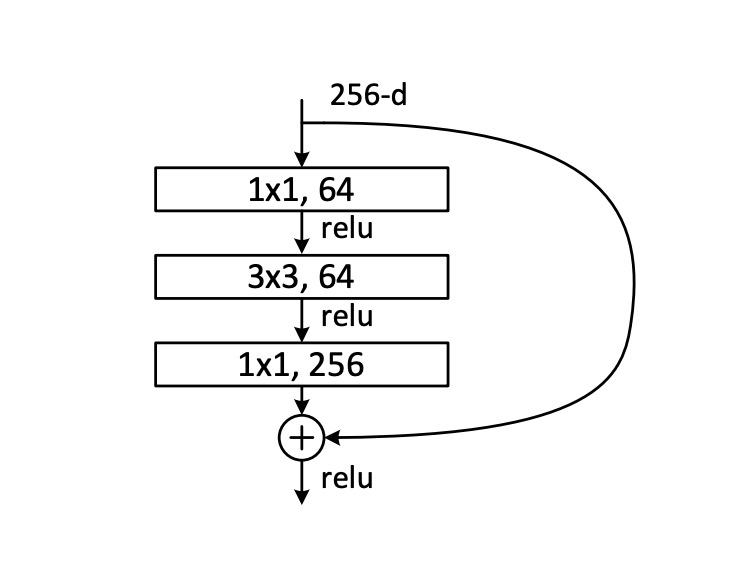
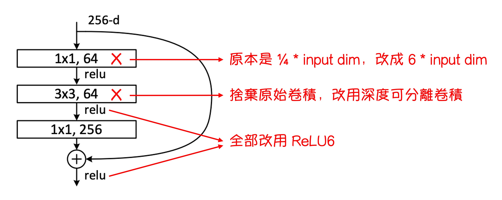
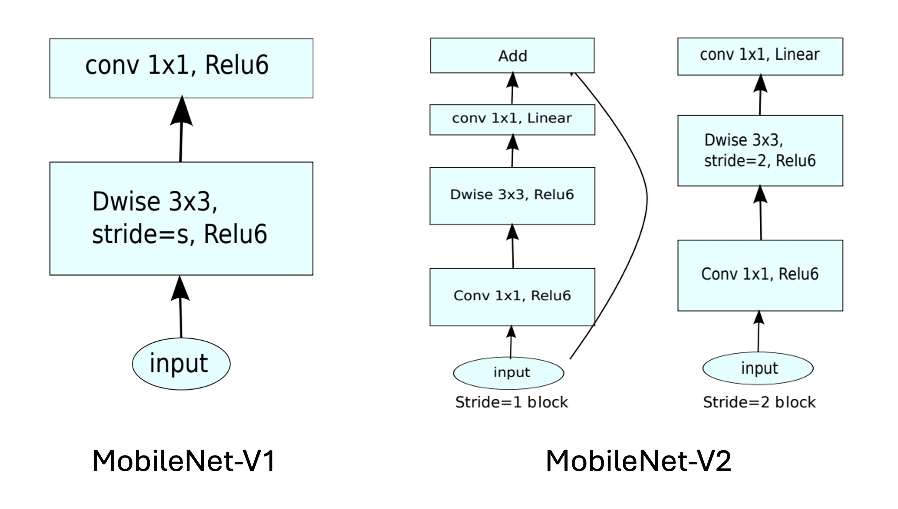
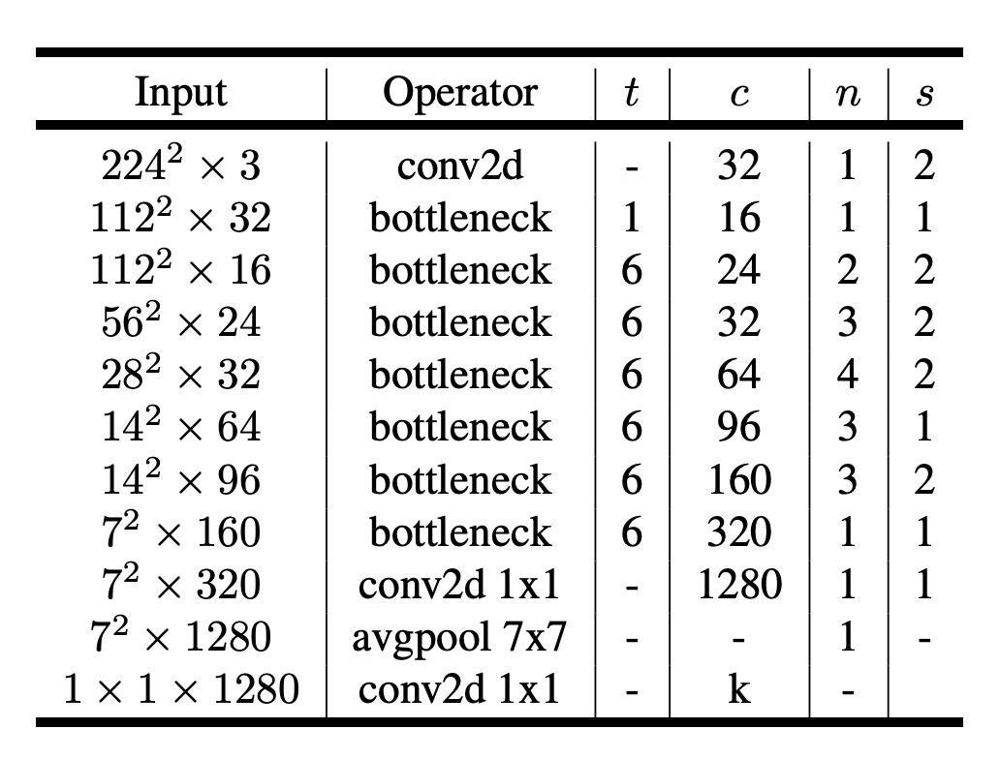
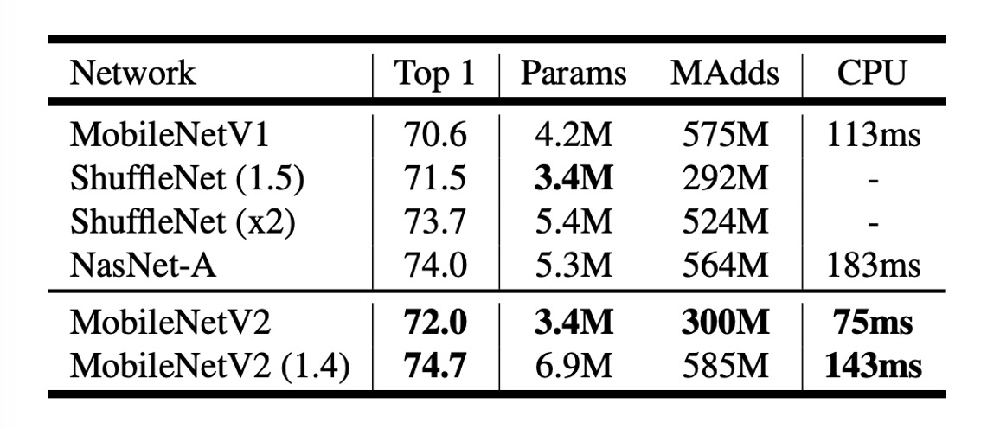

# [18.01] MobileNet-V2

## 瓶頸內的淬煉

[**MobileNetV2: Inverted Residuals and Linear Bottlenecks**](https://arxiv.org/abs/1801.04381)

---

:::info
以下內容由 ChatGPT-4 彙整，並經過人工校對編輯與補充說明。
:::

---

MobileNet 是一個輕量級的深度學習網絡，旨在在移動設備上實現高效的圖像辨識。

在第一代 MobileNet 中，作者提出了深度可分離卷積（Depthwise Separable Convolution）的概念，以減少參數量和計算量。

在這篇論文中，作者延續了這個思路，並嘗試找到提升效能的新方法。

:::tip
如果你是第一次看到這篇論文，你可能會被那些噴湧而出的名詞所淹沒。

因此，這篇論文我們首要推薦看程式碼實作。

不過既然你已經點進來了，那我們就一起看一下吧。
:::

## 定義問題

### 線性瓶頸

作者想討論的第一個問題是線性瓶頸。

假設我們有一個用於圖像識別的深度卷積神經網絡。每個卷積層都會產生一個三維的激活張量（高度 × 寬度 × 深度），其中包含了圖像的特征。

例如，第一層可能會識別邊緣和顏色變化，而更深的層可能會識別更複雜的形狀或對象部分。

在神經網絡的每一層中，激活張量可以視為存在於一個高維空間中。這個空間中的有意義數據結構（在論文內稱為「興趣流形」(manifold of interest)），理論上可以被映射到一個低維子空間中，而不丟失重要信息。這是因為雖然數據在原始空間中是高維的，但它們往往圍繞某些低維結構分佈。

:::tip
舉個例子：如果把 128 個特徵，透過一個轉換矩陣投影到 2 維特徵中，在保有轉換資訊的前提，我們可以透過反轉換矩陣將這 2 維空間的特徵還原回 128 維空間。
:::

為了有效利用這一性質，網絡設計可以引入線性瓶頸層來降低數據的維度，這種方式在 MobileNetV1 中得到了成功應用。

然而，當引入非線性操作，如 ReLU（修正線性單元）時，情況會變得更複雜。

ReLU 的效果是對每個元素進行線性閾值處理，將所有負值設為零，這會改變數據的分佈，從而產生新的幾何結構（如射線和分段線性曲線）。

:::tip
延續剛才的例子：如果把 128 個特徵，透過一個轉換矩陣投影到 2 維特徵中，然後對其使用 ReLU，假設其中一個特徵值小於零，則這個特徵值會被設為零。這樣，原本的 2 維特徵空間中的點集就會被分割成兩部分，這會使得反轉換矩陣無法完全恢復原始的 128 維特徵空間。
:::

而避免這種情況的方式，是提供足夠的維度，以便在非線性變換後仍然保留足夠的信息，如下圖所示：



在圖中，最左邊的是輸入，對於投影到不同的維度上，且經過 ReLU 運算後，右邊的分佈就會有所不同。

可以看到當我們選用的維度不夠時，經過 ReLU 運算後，原本的分佈就會被破壞，有一部分的信息將永遠丟失。

### 殘差網路

先看一下什麼叫做殘差網路，這裡引入 ResNet 論文內提供的圖片：



一般的殘差網路，首先經過一個 1x1 卷積層降維，然後是 3x3 卷積層彙整資訊，最後再經過一個 1x1 卷積層升維，最後再加上原始輸入。

根據剛才提到的線性瓶頸，這個殘差模組中在降維的過程中，又引入了 ReLU 的非線性運算，這樣就會丟失資訊。

資訊丟多了會怎樣？

就會導致在深層的殘差網路中的「殘差分支」失去功能，徹底淪為擺設，白白浪費了計算資源。

## 解決問題

為了解決問題，作者修改了原本的殘差模組，將壓縮維度改成膨脹維度，並將深度可分離卷積引入其中。

這個新的殘差模組被作者稱為「帶有線性瓶頸的反轉殘差」（Inverted residual with linear bottleneck.）。

### 反轉殘差



整個殘差模組的修改如上圖所示。

1. 把原本 ResNet 中壓縮維度的 1x1 卷積層換成了擴展維度的 1x1 卷積層。
2. 把原本 3x3 卷積層換成了深度可分離卷積。
3. 把原本 ReLU 函數全部換成 ReLU6 函數。

:::tip
很抱歉，我們自己做圖顯得比較簡陋，由於論文中的很多圖其實不是那麼容易理解，這裡我們就不放了，有興趣的話可以去論文中看看。
:::

### 擴張瓶頸（論文附錄 A）

瓶頸變換涉及兩個核心操作：線性變換和 ReLU 激活函數，這一過程可以表示為 $ A \text{ReLU}(Bx) $：

1. **線性變換 $Bx$：** 在此，$x \in \mathbb{R}^n$ 代表一個 n 維的向量，可以是代表圖像中的像素點的向量或是任何其他類型的數據。$B$ 是一個 $m \times n$ 的矩陣，負責將原始的 n 維向量 $x$ 變換到 m 維空間。這一步的目的是在不同的維度上重組輸入數據的特徵，可能是為了降維（如果 $m < n$）、升維（如果 $m > n$）、或是轉換到另一個同維度的空間（如果 $m = n$）。

2. **非線性激活函數 ReLU：** ReLU 函數，即修正線性單元（Rectified Linear Unit），作用於 $Bx$ 的結果。這個函數的數學表示是 $\text{ReLU}(z) = \max(0, z)$，其中 $z$ 可以是一個數字或一個向量。對於向量，ReLU 函數對每一元素獨立作用。這一步引入了非線性特性，有助於增加模型的表達能力，因為線性模型無法捕捉到複雜的數據結構和模式。

3. **第二層線性變換 A：** 經過 ReLU 激活後的結果再次被一個 $n \times m$ 的矩陣 $A$ 變換。這一步可以進一步調整特徵，使其適合於後續的神經網路層或最終的輸出要求。

在分析瓶頸變換的效果時，首先要考慮 m（輸出維度）和 n（輸入維度）的關係：

- **當 m ≤ n 時**：此類變換可能在保持非線性的同時，會有資訊損失。因為當輸出維度小於或等於輸入維度時，一些輸入信息在經過轉換後無法完全恢復。
- **當 n < m 時**：這種變換不僅能表達強烈的非線性，而且在很大程度上是可逆的，即初始隨機權重下，轉換後的結果有很高的概率可以恢復原始輸入。

最後，作者指出擴展層的瓶頸結構不僅能防止流形崩塌（即信息喪失），還能幫助網絡表示更複雜的函數。

### 模型架構



最後就是整個模型的架構，從上圖可以看到，相比於 MobileNetV1，在 MobileNetV2 中則是進一步融合殘差模組。

以下還有一點篇幅，我們直接來實作一下吧。

```python
import torch.nn as nn


class InvertResidual(nn.Module):

    def __init__(self, inp, oup, stride, expand_ratio):
        super(InvertResidual, self).__init__()
        self.stride = stride
        self.is_shortcut = stride == 1 and inp == oup
        hidden_dim = int(inp * expand_ratio)

        self.conv = nn.Sequential(
            # pw
            nn.Conv2d(inp, hidden_dim, 1, 1, 0, bias=False),
            nn.BatchNorm2d(hidden_dim),
            nn.ReLU6(),
            # dw
            nn.Conv2d(hidden_dim, hidden_dim, 3, stride, 1, groups=hidden_dim, bias=False),
            nn.BatchNorm2d(hidden_dim),
            nn.ReLU6(),
            # pw-linear
            nn.Conv2d(hidden_dim, oup, 1, 1, 0, bias=False),
            nn.BatchNorm2d(oup),
        )

    def forward(self, x):
        if self.is_shortcut:
            return x + self.conv(x)
        else:
            return self.conv(x)
```

做完模組，再來就是把模型串起來。

先參考一下論文的配置：



輸入圖片大小為 224x224，輸出類別數為 1000......

呃，這幾個參數不重要，不影響模型的實作。

論文中有提到需要縮放模型，因此我們需要有個可以縮放模型寬度的參數 `width_mult`。

這裡我們撇開最後的輸出層，只實作模型的主體部分，也就是特徵提取部分。

```python
import torch.nn as nn

class MobileNetV2(nn.Module):

    def __init__(self, width_mult=1.):
        super(MobileNetV2, self).__init__()

        # setting of inverted residual blocks
        self.settings = [
            # t, c, n, s
            [1, 16, 1, 1],
            [6, 24, 2, 2],
            [6, 32, 3, 2],
            [6, 64, 4, 2],
            [6, 96, 3, 1],
            [6, 160, 3, 2],
            [6, 320, 1, 1],
        ]

        # building first layer
        input_channel = int(32 * width_mult)
        self.first_layer = nn.Sequential(
            nn.Conv2d(3, input_channel, 3, 2, 1, bias=False),
            nn.BatchNorm2d(oup),
            nn.ReLU6()
        )

        # building inverted residual blocks
        layers = []
        for t, c, n, s in self.settings:
            output_channel = int(c * width_mult)
            for i in range(n):
                layers.append(
                    InvertResidual(
                        input_channel,
                        output_channel,
                        stride=s if i == 0 else 1,
                        expand_ratio=t
                    )
                )
                input_channel = output_channel
        self.layers = nn.Sequential(*self.layers)

        # building last several layers
        last_channel = int(1280 * width_mult) if width_mult > 1.0 else 1280
        self.last_layer = nn.Sequential(
            nn.Conv2d(input_channel, last_channel, 1, 1, 0, bias=False),
            nn.BatchNorm2d(oup),
            nn.ReLU6()
        )

    def forward(self, x):
        x = self.first_layer(x)
        x = self.layers(x)
        x = self.last_layer(x)
        return x
```

:::tip
**為什麼 nn.Conv2d 的 bias 設為 False？**

因為我們在 `Batch Normalization` 中已經有了偏移項，因此不需要再在 Conv2d 中加入偏移項。
:::

## 討論

### 圖像分類效能



從上表可以看到，MobileNetV2 在 ImageNet 上的表現比 MobileNetV1 有所提升。

在近乎一半的計算量下，MobileNetV2 的準確率比 MobileNetV1 高了約 1.4%，推論速度提升約 30%。

- 在 300M 計算量的量級上，超越了幾個月前發布的 ShuffleNet。
- 在 600M 計算量的量級上，超越了 NASNet，同時在 CPU 的運行速度上也比 NASNet 快了約 20%。

## 結論

在這篇研究中，作者展示了 MobileNetV2 如何有效地應對行動設備上對高效能和低能耗的需求。

線性瓶頸層和反轉殘差模組的使用，允許模型在保持輕量級的同時，有效地管理信息流，減少信息在傳遞過程中的損失。

這種設計理念不僅提高了模型對輸入數據的表達能力，也提升了在移動裝置上的效能表現。

未來的工作將繼續探索這一架構的潛力，尋求在保持模型輕量化的同時，進一步提升效能和泛化能力。
