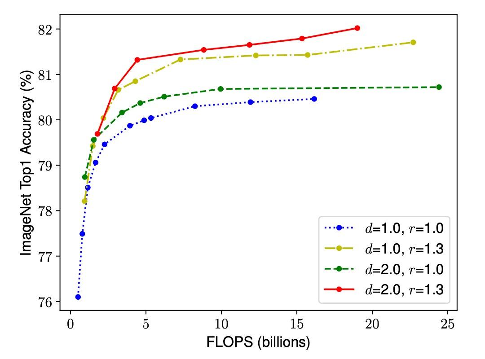

# [19.05] EfficientNet

## 聯合縮放架構

[**EfficientNet: Rethinking Model Scaling for Convolutional Neural Networks**](https://arxiv.org/abs/1905.11946)

---

:::info
以下內容由 ChatGPT-4 彙整，並經過人工校對編輯與補充說明。
:::

---

常見提升卷積網路性能的方法有三：

1. **更深的網路**：增加網路深度，如 ResNet。
2. **更寬的網路**：增加網路寬度，如 WideResNet。
3. **更高的解析度**：增加輸入圖像的解析度。

今天我加一點，你加一點，每次精度都加一點，大家開心愉快地刷榜，豈不美哉？

## 定義問題

本篇論文的作者說：不行這樣，我們應該要把整個問題一起考慮進去！

因此，提出聯合縮放架構（**Compound Scaling**）。

## 解決問題

### 兩個觀察

在這篇論文中，作者提出了兩個重要觀察，這些觀察是聯合縮放方法的基礎。

- **觀察一：任何維度的擴展都能提升準確度，但在模型變大後，準確度提升會迅速飽和**

  

  當我們擴展卷積神經網絡的深度、寬度或解析度時，模型的準確度通常會提高。然而，當網絡變得非常深、寬或解析度非常高時，準確度的提升幅度會逐漸減少，甚至趨於飽和。這意味著單純增加網絡的某一個維度並不能無限提高模型性能，最終會遇到瓶頸。

- **觀察二：在模型縮放中，平衡網絡的寬度、深度和解析度是關鍵**

  

  為了在給定資源約束下追求更好的準確度和效率，需要同時考慮網絡的寬度、深度和解析度，並使它們之間保持平衡。單獨調整某一維度雖然簡單，但效果有限。相反，協調地縮放所有維度可以更有效地利用資源，達到更高的準確度。

### 聯合縮放

這裡重新描述了一次模型縮放的問題：

卷積神經網絡的每一層都可以定義為一個函數 $Y_i = F_i(X_i)$。

- 其中 $F_i$ 是操作符，$Y_i$ 是輸出張量，$X_i$ 是輸入張量。

整個卷積神經網絡 $N$ 可以表示為一系列層的組合：$N = F_k \odot ... \odot F_2 \odot F_1(X_1)$。

實際上，卷積神經網絡的層通常被劃分為多個階段，每個階段中的所有層共享相同的架構。

因此，這裡可以將卷積神經網絡定義為：

$$N = \odot_{i=1}^s F_i^{L_i}(X)$$

其中，$F_i^{L_i}$ 表示第 $i$ 階段中的層 $F_i$ 被重複 $L_i$ 次。

模型縮放的目標是最大化模型在給定資源約束下的準確度。我們希望在保持基礎網絡架構 $F_i$ 不變的情況下，通過調整網絡的深度 ($d$)、寬度 ($w$) 和解析度 ($r$) 來優化模型。

這可以形式化為一個優化問題：

- $\max_{d,w,r} \text{Accuracy}(N(d, w, r))$

受限於

- $\text{Memory}(N) \leq \text{target memory}$
- $\text{FLOPs}(N) \leq \text{target flops}$

作者提出了一種聯合縮放方法，使用一個聯合係數 $\phi$ 來統一縮放網絡的寬度、深度和解析度：

- $\text{depth: } d = \alpha^\phi$
- $\text{width: } w = \beta^\phi$
- $\text{resolution: } r = \gamma^\phi$

滿足 $\alpha \cdot \beta^2 \cdot \gamma^2 \approx 2$ 的約束，其中 $\alpha, \beta, \gamma$ 是通過小範圍搜索確定的常數，$\phi$ 是用戶指定的控制縮放資源的係數。

這種方法在保證計算成本（FLOPs）適度增加的同時，實現了各個維度的平衡縮放，從而在給定資源約束下達到更好的準確度。

### 模型基礎架構

為了開發一個好的基線網絡，作者借鑑了多目標神經架構搜索（Multi-Objective NAS），優化了準確度和 FLOPs（每秒浮點運算次數）。

作者以 $\text{Acc}(m) \times \left(\frac{\text{FLOPs}(m)}{T}\right)^w$ 作為優化目標。

- 其中 $\text{Acc}(m)$ 和 $\text{FLOPs}(m)$ 分別表示模型 $m$ 的準確度和 $\text{FLOPs}$
- $T$ 是目標 $\text{FLOPs}$
- $w=-0.07$ 是控制準確度和 $\text{FLOPs}$ 權衡的超參數。

最終，搜索得到了 EfficientNet-B0，它的架構類似於 `MnasNet`，但稍大一些，因為其 $\text{FLOPs}$ 目標是 400M。

下表展示了 EfficientNet-B0 的架構：

EfficientNet-B0 的主要構建單元是移動反向瓶頸卷積（Mobile Inverted Bottleneck MBConv），並加入了 squeeze-and-excitation 優化。

### 模型擴展架構

從基線 EfficientNet-B0 開始，作者通過以下兩個步驟應用聯合縮放方法來擴展網絡：

- **步驟 1**：首先固定 $\phi = 1$，假設有兩倍的資源可用，並基於公式 2 和 3 進行小範圍的網格搜索來確定 $\alpha, \beta, \gamma$ 的最佳值。對於 EfficientNet-B0，最佳值為 $\alpha = 1.2, \beta = 1.1, \gamma = 1.15$，滿足 $\alpha \cdot \beta^2 \cdot \gamma^2 \approx 2$。

- **步驟 2**：然後將 $\alpha, \beta, \gamma$ 固定為常數，使用不同的 $\phi$ 值來擴展基線網絡，從而獲得 EfficientNet-B1 到 B7。

值得注意的是，雖然可以直接在大模型上搜尋 $\alpha, \beta, \gamma$ 以獲得更好的性能，但這樣的搜尋成本在大模型上會變得非常昂貴。作者的方法通過僅在小型基線網絡上進行一次搜索（步驟 1），然後使用相同的縮放係數對所有其他模型進行縮放（步驟 2），有效地解決了這一問題。

## 討論

### 聯合縮放的重要性

為了進一步理解為什麼複合縮放方法比其他方法更好，作者在上圖中比較了一些具有不同縮放方法的代表性模型的類別活化圖（CAM，Class Activation Map）。

這些模型都是從相同的基線（EfficientNet-B0）進行縮放的，顯示了不同模型在處理影像時所關注的區域：

- **單維縮放模型**：缺乏對物件細節的關注，無法捕捉影像中的所有物件。
- **複合縮放模型**：傾向於關注具有更多物件細節的更相關區域，顯示出對物件特徵的更全面捕捉。

另外，作者也觀察了幾種縮放方法的效能：

1. **單維縮放方法**：

   - **深度縮放**：增加網絡的深度，即層數。
   - **寬度縮放**：增加網絡的寬度，即每層的通道數。
   - **解析度縮放**：增加輸入影像的解析度。

2. **複合縮放方法**：
   - 結合深度、寬度和解析度的增長，根據本文提出的 $\alpha, \beta, \gamma$ 參數進行協調縮放。

實驗結果如下圖，雖然所有縮放方法都能提高精度，但複合縮放方法的精度提升更為顯著，最高可達 2.5%。這表明，在相同的資源增加下，複合縮放方法能更有效地利用資源，從而在提升模型性能方面具有顯著優勢。

### ImageNet 上的結果

在這篇論文中，作者使用具體訓練配置如下：

- **優化器**：RMSProp
- **權重衰減**：$1 \times 10^{-5}$
- **初始學習率**：0.256，每 2.4 個 epoch 衰減 0.97
- **活化函數**：SiLU
- **資料增強**：AutoAugment，隨機深度

考慮到較大的模型需要更多的正規化，作者將 dropout 比率從 EfficientNet-B0 的 0.2 線性增加到 EfficientNet-B7 的 0.5。

上表數據顯示，EfficientNet 模型通常使用比其他具有相似精度的卷積神經網絡少一個數量級的參數和 FLOPS。特別是，EfficientNet-B7 以 66M 個參數和 37B FLOPS 實現了 84.3% 的 Top-1 準確率，比之前最好的 GPipe 更準確，但模型大小減少了 8.4 倍。

EfficientNet 模型不僅尺寸較小，而且計算成本更低。例如，EfficientNet-B3 使用了減少 18 倍的 FLOPS 實現了比 ResNeXt101 更高的準確度。

### 推論速度

為了驗證延遲，作者還測量了在真實 CPU 上一些代表性卷積神經網絡的推理延遲。

下表展示了 20 次運行的平均延遲：

這些結果表明，EfficientNet 與 ResNet-152 和 GPipe 相比，不僅在參數和 FLOPS 上具有優勢，而且在實際硬體上的推理速度也非常快。

### 參數-精度曲線

上圖顯示了代表性卷積神經網絡的參數-精度和 FLOPS-精度曲線，其中 EfficientNet 模型在使用更少的參數和 FLOPS 的情況下實現了更高的精度，顯示了其在效能上的顯著優勢。

## 結論

模型的深度、寬度和解析度是影響卷積神經網絡性能的重要因素。

在這篇論文中，作者提出了一種聯合縮放方法，通過協調地縮放網絡的深度、寬度和解析度，實現了更好的準確度和效率。

未來的研究可以進一步優化複合縮放方法中的參數選擇，並探索其在其他類型神經網絡中的應用，進一步推動深度學習模型在效率和性能上的提升。

:::tip
這篇論文我們是看完摘要之後，就直接拿模型架構來用了，效果確實不錯。
:::
