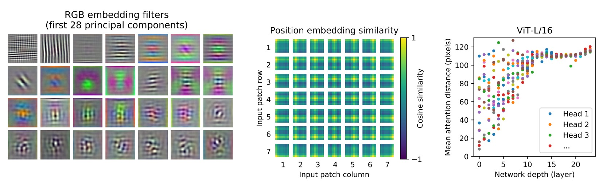
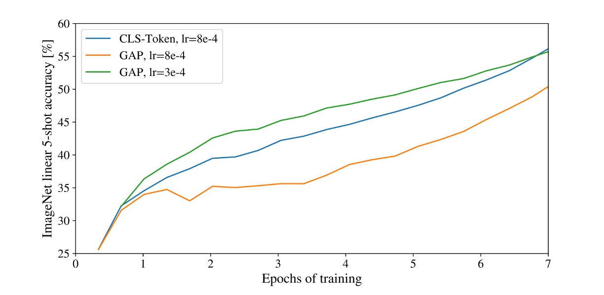

# [20.10] ViT

## 新世界拓荒者

[**An Image is Worth 16x16 Words: Transformers for Image Recognition at Scale**](https://arxiv.org/abs/2010.11929)

---

在 2017 年，Transformer 模型提出後，在 NLP 領域內掀起一陣狂潮，霎時間便烽火連天。

這陣風吹了三年，終於把硝煙也吹進了電腦視覺領域。

## 定義問題

在前幾年的嘗試中，許多研究嘗試將注意力機制與卷積網路結合使用。

或是在保持卷積網路的結構不變的前提下，替換掉某些部分。

這些研究都暗示著 Transformer 架構沒有辦法直接生搬硬套到圖像領域。

本篇論文的作者認為：

- **那只是你們的方法不對！**

我們完全可以捨棄卷積，直接用 Transformer 來處理圖像。

圖像這件事，不過就是 16 x 16 的文字集合罷了！

## 解決問題

### 模型架構


說到 Transformer，我們都很熟悉。

把文字經過 Embedding 後，排成一個序列，然後丟進 Encoder，再經過 Decoder，最後輸出結果。

當我們想在圖像上套用這個架構，首先要思考的問題是：

- **該怎麼把圖像轉換成文字序列？**

在這裡，作者提出的方法是：切塊吧！

### Patchify

給定一張圖像，假設其尺寸為 224 x 224，試想該如何把他們切成一塊一塊的區域呢？

手動切嗎？當然不是！

這裡作者引入一個 Conv2d 的操作，就完成了這個任務。

直接來實作一下：

```python
import torch
import torch.nn as nn

# 假設圖像尺寸為 224 x 224
dummy_img = torch.randn(1, 3, 224, 224)

# 切塊
patch_size = 16

# 編碼維度
embed_dim = 768

# Patchify
emb_layer = nn.Conv2d(3, embed_dim, kernel_size=patch_size, stride=patch_size)

# 切塊後的結果：
# input.shape = (1, 3, 224, 224)
# tokens.shape = (1, 768, 14, 14)
tokens = emb_layer(dummy_img)
```

這裡我們設定切塊圖像的尺寸為 16 x 16，並且設定編碼維度為 768。

透過卷積的 stride 進行不重疊滑動視窗，就可以將 224 x 224 的圖像切成 14 x 14 塊。

在原本的 Transformer 中，我們會將文字序列的每個 token 進行 Embedding，這裡也是一樣的。將每個切塊的圖像進行 Embedding，意思就是把每個 16 x 16 x 3 的區域轉換經過線性轉換，投影到 768 維的向量。

最後我們把這些切塊的結果展平，變成一個序列：

```python
tokens = tokens.flatten(2) # (1, 768, 14, 14) -> (1, 768, 196)
tokens = tokens.permute(2, 0, 1) # (1, 768, 196) -> (196, 1, 768)
```

在 Transformer encoder 中，輸入的第一個維度是序列的長度，第二個維度是 batch size，第三個維度是特徵編碼長度。

經過上面的操作，我們就得到可以丟進 Transformer 的輸入序列了。

### 然後呢？

然後就結束了。

之後就跟 NLP 的 Transformer 一樣，想怎樣就怎樣。

卡！不對，不能這麼早結束！

＊

下表為 ViT 的參數設定：


### 沒有歸納偏差

在 Transformer 的架構中，並沒有對於圖片的歸納偏差（inductive bias）。

在 ViT 中，只有 MLP 層是局部和平移不變的，同時自注意力機制是全局的，二維鄰域的結構關係非常少。

因此模型必須重頭開始學習並理解：什麼是圖像？所謂圖像的特徵又是什麼？

這也是為什麼從 Transformer 到 ViT 的時間需要這麼長的原因，大部分的早期研究都沒有做出比卷積網路更好的結果，故而不了了之。

:::tip
**卷積網路的歸納偏差是什麼？**

卷積網路的歸納偏差是指，卷積網路在設計上，對於圖像的平移不變性和局部性有著很強的偏好。這種偏好是通過卷積核的設計實現的，卷積核的共享權重和局部感受野，使得卷積網路能夠捕捉到圖像的局部特徵，並且對於圖像的平移不變性有著很好的性能，並且容易泛化到其他圖像辨識任務上。
:::

### 訓練資料必須大


從實驗中可以看到，如果訓練資料的規模不夠大，ViT 的效果會比卷積網路差很多。

上圖中，灰色的線表示 ResNet50x1 (BiT) 和 ResNet152x2 (BiT) 的結果，而其他顏色的線則是 ViT 的結果。底下橫軸是訓練資料量，當資料量來到 300M 時，ViT 的效果終於超越卷積網路。

作者認為：

- **在小資料集上，卷積網路的歸納偏差是很重要的。**
- **在大資料集上，直接從資料中學習相關的模式就足夠了！**

:::tip
ViT 模型的閱讀方式：

- ViT-L/16：Large 模型，16 x 16 的切塊
- ViT-L/32：Large 模型，32 x 32 的切塊

切塊的大小愈小，編碼的解析度愈高，模型的效果愈好，但是計算量也愈大，呈平方關係增長。
:::

### 還能再更大


如果一直 Train 下去，會怎樣？

在這個實驗中，作者使用了 3 個不同的模型：

- ViT
- ResNet
- Hybrid Model

實驗結果顯示，當訓練資料量足夠大時，ViT 的效果會超越 ResNet。

同時 Hybrid Model 在小模型上的效果會比 ViT 稍微好一點，但是當模型變大時，這種差異就消失了。

最後，ViT 在嘗試的範圍內並未飽和，這其中顯然還有很多潛力可以挖掘。

:::info
人們可能會期望卷積局部特徵處理能夠幫助任何大小的 ViT，但是沒有。
:::


## 討論

### ViT 看到了什麼？



作者將第一層將影像片段（patches）投影到低維空間，取出前 28 個主成份。

- **Self-attention（上圖左）**

  ViT 通過自我注意力機制，能夠整合影像的整體信息，即使在最低層也是如此。

  注意力權重用於計算影像空間中信息整合的平均距離，這類似於 CNN 中的感受野大小。

  模型展示了在最低層中對大部分影像的關注，說明其全局整合信息的能力。而其他注意力頭在低層的關注則更局部化。

- **Position Embeddings（上圖中）**

  空間上較近的區塊具有相似的 embeddings，表示這些 embeddings 能夠編碼影像內部各區塊之間的距離關係。

  從 embeddings 中看到看到行列結構，對於較大的網格，有時觀察到顯著的正弦結構。

- **注意力距離（上圖右）**

  這種「注意力距離」類似於 CNN 中的感受野大小。

  較低層中各個頭部的平均注意力距離變化很大，有些頭部關注影像的大部分，而其他頭部則專注於查詢位置或附近的小區域。

  隨著深度的增加，所有頭部的注意力距離都會增加。 在網路的後半部分，大多數頭部廣泛帶有長注意力距離，這表明了模型在這些層中更多地關注全局信息。

### 用 \[CLS\] 預測還是用 GAP 預測？



在本篇論文中，作者使用了兩種不同的方法來進行分類任務：

- **\[CLS\] 預測**

  這是 NLP 中常見的做法，將序列的第一個 token 作為整個序列的表示。

  這種方法在圖像領域中也取得了不錯的效果。

- **GAP 預測**

  GAP（Global Average Pooling）是一種常見的特徵提取方法，將特徵圖的每個通道進行平均，得到一個向量。

  一開始作者是用這種方式，但發現效果非常差！

  仔細分析後發現，問題不是 GAP 的問題，而是「學習率」設太大了！

經過調整後，兩種預測方式都取得了不錯的效果。

:::tip
在我們的經驗中，Transformer 架構對學習率非常敏感，這在 ViT 中也是如此。
:::

### 其他注意事項

除了主要論述的內容之外，還有一些訓練的技巧和注意事項：

1. 使用 0.1 的 Weight Decay 進行訓練，作者發現這對於後續下游任務很有幫助。
2. 作者模仿了 MLM 的訓練方式，發現效果不好，之後還得再研究。
3. 當輸入影像解析度有變動時，會對應地改變輸入序列的長度（因為 Patch 的尺寸固定），這時候必須將學習好的位置編碼進行線性插值。
4. 用 Adam 會比 SGD 更好，作者認為這是因為 Adam 能夠更好地處理學習率的問題。（現在大多改用 AdamW）
5. 使用 1-D 的可學習的位置編碼，或是 2-D 的可學習的位置編碼，或是相對位置邊編碼，沒有太大的差別，但一定要選一個，如果都不選，效果會很差。

## 結論

這篇論文探索了 Transformer 在圖像領域的應用，提出了一種全新的架構 ViT。

ViT 在大資料集上的效果超越了傳統的卷積網路，並且在實驗中展現了更大的潛力。

這篇論文的發表，標誌著 Transformer 架構在圖像領域的成功應用，也為未來的研究開啟了新的方向。
