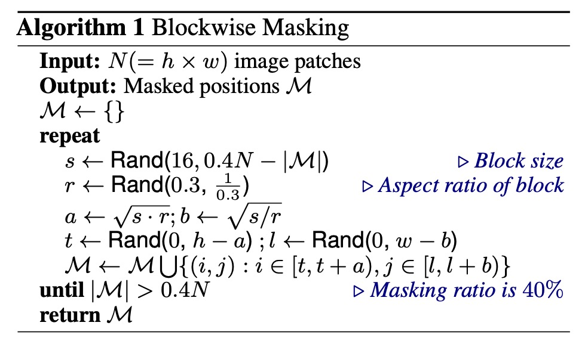
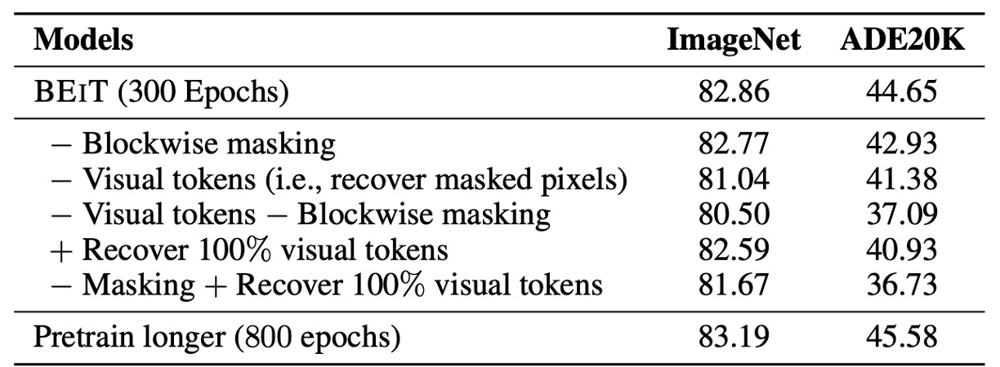
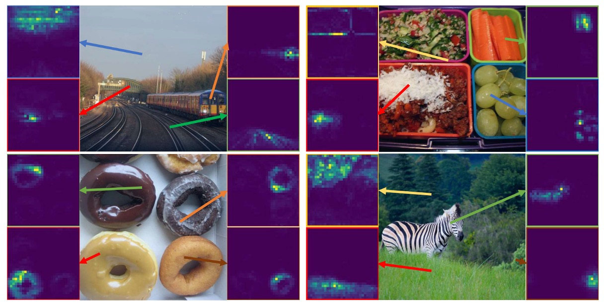

# [21.06] BEiT

## 離散編碼預訓練

[**BEiT: BERT Pre-Training of Image Transformers**](https://arxiv.org/abs/2106.08254)

---

這篇論文的主要比較對象是 ViT 和 DeiT。

主要想要解決的問題是如何提升 ViT 架構在 ImageNet 上的分類性能。

## 定義問題

我們都知道 BERT 在過去一段時間已經透過 MLM 的預訓練手法取得輝煌的戰果，可以說是自編碼模型最有用的一個預訓練方式。

- [**BERT: 十二層編碼器**](../language-model/1810-bert/index.md)

但是在圖像領域，BERT 的概念卻不那麼好用。在 ViT 中，作者嘗試把模型進行遮罩後，預測每個遮罩的「RGB 平均值」，用這種方式來達成自監督學習，但最後的結果顯示效果不如預期。最後還是選用監督式學習的方式來進行預訓練。

前人留下來的懸念，後續當然是要解決的。

這篇論文的作者提出了一個新的預訓練方法：

- 或許我們不要直接預測圖像的像素值，而是預測圖像的「離散標籤」。使用這樣的方式，可以讓模型學習到更高層次的特徵，而不是只是學習到圖像的像素值。

## 解決問題

### 模型架構

在這裡同時存在兩個架構，我們依序來看。

第一個架構是類似 VAE 的結構，在上圖中最上面那一部分，這不是作者提出的架構，僅是使用前人的研究結果。實際上這個部分也不參與訓練，只用來負責把圖像拆成一個個小塊，並附上一個標籤。

這個部分的目的是要將圖像離散化，讓模型學習到圖像的高層次特徵而不僅是像素值。整體概念比較像是訓練一個「圖像字典」，分別對應了圖像不同的抽象概念，在這裡總共有 8192 個標籤。

這個部分訓練方式和詳細內容，請另外參考原論文：

- [**[21.02] Zero-Shot Text-to-Image Generation**](https://arxiv.org/abs/2102.12092)

  :::tip
  對，你沒看錯，就是大名鼎鼎的 DALL-E。
  :::

---

第二個架構就是上圖下半部，也就是真正參與梯度更新的模型。

這裡跟我們認識的 ViT 一模一樣。差別在於原本的 ViT 是使用圖像標籤進行監督，而這裡則是引入了 BERT 的 MLM 機制：

1. **Patchify**：將圖像拆成一個個小塊，這個跟 ViT 一樣。
2. **Blockwise Masking**：從這裡開始不一樣，這邊會隨機遮罩掉一些小塊，遮罩邏輯在論文中有提到：

   

   可以看到，這個遮罩邏輯是「區塊式」的，而不是像 BERT 那樣是「Token 級」的遮罩。這邊每次迭代都會隨機產生一個長寬比，然後選定遮罩大小，最後把整個區塊蓋起來。

   這個動作會不斷地重複，直到遮住 40% 的圖像區塊才停止。

3. **Transformer Encoder**：這個部分就是 ViT 的 Encoder，被遮罩的區塊會一起進入到模型中，然後進行預測。
4. **Masked Patch Prediction**：這個部分就是預測遮罩區塊的標籤，這個標籤是上面提到的 8192 個標籤之一。

### 訓練方式

BEiT 的網路架構遵循 ViT-Base 的設計，以確保公平比較。BEiT 使用了 12 層的 Transformer 結構，具有 768 的隱藏層大小和 12 個注意力頭，而 FFN 的中間大小為 3072。輸入 patch 的大小為 16 × 16，視覺標記的詞彙大小為 8192，這些標記由訓練好的圖像分詞器生成。

BEiT 在 ImageNet-1K 的訓練集上進行預訓練，該訓練集包含約 120 萬張圖像。預訓練過程中，圖像增強策略包括隨機調整大小裁剪、水平翻轉和顏色抖動。需要注意的是，預訓練過程不使用標籤。

作者在實驗中使用 224 × 224 的解析度，將輸入圖像分割成 14 × 14 的 patch，隨機遮蔽最多 75 個 patch（約 40%）。

預訓練大約進行 500,000 步（即 800 個 epoch），批次大小為 2000。使用 Adam 優化器，$\beta_1 = 0.9, \beta_2 = 0.999$，學習率設定為 $1.5 \times 10^{-3}$，前 10 個 epoch 為預熱階段，隨後進行餘弦學習率衰減。權重衰減為 0.05，並採用隨機深度技術，速率為 0.1。

訓練使用 16 張 Nvidia Tesla V100 32GB GPU 卡，大約需要五天時間。

為了穩定 Transformer 的大規模預訓練，作者強調了適當的初始化。首先在一個小範圍內隨機初始化所有參數（如 $[-0.02, 0.02]$），然後對於第 $l$ 層 Transformer，將自注意模塊和 FFN 的輸出矩陣重新縮放為 $\frac{1}{\sqrt{2l}}$。

### 下游任務微調

在預訓練 BEiT 之後，作者在 Transformer 上添加任務層，並在下游任務上微調參數，類似於 BERT。我

論文中以圖像分類和語義分割為例說明。對於其他視覺任務，可以直接應用預訓練再微調的範式。

- **圖像分類**：對於圖像分類任務，作者直接使用簡單的線性分類器作為任務層。使用平均池化來聚合表示，並將全局表示傳遞給 softmax 分類器。

- **語義分割**：對於語義分割，作者遵循 SETR-PUP 中使用的任務層。使用預訓練的 BEiT 作為骨幹編碼器，並結合幾個反卷積層作為解碼器來生成分割。模型同樣以端到端的方式進行微調，類似於圖像分類。

  - [**[20.12] Rethinking semantic segmentation from a sequence-to-sequence perspective with transformers**](https://arxiv.org/abs/2012.15840)

## 討論

### ImageNet 上的表現

作者探討了 BEiT 模型在影像分類任務中的表現，並且與其他幾個流行的視覺 Transformer 模型進行了詳細的比較。在這些模型中，除了 iGPT 具有 1.36B 的參數之外，其餘都是基本大小的模型。特別值得注意的是，ViT-JFT300M 在 Google 內部的 3 億張影像上進行了預先訓練，這使得它在比較中具有一定的優勢。

然而，研究結果顯示，預訓練的 BEiT 模型在 ImageNet 資料集上的效能顯著優於這些比較模型。

為了進一步驗證 BEiT 的效能，作者在 224 × 224 解析度微調後，對 384 × 384 解析度的影像進行了額外的微調。結果顯示，較高的解析度顯著提升了 BEiT 在 ImageNet 上的效能，甚至在相同解析度下，BEiT384 的表現也優於使用 ImageNet-22K 進行有監督預訓練的 $\text{ViT}_{384}$。

此外，研究還將 BEiT 模型擴展到更大的版本（如 BEiT-L），並發現其效能提升比從基礎版擴展到大型版的 ViT 更加顯著。這顯示了 BEiT 在處理大型模型時的潛力。隨著模型尺寸的增大，BEiT 的改進效能更加明顯，尤其是在標記資料不足的情況下，其優勢更加突出。

### 消融實驗

最後，作者針對幾個關鍵組件進行消融實驗。首先是 Blockwise masking，這項技術通過隨機抽樣遮罩位置來消融，結果顯示，Blockwise masking 在影像分類和語義分割任務中均有助益，尤其在語義分割任務中效果更加明顯。

其次，作者消融了視覺標記的使用，改為預測被遮罩區域的原始像素，即將預訓練任務轉變為像素回歸問題以恢復被遮罩的區塊。研究結果顯示，提出的遮罩影像建模任務顯著優於簡單的像素級自動編碼。

與上表中的結果相比，消融結果在兩個任務上的表現均劣於從頭開始訓練的視覺 Transformer，這表明視覺標記的預測是 BEIT 的關鍵組成部分。

第三，作者同時消融了視覺標記和 Blockwise masking，結果顯示 Blockwise masking 對像素級自動編碼的幫助更大，因為它緩解了短距離依賴問題。

第四，恢復所有視覺標記會損害下游任務的性能。第五，作者比較了 BEIT 在不同訓練步數下的表現，結果顯示，延長預訓練時間可以進一步提升下游任務的性能。

這些消融實驗表明，Blockwise masking 和視覺標記預測是 BEIT 模型成功的關鍵。

## 結論

BEiT 接續了 ViT 未完成的自監督預訓練，成功將 BERT 的成功經驗轉移到 ViT 的架構上。透過引入自監督的預訓練框架，BEiT 在下游任務如影像分類和語義分割中取得了優異的微調結果。

同時，這種方法還具有一個有趣的特性，即在沒有任何人工標注數據的情況下，自動獲得了關於語義區域的知識（如上圖），這個特性為之後的多模態預訓練任務埋下一個重要的伏筆。

後續推出的 BEiT-V2 和 BEiT-V3 有更多的改進，我們之後遇到再來討論。
