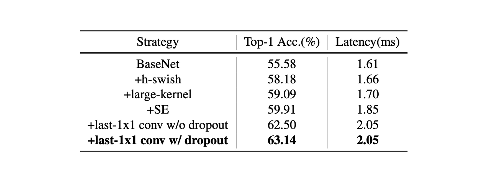

# [21.09] PP-LCNet

## 探索速度的邊界

[**PP-LCNet: A Lightweight CPU Convolutional Neural Network**](https://arxiv.org/abs/2109.15099)

---

在輕量模型的競賽中，有幾個主要的方向。

- 其一：優化參數量，以減少模型大小。
- 其二：優化計算量（FLOPs），降低計算量以提高模型的速度。
- 其三：優化推理時間。

欸，等等？

優化參數量和計算量，難道和優化推理時間不是一回事嗎？

多數人會認為：優化參數量和計算量會自然地導致更快的推理時間？

- **答案是：不對！**

---

舉個簡單的例子：

- 在 ResNet 中的跳躍連接
- 在 GoogleNet 中的 Inception 模塊
- 不同模組間的共用參數

以上操作，都會在同等參數量或運算量的前提下，增加推理時間。

其中原因來自於記憶體讀取和多分支架構間的互相等待。

不過在這篇論文中其實沒有很深入的討論這個問題，之後我們看到其他論文的時候再繼續深入討論。

## 定義問題

這篇論文只是想先解決幾個問題：

1. **如何在不增加延遲的情況下促進網路學習更強的特徵表示？**
2. **提高 CPU 上輕量級模型精確度的要素有哪些？**
3. **如何有效結合不同策略在 CPU 上設計輕量級模型？**

## 解決問題

### 模型架構

作者提出了幾個策略，來解決上述問題。

1. **DepthSepConv**

   作者使用在 [**MobileNetV1**](https://arxiv.org/abs/1704.04861) 中提出的 DepthSepConv 作為基本區塊，這裡不會用到 shortcut 和 concat 等操作，因此可以提升計算效率。

   特別是在過去研究中，已經證明在小模型中使用 shortcut 對於性能提升沒有太大幫助。

   另一方面，在 Intel CPU 中，針對 Inverted Block 或 ShuffleNet Block 有專門的優化，在推論時可以獲得更好的性能。

2. **HSwish**

   使用 ReLU 激活函數肯定是最快的！

   但通常不是最好的。

   目前已經有很多改進的激活函數，例如 Swish、Mish、GELU 等，都可以提升模型的表現。

   這裡作者參考了 [**MobileNetV3**](https://arxiv.org/abs/1905.02244) 中提出的 HSwish，這個激活函數在保持速度的同時，提升了模型的性能。

   :::tip
   Hswish 函數的表達式如下：

   $$ \text{Hswish}(x) = x \frac{\text{ReLU6}(x+3)}{6}, \text{ReLU6}(x) = \min(\max(x, 0), 6) $$

   其中，$\text{ReLU6}(x)$ 是 ReLU 函數的一個變體，它對輸入 $x$ 值進行限制在 0 到 6 之間。

   函數的特點包括：

   - **非線性**：它提供了非線性處理能力，這對於深度學習模型來說是必需的，以幫助模型學習複雜的數據模式。
   - **有界性和平滑性**：通過 $\text{ReLU6}$ 限制，Hswish 函數在 $-3$ 到無窮大的範圍內是有界的，並且相對平滑。
   - **計算效率**：由於其結構相對簡單，它在計算上更加高效，這使得它特別適用於計算資源有限的設備上。

   :::

3. **SEBlock**

   這個架構來自於這篇論文：

   - [**Squeeze-and-excitation networks**](https://arxiv.org/abs/1709.01507)

   這個模塊也幫助了 SENet 贏下了 2017 年的 ImageNet 挑戰賽。

   但是在 Intel CPU 上，這個模塊會增加推理時間，因此作者在這裡做了一些簡化：只放在網路的末端。

   經過實驗，這樣的設計在提升精度的同時，還保證了推理速度不會下降。

4. **大核卷積**

   在 [**MixNet**](https://arxiv.org/abs/1907.09595) 中，作者分析了不同大小的捲積核對網路效能的影響，最終在網路的同一層混合不同大小的捲積核。

   只是這種恣意的混合會降低模型的推理速度，因此作者在這裡也做了一些簡化：只放在網路的末端。

   在網路的末端，將 3x3 的卷積換成 5x5 的卷積，可以提升模型的精度。

5. **最後多一層全連接層**

   由於模型太小，資訊容量不足，因此作者在網路的最後多加了一層 1280 維的全連接層。

## 討論

### 實驗結果

作者在 ImageNet-1k 數據集上進行了實驗，包括 128 萬張訓練影像和 1000 個類別的 5 萬張驗證影像。

- **訓練配置**：

  - 使用 SGD (隨機梯度下降) 作為最佳化器，具有 0.9 的動量和 3e-5 的權重衰減（對於大型模型為 4e-5）。
  - 批量大小為 2048，學習率從 0.8 開始，並通過餘弦退火計劃進行調整。
  - 整個訓練過程包括 360 個週期，其中包含 5 個線性預熱週期。
  - 影像的前處理包括隨機裁切為 224×224 像素並進行隨機水平翻轉。

- **評估階段**：

  - 評估時，首先將影像沿短邊調整為 256 像素，然後進行 224×224 像素的中心裁切。

- **精度提升技術**：

  - 使用 SSLD 蒸餾方法可以顯著提高 PP-LCNet 的精確度，表 3 展示了 PP-LCNet 與其他最先進模型的比較。

從上面圖表中，可以看到 PP-LCNet 在計算量與參數量相近，且精度持平的情況下，推論速度比其他模型快 1.5 倍以上。

### 消融實驗

1. **SE 模組（Squeeze-and-Excitation）**:

   - SE 模組增強了模型對通道之間關係的注意力，從而提升模型準確性。
   - 在網路的尾部添加 SE 模組比在其他位置添加更為有效。

   因此，在 PP-LCNet 中優先在最後兩個區塊中加入 SE 模組，以平衡推理速度與準確度。

2. **大核心的使用**:

   - 大核心（如 5×5）雖然能提升精度，但並非適合新增至網路的所有位置。
   - 和 SE 模組相似，將大內核置於網路尾部更為有效。

   因此，選擇在特定的層使用 5×5 的深度分離卷積核，而在其他層維持 3×3 核。

3. **不同技術的綜合效果**:

   - H-Swish 和大核心可以在幾乎不增加推理時間的情況下提升效能。
   - 適量添加 SE 模組進一步提升效能。
   - 在全域平均池化（GAP）後使用更大的全連接層顯著提高精度。
   - 應用 dropout 策略也有助於提升模型的準確度。

## 結論

在這項研究中，作者專注於開發適用於輕量級 Intel CPU 網絡的方法，旨在在不增加推理時間的前提下，提高模型的準確性。

透過廣泛的實驗和方法的優化，提出了一種在各種視覺任務上具有不錯性能的網絡架構，特別是在精度與速度的平衡上表現優異。

:::info
這個模型確實很小，精度也不差，而且推理速度很快。

對於開發手機應用或模型規模受限的情況下，我們通常會作為首要考慮的選擇。
:::
