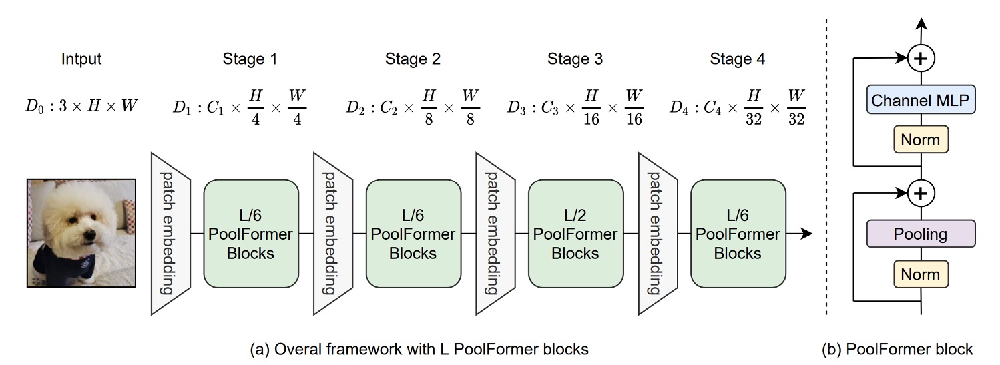
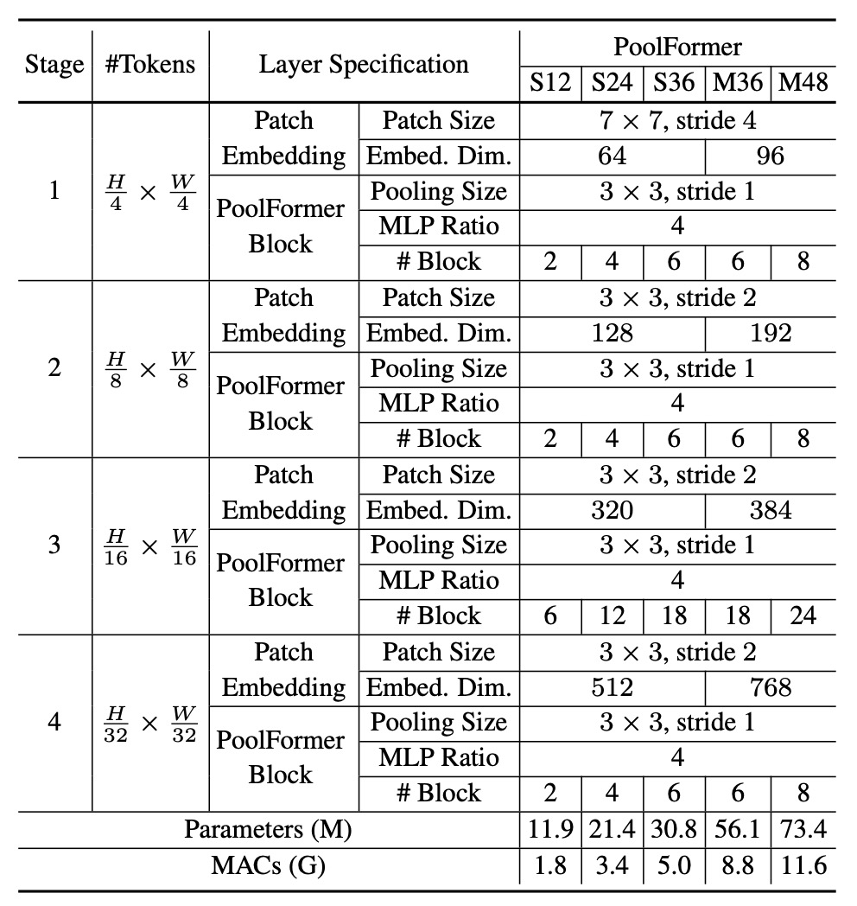
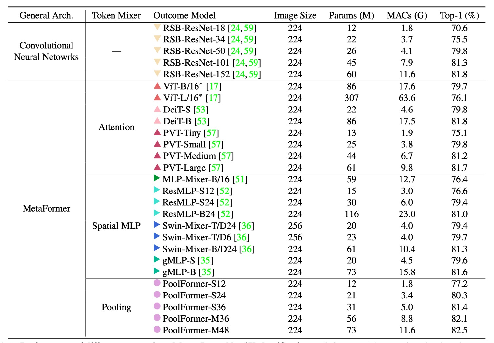
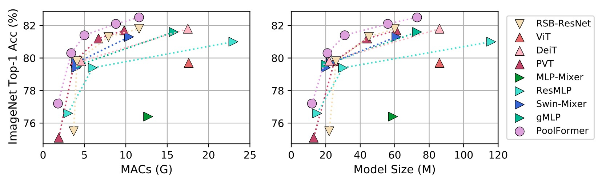
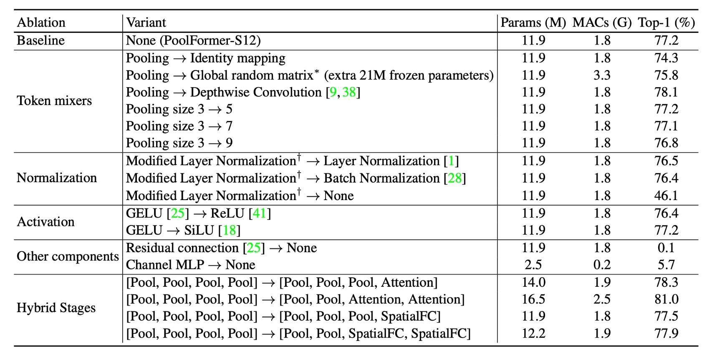

# [21.11] PoolFormer

## 你需要的是框架！

[**MetaFormer Is Actually What You Need for Vision**](https://arxiv.org/abs/2111.11418)

---

:::info
以下內容由 ChatGPT-4 彙整，並經過人工校對編輯與補充說明。
:::

---

Transformer 架構帶入視覺領域之後，帶起來一大波的研究風潮。

在過去的研究中，多數人研究如何提升 Token-Mixer 的性能，也有一部分的人研究如何優化 Patchify 的過程。

但是，這些研究都忽略了一個重要的問題：**框架**。

## 定義問題


這個「**框架**」指的組成整個 Transformer 的基本結構，包括：

### Input Embedding

這個部分是將圖片轉換成一個向量序列，這個過程通常是透過 CNN 來完成。

:::tip
通常是不重疊滑動視窗的大核卷積，因此雖然說是 CNN，但實際上的功能是全連接層，用 CNN 的原因是可以透過滑動視窗的機制來達到切塊的效果。
:::

### Token-Mixer

這個部分是「跨 Token」的混合，這個過程通常是透過 Transformer 的 Self-Attention 來完成。

在最近的研究中，引入 MLP-Mixer 的概念，將 Token-Mixer 的 Self-Attention 換成 MLP，這樣可以減少計算量。

### Channel MLP

這個部分是針對每個 Token 內的「跨維度」的混合。

這個部分大多是透過 MLP 來完成。

### 或許 Token-Mixer 不是重點？

作者試圖探索到底是 Transformer 中基於注意力的 Token-Mixer 對其成功貢獻最大，還是 Transformer 的整體架構（即 MetaFormer）更為重要。

他們通過用簡單的池化操作符替換原本的注意力模組來進行實驗，以驗證 MetaFormer 架構本身在模型效能中的關鍵作用。

## 解決問題

### 模型架構



作者為了驗證 MetaFormer 的重要性，弱化了 Token-Mixer 的作用，將原本的 Self-Attention 模組替換成了池化操作。這個操作的簡單程度，大概僅次於恆等映射，它只是將一組數據中的數值進行某種統計運算，例如最大池化、平均池化等。

除此之外，作者沿用了從 PVT 的多層次架構，像是 CNN 模型一樣進行分層次的降採樣。

- [**PVT: 空間縮減注意力機制**](../2102-pvt/index.md)

在池化操作的部分，作者也留下了實作細節：

```python {20}
import torch.nn as nn

class Pooling(nn.Module):

    def __init__(self, pool_size=3):
        super().__init__()
        self.pool = nn.AvgPool2d(
            pool_size,
            stride=1,
            padding=pool_size//2,
            count_include_pad=False,
        )

    def forward(self, x):
        """
        [B, C, H, W] = x.shape
        Subtraction of the input itself is added since the block already has a
        residual connection.
        """
        return self.pool(x) - x
```

這裡特別注意到實作中的這句 `self.pool(x) - x`，第一次看可能會感到困惑。

作者有留下註解，解釋原因是因為在 Token-Mixer 的結構中有殘差連接的機制，即：

$$
x = x + \text{TokenMixer}(x)
$$

這裡減去 `x` 的原因是為了取消掉原本的殘差連接，單純地檢視池化操作的效果。

### 模型配置



這邊的架構配置遵循之前研究的比例，採用 1:1:3:1 的比例，此外 MLP 的擴充比例為 4。

## 討論

### ImageNet 實驗



PoolFormer 的實驗結果十分驚人，它在 ImageNet 上的表現超越了許多先前「精心設計」的模型，包括 ViT、MLP-Mixer、PVT 等。

就只是使用「平均池化」作為 Token-Mixer 的替代，就能達到如此驚人的效果，這也證明了 MetaFormer 的重要性。

把上表畫成圖表，可以發現 PoolFormer 在參數和計算量較少的情況下，性能超越其他模型。



### 消融實驗

:::tip
基於這篇論文的標題，我們認為這一段是全篇最重要的章節。
:::



為了近一步驗證 PoolFormer 的有效性，作者進行了消融實驗，將 PoolFormer 的架構逐步還原成原本的 Transformer 架構。

1. **Token-Mixer**

   - **恆等映射**
     - 將池化替換為恆等映射後，MetaFormer 仍達到 74.3% 的 top-1 準確率。表明 MetaFormer 本身是性能保證的關鍵。
   - **全域隨機矩陣**
     - 使用全域隨機矩陣進行 Token 混合，模型準確率為 75.8%，比恆等映射高 1.5%。
   - **深度卷積**
     - 使用深度卷積替代池化，模型達到 78.1% 的 top-1 準確率，比 PoolFormer-S12 高 0.9%。

2. **Pooling Size**

   - 測試池大小為 3、5、7，發現效能相似，預設為池大小 3。

3. **修改層標準化（MLN）**

   - 計算標記和通道維度的平均值和方差，比 Layer Normalization 或 Batch Normalization 分別高 0.7% 或 0.8%。
   - 去除標準化後，模型性能降至 46.1%。

4. **GELU vs ReLU vs SiLU**

   - 使用 ReLU，性能下降 0.8%。
   - 使用 SiLU，性能與 GELU 相同。
   - 預設使用 GELU。

5. **殘差連接和通道 MLP**

   - 沒有殘差連接或通道 MLP，模型無法收斂，準確度僅為 0.1%/5.7%。

6. **混合模型**
   - 在底部階段使用池化，頂部階段使用注意力或基於空間 MLP 的混合器。該變體以 16.5M 參數和 2.5G MAC 達到 81.0% 準確率。
   - 與 ResMLP-B24 相比，其需要 116M 參數和 23G MACs 才能達到相同精確度。

根據上述的消融實驗，作者提出幾個觀點：

- MetaFormer 架構是性能保證的關鍵。
- 簡單的池化作為 Token-Mixer 也能達到競爭性能。
- 修改層標準化（MLN）優於普通 LayerNorm 和 BatchNorm。
- 殘差連接和 Channel MLP 是不可或缺的組件。
- 結合池化與其他 Token-Mixer 可能是提高效能的有希望方向。

## 結論

在這篇研究中，作者抽象了原本的 Transformer 為 MetaFormer 的通用架構。

將 Transformer 中的注意力機制抽象化為 Token-Mixer。這種抽象化的創新在於，它不僅僅限於特定的 Token-Mixer，從而提供了一種靈活且強大的框架。

透過將池化這種極為簡單的操作作為 Token-Mixer，作者成功地展示了 PoolFormer 模型在各種視覺任務中的競爭力，從而強有力地支持了「**MetaFormer 其實就是你視覺所需要的**」這一主張。

未來的研究方向之一是檢驗 MetaFormer 架構的廣泛適用性和穩健性。

作者建議探索 PoolFormer 在自然語言處理（NLP）任務中的應用，以驗證 MetaFormer 在 NLP 領域的有效性。如果能夠證明這一點，MetaFormer 作為通用架構的地位將更加堅固。
