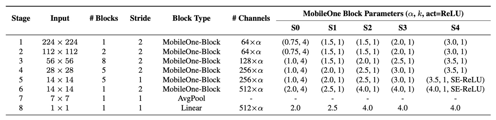
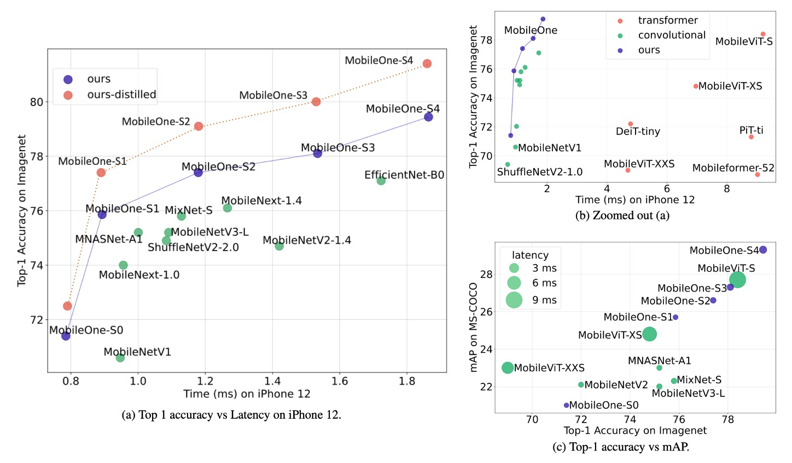
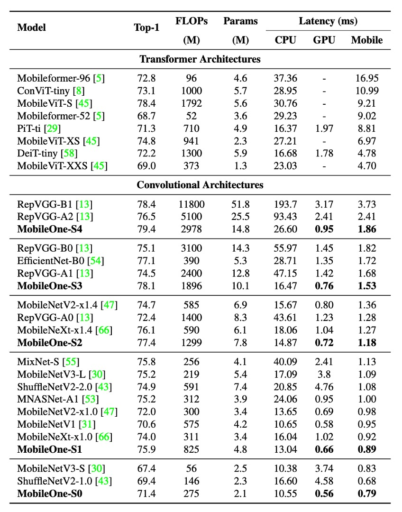

# [22.06] MobileOne

## 一毫秒攻防

[**MobileOne: An Improved One millisecond Mobile Backbone**](https://arxiv.org/abs/2206.04040)

---

:::info
以下內容由 ChatGPT-4 彙整，並經過人工校對編輯與補充說明。
:::

---

重新參數化的概念大約在 2021 年 RepVGG 提出之後開始受到關注。

研究者們紛紛思考如何在模型架構上找到適合重新參數化的方法，以提高模型的效能。

:::tip
**模型重新參數化（Reparameterization）**：

拆分訓練和推論架構，將原本的模型參數轉換為新的參數，以數學等價的方式將訓練架構轉換為推論架構，從而提升模型速度和性能。
:::

## 定義問題

有了 RepVGG 的成功經驗，作者也想嘗試重參數的效果，為此設計了另外一種用來「重新參數化」的結構單元，並且在 iPhone12 上使用 CoreML 進行神經網絡部署和基準測試。

和 RepVGG 一樣，MobileOne 也是在訓練時使用線性超參數化模型，推理時重新參數化線性結構，並動態放鬆訓練中的正規化。

:::tip
模型重新參數化的概念我們推薦你回去看 RepVGG，這篇 MobileOne 論文在問題描述的部分沒有講出新東西。

- [**RepVGG: 讓 VGG 再次偉大**](../2101-repvgg/index.md)
  :::

## 解決問題

### 瓶頸分析 - 激活函數

作者為了分析激活函數對延遲的影響，建立了一個 30 層的卷積神經網絡，並在 iPhone12 上使用不同的激活函數進行基準測試。

上表顯示，儘管所有模型除了激活函數外具有相同的架構，它們的延遲卻大不相同。

這些延遲差異主要是由最近引入的激活函數引起的。這些激活函數雖然在極低 FLOPs 模型（如 MicroNet）中顯示出顯著的精確度提升，但其使用導致的延遲成本可能很高。

因此，在設計 MobileOne 時，作者選擇僅使用 ReLU 激活函數，以減少延遲成本。

### 瓶頸分析 - 架構

接著考慮兩個常見的架構：跳躍連接和 Squeeze-Excite 模組。

影響運行時效能的兩個關鍵因素是記憶體存取成本和並行度。在多分支架構中，記憶體存取成本顯著增加，因為必須儲存每個分支的啟動來計算圖中的下一個張量。如果網路的分支數量較少，則可以避免這種記憶體瓶頸。由於同步成本，強制同步的架構區塊（例如 Squeeze-Excite 區塊中使用的全域池操作）也會影響整體運行時間。

為了展示記憶體存取成本和同步成本等隱藏成本，作者在 30 層卷積神經網路中消除了跳躍連接和 Squeeze-Excite 模組的使用。在上表中展示了每種選擇對延遲的影響。

因此，MobileOne 採用推理時無分支的架構，這會導致更小的記憶體存取成本。只在最大的變體中使用 Squeeze-Excite 模組，以提高準確性。

### 模型架構

MobileOne 的單元結構和之前的研究類似，差別在於在 RepVGG 中，改變的是 ResNet 的殘差結構，將其轉換成可重新參數化的形式。而 MobileOne 則是將 MobileNet 的基本塊轉換成可重新參數化的形式。

也就是在上圖中所展示的，這次重參數的對象改成深度可分離卷積的形式，先進行 3x3 深度卷積，然後進行 1x1 逐點卷積。然後，引入帶有 batchnorm 的可重新參數化的跳過連接以及複製結構的分支。

在推論時，MobileOne 模型沒有任何分支。使用重新參數化過程將它們刪除。對於內核大小為 K、輸入通道維度 $C_{in}$ 和輸出通道維度 $C_{out}$ 的捲積層，權重矩陣表示為 $W' \in \mathbb{R}^{C_{out}\times C_{in}\times K\times K}$，偏差表示為 $b' \in \mathbb{R}^D$。累積標準差 $\mu$、尺度 $\gamma$ 和偏差 $\beta$。

在每個分支中獲得批量歸一化折疊權重後，推理時卷積層的權重 $W$ 和偏置 $b$ 的計算方法如下：權重 $W$ 等於所有分支權重 $W_{i}$ 的總和，即 $W = \sum_{i=1}^{M} W_{i}$；偏置 $b$ 等於所有分支偏置 $b_{i}$ 的總和，即 $b = \sum_{i=1}^{M} b_{i}$，其中 $M$ 是分支的數量。

### 模型配置

最近的研究通過調整模型的寬度、深度和分辨率來提高效能，上表展示了 5 種不同的寬度比例。

MobileOne 在深度縮放上類似於 MobileNet-V2，即在輸入解析度較大時使用較淺的早期階段，因為這些層比後期階段要慢得多。

由於 MobileOne 在推理時沒有多分支架構，因此避免了多分支架構所產生的資料移動成本。這能夠在不增加顯著延遲成本的情況下擴展模型參數，與 MobileNet-V2 和 EfficientNets 等競爭性多分支架構相比，這是一大優勢。

## 討論

### ImageNet 的性能

作者在 ImageNet 資料集上評估了 MobileOne 模型。該資料集包含 128 萬張訓練影像和來自 1,000 個類別的 50,000 張驗證影像。

所有模型都在配備 8 個 NVIDIA GPU 的機器上使用 PyTorch 庫從頭開始訓練。訓練過程使用了 SGD 和動量優化器，共進行了 300 個週期，有效批次大小為 256。為了提高模型效能，使用了標籤平滑正則化和交叉熵損失，平滑因子設定為 0.1。

初始學習率為 0.1，並採用餘弦退火策略，初始權重衰減係數為 $10^{-4}$，逐漸退火至 $10^{-5}$。

較大的 MobileOne 變體（S2、S3 和 S4）採用 AutoAugment 技術進行訓練，而較小的變體（S0 和 S1）則使用標準的資料增強方法，如隨機調整大小的裁切和水平翻轉。

所有版本的 MobileOne 都使用 EMA（指數移動平均）權重平均值進行訓練，衰減常數為 0.9995。

測試時，所有模型均在分辨率為 224 × 224 的圖像上進行評估，參數 ​​ 計數均低於 2000 萬，並未使用蒸餾技術進行訓練。使用 fvcore 庫報告 FLOPs 計數。

實驗結果顯示，即使是 Transformer 架構的最小變體，其在行動裝置上的延遲也高達 4 毫秒。

最先進的 MobileFormer 的 top-1 準確率為 79.3%，延遲為 70.76 毫秒，而 MobileOne-S4 的準確率達到了 79.4%，延遲僅為 1.86 毫秒，速度快了 38 倍。MobileOne-S3 的 top-1 準確率比 EfficientNet-B0 高出 1%，並且在行動裝置上的速度提高了 11%。

與其他競爭方法相比，MobileOne 模型在 CPU 和 GPU 上也表現出較低的延遲。

## 結論

這項研究分析了現代高效能 CNN 中使用的各種架構組件的效率瓶頸，並證明了透過使用可重新參數化結構可以改善最佳化瓶頸。

MobileOne 的模型擴展策略透過使用可重新參數化的結構，實現了最先進的性能，並在行動裝置和桌面 CPU 上都保持了高效。

研究的成果不僅提升了模型的準確性和泛化能力，還顯著降低了延遲，為未來的研究和應用提供了重要的參考和基礎。
