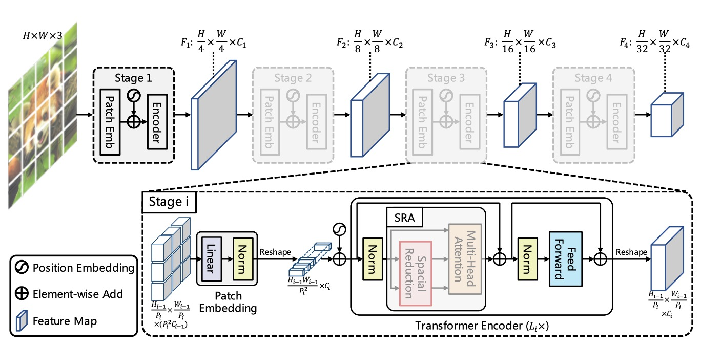
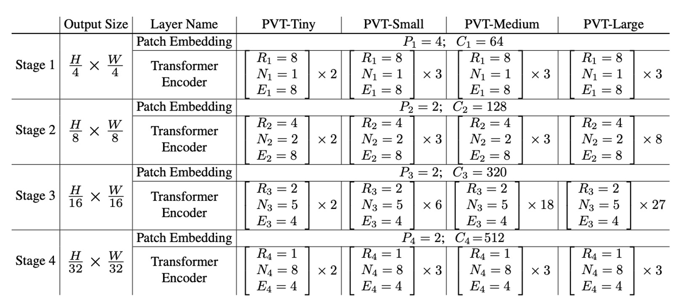
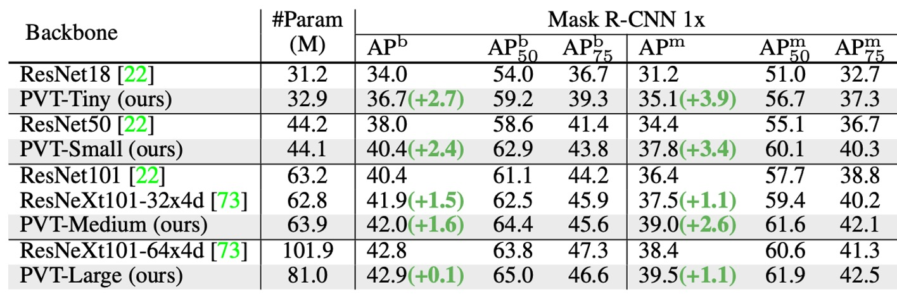

# [21.02] PVT

## 空間縮減注意力機制

[**Pyramid Vision Transformer: A Versatile Backbone for Dense Prediction without Convolutions**](https://arxiv.org/abs/2102.12122)

---

:::info
以下內容由 ChatGPT-4 彙整，並經過人工校對編輯與補充說明。
:::

---

ViT 在影像分類上取得驚人的成績。

正式宣告 Transformer 架構踏入電腦視覺領域攻城掠地。

## 定義問題

ViT 架構在一開始就使用 16 x 16 的大核卷積，來進行圖像分塊（patchify）。

如果是一張解析度 224 x 224 的影像，經過分塊後，即變成 14 x 14 的影像。

這種解析度的影像，用來做影像分類是沒問題，因為分類需要依賴高度抽象的全局特徵。

但如果要進行密集預測的任務，例如影像分割或物件偵測等，這樣的分塊方式就會讓模型難以捕捉到局部細節。

- **因為細節都在 16 x 16 的特徵壓縮操作中消失了。**

顯然地，我們需要更精細的特徵來進行密集預測，那麼把 16 x 16 的卷積改成 2 x 2 好嗎？

- **當然不好！**

我們就以 224 x 224 的圖像為例：

- 使用 16 x 16 的分塊尺寸，我們會得到 14 x 14 共 196 個輸入 Token。
- 使用 2 x 2 的分塊尺寸，我們會得到 112 x 112 共 12,544 個輸入 Token。

**試計算 12,544 x 12,544 的自注意力矩陣......**

想必沒有人會認為這是一個好主意。

## 解決問題

### 模型架構



上圖展示了 PVT 的架構設計。

看起來好像很複雜，但你只要回想一下卷積網路的架構，就會發現這其實是個一模一樣的概念。

### 分層結構

首先看到的是分層結構，這就像是我們在 ConvNet 中常提到的 1/2 降維，總共分五個階段。

所以會有 1/2 尺寸的特徵圖、1/4 尺寸的特徵圖、1/8 尺寸的特徵圖，以此類推。

在 PVT 的架構中，從 1/4 尺寸的特徵圖開始，直到 1/32 尺寸的特徵圖。

降採樣的過程也是透過指定 stride 數值的卷積來實現。

舉例來說，輸入圖像為 3 x 224 x 224，指定 stride 為 4 的卷積，輸出通道數量為 64，那麼經過計算後，得到的特徵圖尺寸為 64 x 56 x 56。

所以在第一個 Stage 中，輸入 Transformer Encoder 的資料為：

- **序列長度**：3136（所有影像切塊，即 56 x 56 個）
- **特徵數**：64（每個切塊特徵數，即上面提到的通道）

### 空間縮減注意力（SRA）


得到特徵圖像後，我們發現 (56 x 56) x (56 x 56) 的自注意力矩陣仍然非常巨大，必須嚴肅處理。

作者在這裡緊接著提出了「空間縮減注意力」（Spatial Reduction Attention）的概念。

方法是保留查詢（Query）的尺寸，縮減鍵（Key）和值（Value）的尺寸。

舉例來說，原始的自注意力圖的尺寸 **$QK^T$** 得到 (56 x 56) x (56 x 56) 的注意力圖，如果把 Key 和 Value 的尺寸從 (56 x 56) 縮減為 (7 x 7) 的話，那麼最後的注意力圖尺寸就會變成 3136 x 49。

剛才看來過於龐大的自注意力矩陣，現在就可以接受了。

＊

比照以往，我們直接看一下實作，就知道這篇論文的核心思想。

重點的部分我們用 Hightlight 標示出來，其中在本篇論文的中，`sr_ratio` 的設定是 **[8, 4, 2, 1]**，也就是每個 Stage 的空間縮減比例。

在剛才的範例中，第一層原本的 56 x 56 縮減為 7 x 7。

```python {31-34,40-44}
# Reference:
#   - https://github.com/whai362/PVT/blob/v2/classification/pvt.py

import torch
import torch.nn as nn

class SpatialReductionAttention(nn.Module):

    def __init__(
        self,
        dim,
        num_heads=8,
        qkv_bias=False,
        qk_scale=None,
        attn_drop=0.,
        proj_drop=0.,
        sr_ratio=1
    ):
        super().__init__()
        self.dim = dim
        self.num_heads = num_heads
        head_dim = dim // num_heads
        self.scale = qk_scale or head_dim ** -0.5

        self.q = nn.Linear(dim, dim, bias=qkv_bias)
        self.kv = nn.Linear(dim, dim * 2, bias=qkv_bias)
        self.attn_drop = nn.Dropout(attn_drop)
        self.proj = nn.Linear(dim, dim)
        self.proj_drop = nn.Dropout(proj_drop)

        self.sr_ratio = sr_ratio
        if sr_ratio > 1:
            self.sr = nn.Conv2d(dim, dim, kernel_size=sr_ratio, stride=sr_ratio)
            self.norm = nn.LayerNorm(dim)

    def forward(self, x, H, W):
        B, N, C = x.shape
        q = self.q(x).reshape(B, N, self.num_heads, C // self.num_heads).permute(0, 2, 1, 3)

        if self.sr_ratio > 1:
            x_ = x.permute(0, 2, 1).reshape(B, C, H, W)
            x_ = self.sr(x_).reshape(B, C, -1).permute(0, 2, 1)
            x_ = self.norm(x_)
            kv = self.kv(x_).reshape(B, -1, 2, self.num_heads, C // self.num_heads).permute(2, 0, 3, 1, 4)
        else:
            kv = self.kv(x).reshape(B, -1, 2, self.num_heads, C // self.num_heads).permute(2, 0, 3, 1, 4)
        k, v = kv[0], kv[1]

        attn = (q @ k.transpose(-2, -1)) * self.scale
        attn = attn.softmax(dim=-1)
        attn = self.attn_drop(attn)

        x = (attn @ v).transpose(1, 2).reshape(B, N, C)
        x = self.proj(x)
        x = self.proj_drop(x)

        return x
```

### 模型配置

最後，我們來看一下 PVT 的模型配置。

1. $P_i$：第 $i$ 階段的補丁大小
2. $C_i$：第 $i$ 階段輸出的通道數
3. $L_i$：第 $i$ 階段中編碼器層的數量
4. $R_i$：第 $i$ 階段中 SRA（空間縮減注意力）的減速比
5. $N_i$：第 $i$ 階段中 SRA 的頭數
6. $E_i$：第 $i$ 階段中前饋層的擴展比

模型設計遵循 ResNet 的設計規則：

1. 在淺層階段使用較小的輸出通道數。
2. 將主要計算資源集中在中間階段。

為了提供討論實例，下表展示了一系列不同尺度的 PVT 模型，分別是 PVT-Tiny、PVT-Small、PVT-Medium 和 PVT-Large。它們的參數數量分別與 ResNet18、ResNet50、ResNet101 和 ResNet152 相當。



## 討論

### ImageNet 的性能


作者將 PVT 與兩個最具代表性的 CNN 主幹進行比較，即 ResNet 和 ResNeXt，這些模型廣泛用於許多下游任務的基準測試中。

在上表中，PVT 模型在相似的參數數量和計算預算下優於傳統的 CNN 主幹。

例如，當 GFLOP 大致相似時，PVT-Small 的 top-1 錯誤率為 $20.2\%$，比 ResNet50 的 $21.5\%$ 高 $1.3$ 個百分點（$20.2\%$ vs. $21.5\%$）。

在相似或更低的複雜性下，PVT 模型的性能與最近提出的基於 Transformer 的模型相當，例如 ViT 和 DeiT。

PVT-Large 的 top-1 錯誤率為 $18.3\%$，與 ViT（DeiT）-Base/16 的 $18.3\%$ 相當。

### 物件偵測性能




這個架構從一開始就瞄準了密集預測的任務，因此我們特別看一下 PVT 在密集預測任務上的性能。

1. **資料集**：

   - 使用 COCO benchmark
   - 訓練集：COCO train2017（118k 張影像）
   - 驗證集：COCO val2017（5k 張影像）

2. **模型與初始化**：

   - 標準偵測器：RetinaNet 和 Mask R-CNN
   - Backbone 使用 ImageNet 預訓練權重初始化
   - 新增的層使用 Xavier 初始化

3. **訓練設定**：

   - 批次大小：16
   - 硬體：8 個 V100 GPU
   - 最佳化器：AdamW
   - 初始學習率：$1 \times 10^{-4}$

在可比的參數數量下，PVT 模型顯著優於傳統模型，使用 RetinaNet 時，PVT-Tiny 的 AP 比 ResNet18 高 4.9 點（36.7 vs. 31.8）。

使用 Mask R-CNN 時，PVT-Tiny 的 mask AP (APm) 為 35.1，比 ResNet18 高 3.9 點（35.1 vs. 31.2），甚至比 ResNet50 高 0.7 點（35.1 vs. 34.4）。

這些結果表明，PVT 可以成為 CNN backbone 的良好替代方案，用於物件偵測和實例分割任務。

下圖展示了 PVT 在 COCO 驗證集上的結果。


### 金字塔結構的貢獻

最後作者進行了幾個消融實驗，以驗證 PVT 的各個部分對性能的影響。

首先看到的是金字塔結構的貢獻分析，如下表：


對比原始的 ViT 結構，PVT 的金字塔結構在 AP 分數上提高了 8.7 個百分點。

這表明金字塔結構的設計確實有助於提高密集預測任務的性能。

### 深度與寬度的權衡


作者進一步探討 PVT 應該更深還是更寬，以及不同階段的特徵圖尺寸對性能的影響。

將 PVT-Small 的隱藏維度乘以 1.4，與 PVT-Medium 參數數量相當，如上表。

實驗指出，在參數量相近的情況下，更深的模型性能更好。

### 治標不治本


最後，作者針對效能的部分做了一些討論。

首先，隨著輸入規模增加，PVT 的 GFLOPs 增長率高於 ResNet，低於 ViT。

當輸入規模不超過 640×640 像素時，PVT-Small 和 ResNet50 的 GFLOPs 相似。

此外，當輸入影像固定為短邊為 800 像素時，基於 PVT-Small 的 RetinaNet 推論速度較慢。

也就是說，基於卷積網路的架構更能適應大尺寸的輸入，而這正是實務上提升性能的一個重要方向。

:::tip
究其原因，SRA 機制只是將自注意力矩陣縮小，並沒有從源頭解決自注意力矩陣的計算複雜度問題。
:::

## 結論

雖然在 2021 年這個時間點，本篇論文還是抓著 ResNet 和 ResNeXt 打，可能會讓人覺得有點保守。

但本研究將金字塔結構引入 Transformer，以提供一個純 Transformer 主幹網，用於密集預測任務，而不是針對特定任務的頭部或影像分類模型，為之後的研究提供了一個重要的方向。

此時也是基於 Transformer 的模型在電腦視覺中的應用的早期階段，未來有許多潛在的技術和應用有待探索。
