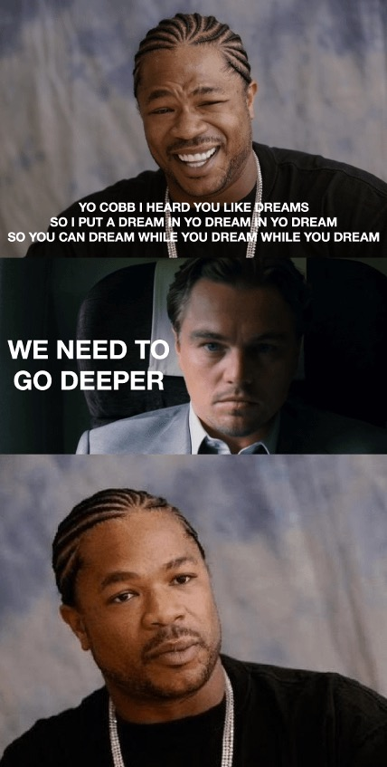
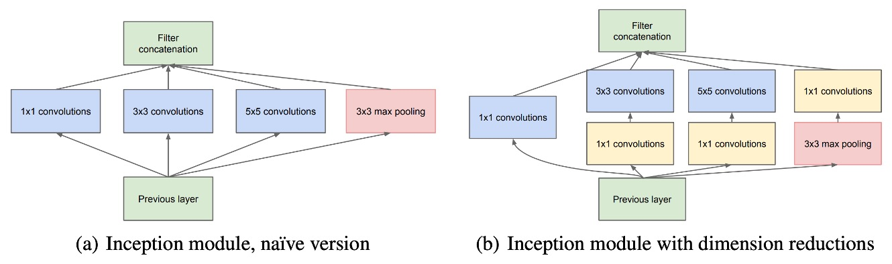

# [14.09] GoogLeNet

## 或叫做 Inception-V1

[**Going deeper with convolutions**](https://arxiv.org/abs/1409.4842)

---

GoogLeNet 採用了 Inception 架構，其靈感來自「Network in Network」模型，以及網路上的「we need to go deeper」迷因。

- [**[13.12] Network in network**](https://arxiv.org/abs/1312.4400)

我們很少看到有論文如此正經地說自己的研究動機是來自於網路迷因。

不過既然作者敢這樣寫，我們也就如實轉述：

<figure style={{ "width": "60%"}}>

<figcaption>圖片來源：[Know your meme: We need to go deeper](https://knowyourmeme.com/memes/we-need-to-go-deeper)</figcaption>
</figure>

Inception 架構的「深度」有兩層意義：一方面，它引入了一種新的組織形式，也就是「Inception 模組」，另一方面，它也實現了更深的網路結構。

GoogLeNet 的命名是向 Yann LeCun 的 LeNet-5 網路致敬。該名稱指的是 Inception 架構的特定版本，這個版本被用於參加 ILSVRC14 競賽。

## 解決問題

### Inception 模塊

Inception 架構的核心理念是透過現有的稠密組件來近似並覆蓋最佳的局部稀疏結構。

在模組中，使用了 1×1、3×3 和 5×5 的卷積核來處理不同空間分布的特徵，並將所有層的輸出濾波器併合成一個輸出向量，作為下一階段的輸入。為了避免卷積核過大的情況，這些卷積濾波器的大小限制是基於方便性，而非絕對必要性。

由於池化操作在卷積神經網路中的重要性，每個 Inception 模組除了卷積濾波器外，還包含一個平行的池化路徑，並將池化層的輸出與卷積層的輸出併合，進一步豐富特徵表示。

為避免計算量急劇增長，Inception 架構採用了 1×1 卷積來執行維度縮減，這種卷積既可作為降維工具，也可作為非線性啟動層。這種方法大幅減少了計算資源的需求，特別是在進行 3×3 和 5×5 卷積之前，降低了計算複雜度。

當 Inception 模組堆疊在一起時，特徵的抽象層次逐層提高，並且較高層的特徵空間濃度會逐漸減少，因此 3×3 和 5×5 卷積的比例隨著層數增加而提高。

### 參數配置

上表列出了 GoogLeNet 的一些重要參數配置。

GoogLeNet 網路的感受野大小為 $224 \times 224$，處理 RGB 圖像並進行均值減法操作。表格中的「#3×3 reduce」與「#5×5 reduce」表示在 3×3 與 5×5 卷積之前使用的 1×1 濾波器數量，而「pool proj」表示內建最大池化後投影層中的 1×1 濾波器數量。

GoogLeNet 架構在僅計算有參數的層時深度為 22 層，若計入池化層則為 27 層。整體上該網路包含約 100 個獨立的構建模組，具體數量取決於使用的機器學習基礎設施。平均池化層被用於分類器之前，並且實現上使用了一個額外的線性層，這使得網路可以更容易調整至其他標籤集合。

移除全連接層並改用平均池化，提升了約 0.6%的 top-1 準確率，但即使在移除全連接層後，Dropout 的使用仍然是必須的。Dropout 層的輸出丟棄比例為 70%。

### 模型架構

由於網路深度較大，如何有效地將梯度回傳至所有層是設計中的一個關注點。為此，作者在這裡引入了輔助分類器，這些分類器位於 Inception 模組 (4a) 與 (4d) 的輸出之上。

:::tip
上圖中的 `Softmax0` 和 `Softmax1` 是輔助分類器。
:::

輔助分類器的設計包括一個 5×5 的平均池化層、1×1 的卷積層（128 個濾波器）、具有 1024 個單元的全連接層、70%輸出丟棄比例的 Dropout 層，以及一個線性層。這些分類器在訓練時用以加強梯度信號的回傳，並提升低層次特徵的辨別能力，訓練時損失會以 0.3 的權重加入總損失，但在推論時輔助網路會被移除。

## 討論

### 在 ILSVRC 2014 上的表現

ILSVRC 2014 比賽的任務是將圖像分類為 Imagenet 層次結構中的 1000 個葉節點類別之一。

訓練集中有約 120 萬張圖片，驗證集有 5 萬張圖片，測試集則有 10 萬張圖片。每張圖片對應一個真實標籤，性能的評估基於預測結果

作者在參賽時並未使用任何外部數據進行訓練，完全依賴訓練集中提供的資料。此外，在測試過程中，額外採用了幾種技術來提高性能：

1. 獨立訓練了 7 個版本的 GoogLeNet 模型，並以集成方式進行預測。
2. 通過多個裁剪結果以及所有獨立分類器的結果進行平均，得到最終的預測結果。

最終在挑戰中的提交結果在驗證集和測試集上的 Top-5 錯誤率為 6.67%，排名第一。

## 結論

GoogLeNet 的設計展示了透過創新的 Inception 架構，在計算資源和模型效能之間取得平衡的重要性，同時也展示了稀疏架構的潛力，為未來自動化設計更稀疏、更精細的神經網路結構指引了方向。

該方法的可擴展性使其成為現代深度學習研究中的一個重要基石，尤其在強調效率和效能平衡的背景下，這對未來的研究和應用都有重要啟發。

這篇算是 Inception 系列的第一篇，後續還有 Inception-V2、V3、V4 等等，每一篇都有不同的改進和優化，我們找時間繼續閱讀。
