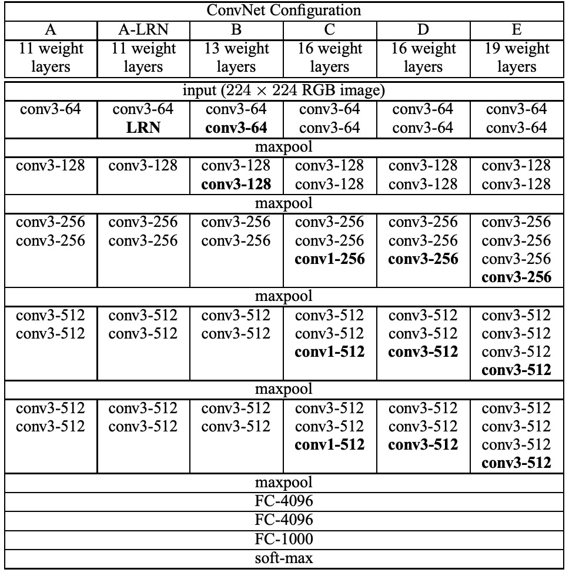
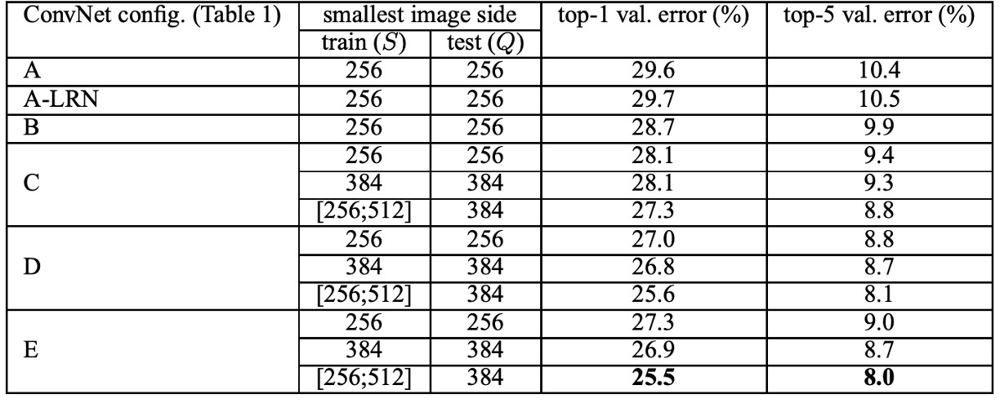
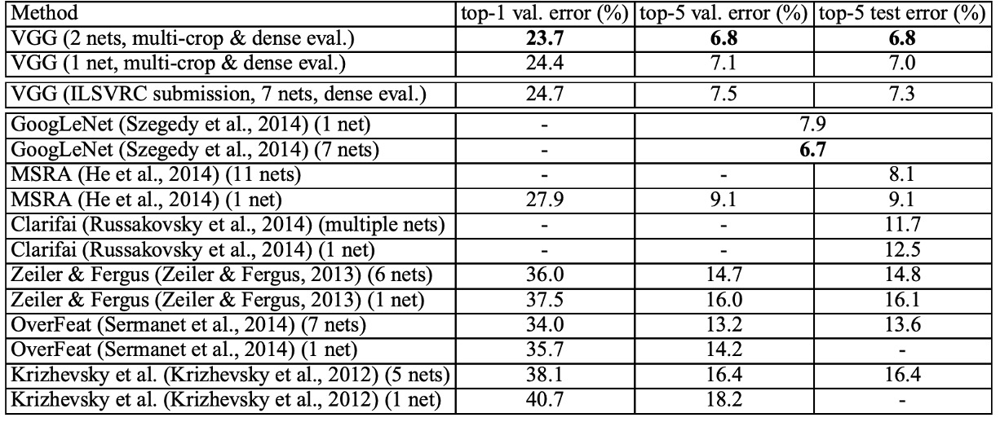

## 很深，還要更深

[**Very Deep Convolutional Networks for Large-Scale Image Recognition**](https://arxiv.org/abs/1409.1556)

---

在神經網路早期，深度的研究停滯了很久。

主要原因還是在於梯度消失問題，隨著網路深度的增加，梯度的資訊無法有效地傳遞到較早期的層，導致訓練困難。

因此在 AlexNet 之後，研究者們開始對網路的深度進行探索，並提出了一系列的深度網路結構，其中 VGG 是其中一個重要的代表。

## 定義問題

在過去的研究中，卷積核的大小通常是 5×5 或 7×7，而 VGG 提出了使用多個 3×3 的卷積核來代替較大的卷積核。作者認為使用「多層」小卷積核，而不是「少層」大卷積核，可以帶來幾個明顯的優勢：

1.  **提高決策函數的辨別力**：

    使用多層小卷積核（例如 3×3）的堆疊，每層之間引入非線性啟動函數（如 ReLU），可以增加模型的非線性表示能力。這使得決策函數更具辨別力，相比於單一大卷積核（例如 7×7），能夠更有效地捕捉數據中的複雜特徵。

2.  **減少參數數量**：

    假設輸入和輸出都有 C 個通道，三層 3×3 卷積堆疊需要的參數數量為：

         - $3×(3×3×C×C) = 27C^2$

    而單一層 7×7 卷積需要的參數數量為：

        - $7×7×C×C = 49C^2$。

    這意味著多層小卷積核堆疊比單層大卷積核減少了約 81% 的參數數量，從而降低了模型的計算和存儲成本。

3.  **有效感受野的增加**：

    堆疊多層小卷積核可以逐層增加有效感受野。

    兩層 3×3 卷積的堆疊具有 5×5 的有效感受野，三層 3×3 卷積的堆疊具有 7×7 的有效感受野。

    因此，可以通過增加卷積層數來靈活地調整感受野，而不需要使用更大的卷積核。

4.  **正則化效果**：

    使用多層小卷積核堆疊有類似正則化的效果。通過分解大卷積核為多個小卷積核，模型被迫學習更細粒度的特徵表示，這有助於減少過擬合。

5.  **引入更多的非線性**：

    1×1 卷積層雖然本質上是線性投影，但結合非線性啟動函數，可以在不改變卷積感受野的情況下增加模型的非線性。

由於多層小卷積核帶來一定程度的正則化效果，如此一來，就能順理成章的增加網路的深度。在這些基礎上，作者提出了 VGG 網路結構，通過堆疊多層小卷積核來構建深度網路，並在 ImageNet 分類任務上取得了優異的性能。

:::tip
**也不是沒有缺點：**

雖然多層小卷積核堆疊可以減少參數數量，但它們也增加了計算層數和計算複雜度。此外，深層網路中，多層小卷積核堆疊可能會加劇梯度消失問題，特別是在缺乏適當的初始化和正則化技術時，這會使得訓練過程變得更加困難。

雖然多層小卷積核可以減少參數數量，但由於層數的增加，每層的中間特徵圖也需要儲存，這可能增加記憶體需求，特別是在處理高解析度影像時。
:::

## 解決問題

### 網路架構

作者設計了 5+1 組實驗，其中 A 和 A-LRN 用來探討在 AlexNet 中 LRN 的效果，另外 B、C、D、E 四組則是用來探討網路深度對於分類效果的影響。

訓練期間，ConvNet 的輸入為固定大小的 224 × 224 RGB 影像。唯一的預處理是從每個像素中減去在訓練集上計算的平均 RGB 值。

作者使用具有非常小感受野的濾波器進行卷積：3 × 3（以及某些配置中 1 × 1）。卷積步幅固定為 1 像素；空間填滿，卷積後保留空間解析度。

空間池化由五個最大池化層執行，最大池化在 2 × 2 像素視窗上執行，步長為 2。

在卷積層後是三個全連接層：前兩個有 4096 個通道，最後一層為 1000 個通道的 softmax 層。

所有隱藏層都配備 ReLU，除一個網路外，其餘網路不包含局部回應歸一化（LRN）。

上表中概述了五種 ConvNet 配置（A-E），主要在深度上有所不同：

    - 網路 A 有 11 個權重層（8 個卷積層和 3 個 FC 層）。
    - 網路 E 有 19 個權重層（16 個卷積層和 3 個 FC 層）。
    - 轉換層的寬度從 64 開始，最大池化層後增加 2 倍，直到 512。
    - 深度較大的網路權重數量並不多於具有較大轉換層寬和感受野的較淺網路。

**在這個卷積網路中，作者使用 3 × 3 的卷積核而非較大的感受野，這是 VGG 的一個重要特點。**

### 訓練細節

作者在訓練過程主要參考了 Krizhevsky 等人的方法（2012）：

1. **訓練方法**：

   - 使用帶動量的小批量梯度下降（SGD）進行訓練，批次大小設定為 256，動量為 0.9。
   - 使用 L2 正則化（權重衰減乘數為 $5 × 10^{-4}$）
   - 使用 dropout 正則化（比率為 0.5）。

2. **學習率**：

   - 初始學習率設為 $10^{-2}$，隨著驗證集準確度的停止提高，學習率逐步減小。
   - 最終在 370K 迭代（74 個 epoch）後停止學習。

3. **權重初始化**：

   初始化對於深度網路非常重要。作者使用配置 A 的層初始化更深層架構的前四個卷積層和最後三個全連接層，中間層隨機初始化。這樣可以避免因深度網路中梯度的不穩定性導致的學習停滯。

4. **訓練影像裁剪和增強**：

   為了獲得固定大小的 224×224 ConvNet 輸入影像，作者從重新縮放的訓練影像中隨機裁剪。此外，還進行隨機水平翻轉和 RGB 顏色偏移來增強訓練集。

在訓練影像大小的部分，作者考慮了兩種設定訓練尺度的方法：

1. **固定 S**：在兩個固定尺度 S = 256 和 S = 384 上進行訓練。先用 S = 256 訓練，然後用這些預訓練權重初始化 S = 384 的網路。
2. **多尺度訓練**：從範圍 [Smin, Smax] 中隨機採樣 S，範圍設為 Smin = 256 和 Smax = 512。這種方法能夠更好地處理影像中的不同大小物體。

這篇論文的實作基於 C++ Caffe 工具箱，並進行了多項重大修改，以支持多 GPU 訓練和評估。

在一個配備四個 NVIDIA Titan Black GPU 的系統上，訓練單一網路大約需要 2-3 週的時間。

## 討論

### LRN 沒有貢獻

在實驗中，作者發現使用由 AlexNet 所提出的 LRN 層對於模型幾乎沒有影響，因此更深層架構（B-E）不使用這個標準化設計。

在網路深度的部分，作者發現 ConvNet 深度增加，分類誤差減少。例如，網路 E 的深度達到 19 層，相較於網路 A 的 11 層，分類誤差有明顯的改善。但是，當深度達到一定程度時，分類誤差會飽和，這表明更深的模型可能對更大的數據集有益。

### ImageNet 上的表現

根據上表，深度卷積神經網路（ConvNets）顯著優於上一代在 ILSVRC-2012 和 ILSVRC-2013 比賽中取得最佳結果的模型。

VGG 的結果在分類任務上與 GoogLeNet（錯誤率 6.7%）的比賽獲勝者具競爭力，並且遠遠超過了 ILSVRC-2013 的獲勝提交 Clarifai（使用外部訓練數據錯誤率 11.2%，不使用外部數據錯誤率 11.7%）。VGG 最佳結果僅通過結合兩個模型實現，這比大多數 ILSVRC 提交使用的模型數量要少得多。在單網路性能方面，VGG 架構達到了最佳結果（測試錯誤率 7.0%），比單一 GoogLeNet 優越 0.9%。

## 結論

VGG 在深度卷積神經網路領域中帶來了革命性的進展，其主要貢獻在於探索了網路深度對大規模圖像辨識準確性的影響。通過系統地評估深度不斷增加的網路，同時使用非常小的 3×3 卷積濾波器，VGG 網路展示了深度達到 16-19 層權重層時對準確性的顯著提升。

此外，VGG 網路不僅在 ImageNet 上取得了優異的成績，其表示能力也能很好地泛化到其他數據集上，並且達到了最先進的結果。這意味著，VGG 網路的深度表示在不同的任務和數據集上都具備很強的適應性和優越性。

這個架構簡單而有效，為後續的深度學習研究提供了寶貴的借鑒。
