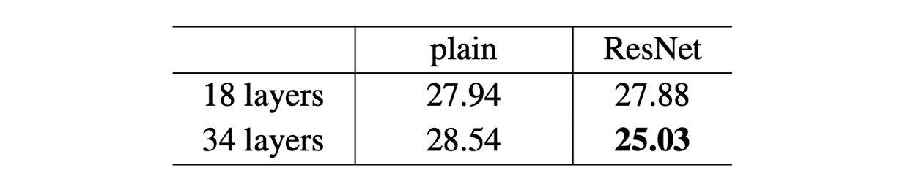
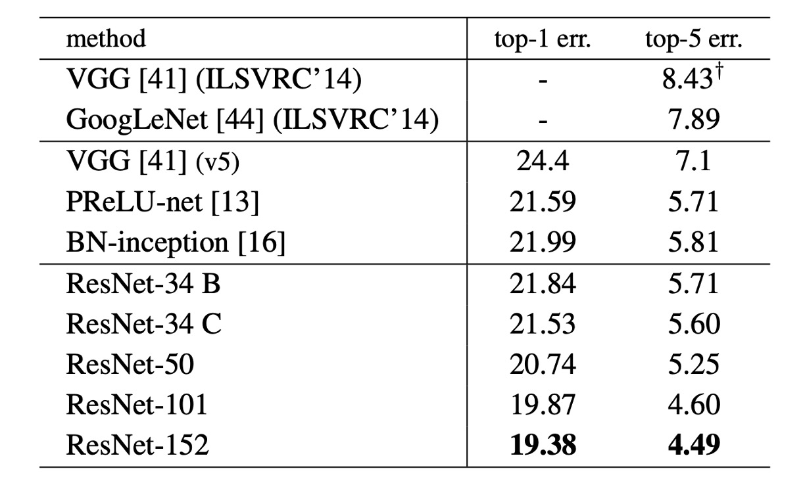

# [15.12] ResNet

## 卷積網路 100 層

[**Deep Residual Learning for Image Recognition**](https://arxiv.org/pdf/1512.03385)

---

在 BatchNorm 提出之後，梯度消失和爆炸的問題似乎得到了解決。

但為什麼模型還是 Train 不好呢？

## 定義問題

作者首先做了一組實驗。

理論上，較深的模型應該不會比其較淺的版本有更高的訓練誤差，因為可以通過將添加的深層設定為恆等映射並從較淺模型複製其它層來構建一個深層模型。然而在上圖中可以看到，隨著網路深度增加，訓練集和測試集的錯誤率都出現了上升的情況。

既然梯度消失的問題已經被解決，那麽模型表現退化的問題顯然就不能再歸咎於梯度。另外，這也不是過擬合的問題，因為如果是過擬合的話，那麼訓練集的錯誤率應該是下降的，測試集的錯誤率上升，兩者之間的差距應該是增大的。

因此這裡作者將這個問題定義為模型退化的問題。

## 解決問題

### 什麼是殘差？

殘差（Residual）在數學和工程學中通常指的是觀察值與參考值之間的差異。

在影像處理和電腦視覺領域，殘差概念應用於局部圖像描述符，以捕捉每個描述符與預定義基準（如字典或模型）之間的差異。

這樣命名和使用殘差表示有幾個原因：

1. **捕捉變化和差異**：殘差表示辨識並編碼局部特徵與參考特徵之間的差異，提供了局部特徵如何偏離參考特徵的有用信息。
2. **提高效率和準確性**：專注於殘差而非原始描述符，可以更有效地編碼和處理信息，因為殘差通常更小且更結構化，易於管理和分析。
3. **適應性和泛化能力**：通過殘差表示，模型更能適應和辨識不同圖像間的細微差異，這對圖像檢索和分類等任務非常重要。

### 殘差學習

假設 $H(x)$ 是一個深度學習模型需要學習的目標函數。在一個深度神經網路中，$H(x)$ 代表輸入 $x$ 通過一系列層後的輸出。$x$ 是輸入到這些層的原始數據。

在深度學習中，特別是當網路變得更深時，直接學習 H(x)可能變得非常困難，這可能導致訓練效率低下和性能不佳（作者稱之為退化問題）。所謂的殘差，即模型輸出和原始輸入之間的差異 $H(x) - x$。這個差異反映了模型需要學習的「額外信息」來從 $x$ 轉換到 $H(x)$。

為了簡化優化過程，作者引入了殘差映射 $F(x)$，定義為 $F(x) := H(x) - x$。這裡不是直接嘗試學習整個 $H(x)$，而是專注於學習這個差異，即 $F(x)$。這裡 $F(x)$ 被定義為殘差函數，也就是模型需要學習如何將輸入 $x$ 轉換成正確的輸出 $H(x)$ 所缺失的那部分。

當我們處理深度神經網路時，如果最優映射接近於身份映射（即輸出等於輸入），那麼學習 $F(x)$ 趨近於零會比學習複雜的 $H(x)$ 更簡單。這種方法還有一個好處，如果最優解接近於身份映射（即輸入 $x$ 和輸出 $H(x)$相近），那麼網路可以輕鬆地學習到接近於零的殘差，從而更有效地接近這個最優解。

為了實現這個方法，作者在網路中引入了捷徑連接，這些連接跳過一個或多個層，直接將輸入 $x$ 添加到中間層的輸出上，實現 $F(x) + x$ 的計算。通過這種方式轉變了優化問題，使得深層神經網路能夠更有效地學習和優化，從而改善了訓練效果和最終性能。

### 殘差模塊

在論文中，作者實際上使用的殘差模塊是上圖中的兩個形式，兩者具有類似的參數量，但右邊的形式帶有瓶頸的設計，作者在後續會測試這兩種形式的性能。每個模塊的卷積層數可以變得更多或更少，但作者發現在實際應用中，只使用一層卷積層沒有什麼效果。

在堆疊模型的過程中，如果遇到通道數不同的情況，作者使用了一個 $1 \times 1$ 的卷積來調整通道數。

### 網路架構

這大概是我們看過論文中「最長」的一張圖了...

這裡僅僅展示了 ResNet-34 的網路架構，受到 VGG 的啟發，這裡卷積層大多使用 $3 \times 3$ 的卷積核，並遵循兩個簡單的設計規則：

1. 對於相同輸出特徵圖大小，堆疊的卷積層應該具有相同的輸出通道數。
2. 如果特徵圖大小減半，則通道數加倍，以維持時間和空間的一致性。

降採樣是通過步長為 2 的卷積來實現，最終採用全局平均池化層和全連接層來實現分類。

值得一提的是在上圖的範例中，ResNet-34 的計算量僅有 VGG-19 的 18%。

:::tip
不敢想像如果是 ResNet-152 的話，滑鼠要往下滾多少久...
:::

### 參數配置

上表展示了所有 ResNet 模型的參數配置，可以看到隨著網路深度的增加，參數量也在增加，但 ResNet-152 的計算量仍遠小於 VGG。

其他訓練配置如下：

1. **資料增強：**

   - **尺度增強**：影像的短邊被調整到一個隨機大小，範圍在 [256, 480] 之間，以進行尺度增強。
   - **裁剪與翻轉**：從影像或其水平翻轉中隨機裁剪 224×224 的區域，並減去每個像素的平均值。
   - **顏色增強**：使用標準的顏色增強方法，這些方法在 AlexNet 中有詳細描述。

2. **歸一化與活化：**

   - 在每次卷積之後和活化之前採用批量歸一化（Batch Normalization，BN），這有助於穩定和加速訓練過程。

3. **權重初始化：**

   - 使用 Kaiming init 進行初始化權重，從頭開始訓練所有普通和殘差網路。
     - [**[15.02] Delving deep into rectifiers: Surpassing human-level performance on imagenet classification**](https://arxiv.org/abs/1502.01852)

4. **優化器：**

   - 使用小批量隨機梯度下降作為優化器，批量的大小設置為 256。
   - **學習率**：初始學習率設置為 0.1，當誤差達到穩定水準時將學習率除以 10。
   - **權重衰減**：設置為 0.0001。
   - **動量**：設置為 0.9。

5. **其他配置：**

   - **Dropout**：在訓練中不使用 dropout。

## 討論

### ResNet-18 vs ResNet-34

作者首先評估了 18 層和 34 層的普通網路。

根據上表的結果，34 層的普通網路相比 18 層的普通網路在驗證誤差上更高。為了揭示其中的原因，作者在下圖（左）中比較了訓練過程中的訓練誤差和驗證誤差。

從圖中觀察到了一個退化問題：儘管 18 層普通網路的解空間是 34 層網路的子空間，但 34 層普通網路在整個訓練過程中具有更高的訓練誤差。作者認為這種優化困難不太可能是由梯度消失引起的。這些普通網路使用批量歸一化（BN）進行訓練，確保前向傳播的信號具有非零方差。我們也驗證了反向傳播梯度與 BN 表現出健康的規範。因此，前向或後向信號都不會消失。

事實上，34 層普通網路仍然能夠達到有競爭力的精度，這表明該求解器在一定程度上發揮了作用。作者推測，深層普通網路的收斂速度可能呈指數級下降，這會影響訓練誤差的減少，未來將進一步研究造成這種優化困難的原因。

接下來作者評估了 18 層和 34 層的殘差網路（ResNets）。基線架構與上述普通網路相同，只是在每對 3×3 濾波器中添加了快捷連接，如上圖（右）所示，殘差學習的情況發生了逆轉：34 層 ResNet 優於 18 層 ResNet，提高了 2.8%。更重要的是，34 層 ResNet 表現出相當低的訓練誤差，並且能夠很好地推廣到驗證資料，這表明退化問題在此設定中得到了很好的解決。

### 更深的瓶頸架構

作者針對 ImageNet 建構了更深的網路。

由於訓練時間的考量，作者將構建模塊修改為瓶頸設計。對於每個殘差函數 $F$，使用堆疊的三層代替兩層，如上圖。

這三層分別是 $1×1$、$3×3$ 和 $1×1$ 的卷積層，其中 $1×1$ 層負責減少和增加（恢復）維度，使 $3×3$ 層成為具有較小輸入/輸出維度的瓶頸，其兩種設計具有相似的時間複雜度。

- **50 層 ResNet**：使用每個 2 層塊替換為這個 3 層瓶頸塊，從而構建出 ResNet-50。
- **101 層和 152 層 ResNets**：使用更多的 3 層塊構建了 ResNet-101 和 ResNet-152。

### 在 ImageNet 上的表現

在上表中，作者展示了 ResNet 在 ImageNet 上的表現，可以看到基線 34 層 ResNet 已經實現了非常有競爭力的精度。

隨著網路深度的增加，50/101/152 層的 ResNets 在準確度上比 34 層的有顯著提高。這裡沒有觀察到退化問題，深度的好處在所有評估指標上都有所體現。

ResNet-152 在 top-5 錯誤率上達到了 4.49%；在 top-1 錯誤率上，ResNet-152 達到了 19.38%，成為當時最先進的模型。

## 結論

在 ResNet 出現之前，隨著網路深度的增加，訓練深層網路變得非常困難，常常遇到梯度消失或梯度爆炸問題。然而殘差學習的概念成功突破了這一瓶頸，使得訓練超深層網路成為可能。這個突破性的進展極大地推動了深度學習的發展，在提出後，即迅速成為深度學習領域的標竿模型。

ResNet 的成功啟發了後續一系列改進和變種模型的出現，包括 DenseNet、ResNeXt 等。這些改進模型在繼承 ResNet 優點的基礎上，進一步優化了網路結構和效能，推動了深度學習模型的持續進步和創新。

由於其卓越的性能，ResNet 被廣泛應用於各種實際場景，如醫療影像分析、自動駕駛、監控系統等。這些應用展示了 ResNet 在實際應用中的巨大潛力和價值，使其成為深度學習技術發展的重要里程碑。
