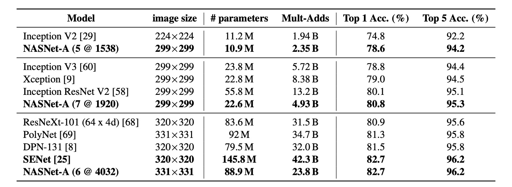

## 搜索網路架構

[**Learning Transferable Architectures for Scalable Image Recognition**](https://arxiv.org/abs/1707.07012)

---

當你拿到一根鎚子，你看什麼都像是釘子。

＊

從深度學習神經網路開始流行之後，如何構建一個有效的網路架構就成為了一個重要的問題。

為了解決這個問題，研究人員提出了許多自動搜索網路架構（Neural Architecture Search, NAS）的方法。

而其中的佼佼者就是 Google 團隊，你可以在各個地方看到他們拿著 NAS 技術在各種地方搜索。

:::tip
Neural Architecture Search（NAS）是一種自動化技術，專門用於設計和優化深度學習模型架構。它旨在克服手動設計神經網路架構的挑戰和局限性，特別是在處理複雜數據或特定應用場景時。通過自動搜索流程，NAS 可以辨識出最高效的網路結構，從而提升模型性能，減少設計過程所需的時間與專業知識。
:::

## 定義問題

從 AlexNet 流行起來，到現在的過去幾年間，各種不同網路架構蓬勃發展。

然而，這些網路架構的設計通常是基於經驗和直覺，而非嚴格的理論基礎。

這導致了許多問題，例如：

- 人們不知道哪些網路架構是最好的。
- 設計網路架構需要大量的專業知識和經驗。
- 網路架構的設計過程通常是耗時且耗費資源。

理論基礎的部分在這裡先撇開不談，本篇論文要提出一個自動搜索網路架構的方法，而這個方法可以幫助我們解決上述的「部分」問題。

## 解決問題

### 可遷移架構

在現階段中，所有論文的目標都是一致的：就是在 ImageNet 資料集上達到最佳的性能。

但是 ImageNet 太大了，如果直接在 ImageNet 上搜索適合的網路架構，會消耗非常可觀的資源。

因此，在本篇論文中提出先在 CIFAR-10 資料集上搜索適合的網路架構，然後再將這個網路架構遷移到 ImageNet 上。

### 基礎結構

作者提出了兩個可以用來構建網路架構的基礎結構：

1. **Normal Cell**：主要功能是維持輸入特徵圖的維度（即高度和寬度）。這樣的設計確保了特徵提取過程中空間信息的完整性，有助於深層網路中信息的有效傳遞。
2. **Reduction Cell**：主要功能是減少特徵圖的空間維度，具體是將高度和寬度縮小一半。這通過將步長設置為 2 來實現，有效地降低了計算量並增加了模型的抽象能力。

雖然 Reduction 和 Normal Cell 可以有相同的架構，但根據經驗，學習兩種獨立的架構是有益的。

此外，每次減少空間維度時，為保持信息密度，作者通過加倍濾波器的數量來補償信息的損失。

這種設計靈感來自於 Inception 和 ResNet 結構，其中層次的深度和濾波器的數量根據具體的應用需求進行調整。

### 搜索過程

在搜索空間中，每個卷積單元接收兩個初始隱藏狀態 $h_i$ 和 $h_{i-1}$，這兩個狀態來自於前兩個較低層的單元輸出或是輸入圖像。

整個搜索過程會透過 RNN 來進行，RNN 會預測卷積單元的結構，並且根據預測結果來生成新的隱藏狀態。

- **RNN 的預測過程**

  RNN 會遞歸地預測卷積單元的結構，根據以下步驟：

  1. **選擇隱藏狀態**：從 $h_i$、$h_{i-1}$ 或前面區塊生成的隱藏狀態集中選擇一個隱藏狀態。
  2. **選擇第二個隱藏狀態**：從與步驟 1 相同的選項中選擇第二個隱藏狀態。
  3. **選擇操作**：對於步驟 1 選擇的隱藏狀態，選擇一個操作進行處理。
  4. **選擇第二個操作**：對於步驟 2 選擇的隱藏狀態，同樣選擇一個操作進行處理。
  5. **合併輸出**：選擇一種方法來結合步驟 3 和 4 的輸出以產生新的隱藏狀態。

- **預測步驟的重複與區塊**

  RNN 將上述 5 個預測步驟重複 B 次，對應於卷積單元中的 B 個區塊。

  在實驗中，選擇 B=5 通常能提供良好的結果。

  每一輪的預測都將新建立的隱藏狀態添加到現有隱藏狀態集合中，作為後續區塊中的潛在輸入。

- **操作選擇**

  RNN 從以下操作中進行選擇，這些操作基於它們在 CNN 文獻中的普及度：

  - identity
  - 1x3 then 3x1 convolution
  - 1x7 then 7x1 convolution
  - 3x3 dilated convolution
  - 3x3 average pooling
  - 3x3 max pooling
  - 5x5 average pooling
  - 5x5 max pooling
  - 7x7 max pooling
  - 1x1 convolution
  - 3x3 convolution
  - 3x3 depthwise separable convolution
  - 5x5 depthwise separable convolution
  - 7x7 depthwise separable convolution

- **合併方法**

  在步驟 5 中， RNN 選擇合併兩個隱藏狀態的方法，可能是兩個隱藏狀態之間的元素級加法或沿著過濾器維度的串聯。

### DropPath 模組

在過去的文獻中，DropPath 技術可以用來防止過擬合，並且可以提高模型的泛化能力。

- [**Fractalnet: Ultra-deep neural networks without residuals**](https://arxiv.org/abs/1605.07648)

在本篇論文中，作者將 DropPath 技術應用到了搜索過程中，發現沒用。

於是改進了 DropPath 技術，並稱之為 **ScheduledDropPath**，這個技術會在訓練過程中「線性增加」丟棄模組的機率，實驗效果良好！

### 搜索實驗結果

最終作者在 CIFAR-10 資料集上搜索到了一個有效的網路架構，如上圖。

這張圖看起來很複雜，但仔細看的話其實很好理解：

- 第 $h_{i-1}$ 層走虛線；第 $h_i$ 層走實線，最後兩者合併，得到 $h_{i+1}$。
- 如果需要降採樣，，就走 `Reduction Cell` 路徑，否則走 `Normal Cell` 路徑。

## 討論

### 在 CIFAR-10 上的結果

從表中可以看出，具有剪切資料增強的大型 NASNet-A 模型實現了 2.40% 的最先進錯誤率（5 次運行的平均值），略優於之前的最佳水平記錄為 2.56%。

作者提到，他們最佳單次運行錯誤率達到 2.19%。

### 遷移架構到 ImageNet

這裡遷移的只有網路結構，模型的部分是重新訓練的。

從上面表格證明，與同類架構相比，NASNet 以更少的浮點運算和參數實現了最先進的性能。

最大的模型基於單一非整合預測為 ImageNet 實現了新的最先進性能 (82.7%)，比先前發布的最佳結果（DPN-131）提升了約 1.2%。

### 在行動裝置上的評比

在之前的研究中，MobileNet 和 ShuffleNet 提供了最先進的結果，使用 ~550M 乘加操作在 224x224 影像上分別獲得了 70.6% 和 70.9% 的準確率。

而由 NASNet 所建構的架構，在計算需求相當的前提下，實現了超越先前模型的預測性能，達到 74.0% 準確率。

:::tip
單純用運算量來評估模型，並不一定能反映出真正的性能，要實際上機推論才知道是不是真的有效果。

考慮到 NASNet 上存在大量的跨分支的相加和串聯運算，這些操作會讓多個分支互相等待，進而導致模型的效率下降。
:::

## 結論

在本篇論文中，研究了一個直接在感興趣的資料集上學習模型架構的方法。

通過設計能夠解耦架構複雜度與網路深度的搜尋空間，從影像分類任務中學習到可擴展的卷積單元。

這一方法提升了模型的適應性，允許其他沒有足夠算力的研究者可以直接採用這些由 NAS 找出來的單元架構。

:::info
我們好奇的是，如果在資源足夠得情況下，直接針對 ImageNet 進行架構搜索，會不會得到更好的結果呢？

或許等到 Google 團隊之後來了興致，這個問題就會有答案了。
:::
