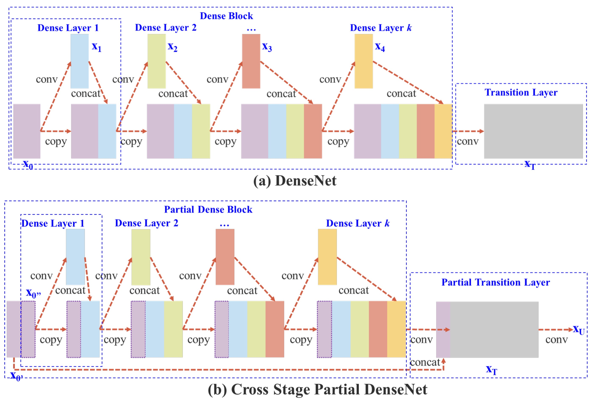
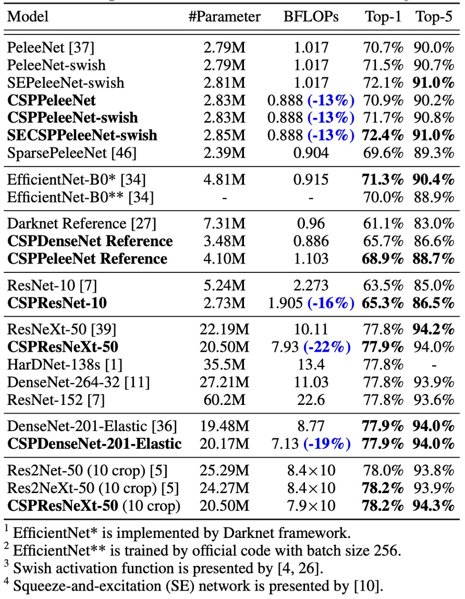

## 半半半插件

[**CSPNet: A New Backbone that can Enhance Learning Capability of CNN**](https://arxiv.org/abs/1911.11929)

---

CSPNet 來自於：「Cross Stage Partial Network」的縮寫。

這篇論文在工業界應用非常廣泛，不僅如此，在 Timm 套件中也有很多相關的實作，例如：`cspdarknet53`, `cspresnet50`, `cspresnext50` 等。

## 定義問題

作者分析目前的神經網路架構，看上了 DenceNet 的特性，但由於 DenceNet 存在著一些問題需要改進，以下歸納了幾點：

1. **計算瓶頸：**

   計算瓶頸是指在一個計算過程中，某些部分或層級的運算資源（如處理單元、記憶體、數據傳輸等）無法有效利用，導致整體效能受限。當計算瓶頸存在時，系統的部分計算資源會閒置，而其他部分會處於過度使用的狀態。

   在 CNN 中，不同層負責不同的計算任務。如果某一層需要執行的計算量過大，而其他層的計算量較小，這會導致系統中某些運算單元過度忙碌，而其他單元處於閒置狀態。

2. **記憶體使用量高**

   前一陣子提出的 DenceNet，雖然在學習能力上有所提升，但是記憶體使用量也隨之增加。因為內部存在大量的 Concat 操作，每次拼接就必須複製一份資料，而後改進版本的網路架構，像是 PeleeNet、VoVNet 等，也同樣存在這個問題。

:::tip
沒看過 DenseNet 的可以參考我們另外一篇論文筆記：

- [**[16.08] DenseNet: 全部連起來**](../1608-densenet/index.md)
  :::

## 解決問題

### 模型架構

如上圖，上半部是 DenceNet 的原始設計，簡單來說，這個流程是這樣的：

1. 將輸入 `x` 通過一個卷積層，得到 `y1`。
2. 將 `y1` 和 `x` 進行拼接，得到 `y2`。
3. 將 `y2` 通過一個卷積層，得到 `y3`。
4. 將 `y3` 和 `x` 進行拼接，得到 `y4`。
5. 重複上述步驟。

DenseNet 多層共享相同的梯度資訊，導致重複學習相同的梯度，影響學習效果。

---

為了降低記憶體的使用量，作者這裡做出的改動就是：「不要使用全部的特徵圖」。

改動後的差異在於幾個地方：

1.  **增加梯度路徑**：通過交叉分割策略，梯度路徑數量增加兩倍，降低特徵圖複製的次數。
2.  **平衡每層的計算量**：為了降低計算瓶頸，部分 dense block 只使用一半的通道數。
3.  **減少記憶體傳輸量**：部分分割的策略可以節省一半的記憶體流量。

整體看來，這個設計保留 DenseNet 的特徵重用優勢，同時透過截斷梯度流動避免重複梯度資訊，提升學習能力。

:::tip
雖然論文中多次提到「一半」這個字，但其實這個拆分比例是可以設定的。

在後面的消融實驗中作者有針對不同的拆分比例進行了實驗，這裡為了方便說明，我們就直接用「一半」這個比例來說明。
:::

### Transition Layer

<figure style={{ "width": "60%"}}>

</figure>

把特徵圖拆開容易，但該用什麼方式把它們合併回來呢？

為了回答這個問題，作者提出了兩種融合策略：

1. **Fusion First**: 如上圖 (c)，先串接兩部分特徵圖，再進行 transition 操作。這種策略會重複使用大量梯度資訊。
2. **Fusion Last**: 如上圖 (d)，先進行 transition，再與另一部分特徵圖串接。此策略有效截斷梯度流動，減少重複資訊。

兩個策略的實驗結果如下：

1. **Fusion First**: 計算成本雖然也顯著下降，但準確率下降 1.5%。
2. **Fusion Last**: 計算成本大幅下降，且 Top-1 準確率僅下降 0.1%。

沒有比較就沒有傷害，所以這裡作者選擇了 Fusion Last 這個策略。

### Exact Fusion Model

其實講完上面 CSP 模組的建構方式，這篇論文的主要內容也就講完了。

最後這段是作者針對 FPN 結構的優化內容。

---

上圖中的 (c) 就是作者提出的 EFM 架構，看起來跟之前提到的 PANet 有點像，作者在 PANet 的基礎上，從高解析度的特徵圖中引入更多的全域資訊。

- [**[18.03] PANet：給我一條捷徑**](../../feature-fusion/1803-panet/index.md)

最後，為了降低特徵圖串接的計算量開銷，作者使用 `Maxout` 操作來壓縮特徵圖，降低負擔。

:::tip
Maxout 不直接對輸入數據進行非線性變換，而是將多個線性輸出進行取最大值操作，這樣可以自動選擇最適合的輸出來進行學習。

假設有兩個線性輸出 $z_1$ 和 $z_2$，Maxout 會選擇其中較大的值作為輸出：

$$
\text{Maxout}(z_1, z_2) = \max(z_1, z_2)
$$

這種技術的優點是它可以有效地避免像 ReLU 那樣的「死區」問題，因為每次都會選擇最適合的線性輸出，而不會像 ReLU 那樣出現輸出為零的情況。
:::

## 討論

### CSP 架構的有效性

首先必須驗證的是，CSP 架構是否真的有效？

為此，作者選了一個過去文獻提供的 Backbone 架構：PeleeNet，並將其改造成 CSP 架構，進行了一系列的實驗。

- [**[18.04] Pelee: A Real-Time Object Detection System on Mobile Devices**](https://arxiv.org/abs/1804.06882)

上表中的 $\gamma$ 是用來控制 CSP 架構中特徵圖拆分的比例，當 $\gamma = 0.5$ 時，表示特徵圖被拆分成兩部分，每部分佔原來特徵圖的一半，依此類推。當 $\gamma = 0.25$ 時，參數量降低比較少；當 $\gamma = 0.75$ 時，參數量降低比較多，但模型的性能也會下降。

單純使用 CSP (Fusion First)策略，模型效能略優於 SPeleeNet 與 PeleeNeXt。部分 transition 層減少冗餘資訊的學習，表現非常出色。例如，當計算量降低 21%時，準確率僅下降 0.1%。

當 $\gamma = 0.25$ 時，計算量減少 11%，但準確率反而提高 0.1%，這展示了部分 transition 層在計算效率和準確性之間的良好平衡。

相較於基準模型 PeleeNet，CSPPeleeNet 表現最佳，計算量減少 13%，而準確率提升 0.2%。若將部分比例調整至 $\gamma = 0.25$，可以在減少 3%計算量的同時，準確率提升 0.8%。

### EFM 架構的有效性

作者基於 MS COCO 資料集，對 EFM 進行消融實驗，實驗結果列於上表。

EFM 相比 GFM 在每秒幀數上慢了 2 fps，但其 AP（平均精度）和 $AP_{50}$ 分別提升了 2.1% 和 2.4%。相較於 SPP 的視野增強機制，SAM 的注意力機制能獲得更好的幀率和 AP，因此作者選擇了 **EFM(SAM)** 作為最終架構。

### ImageNet 上的性能

實驗結果顯示，無論是基於 ResNet、ResNeXt 還是 DenseNet 的模型，引入 CSPNet 後，計算量至少減少 10%，且準確率保持不變或提升。

對於輕量化模型，CSPNet 的引入特別有效，例如：

- **CSPResNet-10** 相較於 ResNet-10，準確率提升 1.8%。
- **CSPPeleeNet** 和 **CSPDenseNet-201-Elastic** 分別減少了 13% 和 19% 的計算量，且準確率稍有提升或保持不變。
- **CSPResNeXt-50** 減少了 22% 的計算量，且 Top-1 準確率提升至 77.9%。

### MS COCO 上的性能

在 **30∼100 fps 的物件檢測器** 中，CSPResNeXt50 結合 PANet (SPP)表現最佳，達到了 38.4% $AP$、60.6% $AP_{50}$ 和 41.6% $AP_{75}$ 的檢測率。

在 **100∼200 fps 的物件檢測器** 中，CSPPeleeNet 結合 EFM (SAM) 的 $AP_{50}$ 增長了 12.1%，並且與 PeleeNet 在相同速度下運行，同時與 CenterNet 在相同速度下檢測率提高了 4.1%。

在 **非常快速的物件檢測器**（如 ThunderNet、YOLOv3-tiny 和 YOLOv3-tiny-PRN）中，CSPDenseNet Reference 結合 PRN 的運行速度最快，達到了 400 fps，這比 ThunderNet 結合 SNet49 快 133 fps，並且在 $AP_{50}$ 上高出 0.5%。

### 推論速度

最後作者展示了 CSPNet 在不同硬體上的推論速度，實驗基於 NVIDIA Jetson TX2 和 Intel Core i9-9900K 進行，使用 OpenCV DNN 模組來評估 CPU 上的推理速度。為了公平比較，未使用模型壓縮或量化技術。

如上表，**CSPDenseNetb Ref-PRN** 的 $AP_{50}$ 高於 SNet49-ThunderNet、YOLOv3-tiny 和 YOLOv3-tiny-PRN，且分別在幀率上超過了這三個模型 55 fps、48 fps 和 31 fps。

**EFM** 在行動 GPU 上表現良好，特別是當生成特徵金字塔時，EFM 能顯著減少記憶體需求，這對於記憶體帶寬有限的行動環境非常有利。**CSPPeleeNet Ref-EFM (SAM)** 的幀率比 YOLOv3-tiny 更高，且 $AP_{50}$ 提升了 11.5%，顯示出顯著的改進。

## 結論

CSPNet 通過有效的特徵融合策略和梯度截斷技術，成功提升了多種架構的計算效率，特別是在邊緣計算環境下展示了顯著的性能優勢。

雖然架構複雜度有所增加，但其能夠顯著減少計算資源需求、降低記憶體流量，同時保持高準確率，使其成為物件檢測和其他實時任務中的強大選擇。

與其說這是一個 Backbone，其實更像是一個插件。下次你在寫模型的時候，不妨也試試看插入 CSP 結構，說不定會有意想不到的驚喜。
