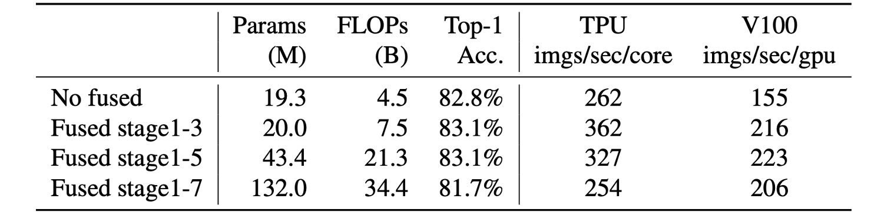
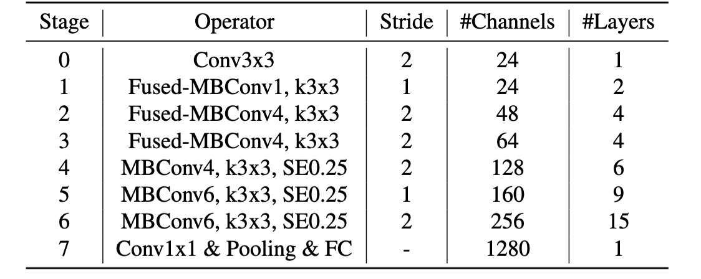
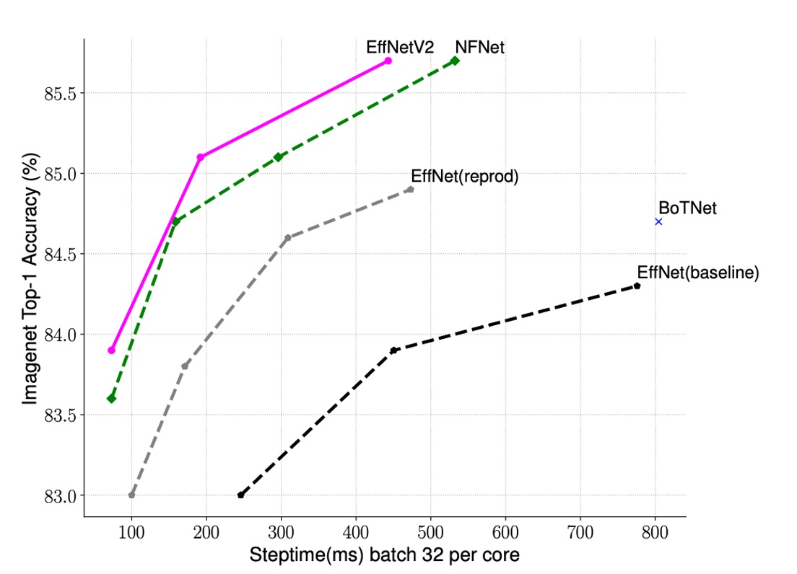
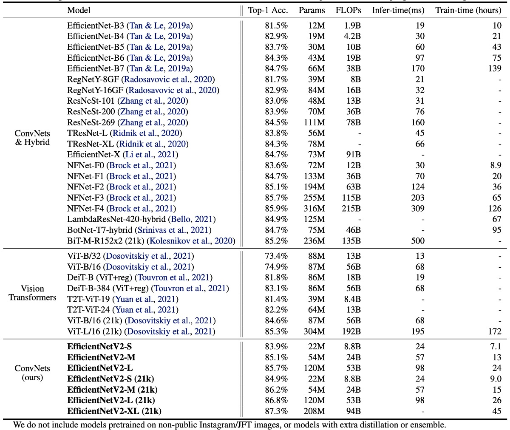

## 深度卷積的蠕行

[**EfficientNetV2: Smaller Models and Faster Training**](https://arxiv.org/abs/2104.00298)

---

EfficientNet 的作者在提出第一代模型後，覺得還有進一步的改進空間。

因此，他們提出了 EfficientNetV2，這是一種更小、更快的模型，同時保持了高效性。

## 定義問題

在過去的 EfficientNet 的開發過程中，作者發現幾個問題：

1. 使用非常大的影像尺寸（如 800x800）會導致訓練速度非常慢。
2. 深度卷積若配置網路的早期層，會導致訓練速度很慢。
3. 根據過去 ResNet 留下的指引，在每個階段均等擴大通道數量，並不會得到最優的結果。

另外，在過去於 Google 的研究中，他們發現深度卷積的訓練速度比常規卷積慢得多。

- [**[20.03] Accelerator-aware Neural Network Design using AutoML**](https://arxiv.org/abs/2003.02838)

  

  <figure style={{"width": "80%"}}>
  
  </figure>
  

  - 這篇論文指出深度卷積表面上大幅降低了計算量，但是實際上無法獲得硬體加速。

既然發現了問題，就要改！

## 解決問題

### 模型架構

<figure style={{"width": "70%"}}>

</figure>

深度卷積比常規卷積具有更少的參數和 FLOPs，但它們通常無法充分利用現代加速器。

因此，作者提出將原本在 EfficientNet-V1 中使用的 `MBConv` 模組，換成了 `Fused-MBConv` 模組。

具體操作如上圖，就是移除了深度卷積，改用標準卷積完成通道擴展。

### 漸進式學習

之前有許多其他工作在訓練期間動態改變影像大小，但它們通常會導致準確性下降。

作者假設準確率下降來自不平衡的正則化：

- 當使用不同的影像尺寸進行訓練時，我們也應該相應地調整正則化強度，而不是像以前的工作那樣使用固定的正則化。

事實上，大型模型需要更強的正規化來對抗過度擬合是很常見的：例如，EfficientNet-B7 使用比 B0 更大的 dropout 和更強的資料增強。

作者認為即使對於相同的網路，較小的圖像尺寸也會導致較小的網路容量，因此需要較弱的正則化；反之亦然，圖像尺寸越大，計算量越大，容量越大，因此更容易出現過擬合。

為了驗證該想法，作者於是在 ImageNet 上進行了以下實驗。

<figure style={{"width": "80%"}}>

</figure>

從上表中可以看出當輸入尺寸為 128 時，使用較少的正則化效果更好；當輸入尺寸為 300 時，使用較多的正則化效果更好。

實驗結果可以佐證上述的想法，因此作者在訓練過程中自適應地調整正規化和圖像大小，改進了過去使用漸進式學習的方法。

### 重來一次 NAS

修改了基本模組後，作者重新進行了 NAS（神經架構搜索）。

在這個部分，作者發現在 EfficientNet-V1 的訓練中會大幅擴大影像尺寸，導致記憶體消耗大、訓練速度慢。為了解決這個問題，本論文中修改縮放規則，將最大影像尺寸限制 480 像素。

## 討論

### Fused-MBConv 放在哪？

<figure style={{"width": "80%"}}>

</figure>

根據實驗，`Fused-MBConv` 放的位置也很講究。

從上表中可以看到使用 `Fused-MBConv` 替換所有區塊，那麼它會顯著增加參數和 FLOPs，同時也會減慢速度。

放在 Stage 1~3 的位置，雖然增加了 FLOPs，但仍然可以提高速度和模型性能。

### 搜索網路結果

<figure style={{"width": "80%"}}>

</figure>

跟第一代相比，第二代的模型主要有幾個差別：

1. 在早期層使用了 `Fused-MBConv`。
2. EfficientNet-V2 偏好 MBConv 的較小擴展比例。
3. EfficientNet-V2 偏好較小的 3x3 卷積核尺寸，但它增加了更多層來彌補感受野的損失。

### 加速訓練

<figure style={{"width": "60%"}}>

</figure>

作者比較了 EfficientNet-V2 和其他模型的訓練速度。

如上表所示，EfficientNet-V2 的訓練速度比其他模型快得多。

### ImageNet 上的結果

EfficientNetV2 模型在速度和精確度方面顯著優於先前的 ConvNet 和 Transformer 模型。

特別是 EfficientNetV2-M 以相同的運算資源實現了與 EfficientNet-B7 相當的精度，並且訓練速度提高了 11 倍。

在準確性和推理速度方面，EfficientNetV2 模型也明顯優於最新的 RegNet 和 ResNeSt 模型。

雖然 Vision Transformers 在 ImageNet 上表現出色，但透過改進訓練方法和設計正確的 ConvNet，EfficientNetV2 依然在準確性和訓練效率方面具有優勢。特別是 EfficientNetV2-L 實現了 85.7% 的 top-1 準確率，超過了在更大資料集 ImageNet21k 上預先訓練的 ViT-L/16 (21k) 模型。

在推理速度方面，EfficientNetV2 模型也表現出色，因為訓練速度通常與推理速度相關。

與 ViT-L/16 (21k) 相比，EfficientNetV2-L (21k) 將 top-1 準確率提高了 1.5%（85.3% vs. 86.8%），使用的參數數量減少了 2.5 倍，FLOP 次數減少了 3.6 倍，訓練和推理速度提高了 6 到 7 倍。

最後是作者提出來的關鍵觀察：

- 在高精度情況下，擴大資料規模比單純擴大模型規模更有效。當 top-1 精度超過 85% 時，透過增加模型規模進一步提高精度變得困難。然而，額外的 ImageNet21k 預訓練可以顯著提高準確性。
- ImageNet21k 上的預訓練非常有效率。儘管 ImageNet21k 的資料量大 10 倍，但使用 32 個 TPU 核心，EfficientNetV2 的預訓練在兩天內完成，比 ViT 的幾週時間顯著減少。

未來研究建議使用公共的 ImageNet21k 資料集進行大規模模型的預訓練。

## 結論

對於我們這種常在寫模型的工程師來說，這篇論文給我們的啟發是：

- 在卷積網路架構中，於前三個階段使用 `Fused-MBConv` 可以提升模型性能。
- 在訓練過程中，根據影像尺寸的變化，自適應地調整正規化強度，可以提高模型的準確性。

這些方法可以幫助我們在訓練模型時更有效率地解決工作現場的問題。
