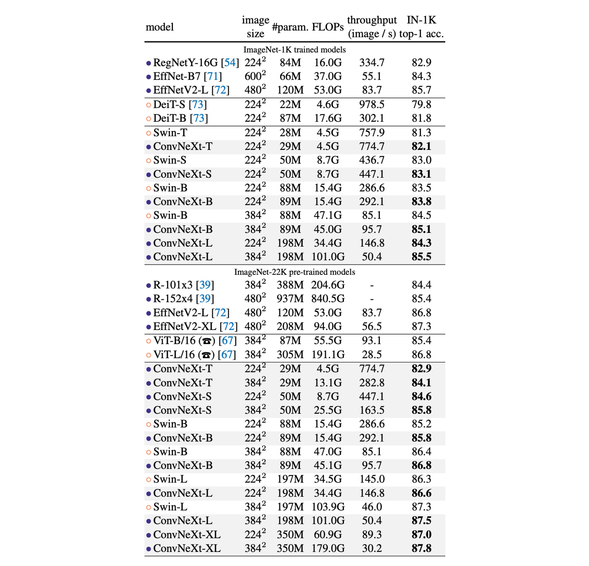

# [22.01] ConvNeXt

## 讓卷積再次偉大

[**A ConvNet for the 2020s**](https://arxiv.org/abs/2201.03545)

---

回顧 2010 年代，深度學習在這一時期取得顯著進步，對多個領域產生了深遠影響。

推動這一進展的核心是神經網路的復興，特別是卷積神經網路（ConvNet）。

在過去十年中，視覺識別領域成功從手工特徵轉向了卷積神經網路架構的設計。

雖然卷積神經網路的概念最早可追溯至 20 世紀 80 年代，但直至 2012 年，我們才真正見證到其在視覺特徵學習方面的潛力，這一轉折點由 AlexNet 的出現標誌，開啟了電腦視覺新紀元的「ImageNet 時刻」。

此後，該領域快速進展，代表作包括：

- [**[14.09] VGG**](https://arxiv.org/abs/1409.1556)
- [**[14.09] GoogLeNet**](https://arxiv.org/abs/1409.4842)
- [**[15.12] ResNet**](https://arxiv.org/abs/1512.03385)
- [**[16.08] DenseNet**](https://arxiv.org/abs/1608.06993)
- [**[17.04] MobileNet**](https://arxiv.org/abs/1704.04861)
- [**[19.05] EfficientNet**](https://arxiv.org/abs/1905.11946)
- [**[20.03] RegNet**](https://arxiv.org/abs/2003.13678)

這些里程碑式研究強調了效率和可擴展性，普及了許多實用的設計原則。

但是，這一切都在 ViT 問世之後嘎然而止。

- [**[20.10] ViT**](https://arxiv.org/abs/2010.11929)

## 定義問題

視覺變換器（ViT）的引入徹底顛覆了網路架構設計。除了最初的「切片」層將影像切割成多個補丁外，ViT 沒有引入特定於影像的歸納偏差，只對原始的 NLP Transformer 進行了最小的修改。

ViT 的一大優勢是其擴展能力：隨著模型和資料集的增大，其性能顯著超越標準的 ResNet。

為了彌補性能上的差距，分層 Transformer 采用了混合策略。例如，「滑動視窗」策略重新引入了局部注意力機制，使 Transformer 在行為上更接近於 ConvNet。

Swin Transformer 是這方面的里程碑，它首次證明了 Transformer 可以作為通用的視覺主幹，在圖像分類以外的多種計算機視覺任務中達到最先進的性能。

Swin Transformer 的成功和快速被接受，同時顯示出卷積的本質仍然難以取代。

- [**[21.03] Swin Transformer**](https://arxiv.org/abs/2103.14030)

從這些進展來看，許多視覺變換器的進步實際上是在恢復卷積的優勢。

然而，這些嘗試代價不菲：滑動視窗自注意力的實現可能成本高昂，透過循環移位等先進方法可以提升效率，但使系統設計更加複雜。

諷刺的是，ConvNet 已經具備了許多所需的屬性，儘管是以簡單、樸素的方式。

ConvNet 失去動力的唯一原因是 Transformers 在許多視覺任務中超越了它們。

作者認為：事情不應該這樣。

## 解決問題

### 重新設計網路架構

為了簡單起見，作者從 ResNet-50 開始，並將規模相近的 Swin Transformer 作為參考比較對象。

### 引入現代訓練技術

ViT 不僅帶來新的網路架構，還引入了許多現代訓練技術，因此作者在什麼都沒有改變的情況下，首先將 ViT 的訓練技術應用於 ConvNet。

- 將訓練時間從 90 個 epoch 增加到 300 個 epoch。
- 使用 AdamW 優化器。
- 使用影像增強技術：

  - [**Mixup**](https://arxiv.org/abs/1710.09412)
  - [**CutMix**](https://arxiv.org/abs/1905.04899)
  - [**RandAugment**](https://arxiv.org/abs/1909.13719)
  - [**隨機擦除**](https://arxiv.org/abs/1708.04896)

- 使用正則化方案:

  - [**隨機深度**](https://arxiv.org/abs/1608.06993)
  - [**標籤平滑**](https://arxiv.org/abs/1512.00567)

:::info
完成上述的訓練技術後，ResNet-50 的性能提升了 2.7%，從原本的 76.1% 提升至 78.8%。
:::

### 宏觀設計

這個部分有兩個設計考慮因素：

1. **階段計算比率**

   在 ResNet 中，跨階段計算分佈的設計主要是基於經驗的。

   例如，ResNet 在 stage-4 階段旨在與下游任務（如目標偵測）相容，其中偵測器頭在 14×14 的特徵平面上運作。

   與之類似，Swin-T 也遵循相同的原理，但階段計算比例略有不同，為 1:1:3:1。對於更大的 Swin Transformer，該比例為 1:1:9:1。

   為了保持與 Swin-T 一致的 FLOP，我們將 ResNet-50 的每個階段的區塊數從 (3, 4, 6, 3) 調整為 (3, 3, 9, 3)。

   :::info
   階段計算比例相關研究：

   - [**[19.05] On network design spaces for visual recognition**](https://arxiv.org/abs/1905.13214)
   - [**[20.03] Designing network design spaces**](https://arxiv.org/abs/2003.13678)
     :::

   從現在開始，模型將使用這一階段的計算比率。

   :::info
   這個階段將模型準確率從 78.8% 提高到 79.4%。
   :::

2. **Stem 結構設計**

   在卷積網路中，stem 是指一開始輸入的那一層。

   通常會用來進行降採樣，以便快速降低輸入的空間尺寸。

   在 ViT 中，stem 是一個 patchify 層，將影像分割成一系列 Patchs，使用的大小為 16×16 的大核卷積。

   在 Swin-T 中，stem 是一個 4x4 大小和步長為 4 的卷積。

   這裡作者採用和 Swin-T 一樣的設計，並將 ResNet-50 的 stem 調整為 4×4 的非重疊卷積。

   :::info
   這個設計將模型準確率從 79.4% 提高到 79.5%。
   :::

### ResNeXt-ify

在這一部分中，作者嘗試採用了 ResNeXt 的設計理念，該模型相比於普通的 ResNet 具有更好的 FLOPs/準確性權衡。

- [**Aggregated Residual Transformations for Deep Neural Networks**](https://arxiv.org/abs/1611.05431)

ResNeXt 的核心設計是分組卷積，其中卷積濾波器被分成不同的群組。

ResNeXt 的指導原則是「使用更多組，擴展寬度」，因此在 3×3 卷積層採用分組卷積。

在本論文的例子中，作者使用了深度卷積，這是分組卷積的一種特殊形式，其中組的數量等於通道的數量。

深度卷積類似於自注意力中的加權和運算，它在每個通道的基礎上進行操作，即僅混合空間維度上的信息。

使用深度卷積有效地減少了網路的 FLOPs，但預期會降低準確性。

按照 ResNeXt 的策略，作者將網路寬度增加到與 Swin-T 相同的通道數（從 64 增加到 96）。

:::info
這使得網路性能提高到 80.5%，同時增加了 FLOPs (5.3G)。
:::

### Inverted Bottleneck

在 Transformer 每個區塊中都有一個反向瓶頸結構，一般使用 4 的膨脹率。

在之後，MobileNetV2 也推廣這個概念，差異在於膨脹後加入一個 3x3 的深度卷積。

上圖 (a) 是 ResNeXt 的基本結構，而 (b) 則是 MobileNetV2 的基本結構，(c) 是另外一種選擇，把 3x3 的深度卷積移動到前面，是為了下一章大核卷積探索做準備。

:::info
採用 (b) 的設計，模型的準確率提高到 80.6%。

在大模型 ResNet-200 / Swin-B 系統中，獲得更多增益，從 81.9% 提高到 82.6%。
:::

### 大核卷積

在 ViT 中的非局部自注意力是其一個重要特性，這使得網路在每一層都有全局的感受野。

這與傳統的 ConvNet 使用較小核心（如 3×3，由 VGGNet 普及）形成對比。

為了探索大內核的應用，文章提出了將深度卷積層向上移動的策略，類似於在 Transformers 中將 MHSA 區塊放在 MLP 層之前的做法。

這樣的結構調整可以有效減少 FLOPs 並優化性能。

通過這些調整後，研究中測試了不同的內核大小（3×3 至 11×11）：

- 3x3：79.9%
- 7x7：80.6%

作者發現將內核大小增加到 7×7 能使網路性能從 79.9% 提升到 80.6%，且此時 FLOP 保持不變。

進一步增加內核大小（超過 7×7）在 ResNet-200 模型中沒有顯示進一步的性能增益，顯示出在 7×7 大小時達到性能飽和。

:::info
這些一步驟的操作沒有提升性能，但是將 (b) 設計改成 (c) 設計，用來模仿 Transformer 的自注意力的風格。
:::

### 微觀設計

1. **用 GELU 取代 ReLU**

   整流線性單元（ReLU）由於其簡單性和計算效率，在卷積神經網路（ConvNet）中一直是首選的啟動函數。

   高斯誤差線性單元（GELU），作為 ReLU 的一個更平滑的變體，逐漸在最先進的 Transformer 模型中獲得青睞，如 Google 的 BERT 和 OpenAI 的 GPT-2。

   作者在 ConvNet 中將 ReLU 替換為 GELU，模型的準確率保持不變。

   :::info
   雖然沒有提升性能，但是作者還是想換成 GELU。
   :::

2. **減少啟動函數**

   

   在 Transformer 架構中，特別是在 MLP 區塊中，通常只會使用一種啟動函數。

   相比之下，ResNet 模塊中的實踐是在每個卷積層之後使用啟動函數，甚至是在較小的 1×1 卷積層之後。

   作者在殘差網路區塊中移除了所有的 GELU 啟動層，除了在兩個 1×1 卷積層之間保留一層，以此模仿 Transformer 區塊的風格。

   這種調整讓性能有所提升，準確率從原來的提高了 0.7%，達到了 81.3%，與 Swin-T 的性能相近。

   :::info
   這個設計將模型準確率從 80.6% 提高到 81.3%。
   :::

3. **減少 Normlization 層**

   在 Transformer 中通常有比較少的 Normalization 層，而在 ConvNet 中，Batch Normalization 在每個卷積層之後都會出現。

   因此，作者刪除另外兩個 Batch Normalization 層，只保留在 1x1 卷積之前使用。

   :::info
   這個設計將模型準確率從 81.3% 提高到 81.4%。
   :::

4. **用 LayerNorm 替換 BatchNorm**

   Transformers 中使用了更簡單的 Layer Normalization，從而在不同的應用場景中獲得了良好的性能。

   在原始 ResNet 中直接以 LN 取代 BN 會導致性能不理想。

   - [**[21.05] Rethinking "batch" in batchnorm**](https://arxiv.org/abs/2105.07576)

   透過網路架構和訓練技術的所有修改，作者重新審視使用 LN 取代 BN 的影響，並發現 ConvNet 模型在使用 LN 進行訓練時沒有任何困難。

   :::info
   這個設計將模型準確率從 81.4% 提高到 81.5%。
   :::

5. **降採樣層**

   在 ResNet 架構中，空間降維是通過每個階段開始的殘差區塊實現的，主要使用步長為 2 的 3×3 卷積層，以及在捷徑連接中使用步長為 2 的 1×1 卷積層。

   相較於 ResNet，Swin Transformers 在階段之間增加了獨立的降維層。

   進一步的調查顯示，在空間解析度發生變化的地方增加標準化層可以幫助穩定訓練。

   這包括在 Swin Transformers 中使用的多個層歸一化（LN）層：在每個降維層之前、在 stem 之後和在最終的全局平均池化之後各添加一個。

   基於這些結果，作者決定在其最終模型中使用獨立的降維層，並將此模型命名為 ConvNeXt。

   :::info
   這個設計將模型準確率從 81.5% 提高到 82%。
   :::

## 討論

### 總結模型配置

這些模型是對 ResNet 架構的「現代化」升級，各個變體主要在通道數（C）和每個階段中區塊的數量（B）上有所區別。

以下是每種型號的特定配置：

1. **ConvNeXt-T**（Tiny 版）:

   - 通道數 C = (96, 192, 384, 768)
   - 每階段區塊數 B = (3, 3, 9, 3)

2. **ConvNeXt-S**（Small 版）:

   - 通道數 C = (96, 192, 384, 768)
   - 每階段區塊數 B = (3, 3, 27, 3)

3. **ConvNeXt-B**（Base 版）:

   - 通道數 C = (128, 256, 512, 1024)
   - 每階段區塊數 B = (3, 3, 27, 3)

4. **ConvNeXt-L**（Large 版）:

   - 通道數 C = (192, 384, 768, 1536)
   - 每階段區塊數 B = (3, 3, 27, 3)

5. **ConvNeXt-XL**（Extra Large 版）:

   - 通道數 C = (256, 512, 1024, 2048)
   - 每階段區塊數 B = (3, 3, 27, 3)

每個新階段的通道數增加一倍，這是遵循類似於 ResNet 和 Swin Transformers 的設計理念。

這種分級設計允許不同規模的模型在處理不同大小或複雜度的資料集時，能夠提供更靈活和高效的性能表現。

### ImageNet 上的性能

1. **ImageNet-1K 性能比較**：

   - **ConvNeXt 與 ConvNet 基準比較**：ConvNeXt 在精確度和推理吞吐量方面能夠與強大的 ConvNet 基準（如 RegNet 和 EfficientNet）競爭。
   - **與 Swin Transformers 比較**：ConvNeXt 在具有相似複雜性的情況下，通常性能優於 Swin Transformers，例如 ConvNeXt-T 比 Swin-T 高出 0.8%。 ConvNeXt 在沒有依賴移動視窗或相對位置偏差等專用模組的情況下，也顯示出更高的吞吐量。
   - **特定模型性能**：例如，ConvNeXt-B 在解析度增加時（從 224² 到 384²），相對於 Swin-B，在 FLOPs/吞吐量上的優勢更為顯著，準確率提高了 0.6% （85.1% vs 84.5%），推理吞吐量提高了 12.5%。

2. **ImageNet-22K 性能比較**：

   - **大規模預訓練的影響**：通常認為視覺 Transformer 在大規模預訓練時可能表現較佳，但實驗結果顯示，適當設計的 ConvNet（如 ConvNeXt）在大規模預訓練後，表現與類似大小的 Swin Transformer 相當甚至更好，且吞吐量略高。
   - **ConvNeXt-XL 的性能**：當進一步擴展到 ConvNeXt-XL 時，準確率達到了 87.8%，顯示出 ConvNeXt 架構的可擴展性。

3. **ConvNeXt 架構的優勢**：

   - 在 ImageNet-1K 上，EfficientNetV2-L 在漸進式訓練程式下實現了最佳性能。
   - 透過 ImageNet-22K 預訓練，ConvNeXt 能夠超越 EfficientNetV2，進一步證明了大規模訓練的重要性。

## 結論

在 2020 年代，隨著像 Swin Transformers 這樣的分層視覺 Transformers 的崛起，傳統的卷積神經網路似乎逐漸被視為較不優越的選擇。

然而，本文所提出的 ConvNeXt 模型展示了在保持結構簡單性和效率的同時，仍能在多個電腦視覺基準上與最先進的視覺 Transformer 競爭。

這場戰爭，方興未艾！
