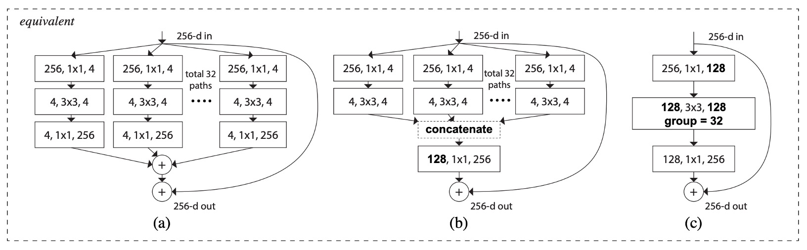

# [16.11] ResNeXt

## 探訪下一個維度

[**Aggregated Residual Transformations for Deep Neural Networks**](https://arxiv.org/abs/1611.05431)

---

還記得稍早提出的 Inception 模型嗎？

- [**Going Deeper with Convolutions**](https://arxiv.org/abs/1409.4842)

那讓人眼花撩亂的分支結構，是不是讓你印象深刻？

## 定義問題

Inception 證明了精心設計的拓墣結構可以用較低的理論複雜度達到更好的性能。

但這種設計方式會帶來幾個問題：

### 下游任務泛化性

在 Inception 模型中，通常會使用不同大小的卷積核（例如 1x1、3x3、5x5 等）來同時進行不同尺度的特徵提取。

我們需要根據數據集特性來確定每一層使用的卷積核大小和數量。例如，對於圖片數據集，較大的卷積核可以捕捉到更多的上下文信息，而較小的卷積核可以提取到更精細的特徵。

每個 Inception 模塊通常包括多個不同大小的卷積層和池化層，根據需求設計每個模塊內部的結構，並使用交叉驗證來選擇效果最好的組合。

:::tip
這不符合人體工學啊！

每當你要拿這個模型來用，你就開始躊躇......根本是反工程師的集大成。
:::

### 不利於模型設計

目前對於神經網路的研究，已經從「特徵工程」漸漸地轉向「模型設計工程」，即如何設計一個好的神經網路。

Inception 模型的設計需要大量的人力和時間，並且不易擴展到更大的模型。

但是這個「分割-變化-合併」的設計理念，還是非常值得借鑒的。

## 解決問題

### 網路架構

如上圖所示，左邊是原始的 ResNet 結構，右邊是作者提出的 ResNeXt 結構。

作者借鑑了 VGG 和 ResNet 的設計方法，採用高度模組化的設計，使得模型由一堆殘差塊（residual blocks）組成。接著引入了一個新的維度：基數（cardinality），作為除了深度和寬度之外的重要因素。

這個 cardinality 指的是在 ResNeXt 模塊中的分組數量，即：將輸入通道分為幾組進行卷積運算。例如上圖中的 `total 32 paths` 中的 `32` 就是分組數，一組有四個通道。

再來，作者通過兩個簡單規則來簡化設計空間，使得整個網路的設計變得更加簡單和統一：

- 規則一：如果生成相同大小的空間圖，則這些區塊共享相同的超參數（寬度和過濾器大小）。
- 規則二：每次將空間圖下採樣 2 倍時，模組的寬度乘以 2 倍。

最後是聚合變換（Aggregated Transformations）的概念，將神經元的基本操作擴展到更複雜的變換上，並且使用瓶頸型架構和分組卷積的方法來簡化實現和提高模型性能。

這個架構存在幾種等價形式，如下圖：

- 上圖 (a) 是本論文提出的結構。
- 上圖 (b) 是省略分支 4 1x1 256 的操作，直接用 concat 來代替，最後加上 128 1x1 256 的卷積。
- 上圖 (c) 是直接調用 Conv2D 內的分組卷積參數，最後加上 128 1x1 256 的卷積。

:::tip
在撇開 Norm、ReLU 和 Pooling 的情況下，這幾個架構的輸出是等價的。

我們在實作的時候會直接用第三種方式，快速又簡單。
:::

### 模型配置

使用分組卷積會降低運算量，因此為了維持相同的比較基準，作者將 ResNeXt 模組中的中間通道數量增加為原本 ResNet 的 2 倍，然後取分組數為 32。

## 討論

### ImageNet-1K 訓練效果

上圖展示了不同模型的驗證誤差和訓練誤差隨著訓練次數（epochs）的變化情況。

與 ResNet-50 相比，32×4d ResNeXt-50 的驗證誤差為 22.2%，比 ResNet-50 的 23.9% 低了 1.7%。

隨著基數 $C$ 從 1 增加到 32，同時保持模型複雜性不變，錯誤率不斷降低。32×4d ResNeXt 的訓練誤差也明顯低於 ResNet-50，表明性能提升主要來自於模型表示能力的增強，而非正則化效應。

在 ResNet-101 的情況下，32×4d ResNeXt-101 的效能比 ResNet-101 高 0.8%。儘管驗證誤差的改善比 ResNet-50 的情況小，但訓練誤差的改善仍然顯著（ResNet-101 為 20%，32×4d ResNeXt-101 為 16%）。

### 增加模型複雜度

為了測試分組數量對模型性能的影響，作者進行了以下幾個實驗：

1. **將複雜性增加兩倍**

   - 與 ResNet-101 基線 (22.0%) 相比，增加模型複雜性總能減少錯誤。
   - 但效果有限：
     - 增加深度（ResNet-200，改善 0.3%）
     - 增加寬度（更寬的 ResNet-101，改善 0.7%）。

2. **增加基數的效果更好**

   實驗顯示增加基數 $C$ 比增加深度或寬度能顯示出更好的結果。

   - 2×64d ResNeXt-101 將 top-1 誤差降低至 20.7%。
     - 在 1×64d ResNet-101 基線上加倍 $C$ 並保持寬度
   - 64×4d ResNeXt-101 將 top-1 誤差降低至 20.4%。
     - 在 32×4d ResNeXt-101 上加倍 $C$ 並保持寬度

3. **較低複雜度下的性能**

   32×4d ResNet-101 (21.2%) 的性能優於更深的 ResNet-200 和更寬的 ResNet-101，儘管其複雜度只有約 50%。這表明基數 $C$ 是比深度和寬度更有效的維度。

### ImageNet-1K 模型表現

上表顯示了在 ImageNet 驗證集上進行單作物測試的結果。

ResNeXt 的結果與 ResNet、Inception-v3/v4 和 Inception-ResNet-v2 相比毫不遜色，實現了 4.4% 的單作物 top-5 錯誤率。

不僅如此，ResNeXt 的架構設計比所有 Inception 模型簡單得多，手動設定的超參數也少得多。

## 結論

本論文提出了一種簡單且高度模組化的網絡架構 ResNeXt，通過重複聚合一組具有相同拓撲結構的變換構建而成，形成了一種同質的多分支架構，只需設定少量的超參數。

作者引入了一個新的維度：基數（cardinality），作為除了深度和寬度之外的重要因素。

實驗結果表明，在保持模型複雜度的條件下，增加基數能夠顯著提高分類準確率。

相比於單純增加模型的深度或寬度，增加基數更為有效。

:::tip
這份論文為之後的可分離卷積、MobileNet 等輕量化模型的發展提供了重要的參考。
:::
