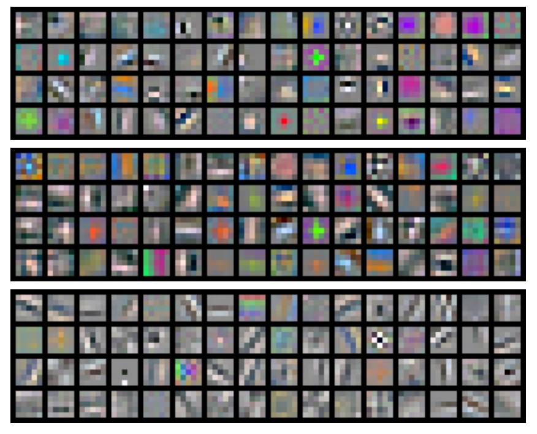

## 尋找不變的特徵

[**Discriminative Unsupervised Feature Learning with Exemplar Convolutional Neural Networks**](https://arxiv.org/abs/1406.6909)

---

讀論文的時候，發現許多研究都參考了這篇論文的想法，所以我們花點時間來看看它。

這篇論文的概念很簡單，但有許多實驗結果能夠給我們帶來一些想法。

## 定義問題

監督式學習的優點同時也是它的缺點：需要大量的標註資料。而在一些特定的應用場景下，這種資料可能難以取得，或者價格昂貴。

而且如果我們想要在不同的任務之間進行遷移學習（transfer learning），例如從物體分類轉換到特徵描述子匹配（descriptor matching），監督式學習的效果可能不盡理想。

既然不理想，一個簡單的想法就是：或許我們不使用資料標籤呢？

但如果不使用資料標籤的話，模型該怎麼訓練呢？

作者說：我們需要有個代理任務。

## 解決問題

作者在論文中提出了一種完全不需要人工標註的訓練方法，稱作 **Exemplar-CNN**。

核心概念非常簡單：

1. **隨機抽取影像塊**：為了更專注於含有較多物體資訊的區域，會根據梯度大小加權取樣，從未標註影像中擷取若干個 $32 \times 32$ 大小的影像塊。

   :::tip
   這不是倒傳遞那個「梯度」，而是影像的梯度。作者認為，影像中的梯度可以幫助我們找到更有意義的影像塊。
   :::

2. **對影像塊進行各種隨機轉換**：例如平移、縮放、旋轉、顏色調整、對比度調整等，得到多個「變形版本」。這些轉換明確定義了網路要學到的不變性（如對旋轉不敏感、對色彩變化不敏感等）。
3. **形成「代理類別」並進行判別式學習**：每個原始影像塊及其所有變形版本，被視為同一個代理類別中的「正樣本」。

系統在大量影像中重複此過程，產生許多代理類別，並訓練一個 CNN 去判別「哪些圖像塊（含各種變形版本）屬於同一代理類別，哪些屬於其他代理類別」。如此一來，模型既能學到如何分辨不同影像塊，又對「同一張影像的各種變形」具備不變性。

在論文中所使用的轉換列表如下：

- **平移**：在垂直或水平方向上，平移距離不超過圖像塊大小的 20%。
- **縮放**：按比例縮放圖像塊，縮放係數介於 0.7 至 1.4 之間。
- **旋轉**：旋轉角度在 ±20 度之內。
- **對比度 1**：每個像素在所有像素主成分方向上的投影，乘以 0.5 至 2 之間的因子（對主成分方向獨立，對圖像塊內像素相同）。
- **對比度 2**：
  - 將 HSV 顏色表示的飽和度和明度（S 和 V 分量）提升至 0.25 至 4 之間的冪次。
  - 再乘以 0.7 至 1.4 之間的因子，並加上 −0.1 到 0.1 之間的偏移值。
- **顏色**：對 HSV 顏色表示的色調（H 分量），加上 −0.1 到 0.1 之間的偏移值。

:::tip
在消融實驗的章節，作者會驗證這些轉換的有效性。
:::

經過裁切後的訓練資料大概長這樣：（以 STL-10 為例）

<figure style={{"width": "90%"}}>

</figure>

### 實驗配置

作者為了比較 **Exemplar-CNN** 與先前的無監督特徵學習方法，基於以下數據集進行了一系列實驗：STL-10、CIFAR-10、Caltech-101 和 Caltech-256。

數據集的數據量、類別數量、圖像尺寸等細節如下：

- **分類數量**：
  - STL-10 和 CIFAR-10：10 類。
  - Caltech-101：101 類。
  - Caltech-256：256 類。
- **圖像尺寸處理**：
  - CIFAR-10：從 $32 \times 32$ 調整至 $64 \times 64$。
  - Caltech-101：調整為 $150 \times 150$。
  - Caltech-256：調整為 $256 \times 256$。

接著作者做了幾個網路架構，如下設計：

- **小型網路（64c5-64c5-128f）**：
  - 兩層卷積層（各 64 個濾波器）。
  - 一層全連接層（128 單元）。
  - 最後接 Softmax 層。
- **中型網路（64c5-128c5-256c5-512f）**：
  - 三層卷積層（濾波器數量分別為 64, 128, 256）。
  - 一層全連接層（512 單元）。
- **大型網路（92c5-256c5-512c5-1024f）**：
  - 三層卷積層（濾波器數量分別為 92, 256, 512）。
  - 一層全連接層（1024 單元）。
- **卷積與池化細節**：
  - 所有卷積濾波器對應輸入的 $5 \times 5$ 區域。
  - $2 \times 2$ 最大池化應用於前兩層卷積層。
- **其他技術**：
  - 全連接層使用 Dropout。
  - 基於 Caffe 實現，訓練細節見附錄 B.2。

測試方法是將網路應用於任意尺寸圖像，計算特徵映射，並根據數據集選用適當的池化方法：

- STL-10 和 CIFAR-10：四象限最大池化（每個特徵映射得 4 個值）。
- Caltech-101 和 Caltech-256：三層空間金字塔池化（$1+4+16=21$值）。

最後使用一對多線性支持向量機（SVM）進行分類。

## 討論

### 和其他方法的比較

<figure style={{"width": "90%"}}>

</figure>

上表比較了 **Exemplar-CNN** 與其他無監督特徵學習方法在不同數據集上的性能。

實驗結果顯示，**Exemplar-CNN** 在所有數據集上均取得了最佳結果，並且在 STL-10 數據集上的性能顯著超越了所有已報告的結果，比監督式的方法還要好！

### 消融實驗-代理類別數量

<figure style={{"width": "70%"}}>

</figure>

作者首先測試了代理類別數量對性能的影響。

實驗設計將代理類別數量 $N$ 從 50 調整至 32000，並觀察了分類準確率的變化。

結果如上圖，可以看到分類準確率隨代理類別數量增加而提升，直到 8000 類左右達到最佳後穩定或下降。作者認為類別數量過多會導致樣本之間相似度過高，難以區分，進而降低分類效果。

:::tip
但後續的研究中認為是因為特徵未經過歸一化，如果對特徵進行歸一化處理，則分類效果會隨著類別數量增加而提升。
:::

### 消融實驗-樣本數量

<figure style={{"width": "70%"}}>

</figure>

再來是每類代理樣本數量 $K$ 的影響。

作者調整 $K$ 在 1 到 300 之間，觀察分類準確率的變化。

結果顯示，準確率隨每類樣本數量增加而提升，在 100 樣本附近趨於穩定。這表明 100 樣本足以近似目標，再增加樣本數對優化問題的影響不大。

### 消融實驗-影像增強類型

<figure style={{"width": "70%"}}>

</figure>

作者進一步探討了不同影像增強類型對性能的影響。

實驗設計固定原始「種子」樣本，調整應用於代理數據的轉換類型，包括縮放、旋轉、平移、顏色變化、對比度變化等。

結果顯示，平移、顏色變化和對比度變化對性能影響顯著，而縮放與旋轉影響較小。

### 消融實驗-參數配置

<figure style={{"width": "90%"}}>

</figure>

上表展示了 **Exemplar-CNN** 使用不同配置參數，在不同數據集上的性能。

結果顯示隨網路規模增大，分類準確率整體提高，表示較大的網路能更充分地學習和利用數據特徵。另外，訓練代理類別數量對結果有顯著影響，說明代理數據的選擇和生成是無監督學習中的關鍵。

### 濾波器可視化

<figure style={{"width": "70%"}}>

</figure>

上圖展示了 `64c5-64c5-128f` 網路第一層在不同數據集上的代理數據進行訓練時所學到的濾波器，排列方式如下：

- **頂部**：來自 STL-10 數據集的代理數據。
- **中間**：來自 CIFAR-10 數據集的代理數據。
- **底部**：來自 Caltech-101 數據集的代理數據。

分析一下上圖所呈現的資訊，可以發現模型基於不同數據集所學到的特徵有所不同：

- STL-10 數據集由於圖像解析度較高且對象多樣，濾波器可能更偏向於學習細節特徵（例如邊緣和紋理）。
- CIFAR-10 數據集的圖像解析度較低，濾波器傾向於學習更粗糙的特徵，例如色塊或簡單的形狀。
- Caltech-101 數據集中的圖像通常對齊良好，濾波器可能更傾向於學習與特定物體相關的局部特徵。

由此可知，即使來自不同數據集的代理數據，網路仍能學到具備分類或匹配能力的有效特徵。

## 結論

這篇論文提出了一種是基於判別目標的無監督特徵學習方法，無需依賴物體類別標籤。作者通過數據增強生成代理標籤，並通過影像增強來定義網路需學習的特徵不變性。

實驗結果表明，Exemplar-CNN 所學特徵在分類準確率上取得了顯著提升，並且判別目標相較於以往的無監督學習目標更具優勢。

:::tip
比較早期的對比學習研究大多會引用這篇論文，雖然現在看來論文中有許多可以優化的地方，但它無疑給後續的研究帶來非常多的啟發，值得一看。
:::
