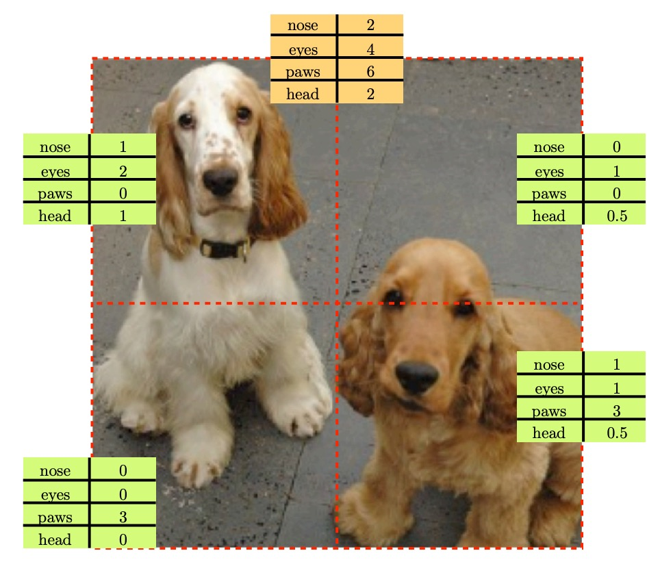
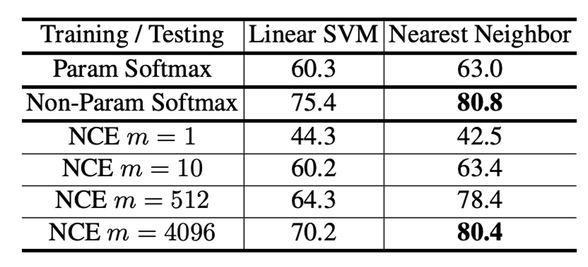
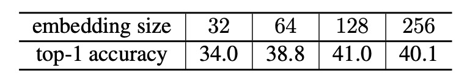
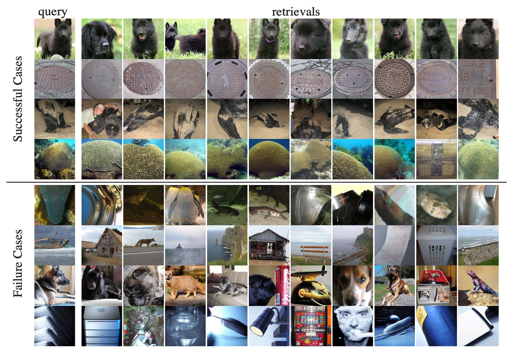

## 多多益善

[**Unsupervised Feature Learning via Non-Parametric Instance Discrimination**](https://arxiv.org/abs/1805.01978)

---

抓個開發的空檔，趕緊來看一些對比學習的相關論文。

雖然之前已經聽過大師課，但還是自己讀過一遍感覺比較扎實。

:::info
在此也推薦對比學習大師課：[**對比學習論文綜述【論文精讀】**](https://www.youtube.com/watch?v=iIczStGLkss)

時長大約 90 分鐘，內容涵蓋了對比學習的基本概念、發展歷程、相關論文的精讀與解析，看完可以提升 10 年功力。（？）
:::

在對比學習的概念開始流行之前，度量學習（Metric Learning）已經在業界得到廣泛應用。最廣為人知的就是人臉辨識，沒有之一。

度量學習的核心在於通過學習特徵表示 $F$，從而在樣本 $x$ 和 $y$ 之間建立一種度量：

$$
d_F(x, y)=\|F(x)-F(y)\|
$$

模型在訓練完成之後，只能依靠其學到的特徵進行推斷，而無法使用線性分類器。

:::tip
度量學習（Metric Learning）的經典論文，可以參考：

- [**[18.01] ArcFace: 反餘弦損失**](../../face-recognition/1801-arcface/index.md)
- [**[18.01] CosFace: 大餘弦損失**](../../face-recognition/1801-cosface/index.md)

在研究過程中，人們發現歸一化（Normalization）這個步驟非常關鍵，也就是將特徵向量統一投影到超球面上，可以提升模型的性能。
:::

## 定義問題

但是，那些度量學習講的都是「類別」層級的學習，也就是說，我們必須知道每一張影像具體是屬於哪個類別，才能進行度量學習。

度量學習的本質是監督式學習，但是在現實應用中，我們通常只有大量的「無標籤」的資料，所以度量學習的概念在這種情況下就難以應用。

於是研究者們找出了各式各樣的解決方式：

### 生成模型

生成模型（Generative Models）的概念也很吸引人，透過建立一個編碼器和解碼器，把影像轉換成一個隱藏的特徵表示，再從這個特徵表示中重建影像。常見的模型像是 Autoencoder、GANs、VAEs 等。

優點就是不需要標籤，只要能找到影像，就能開始訓練。但缺點就是計算成本太高了，隨著重建影像的解析度提高，計算量也會成倍增加。

而且生成模型會依賴於數據的分布樣態，泛化能力不強，甚至在某些情況下可能會出現模型崩潰的情況。

### 自監督結構學習

自監督學習（Self-supervised Learning）的概念是利用數據內部的結構，構建一個預測任務，然後訓練模型。

我們看幾個有趣的例子：

- **預測上下文**

  - [**[15.05] Unsupervised visual representation learning by context prediction**](https://arxiv.org/abs/1505.05192)

      

      <figure style={{"width": "60%"}}>
      
      </figure>
      

- **灰階圖像的顏色復原**

  - [**[16.03] Colorful Image Colorization**](https://arxiv.org/abs/1603.08511)

      

      <figure style={{"width": "80%"}}>
      
      </figure>
      

- **解拼圖任務**

  - [**[16.03] Unsupervised Learning of Visual Representations by Solving Jigsaw Puzzles**](https://arxiv.org/abs/1603.09246)

      

      <figure style={{"width": "80%"}}>
      
      </figure>
      

- **填補圖像缺失部分**

  - [**[16.04] Context Encoders: Feature Learning by Inpainting**](https://arxiv.org/abs/1604.07379)

      

      <figure style={{"width": "50%"}}>
      
      </figure>
      

- **計算物件數量**

  - [**[17.08] Representation Learning by Learning to Count**](https://arxiv.org/abs/1708.06734)

      

      <figure style={{"width": "70%"}}>
      
      </figure>
      

---

看了這麼多代理任務，好像每個都很有道理，但是我們無法解釋為什麼這些任務能幫助語義辨識，也無法確定最佳的自監督任務。

既然大家沒有共識，那就來創造共識，作者從度量學習中得到啟發，希望在沒有人工標籤的條件下，提出了一個全新特徵學習的訓練方法。

## 解決問題

為了得到一個「好的」特徵表示方式，作者採用了「實例級別的區分」策略：把每張影像都視為一個獨立的「類別」，並訓練一個分類器來分辨每張影像是否屬於自己的那個「類別」。

我們來看一下這個模型架構。

### 模型架構

如上圖，左邊是一個標示為「**Backbone CNN**」的深度卷積神經網路。它的功能是把輸入的影像 $x$（例如 224$\times$224 圖片）轉成較高階的語義特徵。對於常見的 CNN 網路，可能包含多層卷積、批次正規化、池化等運算。最後一層一般會輸出一個較高維度的向量，作為「視覺特徵表示」。

從 Backbone CNN 輸出的高階特徵，通常維度還很大（例如 2048 維）。為了在大規模資料中運行，需要更壓縮、更抽象的特徵描述，所以作者加了一個「**Projection Head**」，把 CNN 輸出的向量投影到 **128 維** 的向量空間。

投影完成後，再對輸出的 128 維向量做 **L2 Norm（$\|\mathbf{v}\|_2 = 1$）**，因此每個樣本都會被約束到單位長度。這在計算相似度時特別有用，因為此時向量內積 $\mathbf{v}_i^T \mathbf{v}_j$ 剛好代表這兩個向量在球面上夾角餘弦值的大小，數值範圍在 $[-1, 1]$ 之間，比較直觀也比較穩定。

### 傳統分類器的問題

在傳統的 Softmax 分類模型中，每個類別 $j$ 都會對應一個權重向量 $\mathbf{w}_j$。假設我們總共有 $n$ 張影像（也就等於 $n$ 個「類別」），對應的權重向量為 $\mathbf{w}_1, \mathbf{w}_2, \dots, \mathbf{w}_n$。對於某張影像 $x$，經過神經網路得到的特徵向量是 $\mathbf{v} = f_\theta(x)$，那麼這張影像被判斷為第 $i$ 個影像（即第 $i$ 個「類別」）的條件機率可以寫成：

$$
P(i \mid \mathbf{v}) \;=\; \frac{\exp(\mathbf{w}_i^T \mathbf{v})}{\sum_{j=1}^{n} \exp(\mathbf{w}_j^T \mathbf{v})}
$$

這個式子裡，$\mathbf{w}_i^T \mathbf{v}$ 用來衡量特徵 $\mathbf{v}$ 與類別 $i$ 的相符程度；分母則是對所有類別（1 到 $n$）做指數函式的加總，確保所有類別機率總和為 1。

在一般的分類問題中，類別數固定且不算太大，這種參數式 softmax 很常見。但此處把「每張影像」都視為一個新類別，代表類別數可以非常龐大（上萬、上百萬甚至更多），這樣一來，每個類別都需要一個獨立的權重向量 $\mathbf{w}_j$，不僅儲存空間大，計算也很昂貴。

簡單來說，就是 Train 不動。

### 非參數式分類器

為了改善上述問題，作者提出「非參數式」的做法：

- **把公式裡的 $\mathbf{w}_j$ 換成「在記憶體（memory bank）裡存的特徵向量」$\mathbf{v}_j$。**

也就是說，第 $j$ 個影像的「類別權重」不再是獨立的 $\mathbf{w}_j$，而是直接使用第 $j$ 張影像本身的特徵向量 $\mathbf{v}_j$。另外，作者強制將這些特徵向量歸一化成單位向量（即長度為 1），方便做相似度計算。

如此一來，Softmax 公式可改寫為：

$$
P(i \mid \mathbf{v})
= \frac{\exp\!\bigl(\mathbf{v}_i^T \mathbf{v} / \tau\bigr)}{\sum_{j=1}^{n} \exp\!\bigl(\mathbf{v}_j^T \mathbf{v} / \tau\bigr)}
$$

其中 $\tau$ 稱作「溫度參數」（temperature），可以調整 softmax 分布的「銳利程度」；$\mathbf{v}$ 是當前影像 $x$ 正向傳播得到的特徵；$\mathbf{v}_i$ 是「記憶體」裡儲存的第 $i$ 張影像的特徵（同樣是單位向量），$\mathbf{v}_i^T \mathbf{v}$ 則是兩個單位向量的內積，數值範圍介於 -1 到 1，用來表示它們的相似度。

:::tip
原本的 $\mathbf{w}_i$ 是可學習的參數，作為「每個」類別的分類錨點，當特徵和錨點的內積越大，分類機率就愈高，模型愈傾向於把輸入特徵歸類為這個類別。

這裡作者不要這個 $\mathbf{w}_i$，而是直接用「資料本身的特徵 $\mathbf{v}_i$」作為比較對象，這樣就不用對每個可能的影像類別各自學一個 $\mathbf{w}_i$，有助於降低計算成本。

於是你立刻想到下一個問題：既然分類錨點不是固定的，而是隨著訓練而四處飄移，模型怎麼能保證它們的穩定性呢？

我們稍後再談，先繼續看完整個架構。
:::

### Memory Bank

非參數式 softmax 的訓練目標，與一般分類問題類似：就是最大化每張訓練影像「被正確判定為它自己」的機率，或等價地最小化整個訓練集的負對數似然：

$$
J(\theta)
= - \sum_{i=1}^{n} \log P\bigl(i \mid f_\theta(x_i)\bigr)
$$

其中 $f_\theta(x_i)$ 記為 $\mathbf{f}_i$。計算 $P(i \mid \mathbf{f}_i)$ 時，理論上需要所有影像的特徵 $\{\mathbf{v}_j\}$；但如果在每次反向傳播都要把所有影像丟進神經網路算一遍，成本會相當高。

所以實作上，作者維護一個「Memory Bank」（$\mathbf{V} = \{\mathbf{v}_j\}$）來儲存目前所有影像的特徵，並在每次訓練迭代（iteration）後，用本次正向傳播出來的 $\mathbf{f}_i$ 即時更新這個 Memory Bank 中對應影像的條目。

由於每張影像在記憶體中都有一個位置，可以快速讀取上一次的特徵，以減少大規模資料的計算成本。如果影像總數 $n$ 相當龐大，在實作時，分母要算 $\sum_{j=1}^{n} \exp(\mathbf{v}_j^T \mathbf{v} / \tau)$，這樣的運算量對每張影像都是 $O(n)$，當 $n$ 達到百萬或更多時，幾乎不可行。

### Noise-Contrastive Estimation

NCE 核心想法是：

1. **將多類別分類問題轉成多個二元分類問題**。
2. 二元分類的目標：分辨「真實資料樣本」和「雜訊樣本」。

在多類別情境下，本來每張影像都是一個「類別」；現在改用 NCE，對於某一張影像，我們只要去區分「是否是這張影像」以及「不是這張影像（噪音）」就好。

具體做法是把「其他影像」當成雜訊，或說從一個雜訊分佈（$P_n$）中抽樣來當負例，然後讓模型學會區分誰是正例、誰是負例。

舉例來說，想要計算「特徵 $\mathbf{v}$ 來自第 $i$ 張影像的機率」時，可寫成

$$
P(i \mid \mathbf{v}) = \frac{\exp(\mathbf{v}^T \mathbf{f}_i/\tau)}{Z_i}
$$

其中

$$
Z_i = \sum_{j=1}^n \exp\bigl(\mathbf{v}_j^T \mathbf{f}_i/\tau\bigr)
$$

- $\mathbf{f}_i$ 是「第 $i$ 張影像」對應的特徵（記憶體銀行中存的），$\mathbf{v}$ 也是某個影像的特徵。
- $Z_i$ 稱作「歸一化常數」，確保所有 $i$ 的機率和為 1。
- 若 $n$ 很大，計算 $Z_i$ 就要遍歷所有 $j = 1, 2, \dots, n$，成本極高。

NCE 的巧思就是在「大量可能類別」的情況，不直接算上式的完整分母。轉而把「第 $i$ 類」對應的「正樣本」和「雜訊分佈」對應的「負樣本」區分開。

:::tip
意思就是：反正跟我不一樣的就是負樣本，隨便選出一小坨來算就好。
:::

令雜訊分佈 $P_n$ 是**均勻分佈**（uniform）$\Rightarrow P_n(i) = \frac{1}{n}$。

論文引入一個超參數 $m$，代表「雜訊樣本比真實樣本多 $m$ 倍」，接著定義一個「後驗機率」：

$$
h(i, \mathbf{v}) := P(D=1 \mid i, \mathbf{v})= \frac{P(i \mid \mathbf{v})}{P(i \mid \mathbf{v}) + m P_n(i)}
$$

這個 $h(\cdot)$ 的意義：給定特徵 $\mathbf{v}$ 以及類別 $i$，它是「$\mathbf{v}$ 來自第 $i$ 張影像的真實資料，而不是雜訊」的機率。$P(i \mid \mathbf{v})$ 是上式的輸出；$m P_n(i)$ 則是抽到雜訊樣本（負例）對應到 $i$ 的相對機率。

接下來的關鍵是：

1. **對正樣本的 log-likelihood** 取負號 （正樣本被正確分類為正樣本）。
2. **對負樣本的 log-likelihood** 取負號 （負樣本被正確分類為負樣本）。

:::tip
好像是在講廢話，但是很多人看到「計算負對數似然」就開始放空了，其實就是在講這個事情：要分開算正樣本和負樣本的機率，然後把它們加起來。
:::

因此有：

$$
J_{\text{NCE}}(\theta)
= - \mathbb{E}_{P_d}\bigl[\log h(i, \mathbf{v})\bigr]
  \;-\; m \,\mathbb{E}_{P_n}\bigl[\log \bigl(1 - h(i, \mathbf{v}')\bigr)\bigr]
$$

- 其中 $P_d$ 表示「真實資料分佈」，也就是我們實際有的影像（正例）。
- $P_n$ 表示「噪音分佈」，即雜訊樣本（負例）。
- $\mathbf{v}$ 和 $\mathbf{v}'$ 都是從 Memory Bank（$\mathbf{V}$）中取出的特徵向量；只是一個是「對應到正樣本（$x_i$）」，另一個是「隨機抽的雜訊」。

直覺上，$\log h(i, \mathbf{v})$ 大，代表模型認為「$\mathbf{v}$ 屬於第 $i$ 個影像」的機率高（好事）；而 $ \log(1 - h(\cdot))$ 大，代表模型正確地把噪音排除在外。

### $Z_i$ 的近似

雖然剛才講了這麼多，但是最大的困難還是沒有解決。

我們還是需要計算 $Z_i$，裡面有 $\sum_{j=1}^{n} \exp(\mathbf{v}_j^T \mathbf{f}_i/\tau)$，當 $n$ 很大時，這仍然是個瓶頸。

NCE 一個常見的做法，是把 $Z_i$ 當成「一個常數」去估計或近似，並不帶入梯度更新。而在本論文中參考下列文獻的作法：

- [**Learning word embeddings efficiently with noise-contrastive estimation**](https://www.cs.toronto.edu/~amnih/papers/wordreps.pdf)

使用蒙地卡羅抽樣（Monte Carlo approximation）來估計：

$$
Z
\simeq Z_i
\simeq n \,\mathbb{E}_{j \in \text{subset}}
\bigl[\exp(\mathbf{v}_j^T \mathbf{f}_i / \tau)\bigr]
= \frac{n}{m} \sum_{k=1}^{m}
\exp\bigl(\mathbf{v}_{j_k}^T \mathbf{f}_i / \tau\bigr)
$$

其中 $\{j_k\}$ 是一組隨機抽取出來的索引，用來近似整個集合的平均值。

原本要加總全部 $n$ 項才算出一個 $Z_i$，現在只抽 $m$ 個負例，以這些負例做指數運算加總，再乘上一個 $\frac{n}{m}$ 係數，近似整體平均。

論文中也提到，實驗上只要在訓練初期用少數批次就能估得不錯，後續訓練時再固定這個估計值，效果也相當好。

### 近端正規化

:::info
參考文獻：[**Proximal Algorithms**](https://web.stanford.edu/~boyd/papers/pdf/prox_algs.pdf)
:::

:::tip
剛才我們有提問：如果分類錨點不是固定的，而是隨著訓練而四處飄移，模型怎麼能保證它們的穩定性呢？
:::

和一般分類問題不同的是，這裡「每個類別」只有「一筆」訓練樣本。在每個訓練 epoch 裏，每個類別只會被取樣到一次，這會使整個學習過程的搖擺（oscillation）非常大。例如，如果其中一張影像剛好被模型學習到過擬合或偏移，下一次遇到它又可能有大幅度的梯度更新，導致整體訓練的目標函式波動得很厲害。

為了緩解這種隨機抽樣造成的不穩定，作者採用了近端正規化（Proximal Regularization）的概念，透過在損失函式中加入一項「**平滑約束**」，讓每一次更新時，特徵向量不會與上一次差距過大。這樣做能穩定訓練、加速收斂。

具體做法是，我們先假設兩個變數：

- **當前迭代（iteration $t$）**：對訓練資料 $x_i$，透過網路計算到一個特徵向量 $\mathbf{v}_i^{(t)} = f_\theta(x_i)$。
- **Memory Bank**：儲存上一個迭代（iteration $t-1$）的特徵向量，記為 $\mathbf{v}_i^{(t-1)}$。

在原本的 NCE 損失中，現在多加了一項 $\lambda \|\mathbf{v}_i^{(t)} - \mathbf{v}_i^{(t-1)}\|^2$。

於是目標函式變成：

$$
- \log h\bigl(i, \mathbf{v}_i^{(t-1)}\bigr)
\;+\; \lambda \,\bigl\|\mathbf{v}_i^{(t)} - \mathbf{v}_i^{(t-1)}\bigr\|_2^2
$$

- 第一項（$- \log h(i, \mathbf{v}_i^{(t-1)})$）是 NCE 的原始正例損失；
- 第二項（$\lambda \|\mathbf{v}_i^{(t)} - \mathbf{v}_i^{(t-1)}\|^2$）鼓勵新特徵 $\mathbf{v}_i^{(t)}$ 不要和上一迭代的 $\mathbf{v}_i^{(t-1)}$ 差太多。

透過這個「**近端項（proximal term）**」，每次更新時，如果特徵向量變動過大，會受到懲罰；隨著訓練漸漸收斂，理想狀態是 $\mathbf{v}_i^{(t)} \approx \mathbf{v}_i^{(t-1)}$，因此這個懲罰項也就越來越小，最後幾乎回到原本的目標函式。

整合之後，作者給出「帶有 Proximal Regularization 的最終目標函式」：

$$
J_{\text{NCE}}(\theta)
$$

$$
= - \mathbb{E}_{P_d}
  \Bigl[
    \log h\bigl(i, \mathbf{v}_i^{(t-1)}\bigr)
    \;-\; \lambda \,\bigl\|\mathbf{v}_i^{(t)} - \mathbf{v}_i^{(t-1)}\bigr\|^2
  \Bigr]
  \;-\; m \,\mathbb{E}_{P_n}
  \Bigl[
    \log\bigl(1 - h\bigl(i, \mathbf{v}'^{(t-1)}\bigr)\bigr)
  \Bigr].
$$

其中保留了原本 NCE 中的「正例 $\log h(\cdot)$」和「負例 $\log(1 - h(\cdot))$」兩大項；多了 $- \lambda \|\mathbf{v}_i^{(t)} - \mathbf{v}_i^{(t-1)}\|^2$ 以抑制特徵向量的劇烈變動。

為了確認 Proximal Regularization 的效果，作者比較了不同 $\lambda$ 值（如 0、10、30、50）對訓練的影響：

<figure style={{"width": "70%"}}>

</figure>

如上圖所示，可以看到當 $\lambda = 0$（即無 proximal 項）時，原本的目標函式在訓練過程中「震盪得很厲害」，收斂速度也比較慢；有了適度大小的 $\lambda$ 後，目標函式的曲線相對平滑，能更快收斂，並且最終學到更好的特徵表示。

## 討論

### 參數式 vs 非參數式 Softmax

<figure style={{"width": "70%"}}>

</figure>

既然本篇論文的核心是「非參數式 Softmax」，作者首先在 CIFAR-10 上做了一個實驗，比較了「參數式 Softmax」和「非參數式 Softmax」的效果。

由於 CIFAR-10 資料集規模不算大，可以直接計算非參數式 Softmax 的分母，因此可以直接比較兩者的差異。評估方法是用 Linear SVM 和 k-NN 分類器，分別在「參數式」和「非參數式」特徵上進行分類，並比較兩者的準確率。

實驗結果如上表，可以看到參數式 Softmax 在 SVM 和 k-NN 的表現分別是 60.3% 和 63.0%；而非參數式 Softmax 則分別是 75.4% 和 80.8%。這顯示了非參數式 Softmax 在這個實驗中有顯著的提升，證明了作者的方法的優勢。

此外，作者也研究了在「非參數式」設定下，若使用 NCE 近似會有什麼影響，同樣展示在上表，NCE 的超參數 $m$ 代表每個實例（正樣本）會抽取多少個負樣本做對比：

- 當 $m = 1$ 時（只抽 1 個負例），k-NN 準確率驟降至 42.5%，顯示近似過度（負例太少）。
- 隨著 $m$ 增加，準確率逐漸上升；當 $m = 4,096$ 時，結果已接近「完整版本（$m = 49,999$）」，說明只要負例數量夠多，NCE 可以非常貼近完整的非參數式 Softmax。

### 影像分類任務的性能

接著作者在 ImageNet 上進行了更大規模的實驗，比較了不同方法在各種網路架構下的表現。

實驗設定如下：

- **資料集**：ImageNet，約 128 萬張影像，1000 個類別。
- **溫度參數 $\tau$**：設定為 0.07。
- **NCE 負例數 $m$**：4,096。作者平衡了「計算成本」與「特徵品質」。
- **訓練**：
  - 訓練 200 epochs，用 Momentum SGD。
  - batch size = 256。
  - 初始學習率 0.03，在前 120 epochs 保持，之後每 40 epochs 衰減（×0.1）。

作者列出了幾個代表性的無監督學習（或自監督學習）方法，包括：

- **Random initialization**（隨機初始化，作為下限）。
- **Self-supervised**
- **Adversarial learning**
- **Exemplar CNN**
- **Split-brain autoencoder**：是近期表現較好的自監督基準方法之一。

為了公公平比，作者使用多種常見架構：AlexNet、VGG16、ResNet-18、ResNet-50。因為網路深度對結果影響很大，所以作者特別比較「相同方法，不同深度」之間的差異。

評估方式有兩種，分別為：

1. **線性 SVM (conv1 ~ conv5)**：分別在不同卷積層（如 conv1、conv2、conv3、...）輸出的中間特徵上訓練一個線性分類器，測試在 ImageNet 驗證集的分類效果。
2. **k-NN (最後 128 維輸出)**：直接在最後輸出的 128 維特徵做最近鄰居分類。

實驗結果如下表：

<figure style={{"width": "70%"}}>

</figure>

作者的方法在 conv1 ~ conv5 中最高可達 35.6%（top-1 accuracy），比先前文獻方法（含 Split-brain）更佳。

接著，進一步嘗試更深的網路，如 ResNet-50，準確率可達 54.0%，而 Exemplar CNN 即使用了更深的 ResNet-101，也只有 31.5%。由此可見本方法可隨著網路深度推進而獲得顯著提升。

在 k-NN 的分類結果和線性分類（conv5）相當接近，這代表最後輸出的 128 維特徵本身就形成了不錯的度量空間。而且深度愈深（如 conv4、conv5），效果愈好，這顯示本方法在提取高階特徵上有優勢。

最後在效率的部分有很多方法在最優層（如 conv3、conv4）會有超過 10,000 維度的特徵，這對儲存與運算都不友善。而本方法在最後輸出只有 128 維，非常緊湊；在完整 ImageNet（128 萬張）上儲存全部特徵只需要約 600 MB，且可以在 Titan X GPU 上做 20 ms 以內的最近鄰檢索。

### 跨資料集的泛化能力

<figure style={{"width": "70%"}}>

</figure>

作者接著測試把在 ImageNet 上學到的特徵，**直接**套用到另一個大型資料集 Places （2.45M 圖片、205 類別），不做 finetune，只進行特徵抽取，然後在 Places 上訓練線性分類器或做 k-NN。

實驗結果如上表，可以看到在線性分類和 k-NN 上，本方法在 ResNet-50 上的效果分別為 45.5% 和 41.6%，遠高於其他方法（如 Exemplar CNN、Split-brain 等）。

這些結果顯示，直接用 ImageNet 上學到的特徵，也能在不同領域（場景分類）保持不錯的效果，展現方法的**跨領域泛化能力**。

### 消融實驗 - 特徵維度

<figure style={{"width": "70%"}}>

</figure>

確認模型架構確實有效之後，最後我們來看一些消融實驗。

首先探討特徵為度的影響，作者將特徵維度從 32 → 64 → 128 → 256 進行比較，結果如上表。

實驗顯示，當維度從 32 增加到 128，表現明顯提升；但 128 → 256 的提升幅度趨於飽和（saturate），也就是說，128 維已能提供足夠的表徵能力，再加大維度雖然可能帶來些許好處，但不如前面那麼顯著。

### 消融實驗 - 訓練集大小

<figure style={{"width": "70%"}}>

</figure>

接著，作者探討了「訓練集大小」對模型效果的影響，實驗設定如下：

- **ImageNet 訓練集**：分別取 10%、50%、100% 的影像作為訓練集。
- **驗證集**：完整 ImageNet 驗證集，用來測試模型效果。

實驗結果如上表，可以看到隨著訓練集大小增加，模型效果也持續提升。這顯示了本方法能有效利用更多的未標註資料來提升特徵品質，並且在大規模訓練集上有更好的表現。

:::tip
這個結果非常吸引人，因為這意味著只要我們能夠不斷地掏出更多的未標註資料，這個方法就能不斷地受益，學到更強大的特徵。
:::

### 可視化分析

<figure style={{"width": "90%"}}>

</figure>

文章的最後，作者展示了一些特徵視覺化的結果，也就是我們常聽到的「以圖搜圖」的功能，透過比對影像特徵，找到和「Query」最接近的影像。

實驗結果如上圖：

- **最佳情況（上四行）**：檢索到的前 10 張全部與查詢影像屬於相同類別（表示模型的度量空間極度精準）。
- **最差情況（下四行）**：前 10 張完全不在同一「真實類別」，但在視覺或外型上仍相當相似。例如，雖然物種不同或類別標籤不同，但外觀上很像（如同樣是黑白條紋、或者形狀、背景雷同等等）。

作者表示：即便是「失敗案例」，也能在視覺上找到相似的影像，這證明了「instance-level」的嵌入空間確實捕捉到視覺特徵，而非胡亂對應。

## 結論

論文中還有應用於「半監督分類」和「物體偵測」的實驗，我們就不再一一細說了，有興趣的讀者可以參考原文。

整體來說，這些實驗充分驗證了作者方法的泛用性與可擴充性：不僅在分類、檢索上有效，也能在不同網路架構、不同數據規模、以及不同下游任務（半監督分類、偵測）上展現良好的泛化能力。

在這篇論文提出後，基於 NCE 損失的無監督學習框架很快地在大規模資料集上取得了令人印象深刻的結果，並且在實際應用中展現了強大的性能。

後續還有幾篇經典的論文，我們接著看下去。
