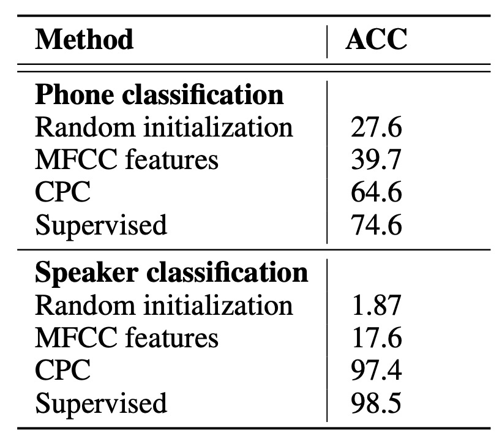
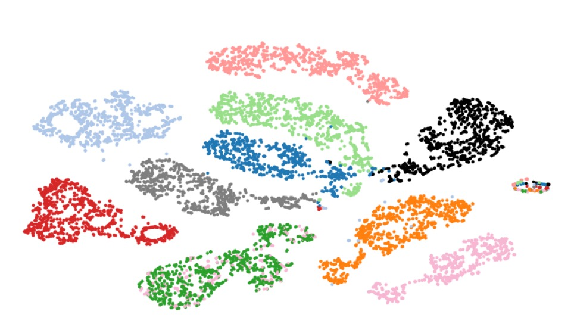

## 未知生，焉知死？

[**Representation Learning with Contrastive Predictive Coding**](https://arxiv.org/abs/1807.03748)

---

在面對複雜的高維度資料時，我們常常會遇到一個大哉問：

> 究竟哪些特徵才是「重要的」？哪些又是「不重要的」？

在監督式任務中，為了在訓練集上追求更低的損失函數，模型總會趁我們不注意的時候，把一些與目標任務無關的微小特徵：可能是雜訊、拍攝角度偏差、錄音設備特性或標記者習慣等，都一併擬合了。

短期看來，模型在訓練集的評估指標節節攀升，甚至在測試集上也有不錯的表現。但在真正部署到真實環境、或面對未知資料時，由於失去之前仰賴的「過擬合」特徵，它的泛化能力可能會大打折扣。

## 定義問題

在這個時期，生成模型是聲量非常高的非監督學習方法。這類模型的目標是學習資料的聯合分佈 $p(x)$，並透過生成式模型 $p(x \mid z)$ 來產生新的樣本。

看起來沒有問題，但你仔細想想：

當我們做影像分類時，就算只是預測下一個像素，整個網路也必須同時掌握影像的所有資訊，無論那些資訊對是不是真的關鍵 —— 因為只有一模一樣的重建，才不會讓模型受到懲罰。

這根本就是浪費算力的標準案例。

所謂「高階抽象意義」的訊息，在在語音資料中，可能講話者的性別、音高變化、語速、語音風格等；在圖像資料中，可能是物體形狀、位置關係、風格之類的。

作者認為，我們應該關注的是：在下一個時刻（或更後面的時刻），究竟該選擇哪些特徵才能重現原始的樣貌。

- **其重點在於「預測」，而非「重建」。**

只要能夠充分掌握決定未來走向的關鍵因素，就能在「過去的隱含表示」與「未來的特徵」之間取得高度相關的資訊。

> 與其去真實「復刻」未來，不如去「提煉」未來與現在共通的高階語意。

你看數千年來，人們所討論的話題如出一徹呢！

## 解決問題

### 模型架構

<figure style={{"width": "90%"}}>

</figure>

為了解決問題，作者提出了對比預測編碼架構，Contrastive Predictive Coding，又稱為 CPC。

整體架構如上圖，我們分幾個步驟來看：

1. **Encoder $g_{\text{enc}}$**

   首先把原始輸入序列 $\{x_t\}$（可能是影像中每個位置的特徵向量，或聲音訊號切成的每一個時刻等）透過一個「非線性編碼器」$g_{\text{enc}}$，轉換到潛在表徵 $\{z_t\}$：

   $$
   z_t \;=\; g_{\text{enc}}(x_t).
   $$

   這個步驟的作用是把高維度的輸入壓到一個較精簡或抽象的表示空間，通常透過一些卷積網路（對影像或聲音）或其他神經網路架構取得。

2. **Autoregressive model $g_{\text{ar}}$**

   接下來，再用一個自回歸模型 $g_{\text{ar}}$（例如 GRU、LSTM 或其他形式的 RNN）去讀取時間序列 $\{z_1, z_2, \ldots, z_t\}$，產生「上下文表示」$c_t$：

   $$
   c_t \;=\; g_{\text{ar}}(z_{\le t}) \;=\; g_{\text{ar}}(z_1, z_2, \ldots, z_t).
   $$

   $c_t$ 可以看作是「模型在時間 $t$ 之後所能對未來進行預測」所需要的隱狀態，也包含了到目前為止所有 $z$ 的資訊。

3. **對未來的預測：不直接生成，而是估計「密度比」**

   剛才我們也提到了，CPC 的目標是在給定上下文 $c_t$ 的情況下，去預測未來的特徵 $x_{t+k}$。

   但 CPC 並不直接去建模 $p(x_{t+k} \mid c_t)$（生成整個 $x$），而是去學一個密度比：

   $$
   f_k(x_{t+k}, c_t) \;\;\propto\;\; \frac{p(x_{t+k} \mid c_t)}{p(x_{t+k})}.
   $$

   這個比值代表「在給定上下文 $c_t$ 的情況下，看到 $x_{t+k}$ 的可能性」相對於「不管任何上下文看到 $x_{t+k}$ 的可能性」的比值。

   作者給出一個簡單的實作方式：用 log-bilinear 的形式

   $$
   f_k(x_{t+k}, c_t) \;=\; \exp\bigl( z_{t+k}^\mathsf{T} \, W_k \, c_t \bigr),
   $$

   其中 $z_{t+k}$ 也是把 $x_{t+k}$ 經過 encoder 之後得到的表示，而 $W_k$ 是一個可學習的線性轉換。對於未來第 $k$ 個時間步，可使用不同的 $W_k$。

---

在這裡，如果我們要直接生成高維度資料（例如影像或語音）需要很複雜的模型；但我們只想利用「與上下文有關的資訊」。換句話說，模型不必重現所有背景雜訊，只需要對捕捉到的抽象特徵進行對比式的辨識或區分就好。

在實務上，從這個架構學到的表示 $z_t$ 或 $c_t$，都可以拿去做下游任務。

若需要更多「歷史上下文」的情形（例如語音辨識，要抓較長的語音內容），就用 $c_t$；若是當下就可以處理的任務（例如某種區域性的辨識），可能用 $z_t$ 即可。也可以對整張圖或整個序列做 pooling，得到一個總體的表徵。

### InfoNCE

接著我們來看一下作者所使用的損失函數：**InfoNCE**。

直接講 InfoNCE 會讓人有點措手不及，所以我們從簡單的 cross-entropy 開始說起。

在二元分類中，我們的目標是讓模型對正類打出的機率越接近 1 越好，對負類打出的機率越接近 0 越好。這可以寫成「交叉熵損失」：

$$
\mathrm{CE} = - \Bigl[\, y \log(\hat{y}) \;+\; (1-y)\log(1-\hat{y}) \Bigr]
$$

- 如果 $y=1$（正類），損失就變成 $-\log(\hat{y})$。
- 如果 $y=0$（負類），損失就變成 $-\log(1-\hat{y})$。

交叉熵在這裡扮演一種「逼迫模型輸出正確概率」的角色。假設我們把「正樣本」看成類別 1，「負樣本」看成類別 0，就能用 cross-entropy 來訓練。

若有 K 個類別，每個輸入 $x$ 對應到其中一個類別 $k$。

模型輸出對每個類別的分數 $\{s_1(x), \dots, s_K(x)\}$，再用 softmax 轉成機率 $\hat{y}_k$：

$$
\hat{y}_k = \frac{\exp(s_k(x))}{\sum_{j=1}^K \exp(s_j(x))}.
$$

如果真實標籤是「類別 $i$」，那整個 cross-entropy 損失就是

$$
\mathrm{CE}
\;=\;
-\, \log \Bigl(\hat{y}_i\Bigr)
\;=\;
-\, \log \biggl(
    \frac{\exp(s_i(x))}{\sum_{j=1}^K \exp(s_j(x))}
\biggr).
$$

換句話說，我們要 **最大化** $\exp(s_i(x))$，同時 **相對** 地壓低其它 $\exp(s_j(x))$（$j \neq i$)，確保「正確類別」的機率最大。

在**對比學習**裡，我們常碰到的情境是：

> 在一批樣本裡面，只有 1 個是『真正對應』到你的條件／上下文，其它都是『不匹配』、或者純粹『噪音』。

舉例來說：$N$ 個樣本裡只有 1 個樣本是正確的（positive），剩下 $N-1$ 個是負樣本（negative）。而我們想要用**同一個 cross-entropy** 來「選出哪個是正樣本」。

這時候，多類別分類的「K= N」：每個樣本對應一個「類別 ID」。

- 「正樣本」就是類別 1（或某個特定標籤），
- 其它 $N-1$ 個樣本各自當成類別 2, 3, ..., N。

但是在實作上，我們不是真的把每個負樣本當成「不同類」，而是要把「哪個樣本是正樣本」當成一個**多選一**的問題。

InfoNCE 就是用多類別 cross-entropy 做「正樣本 vs. 負樣本」對比

在論文中，InfoNCE 的損失定義如下（以一個批次為例）：

$$
L_N
=
-\, \mathbb{E}_{X} \Biggl[
    \log \frac{ f_k(x_{\text{pos}}, c) }
               { \sum_{x_j \in X} f_k(x_j, c) }
\Biggr]
$$

其中：

- $X = \{x_1, x_2, ..., x_N\}$ 包含 1 個**正樣本** $x_{\text{pos}}$（真正對應到上下文 $c$），和 $N-1$ 個**負樣本**。
- $f_k(x, c)$ 是打分函數（score function），可以類比前面「$s_i(x)$ 的 $\exp(\cdot)$」一樣。

在這個多類別分類問題裡，$N$ 個候選樣本對應「N 個類別」，正樣本是我們想要的「正確類別」，而負樣本是「錯誤類別」。

會使用 InfoNCE 這個名稱，是因為作者進一步證明：

- **最小化** 這個對比式的 cross-entropy（$L_N$）
- **等價於** 「最大化」上下文 $c$ 和目標樣本 $x_{\text{pos}}$ 的**互資訊（mutual information）下界**。

也就是說，當我們用這個對比式做法，讓模型去分辨「正樣本 vs. 負樣本」時，模型內部就被迫學到「上下文和正樣本之間的共同資訊」。

- 數學上，它可以證明：$I(x, c) \ge \log(N) - L_N$。
- 當 $N$ 越大，這個下界越緊。

:::tip
**和原始的 NCE 有何不同？**

**NCE（Noise Contrastive Estimation）** 更早期被用來估計「某個目標分布 $p(x)$ 相對於一個噪音分布 $q(x)$ 的密度比」；它常應用在詞向量、詞語機率分布等，目的是減少難以計算的正規化常數。

**InfoNCE** 專門著墨於「對比式學習」和「互資訊最大化」的概念上。它的數學形式仍然是 cross-entropy，但強調的是「在給定上下文 $c$ 時，哪一筆 $x$ 才是正樣本」，並且可以證明它是在最大化互資訊的下界。

若只看數學形式，InfoNCE 也能視為一種「NCE 的變體」，但應用在「對比式自監督學習」與「最大化互資訊」的場景中。
:::

## 討論

作者將 CPC 方法應用在四個不同的領域：

1. **語音（speech）**
2. **影像（images）**
3. **自然語言（natural language）**
4. **強化學習（reinforcement learning）**

作者透過「線性分類」（linear classification）或定性評估（qualitative evaluations）來探測模型所學到的表示到底含有多少可分辨訊息；而在強化學習中，則透過在代理（agent）模型中加入 CPC 的輔助損失函數，觀察其收斂速度的提升幅度。

不過受限於篇幅，我們只看一下 CPC 在語音和影像領域的效果，其他部分請讀者參考原論文。

### 語音辨識領域應用

在語音領域，作者使用公開的 LibriSpeech 資料集中的 100 小時子集（subset）。這個資料集雖然主要提供的是原始語音與轉寫文本，但作者使用了 Kaldi 工具包和其在 LibriSpeech 上的預先訓練模型，來產生對應的「音素（phone）序列」標籤。

作者有將對齊好的 phone 標籤及自己的訓練/測試切分（train/test split）上傳到 Google Drive，方便後續實驗重現。資料集共含有 251 位不同的說話者（speakers）。

:::tip
有興趣測試的讀者，可以從這裡下載：[**CPC Phone Labels**](https://drive.google.com/drive/folders/1BhJ2umKH3whguxMwifaKtSra0TgAbtfb)
:::

模型架構如前所述，作者使用了 5 層的卷積網路（convolutional network）作為 encoder，每層的 stride 和 filter size 分別為 $[5, 4, 2, 2, 2]$ 和 $[10, 8, 4, 4, 4]$。每層都有 512 個隱藏單元，並使用 ReLU 激活函數。

在自回歸模型中，作者使用了 GRU，隱藏層維度為 256。在訓練過程中，作者使用了 Adam 優化器，學習率設為 $2 \times 10^{-4}$，並在 8 張 GPU 上進行訓練。

如下圖所示，作者量測從 1 到 20 個時間步的預測正確率：

<figure style={{"width": "60%"}}>

</figure>

整體看來，預測越遠（例如 t+20）會更困難，模型的正樣本得分相對難以保持在所有負樣本之上。但同時也顯示了這個對比任務既不太容易（代表模型需要真正學到高階特徵），也不至於不可能（仍可達到一定的區分能力）。

為了更好地理解 CPC 所學得的表示，作者在訓練完成後，提取 GRU 輸出（即 $c_t$，256 維），並在整個資料集中以此向量當作特徵，用**一個線性分類器**來做多類別的辨識。

結果如下表所示：

<figure style={{"width": "60%"}}>

</figure>

上表中，幾個名詞分別代表：

- **Random initialization**：隨機初始化的線性分類器。
- **MFCC**：傳統的語音特徵（Mel-frequency cepstral coefficients），再訓練同樣的線性分類器。
- **Supervised**：用有標籤資料做端到端的訓練（同樣是這個卷積+GRU 架構），可以視為此架構「理論最佳」的參考。

實驗結論顯示，雖然 CPC 與全監督的方法相比仍有差距，但 CPC 透過無標籤資料，已經能萃取到音素分佈相當有用的特徵。若在線性分類器再加一層隱藏層，表現可從 64.6% 提高至 72.5%，接近全監督的水準。

### 消融實驗

<figure style={{"width": "60%"}}>

</figure>

為了驗證 CPC 的設計是否真的有幫助，作者設計了兩類消融實驗：

1. **改變預測時間步數**：是否預測多個未來步驟，對表示學習的影響。結果顯示「預測多個未來步」對特徵表示有非常關鍵的影響，這也是 CPC 設計的核心所在。
2. **不同的負樣本策略**：
   - 「混合說話者（mixed speaker）」 vs. 「相同說話者（same speaker）」：是否在負樣本中摻入來自不同說話者的切片。
   - 是否排除當前序列本身作為負樣本來源。
   - 只從同一序列裡抽負樣本 vs. 從整個批次中抽。

這些策略都會影響到對比損失的難易度，也就是正負樣本之間的相似程度。從結果來看，負樣本抽樣方式，會對最終特徵的可分辨度產生顯著影響。

### 語者辨識可視化

<figure style={{"width": "80%"}}>

</figure>

作者使用 t-SNE 來展示 CPC 所學到的語音特徵，並將不同說話者的表示投影到二維平面上。

從圖中可以看到，不同說話者的表示被有效區分開來，這證明 CPC 所學到的特徵不僅包含語音內容，也包含了說話者本身的音色／特性等高階資訊。

### 影像辨識領域應用

在影像領域的實驗，作者使用了 ILSVRC ImageNet 資料集。這是一個常見的基準，用來評估各種無監督視覺模型。

作者在這裡參考過去的文獻的做法：

- [**Multi-task self-supervised visual learning**](https://arxiv.org/abs/1708.07860)

編碼器採用 ResNet v2-101，並在 ImageNet 上進行了線性分類評估。

訓練流程是先把圖像縮放到 256×256。然後從 256×256 的影像切出一個 7×7 的網格，每個小區塊為 64×64，之間帶有 32 像素的重疊。

<figure style={{"width": "80%"}}>

</figure>

:::tip
類似於 ViT 的 patchify 過程。
:::

訓練時使用資料增強，先從 300×300 圖中隨機裁剪成 256×256，搭配水平翻轉（50% 機率）、轉成灰階。對每個 64×64 區塊，再隨機裁切成 60×60，然後補邊回到 64×64。

ResNet v2-101 提取到的表示取自第三個殘差模組，再做空間平均池化，得到 1024 維度的向量，形成 7×7×1024 的張量。接下來用類似 PixelCNN 的架構，對這個 7×7 的網格做「逐行」的自回歸預測：從上往下，每一行都試圖預測後面最多 5 行之後的特徵，且對目標行的每個 patch 都套用對比損失。

實驗結果如下表：

<figure style={{"width": "90%"}}>

</figure>

度量指標是 ImageNet 的 top-1 和 top-5 分類正確率。可以看到：

- CPC 在 top-1 上比之前的最佳結果高了 9% 的絕對差距
- 在 top-5 上也有約 4% 的提升

這代表了 CPC 作為一種相對「領域不相關（domain-agnostic）」的方法，竟能在影像領域也有相當大的進展，說明了作者提出之對比預測編碼在學習影像高階特徵方面的有效性。

### 影像特徵可視化

最後，作者展示了基於 CPC 所學到的影像特徵，將每個神經元（每個 Row）特徵代表了不同的圖像概念。這些特徵在 ImageNet 上的分類任務中，能夠有效地區分不同的物體類別。

## 結論

CPC 在無監督學習領域提供了一條既靈活又高效的途徑，透過同時結合自回歸模型與噪音對比損失，得以自動地從高維度輸入中抽取更抽象、更具通用性的表示。

過去，我們往往必須為不同資料模態或應用場景量身打造特定的特徵提取方法，然而 CPC 告訴我們從語音、影像和文字等任務，都能以相似的機制進行表徵學習，這種通用性將為未來的研究和應用帶來更多可能性。

:::tip
這裡雖然還沒有跨模態對比學習的概念，但也可以初見端倪。
:::
