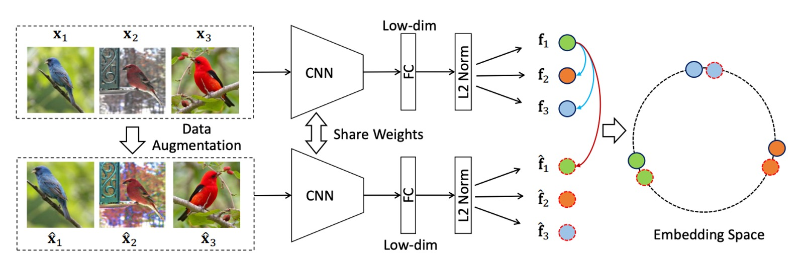
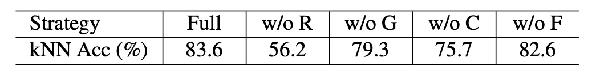

## 難題下的蛛絲馬跡

[**Unsupervised Embedding Learning via Invariant and Spreading Instance Feature**](https://arxiv.org/abs/1904.03436)

---

這篇論文主要的比較目標是 Exemplar CNN 和 InstDisc 這兩篇論文。

:::tip
如果你不知道這兩篇論文是什麼，不妨先去看看我們之前的文章：

- [**[14.06] Exemplar CNN: 尋找不變的特徵**](../1406-examplar-cnn/index.md)
- [**[18.05] InstDisc: 多多益善**](../1805-instdisc/index.md)

在這篇論文中，稱 `InstDisc` 這篇論文為 NCE；稱 `Exemplar CNN` 這篇論文為 Exemplar。
:::

## 定義問題

為了要找到通用的特徵，其一是使用分類器權重的 Softmax 嵌入，也是 Exemplar CNN 提出的方法：**將每張圖片當作一個獨立的類別**。

Exemplar CNN 定義了一個矩陣 $W = [w_1, w_2, \dots, w_n]^T \in \mathbb{R}^{n \times d}$，其中 $w_j$ 是對應第 $j$ 個實例的分類器權重。

訓練時，基於 Softmax 函數，樣本 $x_j$ 被辨識為第 $i$ 個實例的概率為：

$$
P(i|x_j) = \frac{\exp(w_i^T f_j)}{\sum_{k=1}^n \exp(w_k^T f_j)}
$$

在每一步中，網路會將特徵 $f_i$ 拉近對應的分類器權重 $w_i$，並遠離其他分類器權重 $w_k$。

但這種方法的分類器權重會導致特徵間的顯式比較受到限制，最終導致效率和辨識力不佳。

接著 InstDisc 捨棄了分類器權重，提出了 Memory Bank 的方法，將前一步計算的實例特徵 $f_i$ 儲存下來，記作 $v_i$。

此記憶特徵在後續步驟中「直接」作為對應實例的分類器權重，樣本 $x_j$ 被辨識為第 $i$ 個實例的概率為：

$$
P(i|x_j) = \frac{\exp(v_i^T f_j / \tau)}{\sum_{k=1}^n \exp(v_k^T f_j / \tau)}
$$

其中，$\tau$ 是控制分布集中度的溫度參數。$v_i^T f_j$ 表示特徵 $f_j$ 與記憶特徵 $v_i$ 的餘弦相似度。

缺點是記憶特徵更新頻率較低，網路的即時特徵 $f_i$ 與過時的記憶特徵 $v_i$ 之間的比較會導致訓練效率下降。

既然使用有參數的 Softmax 效果不好；使用 Memory Bank 的方法效率不高，那麼有沒有一種方法，可以直接優化特徵本身，而不是分類器權重或記憶特徵呢？

作者認為我們應該捨棄 Memory Bank，直接優化特徵本身就好！

## 解決問題

### 模型架構

<figure style={{"width": "90%"}}>

</figure>

上圖為作者提出的方法框架，看起來很簡單，首先輸入一批圖片，這些圖片會經過隨機的數據增強操作。

- **原始圖片：** 一組無標籤的圖片作為數據來源。
- **數據增強：** 每張圖片都會被應用隨機的增強方法（如旋轉、裁剪、顏色抖動等），生成增強後的圖片。這些增強後的圖片保留了與原始圖片相同的語義信息。

原始圖片和增強圖片都會被輸入到 CNN 主幹網路中，提取出對應的特徵向量。其中，原始圖片的特徵向量記為 $f_i$，增強圖片的特徵向量記為 $\hat{f}_i$。

最後是特徵的對齊和分散：

- **相同圖片的特徵對齊 (Invariance)：** 對於同一實例（即原始圖片和其增強版本），希望嵌入特徵 $f_i$ 和 $\hat{f}_i$ 是一致的（特徵靠近）。這種設計保證了模型能夠學習到圖片的內在語義特徵，而不是被增強操作帶來的變化所影響。
- **不同圖片的特徵分散 (Spread-out)：** 不同實例的嵌入特徵應該相互分離，避免它們彼此靠近。這種特徵分散性有助於模型區分不同的圖片實例，即便它們之間可能存在部分相似性。

### 損失函數

在方法論的最後，我們來看這篇論文所設計的損失函數。

首先是正樣本的分類概率，增強樣本 $\hat{x}_i$ 被正確分類為實例 $i$ 的概率為：

$$
P(i|\hat{x}_i) = \frac{\exp(f_i^T \hat{f}_i / \tau)}{\sum_{k=1}^m \exp(f_k^T \hat{f}_i / \tau)}
$$

其中：

- $f_i$：原始圖片 $x_i$ 的嵌入特徵。
- $\hat{f}_i$：增強圖片 $\hat{x}_i$ 的嵌入特徵。
- $\tau$：溫度參數，用於調節概率分布的集中程度。

然後是錯誤分類概率，其他實例 $x_j, j \neq i$ 被錯誤分類為實例 $i$ 的概率為：

$$
P(i|x_j) = \frac{\exp(f_i^T f_j / \tau)}{\sum_{k=1}^m \exp(f_k^T f_j / \tau)}
$$

而 $x_j$ 沒有被錯誤分類為實例 $i$ 的概率為：

$$
1 - P(i|x_j)
$$

假設不同實例被分類為實例 $i$ 是相互獨立的，則聯合概率為：

$$
P_i = P(i|\hat{x}_i) \prod_{j \neq i} (1 - P(i|x_j))
$$

其中：

- $P(i|\hat{x}_i)$：增強樣本 $\hat{x}_i$ 被正確分類為實例 $i$ 的概率。
- $1 - P(i|x_j)$：其他實例 $x_j, j \neq i$ 沒有被錯誤分類為實例 $i$ 的概率。

基於最大似然估計，我們可以將聯合概率取負對數，得到損失函數：

$$
J_i = -\log P(i|\hat{x}_i) - \sum_{j \neq i} \log(1 - P(i|x_j))
$$

這裡，損失函數由兩部分組成：

1. 增強樣本 $\hat{x}_i$ 被正確分類的損失（第一項）。
2. 其他樣本未被錯誤分類的損失（第二項）。

在批次中對所有實例進行加總，最後的總損失函數定義為：

$$
J = -\sum_i \log P(i|\hat{x}_i) - \sum_i \sum_{j \neq i} \log(1 - P(i|x_j))
$$

這個損失函數的設計避免了使用分類器權重或記憶庫所帶來的效率問題，而且直接對實例特徵進行優化，有效提升了計算效率和辨識能力。

## 討論

### 和其他方法的比較

<figure style={{"width": "50%"}}>

</figure>

作者首先遵循 InstDisc 的實驗設計，在 CIFAR-10 和 STL-10 資料集上進行實驗，並將 ResNet18 網路作為主幹網路，嵌入特徵的輸出維度設定為 128。

上表為基於 CIFAR-10 資料集的實驗結果，作者將本文方法與 DeepCluster、Exemplar CNN、NPSoftmax、NCE 和 Triplet loss 方法進行比較。結果顯示，本文方法在 kNN 分類器上達到了最佳性能（83.6%）。

在不同 epoch 中，作者繪製了其他方法的學習曲線，如下圖：

<figure style={{"width": "70%"}}>

</figure>

結果顯示，本文所提出的方法僅需 2 個 epoch 即可達到 kNN 分類準確率 60%，而 NCE 需要 25 個 epoch，Examplar 則需要 45 個 epoch 才能達到相同準確率。

顯然本文方法的學習速度遠快於其他競爭方法。這種效率得益於直接對實例特徵進行優化，而不是依賴分類器權重或記憶庫。

:::tip
另外一個 STL-10 資料集也是 SoTA 水準，為節省篇幅，這裡就不再贅述了。
:::

### 未知類別的實驗

根據監督深度嵌入學習的既有工作，作者評估了測試集的指標如下：

- **檢索性能（R@K）：** 測量測試集中，對於給定查詢圖片，在前 $k$ 個檢索結果中正確匹配（相同類別標籤）的概率。
- **聚類性能（NMI）：** 使用歸一化互信息（NMI）測量測試集的聚類質量。

接著，為了評估學習到的特徵嵌入在訓練樣本與測試樣本的語義類別不重疊時的區分能力，作者在 CUB200、Product 和 Car196 三個數據集上進行了實驗：

- **CUB200（鳥類數據集）：** 使用前 100 個類別（共 5,864 張圖片）進行訓練，後 100 個類別（共 5,924 張圖片）進行測試。
- **Product（產品數據集）：** 使用前 11,318 個類別（共 59,551 張圖片）進行訓練，後 11,316 個類別（共 60,502 張圖片）進行測試。
- **Car196（汽車數據集）：** 使用前 98 個類別（共 8,054 張圖片）進行訓練，後 98 個類別（共 8,131 張圖片）進行測試。

<figure style={{"width": "70%"}}>

</figure>

結果顯示如上表，本文方法在 CUB200 數據集上的表現甚至能與部分監督學習方法競爭，展現了優越的無監督學習能力。

:::tip
這裡我們僅擷取了 CUB200 數據集的結果，其他兩個數據集的結果可以參考原文。
:::

### 消融實驗

本文提出的方法在實例特徵學習中引入了兩個重要的性質：**數據增強不變性** 和 **實例分散性**。

為了驗證這兩個性質對性能的影響，作者在 CIFAR-10 數據集上進行了消融實驗。

- **數據增強不變性的影響**

    

    <figure style={{"width": "70%"}}>
    
    </figure>
    

  上表展示了結果，其中：

  - **`w/o`**：表示去除特定增強操作的情況
  - **`R`**：表示隨機裁剪（RandomResizedCrop）
  - **`G`**：表示隨機灰階（RandomGrayscale）
  - **`C`**：表示顏色抖動（ColorJitter）
  - **`F`**：表示隨機水平翻轉（RandomHorizontalFlip）。

  從結果可以看出，所有增強操作都對模型的性能提升起到了作用，特別是隨機裁剪貢獻最大。此外，作者也在完全不進行數據增強（No DA）的情況下進行了實驗，結果如下表：

    

    <figure style={{"width": "70%"}}>
    
    </figure>
    

  結果分類準確率從 83.6% 驟降至 37.4%，真是驚人！

  這表明，沒有數據增強時，網路無法生成任何正向集中性，導致視覺上相似的圖片特徵被錯誤分離。因此，數據增強不變性對學習有效的嵌入特徵是關鍵因素。

- **實例分散性的影響**

  為了研究實例分散性的作用，作者測試了兩種負樣本選擇策略：

  1. **Hard Negative（困難負樣本）：** 選擇與查詢實例最相似的前 50% 特徵作為負樣本。
  2. **Easy Negative（簡單負樣本）：** 選擇與查詢實例最不相似的後 50% 特徵作為負樣本。

    

    <figure style={{"width": "70%"}}>
    
    </figure>
    

  還是同樣這張表格，當僅使用簡單負樣本時，準確率從 83.6% 驟降至 57.5%，而僅使用困難負樣本時，性能幾乎與完整模型相當。

  意思就是分離困難負樣本有助於提升學到嵌入特徵的區分能力。相比之下，簡單負樣本對模型幾乎沒有挑戰性，因而無法有效幫助模型學習實例分散性。

## 結論

這篇論文就強調了兩個重點：「數據增強不變性」和「實例分散性」。

根據作者提出的種種實驗，如果我們想做好無監督學習，就應該用足夠多的數據增強操作，並且選擇困難負樣本。

這兩個結論在後續的研究中仍然反覆出現，可以說是無監督學習領域內的重要觀察成果。
