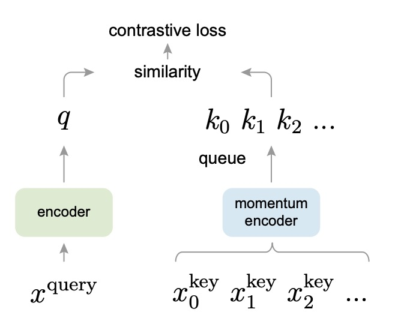
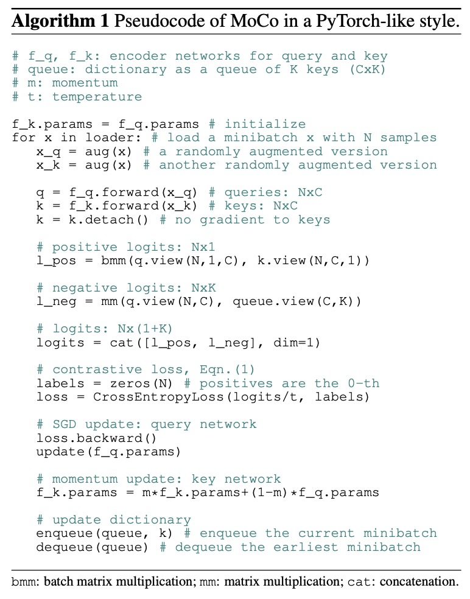

## 動量對比學習

[**Momentum Contrast for Unsupervised Visual Representation Learning**](https://arxiv.org/abs/1911.05722)

---

已經有這麼多機構在對比學習這個方向上提出了自己的見解，Facebook AI Research (FAIR) 肯定也不會缺席。

他們也在這個時候加入討論，認為對比學習的關鍵可能在於：動量！

:::tip
現在的 Meta AI 在當年叫做 Facebook AI Research（FAIR）。
:::

## 定義問題

在 NLP 領域中，文字空間的本質是離散的，可以輕易地把字或 sub-word tokens 當作「字典」。對比之下，影像空間是連續且高維的，沒有像文字那樣的自然分段。要在影像上套用類似 Tokenize 的流程，需要考量如何動態構建「字典」並從中抽取負例 (negative) 與正例 (positive)。

我們也讀過了之前幾篇論文，雖然效果不錯，但仍然存在幾個問題：

1. **字典大小往往受限於 batch size 或 GPU 記憶體。**
2. **當網路參數不斷更新時，字典中「舊」的特徵向量與「新」的特徵向量可能不一致。**

一種可行的做法是使用很大的字典，像之前那篇提出 memory bank 的論文這般，但因為網路參數持續更新，memory bank 中存的特徵向量會與新參數不相符，導致對比時不夠「一致」。

既然不夠「一致」，我們能不能將字典侷限在當前 mini-batch 裡呢？

也不行。

這種做法雖然能確保一次拿到的特徵能保持一致；可是在視覺上，batch size 通常有限，導致可用的負例樣本很少。由於負樣本不足，對比學習的效果就會變差。

作者希望能找到一個方法，同時擴大字典規模，並且維持字典內特徵向量的一致性，因此提出了 Momentum Contrast (MoCo)。

簡單來說，就是使用一個隊列（queue）來保存大量的負例，並且以動量更新（momentum update）的方式讓 key encoder 慢速演化，維持與歷史負例的一致性。

真的有這麼簡單？

我們這就來看一下這篇方法的細節。

## 解決問題

MoCo 的核心假設是：若字典的負例數量越多（表示能夠涵蓋越廣的多樣性），並且在訓練過程中保持編碼的「一致性」（consistency）越高，就能學到較好的特徵表示。

設計概念如下圖所示：

<div align="center">
<figure style={{"width": "70%"}}>

</figure>
</div>

在 MoCo 的設計中，查詢（query）和鍵（key）分別由兩個編碼器進行編碼。其中 **query encoder** 負責編碼當前批次的樣本，而 **key encoder** 則用於編碼隊列中的負例。為了確保字典裡的負例表徵能夠與最新的查詢表徵保持一致，作者提出了 **慢速動量更新**：

$$
\theta_k \leftarrow m \theta_k + (1 - m)\theta_q
$$

其中 $\theta_q$ 與 $\theta_k$ 分別代表 query encoder 與 key encoder 的參數，$m$ 為動量係數（如 0.999）。透過這種方式，key encoder 的參數能夠在訓練過程中以較緩慢、平滑的方式跟上 query encoder 的最新狀態，避免因編碼器更新過於劇烈而導致字典內的負例向量失去一致性。

同時，作者在這裡設計了一個「隊列」來保存大量的負例。

這個隊列的大小可以遠大於 batch size，因此能夠保存更多的負例樣本。每次訓練讀入的新 batch 會被編碼後，enqueue 到隊列尾端；同時最舊的一批 key 會被 dequeue 出去。如此一來，就能持續保存大量、多樣化的負例，而每次更新僅需對新的 batch 做編碼，計算量相對可控。

:::tip
在這篇論文中，作者大量使用查詢（query）和鍵（key）這兩個詞彙。

不要慌張，這跟自注意力那個查詢-鍵-值（query-key-value）沒有關係。這裡的查詢和鍵只是對比式學習中的一種比喻，用來描述「正樣本」和「負樣本」之間的關係。

從概念上來說，**「查詢 (query)」** 和 **「鍵 (key)」** 並沒有直接取代「正樣本 (positive)」與「負樣本 (negative)」這兩個概念，而是作者在**對比式學習**裡面，使用「字典查詢」的類比方式來重新闡釋「正、負樣本」之間的關係：

1. **Query (查詢)**：這個向量是要被「分類」或「辨識」的對象，類似我們在一般對比學習中所謂的「anchor」。在 InfoNCE 或其他對比損失裡，會希望將 Query 與它對應的正例拉近，和不相干的負例拉遠。
2. **Key (鍵)**：字典中的每個元素都被稱為 Key；它可以是**正例**（正確匹配 Query 的那個 Key）或是**負例**（和 Query 不匹配的其他 Key）。也就是說，對於一個特定的 Query，只有一個 Key 是所謂的「正樣本 (positive)」，其餘的 Key 都是「負樣本 (negative)」。

作者為了強調「字典—查詢」關係，而將正樣本和負樣本都統一叫做 Key（正例 Key 與負例 Key），而將要對應的那個樣本叫做 Query。
:::

### 演算法設計

作者可能也知道讀者沒有耐心讀完整篇論文，所以提供了完整演算法流程，看完就相當於讀完了這篇論文。

<div align="center">
<figure style={{"width": "70%"}}>

</figure>
</div>

我們逐行拆解一下：

---

```python
# f_q, f_k: encoder networks for query and key
# queue: dictionary as a queue of K keys (CxK)
# m: momentum
# t: temperature

f_k.params = f_q.params # initialize
```

1. 這行將 **key encoder (f_k)** 的參數初始化為 **query encoder (f_q)** 的參數。
   - 一開始兩個編碼器一致，之後訓練過程中會用動量更新來讓 key encoder 慢速演化。

```python
for x in loader: # load a minibatch x with N samples
```

2. 使用一個 **資料載入器 (loader)** 讀取一個含 **N 筆樣本**的 minibatch。
   - 通常 `loader` 是 PyTorch 的 `DataLoader`，會不斷從資料集裡取出 batch。

```python
x_q = aug(x) # a randomly augmented version
x_k = aug(x) # another randomly augmented version
```

3. 對同一批影像 `x`，各做一次隨機增強 (augmentation)。
   - `x_q` 與 `x_k` 雖然來自同一張原圖，但經過隨機裁切、翻轉、顏色抖動等操作後，形成兩個不同的「視圖 (views)」。
   - `x_q` 接下來會進 query encoder，`x_k` 進 key encoder，用於構成「正例」對（positive pair）。

```python
q = f_q.forward(x_q) # queries: NxC
k = f_k.forward(x_k) # keys: NxC
```

4. 分別透過 **query encoder (f_q)** 與 **key encoder (f_k)** 對增強後的影像做前向傳播。
   - `q` 形狀為 `N x C`，表示 N 筆樣本，每筆樣本的特徵向量維度為 C。
   - `k` 同理，也是 `N x C`。

```python
k = k.detach() # no gradient to keys
```

5. `k.detach()` 表示不對 `k` 做梯度追蹤。
   - 因為 key encoder 的更新並不是透過反向傳播，而是透過「動量更新」(momentum update)。
   - 這可避免計算圖 (computational graph) 自動回溯到 key encoder 的參數。

```python
# positive logits: Nx1
l_pos = bmm(q.view(N,1,C), k.view(N,C,1))
```

6. 算出 **正例 (positive) 的 logits**。
   - `q.view(N,1,C)` 表示把 `q` reshape 成 (N, 1, C)，`k.view(N,C,1)` 為 (N, C, 1)，以便做「批次矩陣乘法 (batch matrix multiplication)」。
   - `bmm` 會針對 batch 維度一一做內積，結果形狀是 `(N,1,1)`，可以視為 `(N,1)`，對應每一筆樣本的正例相似度（點積）。

```python
# negative logits: NxK
l_neg = mm(q.view(N,C), queue.view(C,K))
```

7. 算出 **負例 (negative) 的 logits**。
   - 這裡 `queue` 大小為 `(C x K)`，表示隊列中有 K 個鍵向量，每個維度 C。
   - `q.view(N,C)` 與 `queue.view(C,K)` 做矩陣乘法，結果為 `(N, K)`，代表每個 query 與所有隊列中的 K 個鍵之內積。
   - 這些鍵被視為「負例」，因為它們對應到其他影像或其他不相同的樣本。

```python
# logits: Nx(1+K)
logits = cat([l_pos, l_neg], dim=1)
```

8. 將正例的 logits (`l_pos`) 和負例的 logits (`l_neg`) 做拼接 (concatenation)。
   - 最後得到 `(N, 1+K)` 的張量，每一筆樣本有 1 個正例（位置 0）和 K 個負例（位置 1 ~ K）。

```python
# contrastive loss, Eqn.(1)
labels = zeros(N) # positives are the 0-th
loss = CrossEntropyLoss(logits/t, labels)
```

9. 這一行計算 **對比損失 (contrastive loss)**，類似於 InfoNCE。
   - `labels = zeros(N)` 表示對於 N 筆樣本，正例的標籤都是 `0`。因為在 `logits` 的拼接結果裡，正例 logits 就在第 0 列。
   - `logits/t` 則把整個 logits 除以一個溫度參數 `t` (temperature)，控制 softmax 的平滑度。
   - `CrossEntropyLoss` 會把 logits 做 softmax，計算把每個樣本分到正例位置 (0-th) 的交叉熵損失。

```python
# SGD update: query network
loss.backward()
update(f_q.params)
```

10. 用**反向傳播 (back-propagation)** 來更新 **query encoder** 的參數。
    - `loss.backward()` 計算梯度，`update(f_q.params)` 表示透過優化器（如 SGD）執行權重更新。

```python
# momentum update: key network
f_k.params = m*f_k.params + (1-m)*f_q.params
```

11. 使用 **動量更新（momentum update）** 來更新 **key encoder** 的參數：
    $$
    \theta_k \leftarrow m\,\theta_k \;+\;(1 - m)\,\theta_q
    $$
    - 這裡 `m` 是動量係數（通常設為接近 1，如 0.999）。
    - 因此 key encoder 的參數會更平滑地跟隨 query encoder 變動，使得舊的 key 向量和新的 query 向量間的「不一致」(inconsistency) 可以降低。

```python
# update dictionary
enqueue(queue, k) # enqueue the current minibatch
dequeue(queue) # dequeue the earliest minibatch
```

12. **更新字典（隊列）**：
    - `enqueue(queue, k)`：把當前批次 `k`（形狀 `N x C`）加入隊列末端。
    - `dequeue(queue)`：從隊列前端移除最早的一批 key（同樣 `N x C` 大小），確保隊列大小維持在預先設定的 `K`。
    - 藉此隊列可不斷滾動地保留最近編碼到的 key，提供大量而多樣化的負例給下次訓練迴圈使用。

---

讀完程式碼，我們最後總結幾個重點：

1. **雙編碼器架構 (f_q, f_k)**： Query encoder (f_q) 負責當前 batch 的正例查詢；Key encoder (f_k) 用來計算負例，並且不直接接受反向傳播梯度。
2. **動量更新 (Momentum Update)**：Key encoder 以慢速方式貼近 Query encoder 的參數，可降低網路快速變動帶來的「不一致性」。
3. **大型字典 (Queue) 機制**：每次只需編碼當前 batch 的 key，然後把它們 enqueue；再 dequeue 掉最舊的一批 key。可以藉此保留大量負例（keys），增強對比學習效益，同時避免像 memory bank 那樣存整個資料集而造成巨量記憶體需求。
4. **對比損失 (Contrastive Loss)**：透過正例 $\ell_{\text{pos}}$ 與負例 $\ell_{\text{neg}}$ 的內積得到 logits，接著用 softmax + cross entropy 的形式實現 InfoNCE 損失。

整個演算法核心目的在於利用大規模且動態更新的隊列做對比學習，同時藉動量更新確保編碼器的一致性，最終學到更好、更具泛化能力的影像表徵。

### 前置任務

這篇論文的重點不是在於設計「新的前置任務」，而是提出一種通用機制 MoCo 來建構「大且一致」的字典，以利於各種對比式學習。

作者在實驗中使用了 **instance discrimination** 這種常見且簡單的做法，將同一張影像的不同增強版本視為正例，其他影像的增強版本視為負例。

值得一提的是作者在實驗中遇到了「BN 作弊 (Batch Normalization Cheating)」的問題。

所謂 BN 作弊，是指在對比式學習時，由於 Batch Normalization 會在同一個 batch 裡共享統計量，導致模型可以「偷看」到正例與負例之間不該共享的訊息，進而找到較「投機取巧」的解，損害學到的表示品質。

為了避免這種情況，作者引入了「Shuffling BN」，在多 GPU 訓練時把正例與負例分散到不同 GPU 並打亂樣本順序，使得它們的統計量互不干擾，從而解決了 BN 帶來的負面影響。

:::tip
**那為什麼之前的 memory bank 沒有這個問題？**

在 memory bank 的情境下，正例 key 其實是過往 batch 的樣本，也就是說它們本來就不會跟當前 batch 用同一個 BN 統計量，因此不用特別做 shuffling。但 MoCo 則是當前 batch 要即時計算 query 與 key 的表徵，所以才會遇上這個問題。
:::

## 討論

我們挑幾個重點圖表來看看 MoCo 的效果，完整的實驗結果請讀者參考原論文。

### 特徵穩健性

作者採用 **線性分類 (linear classification)** 來驗證 MoCo 所學到的特徵好壞。

- **自我監督預訓練**：在 ImageNet-1M (IN-1M) 上進行 MoCo 的無監督訓練，得到一個特徵抽取網路。
- **凍結 (freeze) 特徵**：接著固定該網路的卷積層權重，只在最後接上一個全連接層 (fully-connected layer + softmax) 進行有監督的線性分類，訓練 100 個 epoch。
- **評估**：在 ImageNet 驗證集上量測 Top-1 分類準確率 (1-crop)。

此流程是電腦視覺中常用的「檢驗自監督特徵表示」方法，能排除較複雜的微調因素。

比較的對象是三種常見的對比損失機制：

1. **End-to-end**：將 query encoder 與 key encoder 同時用反向傳播更新。
2. **Memory bank**：特徵向量事先存於記憶庫；但隨訓練更新，新舊特徵容易不一致。
3. **MoCo**：使用動量更新之 key encoder + 大規模隊列管理負例。

實驗結果如下圖：

<div align="center">
<figure style={{"width": "70%"}}>

</figure>
</div>

- 三者都隨著字典大小 $K$ 變大而準確率提升，顯示大字典能捕捉更多樣本多樣性。
- **End-to-end** 機制只能受限於 mini-batch 的大小（作者用 8 卡 Volta 32GB，可支援 batch size 約 1024）。但要更進一步擴大 batch size 會遇到大批量訓練的困難。
- **Memory bank** 雖可擴充更大字典，但由於不一致性（多次更新後的舊特徵），最終結果比 MoCo 低 2.6%。
- **MoCo** 在較大字典設定下表現最好，也驗證其能兼顧「大字典」與「一致性」。

### 動量係數的影響

作者進一步探討了動量係數 $m$ 對 MoCo 的影響。

下表格中列出了不同 $m$ 值在預訓練 (K = 4096) 下對 ResNet-50 的影響：

| momentum $m$ | 0    | 0.9  | 0.99 | 0.999 | 0.9999 |
| ------------ | ---- | ---- | ---- | ----- | ------ |
| accuracy (%) | fail | 55.2 | 57.8 | 59.0  | 58.9   |

實驗結果顯示，動量係數 $m$ 對 MoCo 的性能有著明顯影響：

- $m$ 太小 (如 0.9) 會導致表示學習失準，正確率大幅下降。
- $m=0$ 更是無法收斂。

相反地，**0.99~0.9999 區間**都能學到不錯的表示，其中 0.999 附近效果最佳。這說明「慢速演化的 key encoder」有助於維持字典的一致性並讓訓練穩定收斂。

### 和其他方法之比較

<div align="center">
<figure style={{"width": "85%"}}>

</figure>
</div>

為了更全面的比較，作者將 ResNet-50 (R50) 與其加寬版本 (2×, 4×) 都拿來做 MoCo 預訓練，並報告模型大小 (#params) 與線性分類準確率的關係。

- **MoCo + R50**：達到 **60.6%** Top-1 accuracy
- **MoCo + R50w4×**：更大模型，達到 **68.6%** accuracy

詳細比較數據如下表，若只看 **標準 ResNet-50**（參數量約 24M），MoCo 的 60.6% 準確率已經「優於」其他同級模型：

<div align="center">
<figure style={{"width": "70%"}}>

</figure>
</div>

:::tip
這裡作者並沒有使用特殊的網路結構，像是 patchify、客製 receptive field 等，而是直接使用 ResNet 後加個投影層，方便模型遷移到各種下游視覺任務。

這表示 MoCo 框架具備相當好的彈性，能持續結合其他策略來提升精度。
:::

## 結論

MoCo 是一個簡單而有效的對比式學習機制，通過動量更新與隊列管理，實現了在無監督情境下同時獲得「大字典」與「一致性」的目標。

整體而言，MoCo 的核心機制展現了很高的普適性及擴充性，為無監督視覺表示學習提供了一個兼顧效率與性能的解決方案。

:::tip
這個架構在之後推出了許多版本，我們晚點再來看一下後續的改進。
:::
