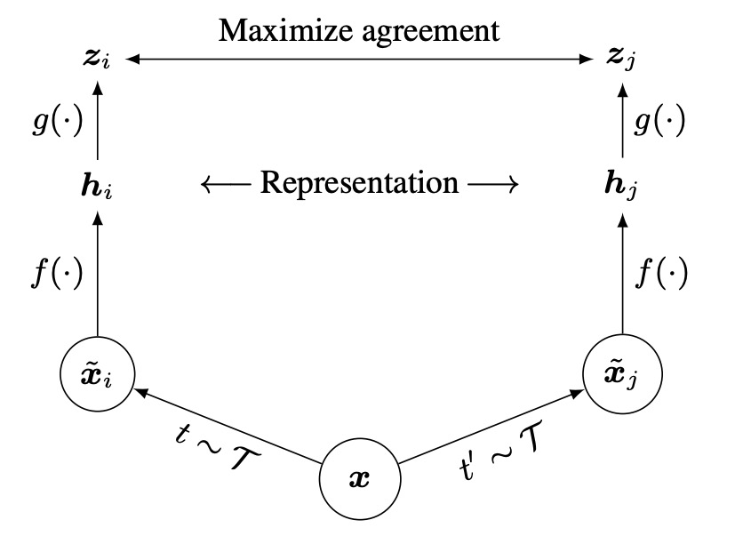
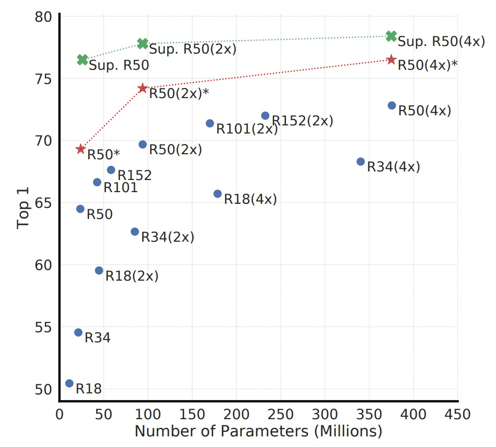
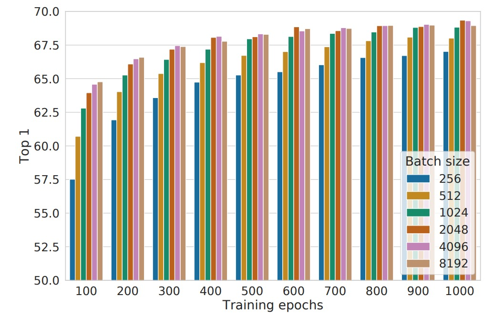
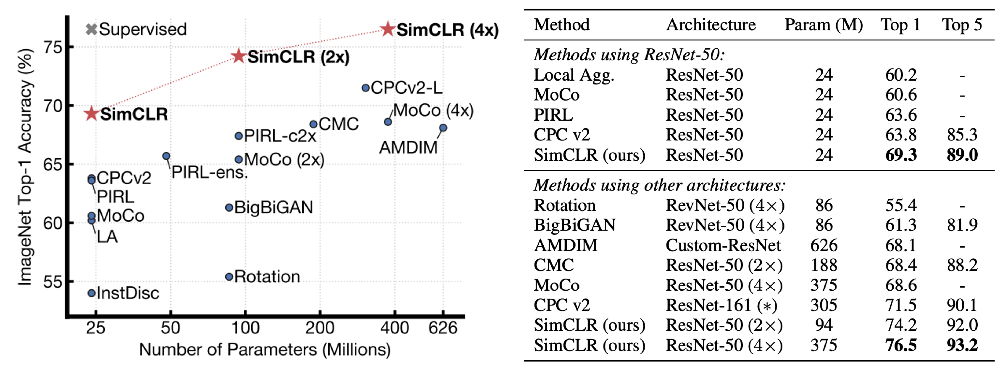

## 一力降十會

[**A Simple Framework for Contrastive Learning of Visual Representations**](https://arxiv.org/abs/2002.05709)

---

對比學習的研究約莫過了五年，整個場面已經變得非常複雜與混亂。不光是架構設計複雜，具體的模型訓練方法也是百家爭鳴。

本篇論文的作者認為，對比學習的核心應該要簡單一點。

## 定義問題

回想一下對比學習的必備要素：

- **要有好的結果，一個記憶庫 (memory bank) 似乎是一件必要的事情？**

因為我們需要大量的負樣本來引導模型學到更好的表示方式，而記憶庫確實能夠提供這樣的功能。一開始的 InstDict 是這樣做，後來的 MoCo 也是。

但是很煩！訓練過程中還要額外維護一個記憶庫，顯然是個不友善的設計。

作者在這篇文章中，決定直接捨棄記憶庫的設計，取而代之的是更大的批次大小。只要我們給出足夠多的負樣本，模型就能夠學到足夠好的表示！

:::tip
還沒讀過 InstDict 或 MoCo 的讀者，可以參考我們之前的文章：

- [**[18.05] InstDisc: 多多益善**](../1805-instdisc/index.md)
- [**[19.11] MoCo v1: 動量對比學習**](../1911-moco-v1/index.md)
  :::

## 解決問題

### 模型架構

<figure style={{"width": "70%"}}>

</figure>

這個架構真的非常簡單，沒有多個編碼器，沒有記憶庫。

流程是先對同一張影像做兩種隨機增強，得到兩個「看似不同、但其實來自同源」的影像。

接著，把這兩張影像分別丟到「同一個」編碼器網路，取得兩個潛在向量 (latent vectors)。

然後再用小型的投影網路把這些潛在向量映射到對比學習的空間，最後使用對比損失函式讓「同源」的增強影像在表示空間中彼此相近。

恩？就這樣？

對！就這樣，我們又看完一篇論文了！（~並沒有~）

### 影像增強

<figure style={{"width": "90%"}}>

</figure>

在 SimCLR 中，作者認為增強方式多樣且強力，比起監督式學習更加重要。

論文中用的影像增強方式如上圖所示，比較重要的有：

- **隨機裁切**（random crop）
- **顏色扭曲**（color distortion）
- **高斯模糊**（Gaussian blur）

兩張增強後的影像被視為「正樣本對」，因為它們其實來自同一張原始影像。

### 細部設計

首先是編碼器的部分，這裡使用了 ResNet-50 作為基礎編碼器，將增強後的影像輸入，得到一個向量 $h_i$。這個向量的維度通常很大，例如對 ResNet-50 而言，通過平均池化層後可能是 2048 維。

接著是投影頭的部分，作者發現直接在 $h_i$ 上做對比損失效果不如先加一個小型 MLP。這個投影網路 $g(·)$ 通常有一層 hidden layer，然後 ReLU，最後投影到一個 128 維的向量 $z_i$，用來計算對比損失。

最關鍵的部分就是如何定義對比損失。

核心概念是：同一對 $(i, j)$（它們來自同一張原圖）要在向量空間越靠近越好，而與其他不相干的樣本要盡量遠離。在這裡，作者引用了 NT-Xent (Normalized Temperature-scaled Cross Entropy Loss) 這個形式。

### NT-Xent 損失函式

這其實就是我們之前看過的 InfoNCE 損失函式，只是作者這裡修改了輸入的形式，公式本身沒有改變。輸入特徵在這裡加入了 ℓ₂ normalization，這樣可以讓餘弦相似度的計算更為穩定。

:::tip
如果你對提出 InfoNCE 的論文感興趣，可以參考這裡：

- [**[18.07] CPC: 未知生，焉知死？**](../1807-cpc/index.md)
  :::

NT-Xent 損失函式的計算方式如下：

$$
ℓ_{i,j}
= - \log \left( \frac{\exp(\text{sim}(z_i, z_j)/τ)}{\sum_{k=1}^{2N} \mathbf{1}[k \neq i] \exp(\text{sim}(z_i, z_k)/τ)} \right).
$$

其中：

- $zᵢ$ 為第 $i$ 個增強影像經投影頭後得到的 128 維向量。
- $\text{sim}(u, v) = \frac{u^\top v}{\|u\|\|v\|}$ 表示 cosine similarity（餘弦相似度）。
- $τ$（tau）為溫度（temperature）超參數，控制相似度分數的放大程度。
- 分子 $\exp(\text{sim}(z_i, z_j)/τ)$ 代表 $z_i$ 與正樣本 $z_j$ 之間相似度的指數化分數。
- 分母為 $z_i$ 與 batch 內所有其他向量（不包含自身）相似度的指數化總和。

在一個 batch 中，假設有 $N$ 張原始影像，每張影像經過兩次不同的增強，總共產生 $2N$ 張增強影像。對於一對正樣本 $(i, j)$（即同一張原圖的兩次不同增強），計算損失時，將其餘 $2(N - 1)$ 張增強影像視為負樣本。

目標是最大化正樣本 $(z_i, z_j)$ 之間的相似度，同時讓其餘負樣本的相似度較低，即希望 $\text{sim}(z_i, z_j)$ 遠大於 $\text{sim}(z_i, z_k)$（對所有 $k \neq i$）。如此一來，模型能學習到更具判別力的表徵，使相似樣本聚集，異質樣本分離。

在整個 batch 中，對於每對正樣本 $(i, j)$，會同時計算 $(i, j)$ 與 $(j, i)$ 兩項損失，並對其加總以進行反向傳播。

:::tip
NT-Xent 透過**餘弦相似度**（搭配 ℓ₂ normalization）與「溫度」($\tau$) 來自適應調整負樣本的影響。

- **餘弦相似度**：讓模型關注向量的「方向」而非「長度」，使表徵間的相對相似度比較更準確。
- **溫度參數 $\tau$**：
  控制相似度的放大或縮小，影響負樣本在損失中的權重：
  - **$\tau$ 小** → 擴大相似度差異 → 更強調「難負樣本」(hard negatives)。
  - **$\tau$ 大** → 平滑相似度差異 → 負樣本影響較平均。

在傳統對比損失中，為了考慮「易/難負樣本」對學習的影響，通常需要人工設計 **semi-hard negative mining**。如果不進行此篩選，可能因大部分負樣本太容易區分（對比度過高）而降低學習效果。

然而，NT-Xent 透過**餘弦相似度 + 溫度調整**讓負樣本權重根據相似度動態調整，不再需要手動篩選負樣本。實驗顯示，若不使用 semi-hard negative mining，其他對比損失函式（如 logistic loss、margin loss）效果通常較差，即使加入 semi-hard negative mining，也未必優於 NT-Xent。
:::

## 討論

### 最有用的增強組合

<figure style={{"width": "90%"}}>

</figure>

為了觀察「不同資料增強方式（個別或組合）對模型所學到表徵品質的影響」，作者在這裡使用 **線性評估 (linear evaluation)** 的方式，將自行訓練好的 encoder 凍結，然後在上面疊一個線性分類器（通常是一層線性全連接），並在 ImageNet 做 top-1 accuracy 的評估。

實驗中，模型輸入端有兩個「平行的增強管道」。在這裡，作者特意只對「其中一個管道」套用要測試的增強，另一個分支則不做該增強（只做最基礎的隨機裁切 + resize）。 這樣可以更直接觀察個別增強或不同增強組合「本身」的影響，而不會全部混在一起。

上圖中的表格解讀方式為：

- **對角線 (diagonal entries)**：單一轉換（如高斯模糊、顏色扭曲等），代表只施加該增強到一個分支。
- **非對角線 (off-diagonals)**：兩種增強的組合（例如先做高斯模糊，再做顏色扭曲）。
- **最後一欄 (the last column)**：每個 row 的平均值，也就是在該 row 增強組合之下，所有設定的平均表現。

實驗結果顯示：

- **單一增強**（對角線）通常並不足以讓模型學到非常強的表徵，因為只要依靠這個單一變化，模型仍可能利用其他不變的線索來判斷「正樣本對」。
- **組合增強**（非對角線）往往會讓線性評估的結果提升。

這意味著，當兩種或多種增強同時發生時，對比學習的任務難度會提升，但也能讓模型更能學到通用且穩定的特徵。

### 增強的強度影響

<figure style={{"width": "70%"}}>

</figure>

我們可以調整增強的強度，例如讓亮度、對比度、飽和度、色相的變化幅度更大或更小，因此作者進一步探討了「增強強度」對模型表現的影響。

在訓練 ImageNet 上的監督式分類模型時，我們常會使用 AutoAugment 這樣的自動增強策略。然而，作者在這裡發現，AutoAugment 並不一定比「簡單的裁切 + 強力顏色扭曲」更好。

實驗結果如上表，對於**無監督的對比學習**，加大顏色扭曲的強度能明顯提升模型最終學到的特徵品質。這表示，對於無監督對比學習來說，需要的增強手段跟監督式學習並不相同。很多在監督情境下「很有效」的增強策略，未必能同樣提升對比學習的效果。

:::tip
對於不同的學習目標，增強策略的選擇可能會有所不同，只是我們通常會下意識地忽略這個問題，因為可能有其他更重要的事情要考慮。

這裡作者的實驗結果提醒我們，增強策略的選擇可能會對模型的學習效果產生重大影響，因此值得花時間去仔細調整。
:::

### 擴大模型規模

<figure style={{"width": "70%"}}>

</figure>

上圖顯示了不同模型規模下，對比學習的效果。作者發現，隨著模型規模增大，對比學習的性能也會逐漸提升。

這個結果和我們在監督式學習中的經驗相似：加大模型容量，通常能容納更豐富的特徵表徵能力。而且隨著模型規模增大，無監督對比學習的效果提升更明顯，這意味著對比學習對大模型的依賴程度甚至比監督式學習還高。

:::tip
**為什麼無監督學習在小模型下不如監督式學習，但模型擴大就能夠競爭？**

因為在無監督情境下，模型需要自行挖掘數據結構。如果模型過小，表示空間受到很大限制，無法學到足夠豐富的特徵。但一旦模型容量足夠，就能捕捉多種不需標籤也能觀察到的模式，而這個模式可能會比監督式學習中所使用的標籤更豐富。
:::

### 批次大小影響

<figure style={{"width": "70%"}}>

</figure>

上圖是在不同批次大小和訓練週期下的表現，每個柱狀圖到表從頭訓練的單次實驗結果。

傳統上，批次大小的選擇主要考量計算效率和梯度穩定性，但在對比學習中，批次大小還有一個關鍵作用：**影響可用的負樣本數量**。

- **批次越大，單次訓練中可用的負樣本越多**，這使得模型能夠學習到更豐富的對比資訊，提高樣本區分能力。
- **更快的收斂速度**：在訓練 epochs 數較少的情況下，大批次能讓模型在更短的時間內觀察到更多負樣本，從而加速收斂，提高最終表現。

這點與監督式學習的情況不同。在監督式學習中，使用大批次的主要目的是：「讓梯度估計更穩定、訓練更高效」，但在對比學習中，「更多負樣本」才是大批次帶來的核心優勢。

另一個有趣的發現是，較長的訓練時間可以在一定程度上彌補小批次的缺點：

- 當訓練步數足夠多時，即使批次較小，模型仍能隨時間累積足夠的負樣本視野，縮小與大批次的性能差距。
- 但在相同的訓練時數下，大批次通常能更快達到類似的效果，因此在有限的計算資源下，選擇大批次是一種更高效的策略。

### 和其他方法的比較

作者比較各種自我監督學習方法的線性評估結果（即凍結 backbone，僅在最後疊一層線性分類器）。

結果顯示，即使使用標準的 ResNet 架構（沒有特殊設計），SimCLR 也能達到或超越過去一些需要特別設計網路結構的方法。當 ResNet-50 擴張到 4×，其線性評估結果可與經過監督式預訓練的 ResNet-50 相媲美，代表無監督對比學習在大模型下能有極高潛力。

如果把 ImageNet 的標籤數量壓縮到 1% 或 10%，且採用類別平衡方式進行微調，如下表：

<figure style={{"width": "60%"}}>

</figure>

我們可以看到 SimCLR 的效果仍超過其他方法，這表示對比學習在半監督學習中，也同樣有巨大的潛力。

## 結論

在這項研究中，作者提出了一個簡單而有效的對比學習框架，並透過一系列實驗，深入分析了不同設計選擇對學習效果的影響。

結果顯示，透過數據增強策略、非線性投影頭以及 NT-Xent 損失函式，SimCLR 在自監督學習、半監督學習及遷移學習任務上均顯著優於先前技術。

:::tip
對比學習以 SimCLR 和 MoCo 作為分水嶺，結束了百家爭鳴時期，在這個領域建立了一個明確的研究方向，並為未來的研究提供了重要參考。
:::
