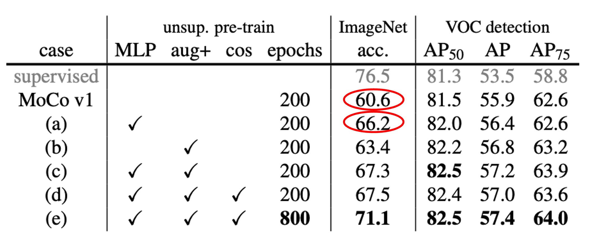
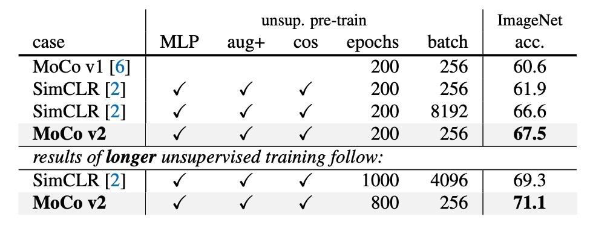

## 扳回一城

[**Improved Baselines with Momentum Contrastive Learning**](https://arxiv.org/pdf/2003.04297)

---

FAIR 提出了 MoCo v1，還沒得意多久，就有了 Google 提出的 SimCLR，效果提升非常多！

這是一棒打在 FAIR 頭上，簡直不能忍！於是在 SimCLR 發表後一個月，FAIR 擷取了 SimCLR 的一些優點，推出了 MoCo v2。

意思很明確，就是告訴其他人 MoCo 架構依然是個比較好的選擇！

:::tip
本篇論文的主要比較對象是 SimCLR，感興趣的讀者可以參考我們之前的文章：

- [**[20.02] SimCLR v1: 一力降十會**](../2002-simclr-v1/index.md)
  :::

## 定義問題

SimCLR 在實作上做了三項改進：

1. **非常大的 batch**（4k 或 8k），保證能看到足夠多的負樣本。
2. **MLP 頭**：把編碼器輸出的特徵先接到一個 2 層的 MLP（含 ReLU）之後，再做對比損失。訓練完後，做下游任務時，通常會只用編碼器輸出的特徵（不包含 MLP 的輸出）。
3. **更強的資料增強**：包含較強的顏色抖動、模糊等。

但是，SimCLR 雖然效果好，但是那個 batch size 真的太大了，一般人根本跑不動。

:::tip
財大氣粗的 Google 有 TPU，所以才能跑得動 4k 或 8k 的 batch size。
:::

所以作者在這篇論文中試著把 SimCLR 的兩大主要設計改進整合進 MoCo：

1. **MLP projection head**
2. **更強的資料增強**

然後發現這些改進在 MoCo 框架同樣有效，而且可以在一般 8-GPU 的環境就做出超越 SimCLR 的結果（不需要超大 batch）。

這顯然對普通使用者來說更友善，也讓對比學習的研究更容易複現。

## 解決問題

<figure style={{"width": "70%"}}>

</figure>

上圖展示了 SimCLR 與 MoCo 的架構差異。

SimCLR 屬於 End-to-end 機制，需要同一個 batch 裡面同時存在足夠多的負樣本，所以通常要用 4k ～ 8k 這麼大的 batch size。

而 MoCo 則使用一個「動量編碼器（momentum encoder）」來維護負樣本的表徵。負樣本的向量存在一個「隊列」中，批次之間共享；因此就算 batch 很小，也可以使用一個很大的隊列，提供大量的負樣本。

因此，MoCo 不需要大 batch 也能保有很多負樣本，對硬體資源的需求相對小。

### 加強 MLP 頭

<figure style={{"width": "70%"}}>

</figure>

作者先把 MoCo 原本最後一層的全連接（fc）投影頭替換成 2 層的 MLP（中間層 2048 維，帶 ReLU），並嘗試不同的溫度參數 $\tau$。

結果顯示如上表，如果只用 fc（無 MLP），ImageNet 線性分類大約 60%~61%；但換成 MLP 之後可以升到 66% 左右（在最佳 $\tau = 0.2$ 時），提升非常顯著。

不過在物件偵測的轉移學習上，MLP 頭帶來的提升比較小。這也說明了一個常見疑惑：

- **「線性分類的結果一定愈高愈好嗎？和實際下游任務有沒有直接關係？」**

其實有些時候並不呈現完全正相關；線性分類的分數是一個參考指標，但不保證在所有下游任務上都會有同樣幅度的改善。

### 加強資料增強

<figure style={{"width": "70%"}}>

</figure>

接下來作者把 MoCo 原本的增強策略再加上 SimCLR 的「模糊增強」，以及稍微更強的顏色扭曲。結果發現，就算不加入 MLP 頭，光是加強資料增強就能讓 ImageNet 線性分類從 60.6% 提高到 63.4%。而在偵測的結果上，也與使用 MLP 頭後的提升相當或者更好。

最後，如果同時使用 MLP 頭和強增強，ImageNet 線性分類可以到 67.3%，偵測也有明顯提升。

## 討論

### 與 SimCLR 的比較

<figure style={{"width": "70%"}}>

</figure>

SimCLR 在文章中用 4k 或 8k 的 batch size，而且預訓練了 1000 epoch，拿到 69.3% 的 ImageNet 線性分類正確率。

作者在相對可行的硬體環境下（8-GPU，batch size = 256），把上述兩個改進（MLP + 增強）整合到 MoCo，成為「MoCo v2」。

結果顯示：

- 當預訓練 200 epoch 時，MoCo v2 可以到 67.5%，比起相同設定下的 SimCLR（61.9%）高出 5.6%，也比用大 batch 的 SimCLR 66.6% 更好。
- 如果把預訓練延長到 800 epoch，MoCo v2 可以達到 71.1%，超過 SimCLR 的 69.3%。

也就是說，MoCo 不需要超大 batch，就能藉由隊列（queue）機制處理大量負樣本，且同時套用 SimCLR 介紹的 MLP 頭與更強增強，就能達到比 SimCLR 更好的結果。

### 計算量與資源消耗

<figure style={{"width": "70%"}}>

</figure>

作者也比較了 end-to-end 機制和 MoCo 機制在 8-GPU 下的記憶體和時間成本。

如果想在 end-to-end 機制中用 batch size = 4k 幾乎無法在 8-GPU 上實行；即使是 batch size = 256，end-to-end 也會比 MoCo 花費更多的記憶體與時間，因為要同時對查詢與關鍵編碼器做反向傳播。

反觀 MoCo 則只需要對查詢編碼器做更新，整體效率更高。

## 結論

總之，SimCLR 的概念都可以照搬到 MoCo 上，而且由於 MoCo 的記憶庫機制，訓練時不需要大量的 GPU 資源。不管怎麼看，都是一個經濟實惠，效果絕佳的好選擇。

FAIR 和 Google 在這次較量中，成功扳回一城。
