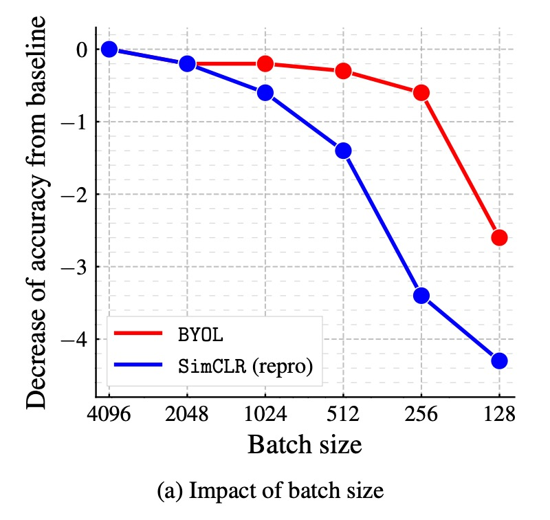
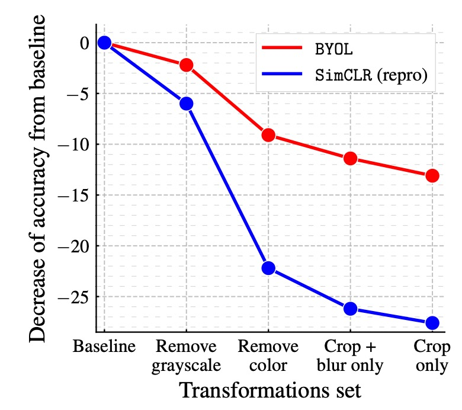
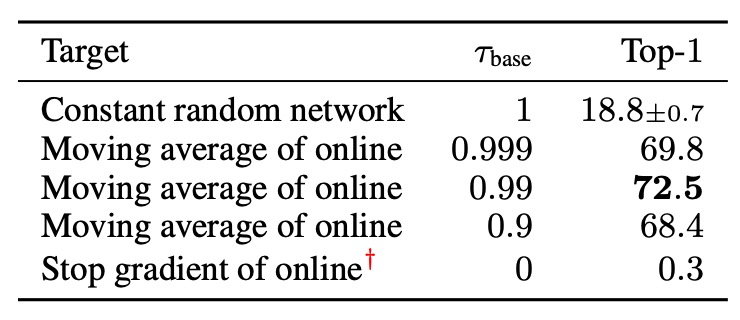

## 不需要負樣本

[**Bootstrap your own latent: A new approach to self-supervised Learning**](https://arxiv.org/abs/2006.07733)

---

當大家還在如火如荼地討論該如何設計負樣本的時候，這篇論文的作者獨排眾議，提出了一個不需要負樣本的方法。

作者說：只要自己跟自己學，模型就可以突破自己的極限。

## 定義問題

對比學習的核心概念是透過拉近相同圖像不同視角的表示（稱為「正樣本對」），同時推開不同圖像之間的表示（稱為「負樣本對」）來學習表徵。

但是這些方法需要精心設計的負樣本處理策略，像是我們之前看過的大批次訓練（SimCLR）或者是記憶庫（MoCo）的設計來確保學習效果。

不僅如此，這些方法還高度依賴於影像增強（image augmentation）的選擇，像是隨機裁剪是實驗證實非常有效的方法。

既然負樣本的設計這麼麻煩，那我們有沒有機會可以不用負樣本呢？

:::tip
如果你還沒讀過 SimCLR 和 MoCo，可以參考我們之前的文章：

- [**[19.11] MoCo v1: 動量對比學習**](../1911-moco-v1/index.md)
- [**[20.02] SimCLR v1: 一力降十會**](../2002-simclr-v1/index.md)
  :::

## 解決問題

### 模型架構

<figure style={{"width": "90%"}}>

</figure>

作者提出了 BYOL 架構，整體包含線上網路（online network）和目標網路（target network）兩部分：

- **線上網路**：如上圖的上半部，包含三個部分：

  1. **編碼器（encoder）** $f_{\theta}$：將輸入圖像轉換為特徵。
  2. **投影器（projector）** $g_{\theta}$：將特徵映射到一個高維度空間，這個部分和 SimCLR 等對比學習方法類似。
  3. **預測器（predictor）** $q_{\theta}$：在投影空間內進一步學習一個非線性映射，用於預測目標網路的輸出。

- **目標網路**：

  結構與線上網路相同，但使用不同的參數 $\xi$，且這些參數是線上網路參數 $\theta$ 的指數移動平均（exponential moving average, EMA），更新方式如下：

  $$
  \xi \leftarrow \tau \xi + (1 - \tau) \theta
  $$

  其中 $\tau$ 是衰減係數，控制目標網路更新的速度。

### 訓練方式

BYOL 訓練過程首先是給定一組圖片資料集 $D$，隨機從中抽取一張圖片 $x \sim D$，並應用兩種不同的影像增強方式 $T$ 和 $T'$ 來生成兩個不同視角：

$$
v = t(x), \quad v' = t'(x)
$$

其中 $t \sim T$，$t' \sim T'$。

對於第一個增強視角 $v$，線上網路計算：

$$
y_{\theta} = f_{\theta}(v), \quad z_{\theta} = g_{\theta}(y_{\theta})
$$

對於第二個增強視角 $v'$，目標網路計算：

$$
y'_{\xi} = f_{\xi}(v'), \quad z'_{\xi} = g_{\xi}(y'_{\xi})
$$

到這邊，我們可以看到 $z_{\theta}$ 和 $z'_{\xi}$ 還是非常像的，因為模型架構一樣，參數也是採用 EMA 更新。這時候如果直接讓這兩個輸出進行對比學習，模型通常會崩潰。

因為他們本身太相似，模型根本不需要學習，就可以直接將這兩個輸出拉近。為了解決這個問題，作者提出了一個新的機制。也就是再將 $z_{\theta}$ 經過一層投影器 $q_{\theta}$，得到預測輸出：

$$
\hat{z}_{\theta} = q_{\theta}(z_{\theta})
$$

然後將 $z'_{\xi}$ 和 $\hat{z}_{\theta}$ 進行比對並拉近，也就是說把整個架構改成是一個「預測」的問題，而不是「對比」的問題。

最後，為了確保數值穩定性，在比對這些向量時，都會進行 **$L_2$ 正規化**（使其範數為 1）：

$$
\hat{z}_{\theta} = \frac{q_{\theta}(z_{\theta})}{\|q_{\theta}(z_{\theta})\|_2}, \quad
z'_{\xi} = \frac{z'_{\xi}}{\|z'_{\xi}\|_2}
$$

### 損失函數

這裡作者就沒有使用 InfoNCE，而是簡單地使用均方誤差（Mean Squared Error, MSE）作為損失函數：

$$
L_{\theta, \xi} = \|\hat{z}_{\theta} - z'_{\xi}\|_2^2
$$

展開計算：

$$
L_{\theta, \xi} = 2 - 2 \cdot \langle \hat{z}_{\theta}, z'_{\xi} \rangle
$$

其中 $\langle \hat{z}_{\theta}, z'_{\xi} \rangle$ 是兩個單位向量的內積，表示它們之間的餘弦相似度。

此外，為了讓學習對稱化（symmetrize），訓練的時候會對調視角，讓 $v'$ 經過線上網路，$v$ 經過目標網路，再計算一次相同的損失：

$$
L'_{\theta, \xi} = \|\hat{z}'_{\theta} - z_{\xi}\|_2^2
$$

最終的 BYOL 總損失為：

$$
L^{BYOL}_{\theta, \xi} = L_{\theta, \xi} + L'_{\theta, \xi}
$$

### 實作細節

BYOL 採用與 SimCLR 相同的影像增強策略：

1. 隨機裁剪並調整至 $224 \times 224$ 的解析度。
2. 隨機水平翻轉。
3. 顏色扭曲（隨機改變亮度、對比度、飽和度、色相）。
4. 灰階轉換（可選）。
5. 高斯模糊。
6. 太陽化（solarization）。

---

網路架構的部分，BYOL 使用 ResNet-50 作為基礎編碼器 $f_{\theta}$ 和 $f_{\xi}$，並在不同實驗中測試了更深的 ResNet（50、101、152、200 層）以及更寬的變體（1× 至 4×）。

網路的詳細結構如下：

- **輸出特徵維度**：2048（當寬度倍數為 1×）。
- **投影層（MLP）**：
  - **第一層**：線性層，輸出維度 4096。
  - **批次正規化（Batch Normalization）**。
  - **ReLU 激活函數**。
  - **最終線性層**：輸出維度 256。
- **預測器（Predictor）**：結構與投影層相同。

與 SimCLR 不同的是，BYOL 不對投影層的輸出進行批次正規化，這是因為沒有負樣本對時，批次正規化可能會影響學習穩定性。

---

最後，BYOL 使用 LARS 優化器，並採用餘弦學習率衰減（cosine decay learning rate schedule）：

- 訓練 1000 個 epoch，前 10 個 epoch 進行學習率預熱。
- 基礎學習率為：
  $$
  \eta = 0.2 \times \frac{\text{BatchSize}}{256}
  $$
- weight decay：$1.5 \times 10^{-6}$。
- 指數移動平均參數 $\tau$：起始值為 0.996，隨訓練逐步增加至 1：
  $$
  \tau = 1 - (1 - \tau_{\text{base}}) \cdot \frac{\cos(\pi k/K) + 1}{2}
  $$
  其中 $k$ 為當前步數，$K$ 為最大步數。

## 討論

### 為什麼 BYOL 不會崩潰？

:::tip
這一段我們覺得是本篇論文最好看的地方。
:::

在對比學習中，負樣本對的設計是為了確保模型不會收斂到一個無信息量的恆定表示（constant representation）。

BYOL 在訓練時沒有顯式的正則化項來避免崩潰解，為什麼它不會崩潰呢？

針對這個議題，作者提出了詳細的說明：

1.  BYOL 的目標網路參數 $\xi$ 並非透過梯度下降來更新，因此它的參數更新方向並不是最小化損失函數 $L_{\theta, \xi}$ 的梯度方向：

    $$
    \xi \leftarrow \tau \xi + (1 - \tau) \theta.
    $$

    這種更新方式與生成對抗網路（GANs）中的學習動力學類似，GANs 透過生成器和鑑別器的相互競爭來學習，而非單純最小化一個聯合損失函數。因此，BYOL 的學習過程並不是單純對一個損失函數進行梯度下降，這樣的動力學降低了收斂到崩潰解的可能性。

---

2.  進一步分析，作者假設 **預測器 $q_{\theta}$ 是最優的（optimal predictor）**，即：

    $$
    q^* = \arg \min_{q} \mathbb{E} \left[ \| q(z_{\theta}) - z'_{\xi} \|_2^2 \right],
    $$

    則最優的 $q^*$ 應滿足：

    $$
    q^*(z_{\theta}) = \mathbb{E}[z'_{\xi} | z_{\theta}].
    $$

    在這種情況下，可以推導出 BYOL 的參數更新方向，它對 $\theta$ 的梯度更新與條件變異數（conditional variance）相關：

    $$
    \nabla_{\theta} \mathbb{E} \left[ \| q^*(z_{\theta}) - z'_{\xi} \|_2^2 \right] = \nabla_{\theta} \mathbb{E} \left[ \sum_{i} \text{Var}(z'_{\xi, i} | z_{\theta}) \right],
    $$

    其中 $z'_{\xi, i}$ 代表 $z'_{\xi}$ 的第 $i$ 個特徵分量。

    這表明，BYOL 實際上是在最小化條件變異數，即減少目標表示 $z'_{\xi}$ 相對於當前表示 $z_{\theta}$ 的變異程度。而根據變異數的基本性質，對於任意隨機變數 $X, Y, Z$，有：

    $$
    \text{Var}(X | Y, Z) \leq \text{Var}(X | Y).
    $$

    如果我們令：

    - $X = z'_{\xi}$（目標投影表示）
    - $Y = z_{\theta}$（當前的線上投影表示）
    - $Z$ 為訓練動態中的額外變異性

    則可得：

    $$
    \text{Var}(z'_{\xi} | z_{\theta}, Z) \leq \text{Var}(z'_{\xi} | z_{\theta}).
    $$

    這說明，BYOL 無法透過簡單地丟棄信息來降低條件變異數，這與崩潰解（恆定表示）相矛盾，因為崩潰解在 BYOL 中是不穩定的。

---

3. 最後再分析一下目標網路參數 $\xi$ 的更新方式。

   假設我們直接將線上網路參數 $\theta$ 覆蓋到目標網路：

   $$
   \xi \leftarrow \theta.
   $$

   這樣確實能夠快速將線上網路的新變異性傳遞到目標網路，但這可能會破壞預測器的最優性假設，從而導致訓練不穩定。因此，BYOL 使用指數移動平均來更新目標網路：

   $$
   \xi \leftarrow \tau \xi + (1 - \tau) \theta.
   $$

   這種平滑更新策略可以確保目標網路的變化較為緩慢，使預測器能夠保持接近最優狀態，進而穩定整體學習過程。

### 在 ImageNet 上的表現

<figure style={{"width": "60%"}}>

</figure>

作者依照標準的線性評估協議（linear evaluation protocol），在 BYOL 預訓練後的固定表示上訓練一個線性分類器，並測量 Top-1 和 Top-5 準確率。

在 ResNet-50（1×） 架構上，BYOL 達到了 74.3% Top-1 準確率（91.6% Top-5 準確率），比之前最先進的自監督方法高出 1.3%（Top-1）和 0.5%（Top-5）。

BYOL 縮小了與監督學習基線（76.5%）的差距，但仍然低於更強的監督學習基線（78.9%）。

在更深、更寬的 ResNet 架構（如 ResNet-50(4×)）上，BYOL 繼續超越其他自監督學習方法，最佳結果為 79.6% Top-1 準確率，已接近最佳監督基線。

BYOL 在無需負樣本的情況下，達到了與對比學習方法相當甚至更好的表現，並接近監督學習的基準，詳細表格資料如下：

<figure style={{"width": "90%"}}>

</figure>

### 消融實驗 - Part 1

作者進行了一系列的消融實驗，探討 BYOL 設計中的關鍵因素對最終模型表現的影響：

1. **批量大小對性能的影響**：

    

    <figure style={{"width": "50%"}}>
    
    </figure>
    

   在對比學習方法中，訓練批量大小直接影響負樣本數量。若批量大小減少，負樣本數量下降，則訓練效果會變差。而 BYOL 不依賴負樣本，因此理論上應該更具穩健性。

   作者比較了 BYOL 與 SimCLR 在批量大小 128 - 4096 之間的性能變化，結果顯示 BYOL 在 256 - 4096 的範圍內表現穩定，直到批量大小過小才開始下降。反觀 SimCLR 的性能隨批量大小降低急劇下降，這與負樣本數量減少有關。

---

2. **影像增強的影響**：

    

    <figure style={{"width": "50%"}}>
    
    </figure>
    

   對比學習方法高度依賴影像增強，特別是顏色失真。這是因為隨機裁剪的視角通常共享顏色資訊，但來自不同圖像的視角顏色變化較大。若不加入顏色增強，對比學習可能只學到基於顏色直方圖的區別性，而非更深入的特徵。

   作者比較了 BYOL 與 SimCLR 在不同影像增強組合下的性能變化，結果顯示 BYOL 對影像增強的依賴性較低，即使去除顏色增強或僅使用隨機裁剪，仍能保持較高的準確率。

---

3. **自引導學習（Bootstrapping）的影響**：

    

    <figure style={{"width": "70%"}}>
    
    </figure>
    

   BYOL 的核心機制之一是使用目標網路來提供學習目標，其中目標網路的權重是線上網路權重的指數移動平均（EMA）。若衰減率設為 1，則目標網路從不更新，相當於使用固定的隨機網路。若衰減率設為 0，則目標網路每個步驟都與線上網路同步更新。

   作者測試不同的目標網路更新速率，結果顯示：

   - 若目標網路更新過快，學習過程變得不穩定，因為學習目標變動過快。
   - 若目標網路更新過慢，則學習進展緩慢，最終學到的特徵品質不佳。
   - 使用適當的指數移動平均策略（如 $\tau = 0.99$），可在穩定性與學習效率之間取得最佳平衡。

### 消融實驗 - Part 2

作者進一步探討 BYOL 與其他對比學習方法的關係，並分析 BYOL 能超越 SimCLR 的原因：

首先，從 InfoNCE 出發，考慮一個擴展的 InfoNCE 損失函數：

$$
\text{InfoNCE}_{\alpha, \beta}^{\theta} =
$$

$$
\frac{2}{B} \sum_{i=1}^{B} S_{\theta}(v_i, v'_i) - \beta \cdot \frac{2\alpha}{B} \sum_{i=1}^{B} \ln \left( \sum_{j \neq i} \exp\left(\frac{S_{\theta}(v_i, v_j)}{\alpha}\right) + \sum_{j} \exp\left(\frac{S_{\theta}(v_i, v'_j)}{\alpha}\right) \right)
$$

其中：

- **$\alpha > 0$**：溫度超參數（temperature）。
- **$\beta \in [0,1]$**：負樣本影響係數。
- **$B$**：批量大小。
- **$v, v'$**：批量中的增強視角，對於任意索引 $i$，$v_i$ 和 $v'_i$ 來自同一圖片的不同增強版本。
- **$S_{\theta}(u_1, u_2)$**：衡量視角相似性的函數，定義如下：
  $$
  S_{\theta}(u_1, u_2) = \frac{\langle \phi(u_1), \psi(u_2) \rangle}{\|\phi(u_1)\|_2 \cdot \|\psi(u_2)\|_2}
  $$
  其中：
  - **SimCLR**：
    - **$\phi(u) = z_{\theta}(u)$**（不使用預測器）。
    - **$\psi(u) = z_{\theta}(u)$**（不使用目標網路）。
    - **$\beta = 1$**（使用負樣本）。
  - **BYOL**：
    - **$\phi(u) = p_{\theta}(z_{\theta}(u))$**（使用預測器）。
    - **$\psi(u) = z_{\xi}(u)$**（使用目標網路）。
    - **$\beta = 0$**（不使用負樣本）。

---

根據以上設置，實驗結果如下表：

<figure style={{"width": "70%"}}>

</figure>

首先測試不同的 $\beta$ 值，來驗證負樣本對是否必要：

- 當 **$\beta = 1$**（使用負樣本對）：可恢復 SimCLR 損失函數。
- 當 **$\beta = 0$**（不使用負樣本對）：只有 BYOL（包含目標網路和預測器）仍然能夠有效學習。

結果顯示，BYOL 是唯一能在不使用負樣本對時仍保持良好性能的方法。

接著將目標網路添加到 SimCLR，觀察其對性能的影響。結果顯示，添加目標網路能提升 SimCLR 的準確率 1.6%，這說明目標網路在對比學習方法中的重要性。

最後測試僅對 SimCLR 添加預測器，結果發現相比於添加目標網路，性能提升有限。作者認為在預測器與目標網路的結合，對於 BYOL 避免崩潰解的關鍵因素。

## 結論

BYOL 的創新在於完全不使用負樣本對，並通過目標網路和預測器的結合，避免了崩潰解的問題。在 ImageNet 上，BYOL 取得了最先進的自監督學習結果，並接近監督學習基線。此外，BYOL 的表現超越了許多現有的對比學習方法。

:::info
針對 BYOL 是否真的能完全擺脫負樣本的限制，在該篇論文發表後有非常多的討論，其中幾篇文章探討到了我們之前看過的「BN 作弊」的問題，非常精彩，相關討論串如下：

- **其他研究人員的質疑：**

  - [**Understanding self-supervised and contrastive learning with "Bootstrap Your Own Latent" (BYOL)**](https://imbue.com/research/2020-08-24-understanding-self-supervised-contrastive-learning/)

- **作者團隊的回覆與後續實驗：**

  - [**[20.10] BYOL works _even_ without batch statistics**](https://arxiv.org/abs/2010.10241)

簡單來說，其他研究人員經過幾輪實驗後，發現當 BYOL 移除 BN 結構，模型就無法順利收斂。推測是因為 BN 提供了隱式負樣本讓模型可以做對比學習。

如果坐實了這個結論，那 BYOL 的創新點（即不需要負樣本）就蕩然無存了。

為了捍衛 BYOL 的創新點，作者團隊進行了一系列的實驗，最終發現即使移除 BN，只要對模型進行適當的調整，仍然可以在不使用 BN 的情況下訓練 BYOL，並取得與原始設置相當的性能。

因此，作者最後的結論是，BN 在 BYOL 中的作用「並非」提供隱式負樣本，而是為了穩定訓練過程，這也是 BYOL 能夠在不使用負樣本的情況下訓練的原因之一。
:::

:::tip
「BN 作弊」的問題在 MoCo v1 中有提到，在那篇論文中作者採用的「Shuffle BN」方法來解決這個問題。

- [**[19.11] MoCo v1: 動量對比學習**](../1911-moco-v1/index.md)
  :::
