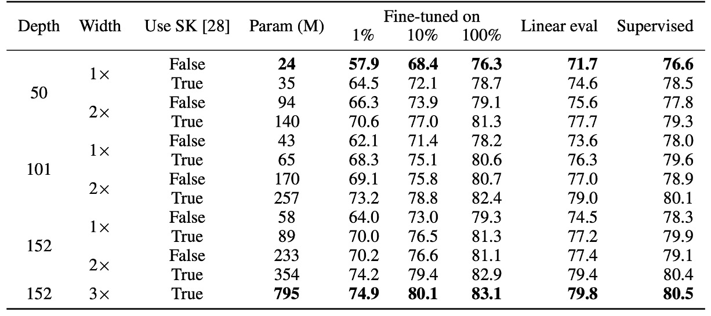

## 模型要大的

[**Big Self-Supervised Models are Strong Semi-Supervised Learners**](https://arxiv.org/abs/2006.10029)

---

FAIR 用 MoCo v2 這篇論文秀了一波肌肉，內容大致上是說：如果你沒有足夠的訓練資源，就採用他們的「動量記憶庫」解決方案，可以達到更好的效果。

只是 SimCLR 的作者（即 Google Research）似乎無意與他們繼續爭辯，反而把目光投向另一個方向：

> **我們不妨先撇開運算資源的問題，來看看基於「無監督」的對比學習架構，可以和大模型擦出什麼火花？**

:::tip
能夠直接撇開運算資源的實在沒多少人，現在回過頭來看，當時就已經預示著人工智慧這個領域最終還是會走向算力壟斷的寡頭競爭。
:::

:::info
如果你對 MoCo v2 的論文感興趣，可以參考我們之前的文章：

- [**[20.03] MoCo v2: 扳回一城**](../2003-moco-v2/index.md)
  :::

## 定義問題

這個時間點，大家耳熟能詳的 GPT-3 的論文已經發表在 arXiv 上。

意思就是在 NLP 領域已經開始大規模應用無標籤資料來建構龐大的語言模型，然後在後續應用上，使用少量的標籤資料進行微調。這種「預訓練 -> 微調」的經典範式已經在 NLP 領域確立。

但在 CV 領域，怎麼好像不怎麼流行呢？

於是作者基於 SimCLR 的對比學習架構，目標希望引入「大規模」的無標籤資料來進行模型的預訓練，並且使用「微量」的資料進行監督式微調。

實驗的效果很好，因此定名為 SimCLR v2。

## 解決問題

<figure style={{"width": "90%"}}>

</figure>

這張圖是 SimCLR v2 的模型架構，可以看到整個框架主要分為三個階段。

1. **無監督預訓練（Unsupervised Pretraining）**：

   這個階段主要是透過對比學習（contrastive learning）的方式，學習通用的視覺特徵。

   方法和之前的發表的 SimCLR 一樣，將每張影像經過不同的數據增強，產生兩個不同的視圖，並透過 NT-Xent 損失函數來學習表示。

   在這個階段，我們不知道後續的下游任務是什麼，因此模型不會接觸到任何標註資料，這是一個任務不可知的使用方式。

   :::tip
   忘記什麼是 NT-Xent 的讀者，這裡我們可以複習一下：

   $$
   \ell_{NT-Xent}^{i,j} = - \log \frac{\exp(\text{sim}(z_i, z_j)/\tau)}
   {\sum_{k=1}^{2N} \mathbb{1}[k \neq i] \exp(\text{sim}(z_i, z_k)/\tau)}
   $$

   其中：

   - $\text{sim}(z_i, z_j) = \frac{z_i \cdot z_j}{\|z_i\|\|z_j\|}$ 為餘弦相似度。
   - $\tau$ 是溫度參數，控制對比學習的分佈平滑度。
     :::

2. **監督微調（Supervised Fine-tuning）**：

   在這個階段，作者使用少量的標註資料來進行微調，使模型適應特定的分類任務。

   不同於傳統的監督學習，SimCLR v2 在微調時不完全丟棄 MLP 投影頭（projection head），而是從其中一層開始微調，藉此來提高模型的表現。

   :::tip
   當使用 3 層預測頭並從第一層開始微調，在 1% 標註數據 上 fine-tune 時，準確率提升了 14%（相較於 SimCLR 的 2 層預測頭）。

   整體提升還是相當可觀的！
   :::

3. **知識蒸餾（Knowledge Distillation）**：

   在這個階段，作者使用知識蒸餾的方式，讓學生模型從教師模型學習，提高效能並壓縮模型大小。這個過程透過蒸餾損失函數（Distillation Loss）來最小化學生模型與教師模型之間的輸出差異。

   具體數學表達式如下：

   $$
   L_{\text{distill}} = - \sum_{x_i \in D} \sum_{y} P_T(y | x_i; \tau) \log P_S(y | x_i; \tau)
   $$

   其中：

   $$
   P(y | x_i) = \frac{\exp(f_{\text{task}}(x_i)[y] / \tau)}{\sum_{y'} \exp(f_{\text{task}}(x_i)[y'] / \tau)}
   $$

   - $\tau$ 是溫度參數（temperature parameter），用來平滑教師模型的輸出機率分佈，使學生模型更容易學習。

   當有部分標註資料時，可以將真實標註資料的交叉熵損失與蒸餾損失做加權組合，如下：

   $$
   L = -(1 - \alpha) \sum_{(x_i, y_i) \in D_L} \log P_S(y_i | x_i) - \alpha \sum_{x_i \in D} \sum_{y} P_T(y | x_i; \tau) \log P_S(y | x_i; \tau)
   $$

   其中：

   - $D_L$ 為有標註的資料集。
   - $\alpha$ 是加權係數，調整真實標註與蒸餾的比例。

   :::tip
   **簡單複習一下知識蒸餾的概念**：

   知識蒸餾是一種讓較小的學生模型（Student Model）學習較大教師模型（Teacher Model）輸出分佈的方法。

   - **教師模型**：是先使用監督微調優化後的強模型。
   - **學生模型**：則學習教師模型對於無標註數據的「軟標籤（Soft Labels）」，而不直接使用真實標籤（Ground Truth）。

   對齊輸出的分佈常見的損失函數像是標準蒸餾損失：

   $$
   L_{\text{distill}} = - \sum_{x_i \in D} \sum_{y} P_T(y | x_i; \tau) \log P_S(y | x_i; \tau)
   $$

   過程和交叉熵損失類似，但是將教師模型的輸出機率作為輸入，學生模型的輸出機率作為目標。

   最後，如果學生模型與教師模型擁有「相同架構」，則稱為「自蒸餾」，可以進一步提升任務特定的效能。若學生模型「較小」，則蒸餾可以幫助模型壓縮，使其更輕量但仍保有高準確率。
   :::

## 討論

### 大模型效率更高

<figure style={{"width": "90%"}}>

</figure>

作者首先探討了不同大小的 ResNet 模型（變更網路深度與寬度）對於半監督學習的影響：

- **最小模型**：標準 ResNet-50。
- **最大模型**：ResNet-152 (3× + SK)。

實驗結果如上表，在是監督式學習的部分，在最小模型與最大模型之間，準確率僅相差 4%。而在自監督學習的部分，線性分類器測試的準確率差距可達 8%，1% 標註資料的微調準確率提升 17%。

最後在 ResNet-152 (3× + SK) 與 ResNet-152 (2× + SK) 的比較中，模型參數數量幾乎翻倍，但效能增益不明顯，顯示模型寬度的效益可能已達到瓶頸。

下圖展示模型大小（model size）與標註數據比例（label fraction）變化對模型效能的影響，探討了較大模型是否更擅長利用有限的標註資料。

<figure style={{"width": "90%"}}>

</figure>

從圖中可以看到隨著模型增大，準確率提升，這在監督學習與半監督學習中都成立。但在半監督學習中，大模型的效能增益更明顯，這表明大模型在標註數據少時的優勢更大。

此外，在標註數據較少的情況下，大模型的優勢更加顯著。當只有 1% 或 10% 的標註數據可用時，較大的 ResNet 變體（如 ResNet-152 3×+SK）在微調後的準確率大幅超越較小的 ResNet-50。

雖然更大的模型整體表現較好，但某些架構（如 Selective Kernel, SK）能夠在較少參數的情況下達到類似的效能，這表明探索更好的模型架構仍然是有價值的方向，而不只是單純增加模型大小。

### 更深的預測頭效果更好

<figure style={{"width": "80%"}}>

</figure>

這一部分主要研究 MLP 投影頭（Projection Head） 在 SimCLRv2 預訓練與微調中的影響。

- **上圖 (a)**：比較不同投影頭層數對於預訓練表徵學習的影響。結果顯示使用更深的投影頭在預訓練階段表現更好。
- **上圖 (b)**：比較從不同層開始微調時的影響。結果顯示最佳微調層通常是投影頭的第一層，而非輸入層，這一點在標註數據較少時更為顯著。

最後，當 ResNet 網路變大時，預測頭深度的影響減小，表示在大模型下，投影頭的深度對於模型效能的影響逐漸減弱。

### 知識蒸餾效果

<figure style={{"width": "90%"}}>

</figure>

上圖為實驗結果，知識蒸餾帶來了兩大優勢：

1. **當學生模型比教師模型小時**：知識蒸餾能有效壓縮模型，使得較小的學生模型仍然能夠保留教師模型的特徵學習能力。這對於資源受限的應用（如行動裝置）特別有幫助。
2. **當學生模型與教師模型相同時（自蒸餾）**：即使學生與教師模型擁有相同架構，蒸餾仍然可以提升半監督學習效能。因為蒸餾過程可以幫助模型過濾雜訊，學習更穩健的特徵。

因此，如果我們今天想獲得一個最佳 ResNet-50 模型，可以參考以下策略：

- **第一步**：先將 ResNet-152 進行自蒸餾，進一步提升其表現。
- **第二步**：再將這個 ResNet-152 蒸餾到更小的 **ResNet-50**，使其在較小的參數規模下依然保持高準確率。

### 和其他方法的比較

<figure style={{"width": "90%"}}>

</figure>

實驗結果如上表，SimCLRv2 在 ImageNet 上超越了以往的半監督學習方法，無論是在小型模型（ResNet-50）還是大型模型（ResNet-152）上，都取得了顯著的改進。

這表明知識蒸餾結合無標註數據是一種有效的半監督學習策略，不僅能提升模型準確率，還能讓較小的模型保持較高的效能。

## 結論

SimCLR v2 的主要研究方向在於探討「模型在少量標註數據下的表現」以及「知識蒸餾的效益」。

我們再次總結一下作者所提出的半監督學習框架，共分為三個步驟：

1. **無監督預訓練**：透過自監督學習學習通用的影像特徵。
2. **監督微調**：使用有限的標註數據來適應特定分類任務。
3. **知識蒸餾**：利用無標註數據，透過教師模型的軟標籤進一步提升學生模型的效能。

這種方法雖然已經普遍用在 NLP 領域內，但是在 CV 領域仍然是個未被充分探索的基線方法。作者的實驗結果表明，這種方法在 ImageNet 上顯著超越了現有的 SoTA 方法。

大模型在 CV 領域的威力，此時此刻已經初露崢嶸。
