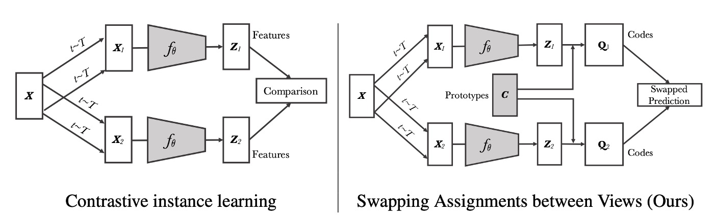
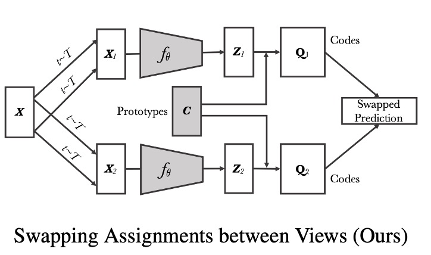
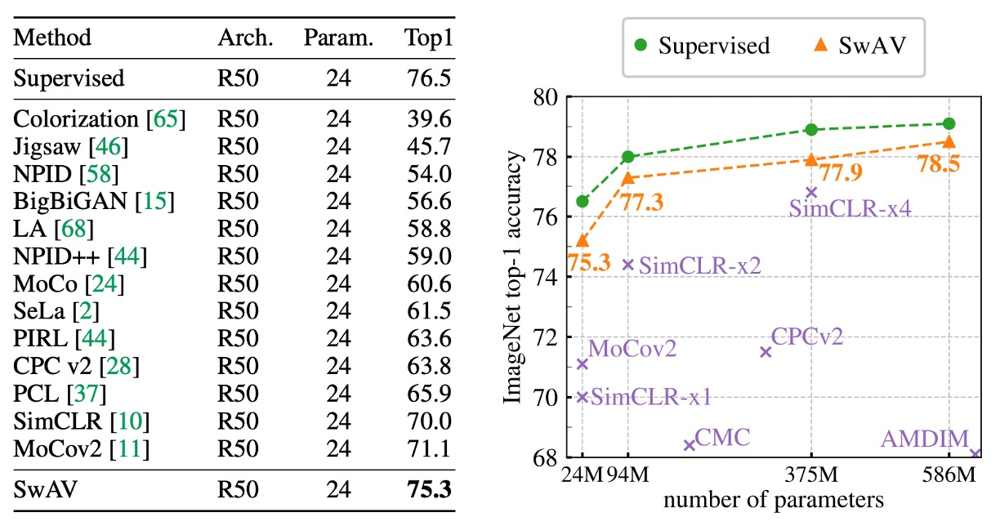

## 交換聚類預測

[**Unsupervised Learning of Visual Features by Contrasting Cluster Assignments**](https://arxiv.org/abs/2006.09882)

---

看 MoCo 和 SimCLP 兩個系列吵來吵去也好一陣子了。

之前都是抓到正負樣本來兩兩比對，這次來看點不一樣的思路：試試看聚類如何？

## 定義問題

對比學習的架構大致上已經確立，主要的配方大概有幾種：

1. **使用對比損失**：InfoNCE（或稱 NT-Xent）是其中一個常見的損失函數。
2. **將影像進行裁切變換**：把同一張影像的特徵拉近，不同影像的特徵推遠。
3. **大量的負樣本**：數量愈大，學習效果愈好。

當然，細節上還有很多不同的方式，例如使用動量編碼器或是記憶庫（memory bank）等等。

這篇論文的作者認為：「大量的計算資源仍然是個不可忽視的問題！」

如果能把問題換一下，不要執著在對比損失上，而是轉成一個「預測」問題。

我們讓模型去「預測」另一個視圖的聚類分配，而不是直接比較特徵。這樣的好處是，我們不需要計算所有的成對比較，而是透過聚類分配的方式，來達到相同的效果。

:::tip
這個「預測」的想法，也體現在同時期的另外一篇論文 BYOL 上，但預測的對象不同，BYOL 是預測另一個視圖的特徵，而 SwAV 是預測另一個視圖的聚類分配。

有興趣的讀者可以參考我們之前的文章：[**[20.06] BYOL: 不需要負樣本**](../2006-byol/index.md)
:::

## 解決問題

### 模型架構

<figure style={{"width": "90%"}}>

</figure>

看完這張圖，就看完這篇論文了。

首先，左半部是目前被廣泛接受的對比學習架構：

圖中可以看到，有一張影像 $X$ 經過不同的變換（transformations $t \sim T$）後，分別產生兩個增強視角（例如 $X_1, X_2$）。

這兩個增強視角各自經過卷積網路（或任何特徵提取網路）$f_\theta$ 後，輸出特徵向量（$Z_1, Z_2$）。

在對比式實例學習中，方法會「直接比較這兩個特徵向量」，例如計算它們的相似度（類似 SimCLR、MoCo 等方法）。模型希望讓來自同一影像的特徵向量在特徵空間中更接近，來自不同影像的特徵向量則要遠離。

---

<figure style={{"width": "85%"}}>

</figure>

右半部就是這篇論文提出來的方法，我們放大一點看：

在 SwAV 中，作者先把每個特徵（例如 $Z_1, Z_2$）分配到一組可訓練的「原型向量（以下全部簡稱 prototypes）」上，得到對應的「代碼（codes）」$Q_1, Q_2$。

圖中以「Prototypes C」與「Codes」來表示這個步驟。

接著，SwAV 的核心是「交換預測（Swapped Prediction）」，也就是：

1. 用視角 1 的特徵所對應的代碼 $Q_1$，去指導視角 2 的特徵應該學到什麼。
2. 用視角 2 的特徵所對應的代碼 $Q_2$，去指導視角 1 的特徵應該學到什麼。

如此一來，SwAV 並沒有直接比較 $Z_1$ 與 $Z_2$，而是比較它們對「prototypes」的分配結果，並要求來自同一影像的不同視角能夠有一致的分配。

由於 prototypes 是一組可以學習的向量，這裡可以視為是一種「聚類中心」，用來將特徵向量對應成「代碼（code）」的形式，形成一種聚類效果。在訓練過程中模型也會同時學習這些 prototypes，使得 prototypes 對應到更能區分不同影像的空間位置。

### Online clustering

SwAV 的一個重要特點是「在線聚類（Online Clustering）」。

我們先來看一下作者是如何在線計算每張影像的「code」，並且更新 prototypes：

先對每張影像 $x_n$，從一系列變換集合 $T$（例如隨機裁切、水平翻轉、顏色抖動等）中，隨機取樣一個變換 $t$，生成增強後的影像 $x_{nt}$。接著使用卷積神經網路取得特徵向量，再將特徵向量投影到單位球面上，得到 $z_{nt}$，也就是將輸出的向量長度正規化成 1。

到這一步，和之前的對比學習論文差異不大。

最後是把 $z_{nt}$ 映射到 $K$ 個可訓練的「prototypes」$\{ c_1, \dots, c_K \}$ 上，得到一個「代碼」$q_{nt}$。

:::tip
看到這一段，豁然開朗！這不就是我們在往後幾年間常看到的 Codebook 的概念嗎！
:::

得到每張圖片專屬的聚類代碼後，接下來就是要進行交換預測：

有兩個增強視角 $(t, s)$ 對應到同一張影像。令 $(z_t, q_t)$ 代表視角 $t$ 的特徵與代碼，$(z_s, q_s)$ 代表視角 $s$ 的特徵與代碼。

- 作者在這裡想用 $z_t$ 來「預測」$q_s$，同時用 $z_s$ 來「預測」$q_t$。
- 這跟對比學習直接比對特徵向量不同，這裡是比對「代碼」。

訓練時採用交叉熵損失（Cross Entropy Loss）來計算，並且在整個資料集上進行「交換預測」的問題。

### 等分配約束

為了實現在線學習，我們在訓練時僅使用「當前批次」內的特徵來計算代碼，而非整個資料集。這樣一來，模型能夠通過不斷接收不同批次的數據來更新 prototypes，使得這些 prototypes 逐漸適應多樣化的特徵分布。

然而，如果對 prototypes 沒有任何限制，很容易導致所有特徵都映射到同一個向量上，進而造成模型崩潰（collapse）。為了避免這種情況，作者引入了「等分配約束」，要求在每個批次內，各個 prototypes 的分配必須盡可能均勻，從而確保每個 prototypes 都能獲得相近數量的樣本。

假設當前批次包含 $B$ 個特徵向量，記為

$$
Z = [z_1, \dots, z_B],
$$

而 $K$ 個 prototypes 記為

$$
C = [c_1, \dots, c_K].
$$

我們希望通過優化一個分配矩陣 $Q$ 來實現特徵與 prototypes 之間的最佳匹配。目標函式

$$
\mathrm{Tr}(Q^\top C^\top Z)
$$

表示所有特徵與 prototypes 之間相似度的總和，而熵正則項 $\epsilon\,H(Q)$（其中 $H(Q) = -\sum_{ij} Q_{ij} \log Q_{ij}$）則用於避免分配過於集中。這樣的設計鼓勵模型在保持辨識能力的同時，避免所有特徵都聚集到少數幾個 prototypes 上。

在實際優化中，我們會將 $Q$ 限制在一個特定的集合 $\mathcal{Q}$ 中，其定義如下：

$$
\mathcal{Q} = \Bigl\{ Q \in \mathbb{R}_{+}^{K \times B} \;\Big|\;
Q\,\mathbf{1}_{B} = \tfrac{1}{K}\,\mathbf{1}_{K}, \quad
Q^\top \mathbf{1}_{K} = \tfrac{1}{B}\,\mathbf{1}_{B} \Bigr\},
$$

其中 $\mathbf{1}_K$ 與 $\mathbf{1}_B$ 分別表示 $K$ 維與 $B$ 維的全 1 向量。在運籌學中，這樣的集合被稱為「運輸多面體（transportation polytope）」，其意涵是要求每一行（代表每個樣本）和每一列（代表每個 prototypes）的和均為固定常數，從而確保每個 prototypes 平均分配到大約 $\frac{B}{K}$ 個樣本。

熵正則項中的平滑參數 $\epsilon$ 起著關鍵作用：若 $\epsilon$ 過大，分配結果會過於均勻，失去區分能力；若 $\epsilon$ 過小，則可能導致分配過於集中，進而引起模型潰散。實驗結果表明，使用較小的 $\epsilon$ 可達到較佳的平衡。

在求解過程中，我們首先獲得連續解 $Q^*$。為一次求解同時滿足運輸多面體的限制與指數映射形式，作者採用了 Sinkhorn-Knopp 演算法。該算法通過反覆進行行列正規化，計算出對應的對角矩陣 $\mathrm{Diag}(u)$ 與 $\mathrm{Diag}(v)$，從而保證最終得到的 $Q^*$ 同時滿足行和與列和的條件，其形式為：

$$
Q^* = \mathrm{Diag}(u)\,\exp \Bigl(\tfrac{C^\top Z}{\epsilon}\Bigr)\,\mathrm{Diag}(v).
$$

實驗中發現，通常只需進行約 3 次迭代即可達到理想效果，而該計算對 GPU 的負擔也非常輕微。

另外，在小批次情況下，當批次中的特徵數 $B$ 遠小於 prototypes 數量 $K$ 時，單一批次內可能無法保證每個 prototypes 都獲得足夠的樣本。為了解決這一問題，作者會保留前幾個批次的特徵，累積成一個較大的特徵集合，然後共同進行分配計算。但在反向傳播時，僅針對當前批次的樣本進行更新。

例如，實際操作中會在快取中保留約 $3K$ 筆特徵（例如當 $K=3000$ 時，保留 9000 筆特徵），大約相當於 15 個批次（假設每個批次大小為 256）。與此相比，某些對比學習方法（如 MoCo）通常需要保留數萬筆特徵或樣本，這使得 SwAV 的存儲需求更為經濟高效。

:::tip
這就像是我們要把 100 顆球扔進 10 個盒子內。為了避免全部的球都塞進同一個盒子，我們需要一個機制來保證每個盒子都能夠均勻地分配到球。

上面這個算法就是在解決這個問題，讓每個「prototype」向量都能「盡可能地」均勻分配到特徵向量。
:::

### 多重裁切

之前的研究大多採用隨機裁切（random crops）對於捕捉影像中各部分（如場景或物體）的關係。透過不同區域的裁切，模型可以學習到局部特徵以及全局結構的聯繫。

理論上來說，愈多的視角可以得到更穩健的特徵表示，但若增加裁切（或視角）的數量，計算與記憶體的需求會呈二次上升，因為每增加一個裁切，就需要額外計算該裁切的特徵和後續的代碼。

為了在不顯著增加計算量的情況下，提供更多視角，作者提出了一個多重裁切的策略：

1. **兩個標準解析度裁切**：這兩個裁切保留影像完整的細節，並用於後續的代碼計算。
2. **額外 $V$ 個低解析度裁切**：這些低解析度裁切只覆蓋影像的部分區域，但由於尺寸較小，計算成本也隨之降低。

使用低解析度的裁切可以大幅減少額外的計算負擔，因為處理低解析度影像所需的運算資源遠低於高解析度影像。這意味著我們能夠從同一張影像中獲得更多視角，而不會對整體計算時間和記憶體產生過大影響。

原本的損失函數式用於兩個視角之間的交換預測損失。在多重裁切策略下，損失函式被泛化為：

$$
L(z_{t_1}, z_{t_2}, \dots, z_{t_{V+2}}) = \sum_{i \in \{1,2\}} \sum_{\substack{v=1 \\ v\neq i}}^{V+2} \ell(z_{t_v}, q_{t_i})
$$

這裡的 $z_{t_1}$ 與 $z_{t_2}$ 代表兩個標準解析度裁切的特徵。其餘 $z_{t_v}$（$v=3,\dots,V+2$）代表低解析度裁切的特徵。

作者在這裡僅使用高解析度裁切來計算「代碼」（codes），然後利用這些代碼去比較其他所有裁切（包括低解析度）的特徵。

:::tip
**為何僅對高解析度裁切計算代碼？**

計算所有裁切的代碼會顯著增加計算成本，且低解析度裁切僅包含局部資訊，會降低代碼分配的品質。實踐中發現，只用全解析度裁切的代碼可以保持較好的轉移學習效果。
:::

## 討論

作者利用 SwAV 學到的特徵，並在多個資料集上進行轉移學習，來驗證這些特徵的通用性與實用性。他們引入了 SimCLR 中的幾項改進技術，包括：

- **LARS（Layer-wise Adaptive Rate Scaling）**：有助於在大批次訓練時穩定學習率。
- **Cosine Learning Rate**：利用餘弦退火的策略來調整學習率，使得訓練過程更加平滑。
- **MLP Projection Head**：透過額外的全連接層（MLP）對特徵進行投影，進一步提升特徵表現。

### 實驗結果

我們這裡主要看一下在 ImageNet 上評估無監督特徵的實驗結果。

方法是從 ResNet-50 網路（經 SwAV 預訓練得到）抽取特徵，然後保持固定，不進行微調，再在這些「凍結」的特徵上訓練一個線性分類器。

結果如下表所示：

<figure style={{"width": "90%"}}>

</figure>

SwAV 的線性分類準確度比當時最先進的方法高出 4.2% Top-1，並且僅比完全監督訓練的模型低 1.2%。此實驗中，SwAV 使用大批次（4096）並訓練了 800 epochs。

上圖右側展示了不同寬度的 ResNet-50 模型在無監督特徵學習上的性能。

結果顯示，隨著模型寬度的增加，SwAV 的性能也隨之提升。在較大的模型上，SwAV 與完全監督訓練的模型之間的差距僅有 0.6%。這些結果不僅驗證了 SwAV 的有效性，也展示了無監督學習在大規模影像分類與下游任務中的潛力。

### 消融實驗：多重裁切

<figure style={{"width": "90%"}}>

</figure>

上圖展示了多重裁切策略的效果，實驗基於 ImageNet 資料集，並使用 ResNet-50 作為基礎網路。

左圖比較了基於聚類（clustering-based）的方法與對比式實例學習（contrastive instance methods）的方法。

實驗結果顯示：

- **無多重裁切（multi-crop）情況下**：SwAV 和 DeepCluster-v2 分別比 SimCLR 高出約 2% 的 Top-1 準確度。
- **有多重裁切的情況下**：兩者比 SimCLR 提升更明顯，達到了 3.5% 的增幅。

這表明，採用聚類策略（尤其是經過改進的版本）在學習視覺特徵方面具有較大的潛力，相較於僅依賴實例間對比的方式，其效果更佳。

從結果來看，SwAV 與 DeepCluster-v2 的表現非常接近，但關鍵在於訓練模式的不同：

- DeepCluster-v2 需要多次遍歷整個數據集來更新聚類中心與分配結果，因此不適合在線訓練。在極大規模的數據集上，通常只能進行單次遍歷，而 DeepCluster-v2 就無法在這種情況下正常運作。
- SwAV 則採用了在批次層級內直接交換分配的策略，這意味著它能夠在線更新，即使只進行單次數據遍歷也能達到理想效果。

從另一角度看，DeepCluster-v2 可以視為 SwAV 提出交換機制的一個特例：在 DeepCluster-v2 中，交換發生在不同訓練輪次之間，即用上一個 epoch 的分配結果來預測當前 epoch 的某個增強視角；而 SwAV 則是在同一個批次內直接進行交換，這更適合在線訓練環境。

## 結論

SwAV 透過一個可學習的聚類中心，不再直接對比影像特徵，而是先將特徵映射到這個聚類中心所代表的特徵上，再在不同視角間進行資訊交換。

這個過程就像是一種中介語言，幫助模型在無監督學習中保持一致性，捕捉影像內部的結構和關係。最終，這種設計不僅使得模型在特徵學習上達到與監督學習相近甚至更優的效果，同時也展現了這種設計方式在無監督學習領域上的潛力。
