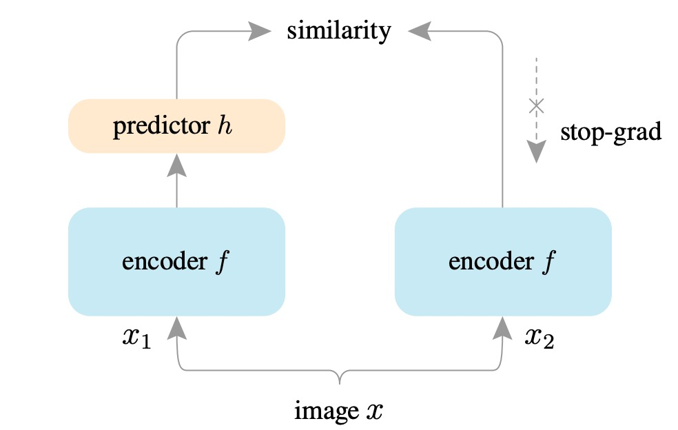
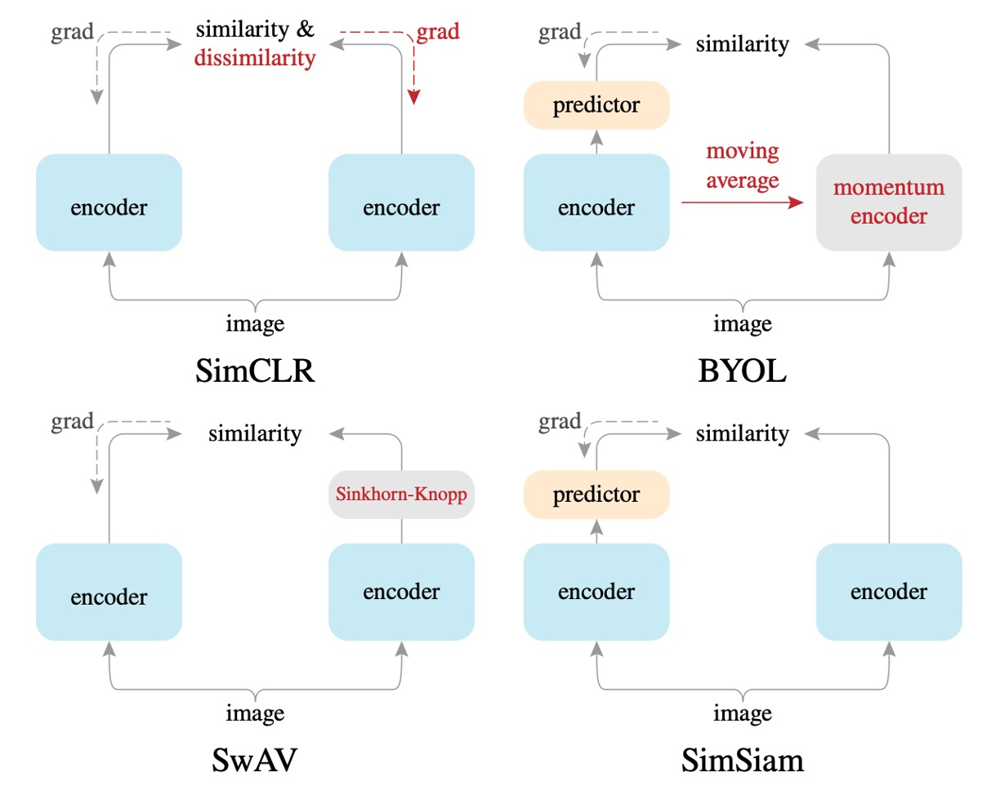
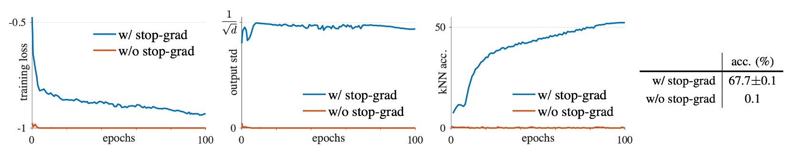
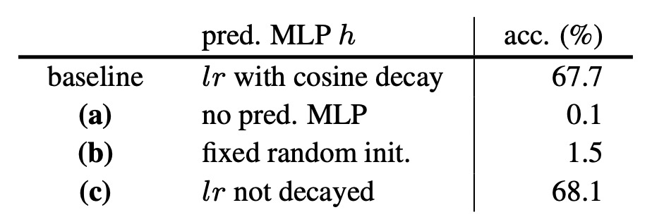
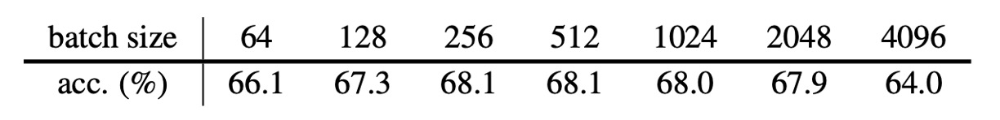
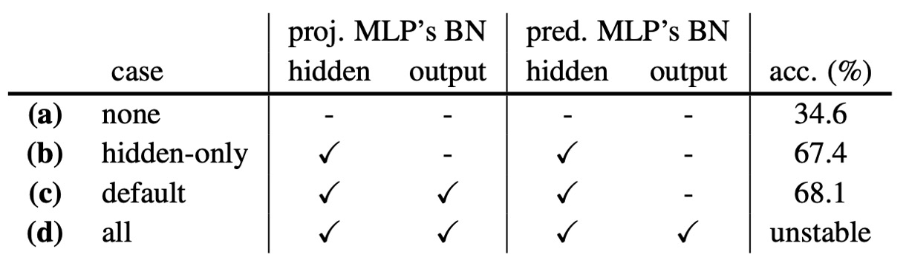

## You Can Not Pass!

[**Exploring Simple Siamese Representation Learning**](https://arxiv.org/abs/2011.10566)

---

雖然我們總說是對比學習，但實際上這個領域應該要叫做表徵學習（Representation Learning），而「對比式」的學習方式只是其中一種較為廣泛使用的方法。

除了「對比式」的學習方式，還有像是「自己預測自己」或是「聚類中心」等，不同的學習方式都不斷地刷新表徵學習的性能。但這個領域似乎還缺少了點共識，到底影響表徵學習的關鍵因素是什麼？

這篇論文內容非常豐富，我們仔細來看一下。

## 定義問題

近年來的一些方法都是採用孿生（Siamese）網路的架構來解決表徵學習的問題。

但是孿生網路非常容易崩潰，最後輸出全部收斂為常數。

為了解決崩潰的問題，過去的研究的解題方式分為幾種：

- **對比學習（Contrastive Learning）**：透過負樣本避免崩潰。
- **聚類（Clustering）**：透過聚類方式間接引入負樣本。
- **動量編碼器（Momentum Encoder）**：使用動量更新方式保持分支差異，避免崩潰。

所以，有沒有可能不使用上述任何策略（負樣本、聚類、動量編碼器），仍然能有效避免崩潰？

:::tip
本篇論文大量比較過去相關研究成果，建議讀者有空也可以去看看：

- [**[20.02] SimCLR v1: 一力降十會**](../2002-simclr-v1/index.md)
- [**[20.03] MoCo v2: 扳回一城**](../2003-moco-v2/index.md)
- [**[20.06] BYOL: 不需要負樣本**](../2006-byol/index.md)
- [**[20.06] SwAV: 交換聚類預測**](../2006-swav/index.md)
  :::

## 解決問題

<figure style={{"width": "90%"}}>

</figure>

本文提出的方法命名為 **SimSiam**，來自簡單孿生網路 Simple Siamese 的簡寫。

其目標是透過最簡單的孿生網路架構進行無監督的表徵學習：

首先，對一張輸入影像 $ x $ 隨機進行兩種不同的資料增強，得到兩個不同的視圖：$ x_1, x_2 $。

將這兩個視圖分別輸入到共享權重的編碼器 $f$ 中，這個編碼器 $f$ 包含兩個子網路：

1. **主幹網路 (backbone)**：例如 ResNet-50。
2. **投影網路 (projection MLP)**：多層感知機，將 backbone 的輸出進一步映射到潛在空間。

接著，其中一個視圖的輸出再經由另一個**預測網路 (prediction MLP)** $h$，使兩個視圖互相預測彼此。

評估方式採用負的餘弦相似度：

- 令 $ p_1 = h(f(x_1)) $，即經過預測網路 $h$ 後的輸出向量
- 令 $ z_2 = f(x_2) $，即經過編碼器 $f$ 後的另一視圖的輸出向量。

損失函數 $D$ 定義為：

$$
D(p_1, z_2) = -\frac{p_1}{\|p_1\|_2} \cdot \frac{z_2}{\|z_2\|_2}
$$

- $\|\cdot\|_2$ 代表的是向量的 $L_2$ 範數（即歐式長度）。

餘弦相似度越大代表兩個向量越相似，因此作者在這裡最小化負餘弦相似度（等同於最大化餘弦相似度）。該式與歸一化的向量之間的均方誤差（MSE）是等價的（僅差一個尺度係數）。

為使兩個視圖能互相對稱地預測，最終損失函數 $ L $ 定義為兩個方向的餘弦相似度的平均：

$$
L = \frac{1}{2} D(p_1, z_2) + \frac{1}{2} D(p_2, z_1)
$$

這個損失函數的理論最小值為 -1，意思是兩個向量完全一致。

到這裡，跟之前的研究差異不大，接著才是本篇論文的核心概念。

### 停止梯度

為了避免模型訓練過程中崩潰，作者提出關鍵的技巧是：

- **停止梯度操作！**

在實作中，式子會改寫為：

$$
D(p_1, \text{stopgrad}(z_2))
$$

$\text{stopgrad}(z_2)$ 意味著在這個式子裡，向量 $ z_2 $ 被視作常數，不會回傳梯度給編碼器 $ f $。

另一方向也用相同的方式處理，最終，損失函數寫為：

$$
L = \frac{1}{2} D(p_1, \text{stopgrad}(z_2)) + \frac{1}{2} D(p_2, \text{stopgrad}(z_1))
$$

透過這種方式，每個分支的編碼器都只會收到來自預測向量（如 $p_1$ 或 $p_2$）的梯度，而不會同時受到自己向量的影響，從而避免模型崩潰的問題。

詳細的實作方式在論文中作者有提供參考：

<figure style={{"width": "70%"}}>

</figure>

## 討論

為什麼？為什麼這麼簡單的方式就可以讓模型收斂？

我們先簡單看一下結果，後續作者有提供大篇幅的推導論證。

### 和其他方法的比較

<figure style={{"width": "90%"}}>

</figure>

作者將 SimSiam 與其他主流無監督表徵學習方法（SimCLR、MoCo v2、SwAV、BYOL）進行比較。比較的條件包括：

- 使用標準的 ResNet-50 架構。
- 預訓練皆在 ImageNet 上進行，影像大小為 $224\times224$，每個方法用兩個不同的視圖。
- 使用線性分類作為評估表徵學習品質的標準。

作者特別強調，為了公平比較：

- 所有結果均為作者**自行重現**的結果。
- SimCLR、SwAV、MoCo v2 經過作者適度改善後（例如增加 projection MLP 層數、採用對稱損失函數），結果比原始論文更好，這些改善方法標示為「+」。

實驗結果顯示，儘管 SimSiam 沒有使用負樣本（negative samples）或 momentum encoder，整體表現非常具有競爭力。特別是在較短的訓練時間（例如 100 epoch）中，**SimSiam 是所有方法中表現最好的**（準確率達到 67.7%），超越 SimCLR、MoCo v2、SwAV 等其他方法。當訓練 epoch 增加（如 200、400 epochs），SimSiam 的效能提升幅度較小，但仍維持極具競爭力的水準。

SimSiam 雖然極為簡單，但在中短期訓練效率上非常優異。

### 探討基礎架構設計

<figure style={{"width": "70%"}}>

</figure>

為了更詳細的比較各種架構，作者提供了多種模型的架構展示圖：

- **與 SimCLR 方法比較**

  SimSiam 在所有實驗情境下，效果皆明顯優於 SimCLR。

  在本篇論文中，**SimSiam 可被視為「無負樣本的 SimCLR」**，此結果也驗證了 SimSiam 的有效性，即使不使用對比學習（負樣本）也能有效避免模型崩潰並取得更好的效能。

  因此，負樣本並非表徵學習取得良好效果的必要設計。

- **與 BYOL 方法比較**

  BYOL 使用動量編碼器（承襲自 MoCo 系列），而 SimSiam 則不使用。

  實驗中 BYOL 在長期訓練（如 200 epochs 以上）表現稍優於 SimSiam，但 SimSiam 已展現出沒有 momentum encoder 仍能達到相近的效能，尤其在較短 epoch 時。

  在本篇論文中，**SimSiam 可以看作是「沒有動量編碼器的 BYOL」**，表示動量編碼器對於防止模型崩潰並非必要。

  因此，動量編碼器雖能提升效能，但不是避免模型崩潰的的必要設計。

- **與 SwAV 方法比較**

  SwAV 本質上使用了線上聚類（online clustering）與 Sinkhorn-Knopp (SK) 轉換。

  在本篇論文中，**SimSiam 可視為「沒有 online clustering 的 SwAV」**，雖然 SwAV 加入這些額外元件，其效果在較長期的訓練 (200 epochs) 表現較佳，但在短期訓練（100 epochs）中並沒有明顯優於 SimSiam。

  因此，SwAV 的線上聚類雖然有其效果，但並非短期有效避免崩潰必要因素。

### 消融實驗

- **Stop-gradient 的必要性**

  

  在完全相同的模型架構與超參數設定下，僅有一組使用 stop-gradient，另一組完全移除 stop-gradient。

  實驗結果顯示，在沒有 stop-gradient 的情況下，模型快速出現崩潰，訓練損失達到理論最小值 -1，輸出向量的 std 幾乎歸零，代表模型坍縮為常數向量。

  加入 stop-gradient 後，特徵分佈正常且標準差接近 $\sqrt{\frac{1}{d}}$，表示向量均勻分佈於單位超球面上，且能有效避免崩潰。

  因此，單純的網路架構設計（predictor, BN, $L_2$ 正規化）並不足以避免崩潰，反之 stop-gradient 是必須的關鍵設計。

- **Predictor ($h$) 的作用分析**

   

   <figure style={{"width": "70%"}}>
   
   </figure>
   

  作者進一步分析 predictor 網路 $h$ 在模型中扮演的角色。

  實驗顯示，當移除 predictor $h$（即設 $h$ 為恆等映射）時，模型立刻崩潰，因為對稱損失函數搭配恆等映射時，stop-gradient 會失去效果。

  如果 Predictor $h$ 使用隨機初始化後固定不更新，模型雖然不會崩潰但不收斂，損失很高。表示 predictor $h$ 必須配合模型的特徵學習而更新。

  因此，Predictor 網路 $h$ 是 SimSiam 中重要元件，必須隨著編碼器一起訓練。

- **Batch Size 的影響分析**

  

  作者探討不同 batch size 下的模型表現：範圍從 64 到 4096，採用線性學習率調整。所有實驗統一使用 SGD（不使用 LARS 優化器）。

  實驗結果顯示 SimSiam 對 batch size 並不敏感，與 SimCLR 或 SwAV 需要大 batch 的要求不同。

- **Batch Normalization 的影響分析**

    

   <figure style={{"width": "80%"}}>
   
   </figure>
   

  作者測試 BN 在模型中的影響。

  實驗結果為：

  - (a) 完全移除 MLP 中的 BN：不崩潰，但效果很差 (34.6%)，優化困難。
  - (b) 僅加 BN 到隱藏層：表現大幅提升至 67.4%。
  - (c) 再加 BN 到 projection MLP 輸出層：進一步提升至 68.1%（最佳設定）。
  - (d) BN 加在 prediction MLP 的輸出層：訓練震盪、不穩定。

  因此，BN 有助於模型訓練的穩定性與收斂，但與避免 collapse 無直接關係。

- **相似度函數的替換分析**

  作者以 cross-entropy similarity 替換 cosine similarity，檢驗模型穩定性。

  實驗結果：

  - Cosine similarity：68.1%
  - Cross-entropy similarity：63.2%
  - 兩者皆能避免 collapse，但 cosine similarity 表現較佳。

  結論是特定的相似度函數和模型是否崩潰無直接關聯，模型設計本身更重要。

- **損失函數對稱性分析**

  作者探討損失函數是否必須對稱。

  實驗結果：

  - 對稱版本 (sym)：68.1%
  - 非對稱版本 (asym)：64.8%
  - 非對稱版本增倍取樣 (asym 2×)：67.3%

  結論是對稱損失函數對於模型效能有正面影響，但並非避免模型崩潰的必要條件。

## 最大期望假說

:::tip
數學警告！以下內容涉及最佳化與數學推導。
:::

作者透過實驗發現，SimSiam 的核心設計「stop-gradient」可以有效避免模型崩潰，並帶來極佳的表徵學習效果。但這個簡單的操作，為何能如此有效？背後究竟隱藏了什麼原理？

為了解釋其中的機制，作者提出了一個關鍵的假說：

> **SimSiam 實際上隱含地解決了一個類似「期望最大化（Expectation-Maximization, EM）」的最佳化問題。**

### 數學表示

作者認為，SimSiam 在數學上等價於求解以下的優化問題，定義損失函數為：

$$
L(\theta, \eta) = \mathbb{E}_{x, T}\left[\|F_{\theta}(T(x)) - \eta_x\|^2_2\right]
$$

其中：

- $F_{\theta}$：是由參數 $\theta$ 決定的編碼器網路。
- $T(x)$：表示影像 $x$ 經過隨機資料增強後的結果。
- $\eta$：是一組額外引入的優化變數，每個影像 $x$ 都有對應的表示向量 $\eta_x$。
- $\eta_x$：可以直觀地理解為影像 $x$ 的「特徵表示」，但並非直接由神經網路輸出，而是透過優化求得的變數。

因此，SimSiam 隱式地解決的是以下最佳化問題：

$$
\min_{\theta,\eta} L(\theta,\eta)
$$

這個最佳化問題的形式與經典的「K-means 聚類」有相似之處：

- $\theta$：相當於聚類中心，透過學習影像的共同特徵。
- $\eta_x$：相當於聚類中每個樣本的指派結果（cluster assignment）。

這種問題可透過「交替優化」的方式求解：

1. **固定 $\eta$，優化 $\theta$**：

$$
\theta^t \leftarrow \arg\min_{\theta}L(\theta,\eta^{t-1})
$$

在這一步驟中，因為 $\eta^{t-1}$ 是固定的常數，因此梯度不會回傳到 $\eta^{t-1}$，自然就引出了 stop-gradient 操作。

---

2. **固定 $\theta$，優化 $\eta$**：

$$
\eta^t \leftarrow \arg\min_{\eta}L(\theta^t,\eta)
$$

這一步驟對每個影像 $x$ 是獨立的，最優解就是令每個影像的表示 $\eta_x$ 等於該影像經過所有影像增強後的平均特徵：

$$
\eta_x^t \leftarrow \mathbb{E}_T\left[F_{\theta^t}(T(x))\right]
$$

### SimSiam 的 EM 近似

SimSiam 實際上近似地執行了上述 EM 算法的交替優化，只不過做了一個簡單但重要的近似：

- 將本應取平均的期望，近似為只使用單一個影像增強 $T'$，即：

$$
\eta_x^t \leftarrow F_{\theta^t}(T'(x))
$$

- 將這個近似後的表示 $\eta_x^t$ 帶回到原本的 $\theta$ 最佳化問題，便得到了 SimSiam 實際使用的損失函數：

$$
\theta^{t+1}\leftarrow\arg\min_{\theta}\mathbb{E}_{x,T}\left[\|F_\theta(T(x))-F_{\theta^t}(T'(x))\|^2_2\right]
$$

這個形式正好呈現了孿生網路（Siamese networks）的架構，並且自然地引入了 stop-gradient 的操作。

### Predictor 的真正角色

前述的 EM 假說並未解釋 predictor $h$ 存在的必要性，因此作者進一步推測：

- Predictor 網路 $h$ 的功能其實是近似另一個影像增強的期望值：

$$
h(z_1) \approx \mathbb{E}_T[F_\theta(T(x))]
$$

由於實務上無法真正計算出所有影像增強的期望值，於是透過訓練 predictor 網路 $h$ 來學習並逼近這個期望。因此，predictor 本質上是用來補足期望計算不足的近似工具。

### 對稱損失函數的效果

作者也指出，上述 EM 假說並未必須使用對稱損失函數（symmetrized loss）。對稱化的效果其實就像是在每次優化時額外多取一對影像增強 $(T_1, T_2)$，有助於更準確逼近期望值，因此可以提升模型準確度，但並非避免崩潰的必要條件。

### 假說驗證實驗

作者透過兩組概念驗證實驗，支持了上述 EM 假說：

1.  **多步交替更新 (Multi-step alternation)**

        實驗發現，增加交替優化的步數（例如 10 步、100 步）仍可得到好效果，甚至比原本 SimSiam 更佳：

        - 1-step (SimSiam): 68.1%
        - 10-step: 68.7%
        - 100-step: 68.9%
        - 1-epoch: 67.0%

        這支持了 EM 交替優化的有效性。

2.  **影像增強期望值的近似驗證**

        若透過 moving-average 的方式近似期望，即便移除 predictor 網路 $h$，仍可達到一定效果 (55.0%)。若不使用 moving-average 也移除 predictor，則完全崩潰(0.1%)。

        這證實 predictor 的存在確實是用來彌補期望計算不足的缺陷。

---

雖然作者提出了上述合理的 EM 假說，但仍未徹底解釋模型崩潰為何能被避免。作者推測可能與交替優化的初始化與路徑有關，但仍屬於直觀層面，有待未來理論研究深入探索。

## 結論

作者在本文中深入探索了「極簡設計的孿生網路（Siamese networks）」，儘管 SimSiam 架構極為簡單（不使用負樣本、不使用聚類、不使用動量編碼器），但在各項實驗中依然表現出極具競爭力的效能。

這代表近期主流的自監督方法（如 SimCLR、MoCo、SwAV、BYOL）的成功，很大程度上可能並非來自各種額外複雜設計，而是根本上來自它們「共享的孿生網路架構本身」！

極簡的孿生網路架構可能是近年表徵學習成功的真正核心原因，值得更深入的探索與研究。
