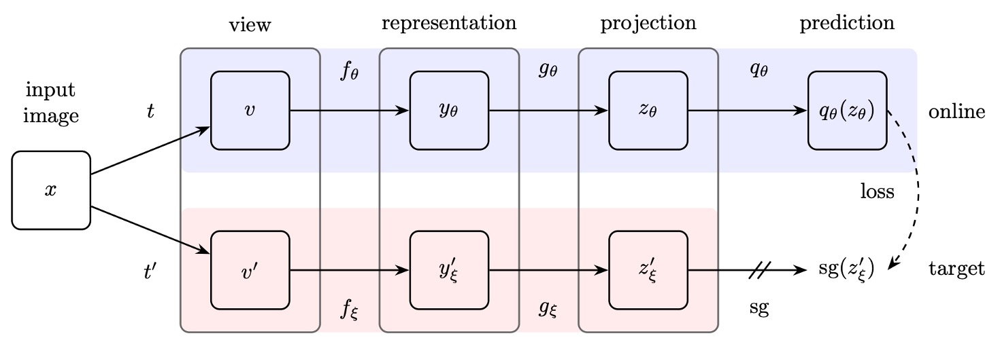

## 無標籤的自蒸餾

[**Emerging Properties in Self-Supervised Vision Transformers**](https://arxiv.org/abs/2104.14294)

---

這篇論文和 MoCo v3 同一時期發表的論文，但效果要好得多。

論文名稱的縮寫雖然是來自於 self-**di**stillation with **no** labels，簡稱 DINO。但是讀音卻是要按照恐龍的英文來讀，叫做 DI-NO，而不是 Dee-No。

:::tip
會這樣判斷是因為他們的 Github 上充斥著各種小恐龍...

- [**https://github.com/facebookresearch/dino**](https://github.com/facebookresearch/dino)
  :::

## 定義問題

還記得 BYOL 嗎？

不記得沒關係，簡單介紹一下， BYOL 的架構長這樣：

<figure style={{"width": "80%"}}>

</figure>

BYOL 首先提出了在表徵學習的訓練過程中，負樣本的存在「非必要」的經典論文。

其中的核心要素有三個：

1. **孿生網路**：線上網路與目標網路，其中目標網路透過指數移動平均（exponential moving average, EMA）進行參數更新。
2. **停止梯度**：目標網路在訓練過程中不回傳梯度。
3. **額外 MLP 層**：線上網路與目標網路的架構差異只在於線上網路多了一層額外的 MLP 預測。

:::tip
如果你對 BYOL 的細節有興趣，可以去看我們之前讀過的論文：

- [**[20.06] BYOL: 不需要負樣本**](../2006-byol/index.md)
  :::

在這篇論文中，作者受到 BYOL 的啟發，決定對這個結構稍作修改。

改動的地方也不多，就兩個：

1. **換個損失函數**：BYOL 採用 MSE，這裡改為相似性匹配損失。
2. **移除額外 MLP 層**：也就是說，這裡的孿生網路的架構是一模一樣的神經網路。

看起來好像沒什麼，但這個形式並非毫無根據，而是作者參考了這篇論文：

- [**[17.03] Mean teachers are better role models**](https://arxiv.org/abs/1703.01780)

這篇論文證明了在 Teacher-Student 的網路架構中，Teacher 網路採用移動平均的形式比起採用固定的網路參數來得效果更好。

:::info
知識蒸餾是一種訓練方式，在此過程中，我們希望讓學生網絡學習模仿教師網絡的輸出。
:::

## 解決問題

<figure style={{"width": "50%"}}>

</figure>

把剛才提到的 BYOL 架構修改後，就成了上面這個樣子。

給定一張輸入圖像 $x$，兩個網絡會分別輸出一個 $K$ 維的特徵向量，並通過 softmax 函數轉換為概率分布。對於學生網絡（上圖左），其第 $i$ 個維度的概率 $P_s(x)(i)$ 定義為：

$$
P_s(x)^{(i)} = \frac{\exp\left(\frac{g_{\theta_s}(x)^{(i)}}{\tau_s}\right)}{\sum_{k=1}^{K} \exp\left(\frac{g_{\theta_s}(x)^{(k)}}{\tau_s}\right)}
$$

其中，$\tau_s > 0$ 是溫度參數，用於控制輸出分布的銳利度；同理，教師網絡（上圖右） $g_{\theta_t}$ 的概率分布 $P_t$ 也按類似公式定義，但使用的溫度為 $\tau_t$。

在固定教師網絡 $g_{\theta_t}$ 的前提下，我們希望學生網絡的輸出分布 $P_s(x)$ 與教師網絡的輸出分布 $P_t(x)$ 盡可能一致，這通過最小化它們之間的交叉熵損失來實現，即：

$$
\min_{\theta_s} H(P_t(x), P_s(x))
$$

其中，交叉熵 $H(a, b) = -\sum a \log b$ 用來衡量兩個分布之間的差異。

由於自監督學習不使用標籤，作者在這裡也是利用對比學習的常用的方法，即同一圖像套用不同的影像增強，來生成不同的「視角」視圖。

在這個架構中，**所有的視圖都會輸入學生網絡，只有全局視圖會輸入教師網絡**，這樣設計可以鼓勵「局部到全局」的對應關係。

針對每一個全局視圖 $x \in \{x^g_1, x^g_2\}$，以及學生網絡處理的其他視圖 $x'$（要求 $x' \neq x$），計算交叉熵損失，並最小化總損失：

$$
\min_{\theta_s} \sum_{x \in \{x^g_1, x^g_2\}} \sum_{\substack{x' \in V \\ x' \neq x}} H(P_t(x), P_s(x'))
$$

此損失函數在視圖數量上是通用的，即使只有兩個視圖也可以使用；在本論文的標準設定下會使用兩個全局視圖及多個局部視圖作為基本參數化設定。

學生網絡的參數 $\theta_s$ 通過隨機梯度下降（SGD）進行最小化上述損失函數的優化。

教師網絡的參數 $\theta_t$ 通過學生網絡參數 $\theta_s$ 的 EMA 更新，具體更新規則為：

$$
\theta_t \leftarrow \lambda \theta_t + (1 - \lambda) \theta_s
$$

這種更新方法與動量編碼器（momentum encoder）類似，其中係數 $\lambda$ 在訓練過程中按照 cosine schedule 從 0.996 變化到 1。

### 避免模型崩潰

這種孿生網路的自監督方法的問題通常是：模型一言不合就崩潰。之前的研究中大多使用對比損失、聚類等方法來防止模型崩塌到常數解。不過這裡作者採用了中心化與銳化策略。

- **中心化（Centering）：**

  中心化操作是將教師網絡的輸出加上一個偏置項 $c$，公式為：

  $$
  g_t(x) \leftarrow g_t(x) + c
  $$

  這樣可以防止某個維度過度主導輸出，但同時可能促使輸出趨向均勻分布。另外，為了讓中心化操作能夠在不同批次大小下穩定工作，中心 $c$ 使用指數移動平均進行更新：

  $$
  c \leftarrow m c + (1 - m) \frac{1}{B} \sum_{i=1}^{B} g_{\theta_t}(x_i)
  $$

  其中，$m > 0$ 是速率參數，$B$ 為批次大小。這樣更新後，中心 $c$ 只依賴於批次的一階統計量。

- **銳化（Sharpening）：**

  銳化操作通過在教師 softmax 正規化中採用較低的溫度 $\tau_t$ 實現，使得教師輸出的概率分布更為銳利，這與中心化的均勻傾向相互平衡，共同避免模型崩潰。

## 討論

### 和其他方法的比較

<figure style={{"width": "60%"}}>

</figure>

根據實驗結果，作者這裡分成對「同架構」的比較和「跨架構」的比較：

1. **同一架構下的比較：**

   - **ResNet-50 架構：**
     DINO 在 ResNet-50 上的效果與現有最佳自監督方法相當，驗證了 DINO 在標準設定下能達到與現有方法媲美的表現。
   - **ViT-S 架構：**
     當採用 ViT-S（設計參照 DeiT-S）時，DINO 的表現明顯超越了 BYOL、MoCov2 和 SwAV。
     - 在線性分類任務上提升了 3.5%
     - 在 k-NN 評估上提升了 7.9%
       此外，使用簡單 k-NN 分類器得到的成績（74.5%）與線性分類器（77.0%）相差不大，這種現象僅在 ViT 架構中出現，而其他自監督方法或 ResNet-50 上均未見此特性。

2. **跨架構的比較：**

   此部分主要探討 DINO 訓練的 ViT 模型在不同規模架構下的極限表現，而非直接比較各種方法。

   從實驗結果看來，擴大 ViT 模型確實能進一步提升性能，但減少 patch 尺寸（即“/8”變體）的影響更顯著。另外減小 patch 大小雖不會增加參數量，但能大幅減少運行時間（提高 1.4 倍）及顯著提升性能，同時會帶來較高的記憶體使用量。

   基礎 ViT 模型在使用 8×8 patch 並以 DINO 訓練後，其線性分類 top-1 精度達到 80.1%，k-NN 分類精度達到 77.4%，且在參數數量上僅為先前最佳方法的十分之一。

綜上所述，DINO 不僅在標準的 ResNet-50 架構下表現出色，還在 ViT 架構中展現了顯著的性能提升，尤其是透過減小 patch 尺寸，不僅在效果上有大幅改善，同時也顯著提高了運行效率。

:::tip
我們第一次看論文原文看到這一段的時候非常困惑。

從表中數據看，im/s 的數值越大代表模型推論速度越快。例如，基於 ViT-S 的標準模型（patch size 較大）有 1007 im/s，而 ViT-S/8（即 patch size 為 8×8）的 throughput 降為 180 im/s，表示相同架構下，縮小 patch size 會增加運算負擔，導致推論速度變慢。

論文中這段描述：

> "While reducing the patch size do not add parameters, it still leads to a significant reduction of running time, and larger memory usage."

容易讓人誤解成「縮小 patch size 能夠顯著加速推論」。但實際上，縮小 patch size 雖然不增加參數數量，卻會使輸入序列變長，從而降低 im/s（即運行速度），而同時帶來較高的記憶體使用量。

這裡作者應該是想表達，在不增加模型參數的情況下，透過縮小 patch size 能夠顯著提升效能（如 top-1 精度），同時相比於一些大型模型，在整體運行效率（與前一個 SOTA 方法相比）上還是更優。

應該啦，如果我們理解有錯歡迎讀者指正。
:::

### 不同組件的重要性

<figure style={{"width": "60%"}}>

</figure>

作者做了一系列的實驗來探討不同組件的重要性：

- **無動量（Momentum）的情況（表格第 2 行）：**
  若不使用動量編碼器，整個框架將無法收斂，即模型無法學習到有用的表示。
- **防止崩潰的操作（例如 SK）：**
  為避免模型崩潰，某些先進操作（如 SK）是必要的。但實驗顯示，當加入動量後，額外使用 SK 的效果變得不明顯（表格第 3 行與第 9 行的對比），進一步突顯了動量編碼器在防止崩潰和提升性能上的關鍵作用。
- **多視圖（multi-crop）與交叉熵損失：**
  實驗（表格第 4 行與第 5 行）顯示，多視圖訓練以及 DINO 所使用的交叉熵損失對於獲得良好特徵的重要性。
- **Predictor 的影響：**
  在學生網絡中加入 predictor 對性能影響有限，而在 BYOL 中則是防止崩潰的關鍵組件。

### 模型崩潰測試

<figure style={{"width": "80%"}}>

</figure>

一般來說，常見的崩潰形式有兩種：

- 其一是模型對於不同輸入輸出均相同，變成均勻分布
- 其二是某一維度過度支配，導致輸出失衡。

中心化（Centering）的操作是在教師輸出上加上一個偏置 $c$（即 $g_t(x) \leftarrow g_t(x) + c$），可防止單一維度過於主導，但同時可能使輸出趨向均勻。此時，搭配銳化（Sharpening）的操作，通過教師 softmax 正規化時採用較低的溫度 $\tau_t$，使輸出分布更尖銳，對抗中心化帶來的均勻傾向。

從數學上來看， 將交叉熵 $H(P_t, P_s)$ 分解為教師輸出熵 $h(P_t)$ 與 KL 散度 $D_{KL}(P_t \| P_s)$：

$$
H(P_t, P_s) = h(P_t) + D_{KL}(P_t \| P_s)
$$

當 $D_{KL}$ 收斂到 0 時，意味著教師輸出不隨輸入變化（即崩潰）。

上圖的實驗表明：若僅使用其中一項操作，KL 會收斂到 0，而熵 $h(P_t)$ 則呈現不同極限（無中心化時趨向 0，無銳化時趨向 $-\log(1/K)$），這凸顯了兩者在防止不同形式崩潰中的互補性。同時使用這兩個操作可以達到平衡效果，避免模型崩潰。

## 結論

<figure style={{"width": "80%"}}>

</figure>

經過多輪實驗分析，作者發現在 ViT 的架構上採用自監督學習進行訓練，不僅能夠在下游任務中展現出卓越的性能，甚至能與專門為視覺任務設計的卷積神經網路相抗衡。

這一結果表明，自監督學習能夠有效提升 ViT 的泛化能力，使其在不同場景下都能夠取得穩定的表現。反觀傳統監督式學習訓練出的 ViT，則在下游任務中的表現普遍不佳，甚至難以達到與 CNN 相匹敵的水準。

上圖展示的是 ViT 針對圖像分割任務的可視化結果，紅點代表模型的多頭注意力 (Multi-Head Attention) 所關注的位置。可以明顯觀察到，透過自監督學習訓練的 ViT，在注意力分布上更加合理且具備更強的語義對齊能力，能夠更準確地關注圖像中的關鍵區域，進一步提升下游任務的表現。

這一發現強烈暗示，自監督式學習或許正是 ViT 架構的最佳解法。它能夠充分發揮 Transformer 的潛力，擺脫對大量標註數據的依賴，並在視覺領域開闢新的可能性。
