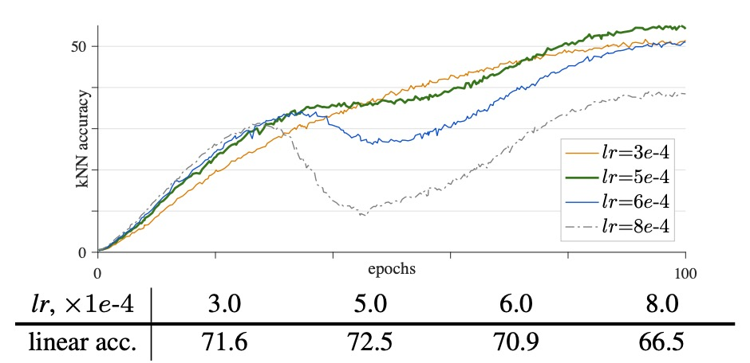
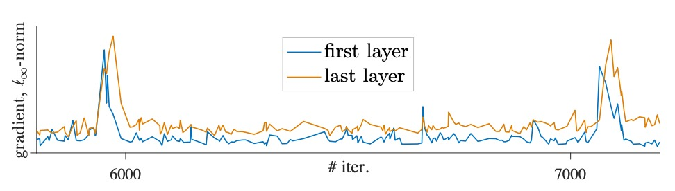
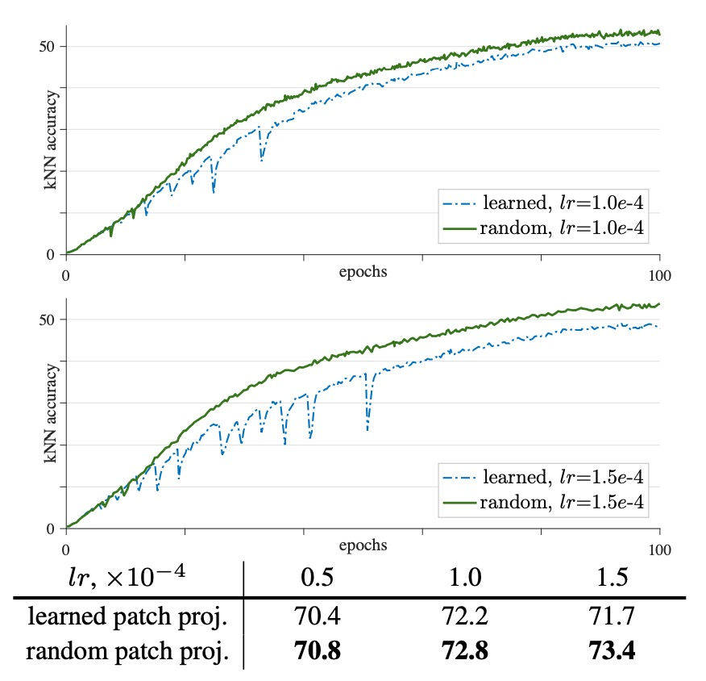
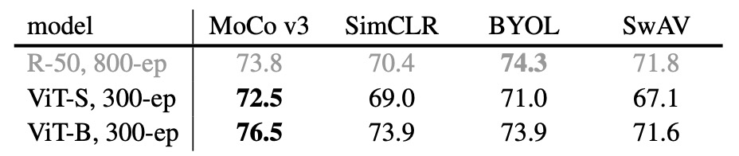

## ViT 探險隊

[**An Empirical Study of Training Self-Supervised Vision Transformers**](https://arxiv.org/abs/2104.02057)

---

表徵學習的風潮持續了五年，大抵是塵埃落定。

此時在電腦視覺領域卻又迎來了一波重磅更新：ViT 發表了。（2020 年 10 月）

MoCo 的研究團隊又按耐不住雀躍的心情，迫不及待地在這個全新的架構大肆搜索一番。

## 定義問題

ViT 架構發表後，原始論文的作者表示在此架構上，使用類似 BERT 的 MASK 機制進行預訓練的話，效果差強人意。

由於影像的特徵較為鬆散，單純引入 MASK 讓模型進行重建的效果遠遠不如預期。反而使用監督式的學習方式，使用超大規模的資料集對模型進行預訓練的話，方能超越其他的 CNN 架構，達到 SOTA 的表現。

在 ViT 論文中的這個結論，還真是引來大批研究者們爭相嘗試：

> **難道無監督學習真的行不通嗎？還是說只是你打開的方式不對？**

因此，MoCo 論文的作者們也決定加入對 ViT 架構的探索，試試看如果在這裡引入孿生網路結構，用表徵學習的方式來對模型進行預訓練，是不是有機會得到不錯的結果？

## 解決問題

這篇論文沒有引入新的方法，也沒有新的架構。

就是很單純的把 MoCo 的架構搬到 ViT 上做一輪實驗。

具體流程我們可以直接看論文內提供的演算法架構說明，其實看完這段就看完這篇論文了：

<figure style={{"width": "70%"}}>

</figure>

我們順著上圖來看：

1. 首先準備兩個編碼器：

   - 第一個編碼器的架構是：backbone + proj mlp + pred mlp
   - 第二個編碼器的架構是：backbone + proj mlp （動量更新）

2. 從數據中取出一個批次 $x$（共 $N$ 張圖片），並對每張圖片應用數據增強產生 $x_1, x_2$。
3. 用 $f_q$ 分別對 $x_1, x_2$ 得到查詢向量 $q_1, q_2$；用 $f_k$ 得到鍵向量 $k_1, k_2$。
4. 調用函數 $ctr(q, k)$ 計算對比損失：
   - 正樣本對應的索引在對角線（使用 `labels = range(N)`）；
   - 將 logits 除以 $\tau$ 後，利用交叉熵損失函數計算損失；
   - 最後損失乘以 $2\tau$ 作為輸出。
   - 最終總損失為 $ctr(q_1, k_2) + ctr(q_2, k_1)$。

這裡說的損失函數就是之前提過的 InfoNCE，其公式為

$$
L_q = -\log \frac{\exp\left(\frac{q\cdot k^+}{\tau}\right)}{\exp\left(\frac{q\cdot k^+}{\tau}\right)+\sum_{k^-}\exp\left(\frac{q\cdot k^-}{\tau}\right)}.
$$

其中：

- $q$ 為查詢向量；
- $k^+$ 為正樣本向量，即從與 $q$ 同一圖片透過另一編碼器 $f_k$ 得到的輸出；
- $\{k^-\}$ 為負樣本集合，來自同一批次中其他圖片的鍵向量；
- $\tau$ 是溫度超參數，用來調節分佈的平滑程度。

此損失目的是將 $q$ 與 $k^+$ 拉近，同時推遠 $q$ 與所有 $k^-$ 的距離。

反向傳播後，用優化器更新 $f_q$，隨後利用動量更新 $f_k$，確保鍵編碼器保持穩定。

---

看到這邊，確實沒有新東西。

所以這邊文章的重點在於實驗的部分，我們仔細來看一下。

## 討論

在這篇論文中，作者透過監控 kNN 曲線來觀察訓練過程的變化。

所謂的 kNN 曲線是用來即時監控模型學習到的特徵表示質量的一種評估工具。其操作流程如下：

1. **特徵提取：**
   在訓練過程中，模型會對輸入圖像提取特徵。這些特徵在沒有額外調整的情況下，直接反映了模型當前的表示能力。

2. **kNN 分類：**
   對於每個待評估的樣本，使用 k 最近鄰方法來進行分類。即，根據某種距離度量（如歐氏距離或餘弦相似度），從預先儲存的特徵庫中找出與該樣本最接近的 k 個鄰居，然後根據這些鄰居的標籤進行多數表決得到預測標籤。

3. **曲線生成：**
   將每次在驗證集上進行 kNN 分類得到的準確率記錄下來，隨著訓練的進行，這些準確率會形成一條曲線。這條曲線可以反映出模型在不同訓練階段的特徵表示品質。

4. **揭示訓練穩定性：**
   通過觀察 kNN 曲線，研究者可以發現即使在表面上損失函數下降和最終準確率看似合理的情況下，模型的特徵表示品質（如 kNN 分類準確率）仍可能出現「跳水」或波動，這些波動暗示了訓練過程中的不穩定性。這種不穩定性可能不會導致模型發散，但會造成最終性能的隱性退化。

總結來說，kNN 曲線是一種基於 k 近鄰分類法的評估手段，用來追蹤模型在訓練過程中學習到的特徵表示的穩定性和質量，從而揭示潛在的訓練不穩定問題。

### ViT 不穩定

理論上，用 ViT 替換 ResNet 作為 backbone 在孿生網路的自監督框架中並不困難；但實際上，ViT 的訓練面臨著明顯的不穩定性問題。這種不穩定性並非僅從最終準確率即可察覺，因為即使訓練結果看起來「表面正常」，其過程中可能隱藏著局部失敗或「部分成功」的情形。

- **批次大小的影響**

    

    <figure style={{"width": "70%"}}>
    
    </figure>
    

  ViT 模型本身計算量大，大批次訓練能夠提供更多的負樣本，有助於對比學習。然而，當批次過大時（例如 4k 或 6k），訓練曲線中會出現明顯的「波動」或「下跌」現象。

  如上圖所示：

  - 批次 1k：線性探測準確率約 71.5%，曲線平滑。
  - 批次 2k：準確率上升至約 72.6%，仍保持較平穩。
  - 批次 4k：曲線明顯出現「dips」，準確率略降到 72.2%。
  - 批次 6k：波動更加明顯，並伴隨大幅下滑，準確率降至 69.7%。

  批次較大雖然能帶來更多負樣本，理論上有利於學習，但過大的批次可能使模型在訓練過程中出現「部分重啟」的現象，即模型從當前局部最優解跳出再尋找新的解，從而引發隱藏的性能退化。這種退化可能不會立即體現為極端的發散，而是導致細微（1∼3%）的精度下降，影響實驗的可重現性與對比分析。

- **學習率的影響**

    

    <figure style={{"width": "70%"}}>
    
    </figure>
    

  為了應對大批次訓練，通常採用線性學習率調整規則，其公式為：

      $$
      \text{Effective LR} = \text{base lr} \times \frac{\text{BatchSize}}{256}.
      $$

  實驗結果顯示：

  - 當使用較小的學習率時（例如 lr = 0.5e-4），訓練雖然較穩定，但可能出現欠擬合現象，導致準確率較低（70.4%）。
  - 適中的學習率（例如 lr = 1.0e-4）能使模型達到較好的擬合效果，準確率達到 72.2%。
  - 當學習率進一步提高（例如 lr = 1.5e-4），訓練變得不穩定，曲線中出現更多的「dips」，最終的模型性能反而降低。

  作者認為學習率需要在穩定性與充分擬合之間取得平衡。過低的學習率會使模型學習不足，而過高的學習率則會加劇訓練過程中的不穩定性，使得梯度變化劇烈，從而導致模型性能波動。

- **優化器的影響**

    

    <figure style={{"width": "70%"}}>
    
    </figure>
    

  部分近期自監督方法採用了針對大批次設計的 LARS 優化器，而 LAMB 則可以看作是 AdamW 的 LARS 版本。

  因此作者測試使用 LAMB 優化器進行訓練試試看結果：

  - 在適當的學習率條件下（例如 lr = 5e-4），LAMB 的最終準確率（72.5%）略優於 AdamW。
  - 當學習率超過最優值時（例如 lr = 6e-4 或 8e-4），LAMB 的性能會迅速下降，分別降低 1.6% 和 6.0%。

  作者指出：儘管 LAMB 的梯度變化較為平滑，但這種平滑性可能會使不穩定的梯度問題逐漸累積，最終影響模型性能。LAMB 對學習率較為敏感，在不同設置下容易產生不同的效果，使得在不額外進行學習率搜索的情況下，難以對比不同架構設計。

  基於這一考慮，作者在其他實驗中選擇了相對穩定的 AdamW 優化器。

### 解決 ViT 的不穩定問題

:::tip
這感覺可以再另外發一篇論文了，不過作者大放送，一篇論文通通送給我們。
:::

作者在訓練過程中，觀察到梯度的突然變化會在訓練曲線上形成明顯的「dip」，如下圖所示：

通過比較各層梯度，發現這種梯度長釘（spike）在第一層（patch projection 層）最早出現，而在後續層則會延遲幾個迭代才出現。

此現象表明，淺層首先出現不穩定性，可能導致後續層的表現受到影響。基於這個觀察，作者假設不穩定性主要始於第一層。

為了避免這一層引發的梯度劇烈波動，提出在訓練過程中凍結 patch projection 層的策略，其實作技巧的實現方式是利用 stop-gradient 操作，使該層的權重固定不更新，改為使用固定的隨機投影來嵌入圖像 patch。

實驗結果如下圖：

<figure style={{"width": "70%"}}>

</figure>

與可學習的 patch projection 相比，使用隨機（凍結）的 patch projection 能夠使訓練曲線更平滑、穩定性更佳。

在學習率 lr=1.5e-4 的條件下，穩定性提升使最終線性探測準確率提高了 1.7%，達到 73.4%。當學習率增大時，這一穩定性改善效果更為明顯（分別提升 0.4%、0.6% 及 1.7%）。

除了固定隨機權重之外作者也嘗試在 patch projection 層上使用 BatchNorm 或 WeightNorm，發現並未改善不穩定性，結果與原設定相近。如果是對該層進行梯度裁剪（gradient clip）在閾值足夠小的情況下能起到類似凍結的效果。

從架構角度看，對於標準 ViT 的 patch projection 層的輸出維度通常是完整或過完備的，這意味著隨機投影已足夠保留原始信息，不必非得學習該層權重。固定第一層實際上縮小了解決方案的空間，這說明問題主要源於優化過程。

儘管該技巧能緩解不穩定性，但當學習率過大時，整體模型仍可能出現不穩定，因此這只是一種部分的解決方案，而非從根本上消除問題。

### 自監督學習框架比較

<figure style={{"width": "70%"}}>

</figure>

作者分別在 MoCo v3、SimCLR、BYOL 和 SwAV 四種框架上進行了測試，所有實驗均採用了相同的隨機投影技巧以確保公平性，並對學習率（lr）和權重衰減（wd）進行了參數搜索。

表格顯示 ViT-S/16 與 ViT-B/16 的表現，其中 MoCo v3 在 ViT 上獲得了最佳的準確率。此外，不同於 ResNet-50 (R50) 的情形，MoCo v3 和 SimCLR 對 ViT-B 更有利，說明在相同的自監督框架下，ViT 與卷積網絡之間的表現存在差異。

### 消融實驗

:::tip
這一段的表格數據散落在內文段落中，因此我們直接寫數據。

若想查看原始表格的讀者請自行翻閱論文。
:::

- **位置嵌入（Position Embedding）：**

  這裡比較了 sin-cos（默認）、可學習及無位置嵌入三種選項。

  結果顯示：sin-cos 取得 76.5% 線性探測準確率；可學習嵌入略低（76.1%）；完全不使用位置嵌入則下降到 74.9%。 這也表示模型就算在缺乏名去的位置訊息的情況下，還是可以學到強表徵。（否則模型應該要崩潰）

- **Class Token 的作用：**

  消融實驗中比較了使用 `[CLS]` 與不使用 `[CLS]` 的情形。

  當去掉 `[CLS]` 並且保留最後一層的 LayerNorm（LN）再進行池化時，性能大幅下降（69.7%）；而直接去除 LN 並用全局平均池化則表現接近（76.3%）。

  結果顯示 `[CLS]` 並非絕對必要，但 LN 的使用方式會對最終效果產生顯著影響。

- **MLP 頭部中的 BatchNorm（BN）：**

  ViT 模型本身不含 BN，僅在 MLP 頭中使用。

  消融結果表明，使用 BN 可達到 76.5%，而去除 BN 時需要更大的批次（2048）才能收斂，且準確率下降到 74.4%，降低約 2.1%。

- **預測頭（Prediction Head）：**

  MoCo v3 預設包含一個預測 MLP 頭，消融實驗中去除預測頭時準確率從 76.5% 降到 75.5%，表明預測頭能夠進一步提升性能，但並非必需。

- **動量編碼器（Momentum Encoder）：**

  比較了不同動量係數 $m$（分別為 0、0.9、0.99、0.999）。

  當 $m = 0.99$ 時（默認設置）達到最佳效果（76.5%）；而 $m = 0$（類似於 SimCLR）僅有 74.3%，顯示使用動量編碼器可提升約 2.2% 的準確率。

- **訓練長度的影響：**

  對比了 300 epoch 與 600 epoch 的訓練結果。

  小型 ViT-S/16 從 300 epoch 的 72.5% 提升至 600 epoch 的 73.4%；而 ViT-B/16 則僅從 76.5% 提升到 76.7%。表明較小的模型更能從延長訓練中獲得顯著收益，而較大模型的增益則趨於飽和。

### 與其他方法的比較

<figure style={{"width": "70%"}}>

</figure>

上表展示了 MoCo v3 與 iGPT、以及 masked patch prediction 方法的比較。

MoCo v3 在相同線性探測協議及訓練數據下，取得更高準確率且模型更小。對於 ViT-L，自監督預訓練（77.6%）甚至超過了監督預訓練的結果（76.53%）。

下圖展示了一個參數數量與線性探測準確率之間的 trade-off 比較圖，用來比較大規模 ResNet 模型與自監督 ViT 模型的表現：

<figure style={{"width": "70%"}}>

</figure>

橫軸通常表示模型的參數量（即模型規模），而縱軸則表示線性探測準確率。通過這樣的展示，可以直觀地看到在增加模型規模（參數量）時，模型性能如何變化。這個比較可以幫助我們理解不同架構在資源消耗（參數量）與最終性能（準確率）之間的平衡，以及自監督學習方法在不同模型規模下的效果。

從圖中可以看出，自監督 ViT 模型在某些參數量範圍內能夠達到與大 ResNet 模型相近甚至更好的表現，這突顯了 ViT 架構在自監督學習中的潛力。同時，不同方法（如 SimCLR v2、BYOL）在相同參數規模下的表現差異，也反映出各自架構和訓練方法對性能提升的影響。

## 結論

好吧，所以整篇論文看完了，明明沒有提出新的方法，到底為什麼這篇論文要叫做 MoCo v3？

其實結果已經很明顯了，因為即便使用了同樣熟悉的配方，放在 ViT 上卻展現出截然不同的優勢！反觀其他競爭的方法（SimCLR, BYOL, SwAV），當模型架構從 CNN 換成 ViT 之後，整體性能提升不明顯甚至還有所下降。

這不就再一次證明了 MoCo 架構才是最棒的嗎！

幫它升個版本號，不過分吧！
