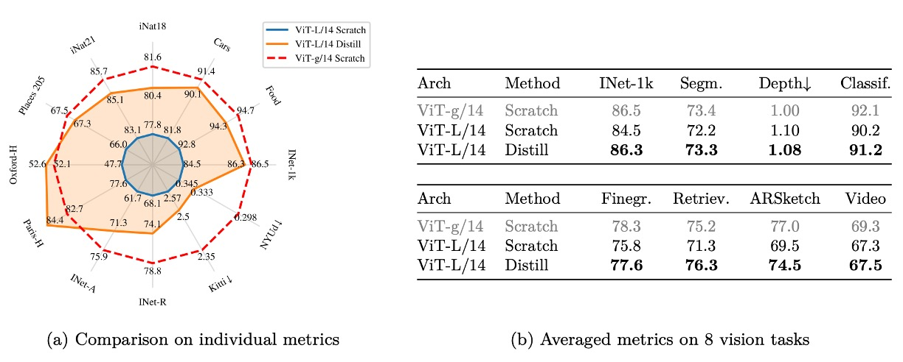
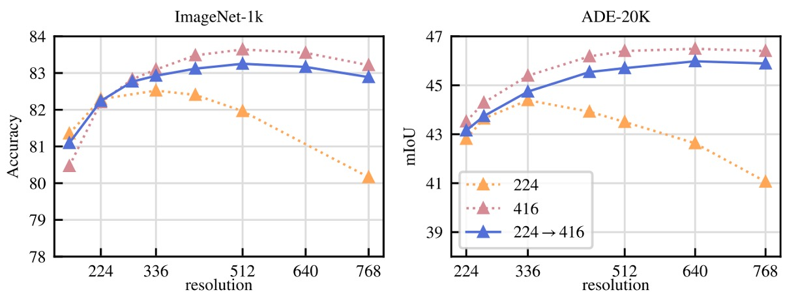
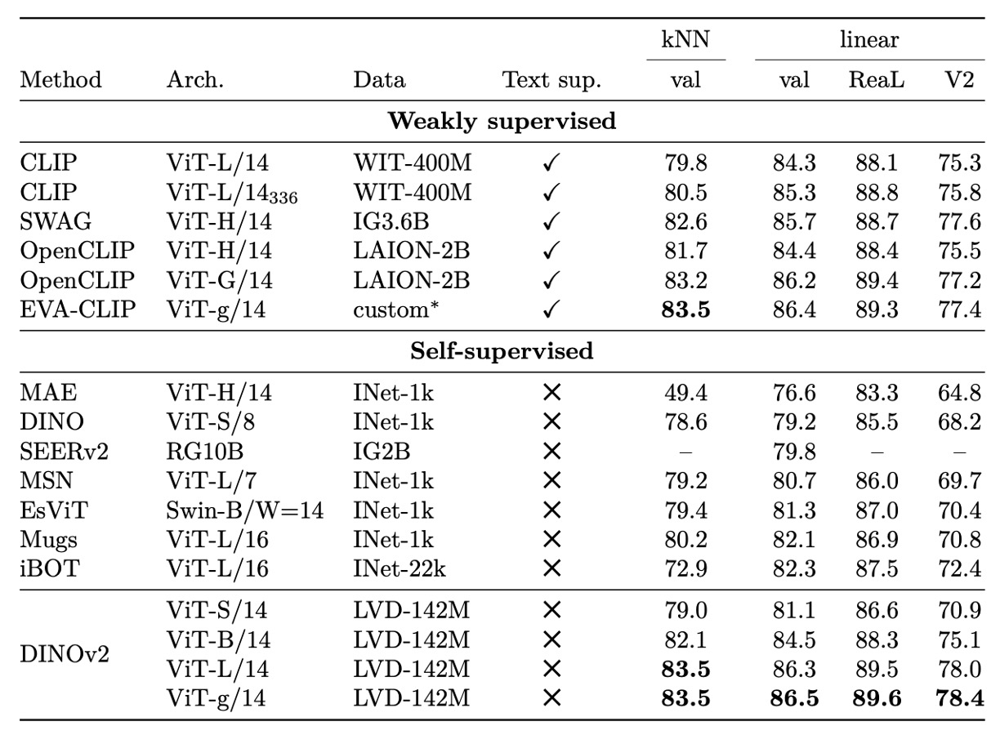

## 通用特徵鍛造法

[**DINOv2: Learning Robust Visual Features without Supervision**](https://arxiv.org/pdf/2304.07193)

---

第一代的 DINO 我們已經看完了。

時隔兩年，我們來看看 Meta AI Research 在這個架構上做了什麼改進。

:::tip
這篇論文將近 20 頁，非常適合用來打發時間。
:::

## 定義問題

近年來，視覺模型的主流發展趨勢漸趨兩極：

一方面，CLIP、ALIGN 等方法透過圖文對齊學習，將語言作為語意的監督軸線，成功訓練出具語義理解能力的基礎模型。在分類、檢索與多模態任務中，這類方法確實展現了強勁表現。

然而，另一條路線選擇不依賴語言，甚至拒絕任何外部標註。這是一種更純粹的自監督觀點，讓影像自己說話，讓模型在無聲中學會辨識、記憶、抽象與歸納。

這條路線，試圖回答一個更根本的問題：

> **在沒有語言的世界裡，影像是否仍能理解自己？**

這正是自監督學習（Self-Supervised Learning, SSL）技術的核心追求。

這些方法大致可分為兩類：

1. **影像內部的預測任務（intra-image pretext task）**，如預測遮蔽區塊、重建原始圖片、修復色彩、判斷 patch 順序等，這類方法與語言模型的「填空任務」形式相近，典型代表包括 MAE、BEiT 等。

2. **辨識式學習（discriminative self-supervision）**，強調不同影像之間的區別性訓練，如對比學習、實例分類或聚類學習，代表方法包括 SimCLR、MoCo、BYOL、DINO 等。

這些方法在 ImageNet-1k 等標準資料集上證實可學得具備泛化能力的 frozen 特徵，甚至能媲美監督式訓練效果。然而，當進一步擴大模型規模、延長訓練時間或嘗試使用未經挑選的資料集時，這些方法往往面臨效能崩壞、訓練不穩、特徵退化等挑戰。

或許，資料的品質與多樣性更是關鍵的因素？

自監督學習雖然不依賴人工標註，卻更依賴輸入資料本身的廣度與結構平衡。當資料集中存在主題偏移、長尾失衡或重複過高等現象，模型往往會傾向學習到片面且難以遷移的表徵。

儘管這類方法在學術與產業上已累積許多亮眼成果，真正要將其推向穩定可用的視覺基礎模型，仍有數個關鍵問題尚未解決：

- **在規模放大的情境下，現有自監督技術是否具備足夠的穩定性與延展性？**
- **完全不依賴語言與標註訊號，是否仍能學得可直接下游應用的泛用特徵？**
- **當面對龐大、未篩選的圖像集合，我們該如何有效自動化地進行資料篩選與分布平衡？**

這些問題至今仍未有明確解答。

DINOv2 的出發點，正是試圖在第一代基礎上，進一步調整資料策略、強化架構穩定性，並重新思考自監督學習的系統性設計。如果資料能更好、架構更穩，也許我們就能走得更遠，讓不依賴語言的模型，也能成為現代視覺系統的通用地基。

## 資料收集

若要讓模型學得穩固、可泛化的視覺特徵，資料品質是優先要考慮的因素。

而當目標是「不依賴標註、完全自監督」，那麼挑選資料的責任，就不再落在標籤上，而是落在**圖像本身的多樣性與代表性**上。

作者規劃的資料處理流程，可以大概分為三個步驟，如下圖所示：

<figure style={{"width": "90%"}}>

</figure>

### 1. 準備資料池

這裡選定的目標資料集 LVD-142M，是由兩部分資料組合而成：

- **curated 部分**：以 ImageNet-1k / 22k、Google Landmarks、以及多個細粒度資料集為基準，作為「代表性樣本」的來源；
- **uncurated 部分**：來自公開網頁爬蟲資料庫的原始圖片，經過安全性過濾（去除非法網址、NSFW、模糊人臉等），總量達到 12 億張。

這些 uncurated 圖像無標籤、無說明、無篩選，是最貼近「野生網路」的資料狀態。

:::info
這篇論文大量出現 curated 名詞，因此特別提醒一下，免得讀者閱讀困難。

- **curated data**: 指的是經過人工挑選、清洗、整理過的高品質資料；
- **uncurated data**: 則是指從網路或其他來源原始抓取下來，未經篩選或清理的資料。
  :::

### 2. 去除重複

為避免訓練資料重複造成偏差，作者引入了專門的 copy detection 流程，移除高相似度影像，不僅針對 uncurated 集合內部，連與測試資料集相似的樣本也一併剔除，以免資料洩漏。

這道步驟的實作細節來自 Pizzi 等人（2022）的演算法，確保資料集多樣且乾淨。

:::tip
Pizzi 參考文獻：[**[22.02] A self-supervised descriptor for image copy detection**](https://arxiv.org/abs/2202.10261)
:::

### 3. 自監督檢索

真正精妙的設計在這裡。

作者先利用一個先前在 ImageNet-22k 上自監督訓練過的 ViT-H/16 模型，為所有圖像計算嵌入表示，再以 cosine similarity 為距離指標，找出那些「長得像 curated 資料」的 uncurated 圖像。

這既不是人工標記，也不是靠關鍵字過濾，而是完全基於圖像特徵進行的視覺相似性檢索。

接著，作者將 uncurated 圖像做 K-means 聚類，依照不同情境（query dataset 大或小）選取每張基準圖像的前 N 個近鄰（N=4）或對應 cluster 中的 M 張影像。

這個選擇權衡了資料間重疊與檢索多樣性的平衡。

### 工程規模與效率

如此大規模的資料處理與檢索，背後也需要強大的計算資源支撐。

整個流程基於 FAISS 架構，使用 GPU 加速的倒排索引與量化編碼法，分散式運行在 20 台配備 8 張 V100 GPU 的計算節點上，僅耗費不到兩天時間，便完成了 1.42 億張高品質訓練資料的整理。

整體來看，DINOv2 的資料準備過程巧妙結合「現有高品質資料」與「視覺語意相近的網路影像」，用自監督的方式自動挑選出訓練樣本，為後續模型學習打下基礎。

## 解決方法

DINOv2 所採用的訓練策略，屬於**辨識式自監督學習（Discriminative Self-Supervised Learning）**，整體可視為 DINO 與 iBOT 搭配 SwAV 的 centering 機制所構成的混合式設計，並在此基礎上加入正則化項與高解析度訓練策略。

:::tip
等等，突然冒出這一串名詞，讓人措手不及。

如果對上述名詞不熟悉的讀者，可以參考以下幾篇論文：

- [**[20.06] SwAV: 交換聚類預測**](../2006-swav/index.md)
- [**[21.04] DINO: 無標籤的自蒸餾**](../2104-dino/index.md)
- [**[21.11] iBOT: Image BERT Pre-Training with Online Tokenizer**](https://arxiv.org/abs/2111.07832)
  :::

### 圖像層級的特徵對齊

<figure style={{"width": "50%"}}>

</figure>

這個部分是基於 DINO 方法的核心思想，如上圖所示。

採用 DINO 損失函數，目的是讓不同視角（augmentation）下的圖像，經由 student / teacher 網路後，其語意表徵應該一致。

具體作法如下：

- 對同一張圖片取兩個不同 crop（稱為 view），分別送入 **student 與 teacher** 模型；

- 這兩個模型都是 Vision Transformer，取其 class token 作為代表該圖的整體語意向量；

- 接著將 class token 分別通過一個 MLP head，輸出稱為「prototype scores」的向量，再各自經 softmax：

  $$
  \mathbf{p}_s = \mathrm{softmax}(h_s(z_s)), \quad \mathbf{p}_t = \mathrm{softmax}(h_t(z_t))
  $$

- 為避免 teacher 預測過於尖銳，teacher 的 softmax 結果會再做一次平滑處理，稱為 **centering**，常見做法是使用滑動平均或 Sinkhorn-Knopp 方法。

- 最後的 loss 為兩者之間的交叉熵：

  $$
  \mathcal{L}_{\text{DINO}} = - \sum_{k} p_t^{(k)} \log p_s^{(k)}
  $$

這裡 student 是訓練對象，而 teacher 是 student 權重的滑動平均（Exponential Moving Average, EMA），不參與反向傳播。

### 區塊層級的預測任務

<figure style={{"width": "90%"}}>

</figure>

為了鼓勵模型學習細節與局部語意，作者加入 iBOT 的「像素層級的預測任務」，架構如上：

- 在 student 輸入中隨機遮蔽若干 patch，形成 masked token；
- 在 teacher 輸入中，這些 patch 是完整顯示的；
- 對每個被遮蔽的 patch，我們計算 student 預測分佈 $\mathbf{p}_{s}^{(i)}$，與 teacher 提供的目標分佈 $\mathbf{p}_{t}^{(i)}$，同樣經過 softmax 與 centering：

  $$
  \mathcal{L}_{\text{iBOT}} = - \sum_{i \in \mathcal{M}} \sum_{k} p_t^{(i, k)} \log p_s^{(i, k)}
  $$

其中 $\mathcal{M}$ 為所有 masked patch 的索引集合。這個任務在空間層級提供更精細的監督，有助於後續的分割等像素層級的任務。

### Head 設計

DINOv2 與 iBOT 都需要額外的 MLP projection head 來將 transformer 輸出映射成 logits。

雖然 iBOT 原論文指出共享 head 會有較好效果，但在 DINOv2 的大規模實驗中，作者發現**獨立使用兩組 head 效果更佳**，因此全程將兩者拆分處理。

### Sinkhorn-Knopp Centering

為了穩定 teacher 的預測分佈，DINOv2 採用來自 SwAV 的 **Sinkhorn-Knopp Normalization（SK）** 方法來平衡 batch 分佈。

該方法是一種對行與列進行標準化的迭代演算法，使輸出接近雙重 stochastic 的平衡狀態。實作上執行 3 輪 normalization 即可。

SK 的使用可降低模型 collapse 的風險，使模型不會將所有輸出集中在單一原型上。

### KoLeo 正則化

DINOv2 引入一項鮮少出現在此領域的正則化技術：**KoLeo 正則化（Kozachenko-Leonenko Regularizer）**，目的是鼓勵特徵分佈在 embedding 空間中保持均勻、分散。

這個項目源自微分熵的估計量，其形式如下：

$$
\mathcal{L}_{\text{KoLeo}} = -\frac{1}{n} \sum_{i=1}^{n} \log d_{n,i}
$$

其中：

- $d_{n,i} = \min_{j \ne i} \| \mathbf{x}_i - \mathbf{x}_j \|$，即第 $i$ 個向量與其他樣本的最近距離；
- 所有向量 $\mathbf{x}_i$ 都會先經過 $\ell_2$ normalization。

這項正則化可以避免特徵在訓練過程中過度集中，有助於提升特徵表示的覆蓋性與多樣性。

### 高解析度訓練階段

雖然高解析度影像對 segmentation 與 detection 等任務關鍵，但在預訓練階段直接使用高解析度會造成龐大計算成本。因此作者採用折衷做法：**在預訓練後期短暫切換到 518×518 的高解析度影像**，以補充細節訊號。

這與 UniViT、FlexiViT 等方法中的 resolution ramp-up 思路類似，實測證明能有效提升像素層級表現，幾乎無需額外訓練時間。

整體看來，DINOv2 的訓練目標融合了語意一致性、區塊預測、分佈平衡與空間正則化等多重元素，並在效率與泛化力間取得穩定平衡。

## 工程實作

作者在論文中特別寫了一個章節，用來向讀者介紹該如何在加速訓練流程，並壓縮了記憶體使用。與 iBOT 相比，同樣的硬體資源下，DINOv2 可達成約 2 倍速度提升，僅需 1/3 記憶體使用量。

### FlashAttention

在 ViT 架構中，自注意力層是最大計算瓶頸。

作者團隊自製一套改良版 FlashAttention，在記憶體使用與速度上均優於原始實作，並且能支援更多硬體平台與變形架構。

他們發現，在 embedding 維度上若能符合 GPU 操作的最佳條件（例如：每個 head 的維度為 64 的倍數、整體維度為 256 的倍數），可進一步提升運算效率。

因此在 ViT-g 設計上，他們採用了 1536 維、24 個 head 的組合（每 head 為 64 維），取代過往常見的 1408 維／16 head 結構。

實驗顯示兩者精度差異不大，但新設計具備更佳效能。

### Sequence Packing

ViT 接收的輸入為 patch tokens，DINO 類方法需同時處理兩種 crop：

- 大 crop（解析度 224）產生長序列；
- 小 crop（解析度 98）產生短序列。

過去的做法是分別 forward，不僅造成 batch size 不一致，也浪費計算資源。

DINOv2 引入來自 NLP 的技巧：**Sequence Packing**。

方法是將多個不同長度的 token 序列串接成一條長序列，再用 block-diagonal attention mask 防止不同序列之間互相注意，效果上等同於分開 forward，但能大幅提升運算效率。

這個設計仰賴低階支援，具體實作建構於 `xFormers` 函式庫之上。

### Stochastic Depth

Stochastic Depth 是在訓練時隨機省略某些 residual block 的正規化手法。

傳統作法是計算完再將結果乘上 0（等效於遮蔽輸出），DINOv2 則直接跳過那些被 drop 的 block 計算本身，節省等量比例的記憶體與算力。

這個實作依賴特殊 kernel 設計：將 batch 維度上樣本隨機排列，只選取前 $(1-d) \cdot B$ 個樣本進行該層計算。以本論文 drop rate $d = 40\%$ 為例，相當於每層平均少算四成資料，大幅減少負擔。

### 分散式訓練

在訓練 billion-scale 模型（如 ViT-g, 參數量約 11 億）時，記憶體成為主要瓶頸。

DINOv2 使用 **Fully-Sharded Data Parallel (FSDP)** 來跨 GPU 分散模型的各個副本，包括：

- Student network
- Teacher network
- Optimizer 一階與二階動量參數（AdamW）

這四組 float32 精度參數總共會占用約 16 GB 記憶體，FSDP 能有效切分這些張量至不同 GPU，解放單卡限制，支援更大模型。

此外，為了降低 GPU 間通訊開銷模型權重與梯度的傳輸會以 float16 精度進行（MLP head 除外）。這比 DDP（Distributed Data Parallel）下的 float32 gradient all-reduce 至少節省 50% 傳輸量。

實測證明，PyTorch FSDP + mixed precision 幾乎全面勝過 DDP + autocast。

### 模型蒸餾

在訓練大型模型（如 ViT-g）完成後，DINOv2 並非直接訓練 ViT-B、ViT-L 等較小模型，而是透過知識蒸餾技術，讓小模型模仿大模型的輸出。

訓練策略沿用原本的 teacher-student 框架，不同處在於：

- 將訓練好的 ViT-g 作為 frozen teacher；
- 不使用 masking 與 stochastic depth，簡化訓練流程；
- 將 iBOT loss 應用於兩個 global crops；
- 訓練過程中保留 student 的 EMA 作為最終模型輸出。

這個設計接近 Duval 等人提出的方法，但 DINOv2 不調整損失函數結構，而是直接 reuse 原始 pipeline，達到簡潔實用的目的。實驗結果顯示，即便是 ViT-L，也能透過蒸餾獲得明顯優於從零訓練的表現。

## 消融實驗

為了測試每個組件設計是否有效，作者準備了幾個實驗來進行驗證，包含訓練策略、資料來源、模型尺寸、損失組件與解析度等面向。

### 模型訓練流程

<figure style={{"width": "70%"}}>

</figure>

作者以 iBOT 作為 baseline，依序加入 DINOv2 的各項技術組件（如雙 head、Sinkhorn centering、KoLeo 正則化等），並觀察在 ImageNet-1k 上的表現（包含 k-NN 與 linear probe）。

結果顯示，**大多數技術組件都能分別提升至少一種評估方式的表現**，而在某些情況下（如 LayerScale 與 Stochastic Depth）雖然造成 linear probing 成績下降，但可明顯提升訓練穩定性，屬於實務上更重要的指標。

### 預訓練資料

<figure style={{"width": "90%"}}>

</figure>

為檢驗資料品質對特徵的影響，作者比較三組資料：

- LVD-142M（經視覺檢索挑選出的 curated 集合）
- ImageNet-22k（傳統有標註大規模資料集）
- Uncurated-142M（從相同來源中隨機抽樣的原始網路資料）

三者皆用 ViT-g/14 訓練，條件一致。

實驗顯示如上表：

- **Curated 資料顯著優於 uncurated**，即使兩者數量相同；
- LVD-142M 在大多數 benchmark（除 ImageNet-1k 外）都超越 ImageNet-22k；
- 在未納入資料篩選參考的領域（如 INaturalist、Places205）中，LVD-142M 同樣展現更佳遷移性。

這一實驗證實了自監督學習下，「資料規劃」依然是非常重要的設計參數。

### 損失組件的重要性

作者接續驗證各損失項對最終表現的實質貢獻，針對以下兩點進行消融：

- **KoLeo 正則化的效果**

  在 Oxford-M 圖像檢索任務上，**啟用 KoLeo 可以帶來約 8% 準確率提升**；反觀在 ImageNet 分類與 ADE segmentation 上則無明顯副作用；

  結果顯示該項正則化成功鼓勵了特徵分佈的分散性，特別有利於 retrieval 這類需要區分特徵細節的任務。

- **iBOT 式遮蔽預測（Masked Image Modeling）**

  在 ADE-20k segmentation 任務中，去除該 loss 將造成 **約 3% 準確率下滑**。可見 patch-level 的 supervision 對 pixel-level 任務極為關鍵。

### 知識蒸餾的效果

<figure style={{"width": "90%"}}>

</figure>

為降低小模型的訓練成本，DINOv2 採用 ViT-g 作為 frozen teacher 對 ViT-L/14 進行蒸餾，並與從頭訓練版本進行比較。

結果顯示，**經蒸餾的 ViT-L 在 12 個 benchmark 上全面超越從零訓練的模型**，這不僅簡化小模型的訓練流程，也證明 DINOv2 訓練框架具備良好的「以大教小」遷移能力。

### 高解析度訓練

<figure style={{"width": "90%"}}>

</figure>

最後，作者針對「是否有必要從頭使用高解析度訓練」進行測試：

- 固定解析度為 224、416、與「訓練尾段（最後 10k iter）使用 416」三種設定進行比較；
- 評估指標包含 ImageNet 分類與 ADE segmentation；
- **全程使用 416 表現最佳，但計算成本是 224 的三倍**；而「最後 10k iter 切換高解析度」策略的表現幾乎相同，但計算開銷僅為少數額外百分比。

因此，DINOv2 採用後者作為折衷方案，既保留解析度帶來的效益，又避免冗長昂貴的全程高解析訓練。

## 討論

### ImageNet Classification

<figure style={{"width": "90%"}}>

</figure>

在 ImageNet-1k 的線性分類任務中，DINOv2 展現出極為強勁的特徵表現力。

即便僅以 frozen backbone 搭配簡單線性分類器，其準確度已全面超越既有自監督方法，並首次在同樣評估設定下與多個弱監督模型並駕齊驅，甚至在部分架構條件下取得領先。

此外，即使不依賴大型語言文本對齊或額外監督，DINOv2 所學得的特徵表示仍展現出優異的線性可分性與強韌的類別泛化能力。其在 kNN 評估上亦同樣穩健，顯示該特徵具備良好的區辨性與鄰近一致性。

進一步觀察不同模型架構與解析度的結果可見，DINOv2 在維持訓練解析度不變的情況下，仍具備可觀的擴展性，並在主流架構範圍內均表現穩定，無論是中型 ViT 還是更大規模的 G 級模型。

整體來看，上表的實驗結果已經清楚標示出 DINOv2 已跨越過去自監督學習的性能邊界，朝向弱監督特徵學習的實用門檻邁進一步，使得 frozen 特徵在現實任務中更具實用價值與部署彈性，也證明其所提方法在不依賴微調的條件下，已具備充分的任務遷移潛力。

### Video classification

<figure style={{"width": "90%"}}>

</figure>

在更廣泛的下游影像與影片分類任務中，DINOv2 所學得的表徵展現出跨模態與跨領域的泛化潛力。無論是自然細分類別資料集（如 iNaturalist 系列）、場景辨識（Places205），或是 SimCLR 所提出的多樣分類基準，DINOv2 都呈現出極具競爭力的性能。

DINOv2 在自然類別辨識上顯著優於弱監督方法，顯示其對細粒度視覺變異具備穩健辨識能力。即便在特定領域如室內場景（Places205），略遜於文字對齊模型，其整體性能仍具高度可用性，且未依賴文字監督資訊。

進一步將視角擴展至影片分類任務，在完全未見影片資料的預訓練前提下，DINOv2 依舊能透過 frozen features 提供有意義的動作辨識基礎。特別是在時間資訊要求較高的資料集中，其性能甚至超越同樣 frozen 設定下的 CLIP 類模型，顯示空間特徵在時間整合後仍保有充分語義。

<figure style={{"width": "90%"}}>

</figure>

最後，上表是在包含物體、場景與材質的 12 個影像分類任務中，DINOv2 一方面對自監督模型維持顯著優勢，另一方面也在多數資料集上與弱監督方法呈現拉鋸，僅在部分偏向文字先驗的資料集（如 SUN）略顯劣勢。尤其在車輛與飛機等細粒度分類任務上，DINOv2 的表現特別出色，反映其表徵學習已內化大量辨識關鍵資訊，無需語言引導亦可達成高效區分。

### Instance Recognition

<figure style={{"width": "90%"}}>

</figure>

在 instance-level recognition 任務中，DINOv2 同樣展現極強的辨識能力。

此處採用非參數檢索方式，根據 query 與資料庫圖像間的餘弦相似度進行排序，比較對象涵蓋自監督與弱監督模型。

結果顯示，DINOv2 在地標辨識（Oxford、Paris）、藝術品檢索（Met）以及歷史街景比對（AmsterTime）等不同資料域中，皆大幅超越既有自監督與弱監督基線。尤其在挑戰性較高的設定下，其平均精度提升幅度格外顯著，顯示其特徵對於微小差異與細節保留具備極佳敏感性。

更值得注意的是，DINOv2 所學得的特徵不僅能處理類別層級分類，也具備優異的實例層級辨識能力，顯示其特徵表示能在不同任務粒度下維持一致性與效能。

### Semantic segmentation

<figure style={{"width": "70%"}}>

</figure>

在語意分割與單眼深度估計等 dense-level 任務中，DINOv2 展現出強大的 patch-level 表徵能力，能夠在 frozen 設定下提供具有實用價值的預測結果。

語意分割方面，即便僅使用簡單的線性預測器進行低解析度邏輯圖上采樣，DINOv2 即可在多個資料集上達成穩定表現。進一步透過簡單的 multi-layer 特徵拼接與多尺度推論強化（+ms 設定），其表現已接近全模型微調的強化版 MAE，並在特定資料集上逼近現有最佳方法，即使使用的預測架構遠較簡化。

更進一步，將 frozen backbone 接入 SOTA segmentation pipeline（ViT-Adapter + Mask2Former）時，DINOv2 在不進行端到端訓練的前提下，亦能達成與現有方法接近的準確度，充分說明其 backbone 所學特徵具備高度可遷移性與可重用性。

### Qualitative Results

在結構化量化評估之外，作者進一步透過多組質性分析，驗證 DINOv2 所學特徵的語意敏感度、結構一致性與跨域遷移能力。

首先是深度估計的視覺比較：

<figure style={{"width": "90%"}}>

</figure>

語意分割與深度估計的視覺比較指出，即便僅使用 frozen backbone 搭配線性預測器，DINOv2 仍能產出語意清晰、邊界連貫的分割圖，遠優於同樣設定下的 OpenCLIP。

深度預測方面亦呈現類似趨勢：DINOv2 輸出更平滑、具空間一致性的深度圖，對物件形狀的還原較為完整，特別是在室內場景中的細部物件（如椅子）辨識更為準確。

接著，下圖是給模型資料域之外的影像，評估模型對於未知資料的泛化能力：

<figure style={{"width": "90%"}}>

</figure>

異常資料的泛化實驗顯示：即便是對於模型從未見過的資料型態（如動物、繪畫），DINOv2 所學特徵仍能驅動 segmentation 與 depth 模組做出合理預測，顯示其視覺表徵未過度擬合單一資料域，具備實質的遷移潛力。

最後，作者針對特徵空間結構進行分析，如下圖：

<figure style={{"width": "90%"}}>

</figure>

特徵空間結構分析方面，PCA 投影結果顯示 patch-level 特徵自然區分前景與背景，甚至無監督情況下仍能捕捉物體內部的語意區塊（如結構分區、部件連續性）。

不同圖像中屬於同一語意類別的部件（如動物的頭部、機翼等）亦展現高度對齊性，暗示模型內部已學會一種具空間一致性的視覺拆解方式。

## 結論

從一個工程實作者的角度來看，DINOv2 帶來的最大價值在於：「高品質、通用性強的視覺特徵，已可在不微調的情況下，直接應用於多種任務。」

這意味著，我們可以用更低的資源成本、更簡單的下游模組，解決原本需要微調或額外監督才能達成的目標。無論是分類、分割、深度估計還是實例檢索，DINOv2 都能提供可立即上線使用的 frozen features，與其搭配的 downstream module 可以是極簡的 linear head，這大幅降低了部署與維護的複雜度。

此外，DINOv2 在跨領域表現與細節結構的辨識上展現出強健性，這讓它非常適合作為骨幹網路，用於那些資料稀少、變異性大、但又需要準確語意分辨的任務中。

更重要的是，它不是黑盒。

透過 PCA 與 patch matching 的分析，我們可以具體理解特徵中所包含的語意結構與物件分區能力，這對模型解釋性與錯誤排查帶來極大的幫助。

如果你今天想要做醫療影像、衛星圖像、零售商品辨識、甚至是無人車的感知模組，DINOv2 都可能是值得考慮的通用基底。
