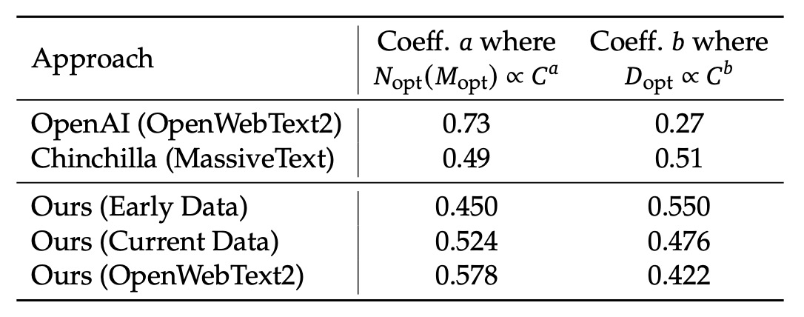
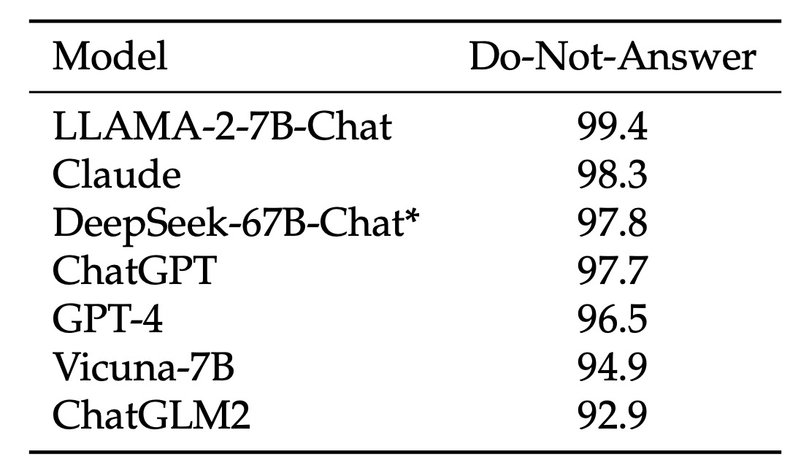

## 新・模型縮放律

[**DeepSeek LLM: Scaling Open-Source Language Models with Longtermism**](https://arxiv.org/abs/2401.02954)

---

最近 DeepSeek 的新聞鬧得沸沸揚揚，連 OpenAI 都忍不住跳出來要說上兩句。

既然他們引起了這麼大的迴響，我們花點時間把他們近年發表的論文都看上一遍。

這篇論文有 48 頁，其中有大量的實驗數據和技術細節，所以我們挑重點看。

## 定義問題

開源模型和閉源模型間的性能差距一直是一個熱門話題。過去的研究表明，開源模型在大多數基準測試中的表現明顯落後於閉源模型，這主要是由於開源模型的規模和資源限制所致。

為了拉近這兩者之間的差距，研究團隊提出了 DeepSeek LLM 系列模型，這是一系列大小從 7B 到 67B 的開源語言模型。為了訓練這些模型，研究團隊針對現有的 Scaling Law 提出質疑，認為過去的研究結果不盡然正確，因此他們提出了自己的 Scaling Law，並以此作為整篇論文的主軸，探討模型規模、數據規模和計算預算之間的關係。

這裡我們專注於 Scaling Law 的討論，並對 DeepSeek LLM 的設計和實驗結果進行簡要介紹。

## 解決問題

### 資料處理策略

研究團隊採取「去重複 → 篩選 → 混合」的三階段策略：

- **去重複 (Deduplication)**：

    

    <figure style={{"width": "80%"}}>
    
    </figure>
    

    將整個 Common Crawl 語料庫作為去重範圍。從上表可見，跨多個 dumps 的去重比僅對單一 dump 來得更徹底，這為模型提供了更多獨特的學習樣本。

- **篩選 (Filtering)**：設計嚴謹的文檔質量評估標準，結合語言和語義層面的分析，從局部與全局角度確保數據品質。
- **混合 (Remixing)**：為解決數據分佈不均問題，特別增強低代表性領域的數據，確保數據集更均衡且包容多元信息。

在 Tokenizer 的設計上，研究團隊採用 Byte-level Byte-Pair Encoding（BBPE），並利用預分詞避免不同字符類別（如換行、標點、CJK符號）混合；同時，將數字拆分為單個數位。詞彙表初步設定為 100000，再加上 15 個特殊 token，並預留額外空間至 102400，兼顧了模型訓練的計算效率與未來擴充的需求。

### 模型架構設計

模型基本沿襲 LLaMA 架構，採用 Pre-Norm 結構搭配 RMSNorm，以及 SwiGLU 作為 FFN 的激活函數。位置編碼採用 Rotary Embedding 方法，增強序列處理能力。

為降低推理成本，67B 模型使用 Grouped-Query Attention（GQA）取代傳統的 Multi-Head Attention。

大小兩種模型（7B 與 67B）的層數分別為 30 層與 95 層，這樣的調整不僅保持與其他開源模型的參數一致性，同時也利於模型流水線劃分，優化訓練與推理流程。與傳統僅擴大 FFN 寬度的做法不同，研究團隊選擇通過增加網絡深度來擴展 67B 模型參數，有助於提升模型整體性能。

:::tip
這裡有幾個關鍵詞，需要閱讀其他論文：

1. Rotary Embedding: 旋轉位置編碼，可以參考我們之前讀過的文章
    - [**[21.04] RoFormer: 旋轉位置編碼**](../../transformers/2104-roformer/index.md)
2. Grouped-Query Attention: 分組多頭注意力，參考 GQA 論文
    - [**[23.05] GQA: Training Generalized Multi-Query Transformer Models from Multi-Head Checkpoints**](https://arxiv.org/abs/2305.13245)

之後等我們看過這些論文之後再補上對應的筆記。
:::

### 參數配置

模型初始化標準差設定為 0.006，使用 AdamW 優化器：

- $\beta_1=0.9$
- $\beta_2=0.95$
- weight_decay=0.1

學習率調度器採用多步配置，經過 2000 步的 warmup 後達到峰值，隨後在 80% 與 90% 的訓練 token 處分別降至最大值的 31.6% 和 10%。該策略允許在固定模型大小下調整訓練規模，並能重用前一階段的訓練成果，為持續訓練帶來便利。整體實驗表明，雖然損失下降曲線有所不同，但最終性能與 cosine 調度器基本一致。

梯度裁剪值設定為 1.0，以防止梯度爆炸並穩定訓練。

訓練採用 HAI-LLM 框架，該框架整合了數據、張量、序列以及管線並行技術，類似於 Megatron 的設計，能有效分攤大規模模型的計算負擔。

另外引入 flash attention 技術以提升硬件利用率；利用 ZeRO-1 技術對優化器狀態進行分割，進一步降低記憶體消耗。通過融合部分層（如 LayerNorm、GEMM 及 Adam 更新）加速訓練；採用混合精度（bf16 訓練、fp32 梯度累積）及原位交叉熵計算以優化記憶體使用。

模型權重與優化器狀態每 5 分鐘自動保存，保證在硬件或網絡故障時最多損失 5 分鐘的訓練；同時支持從不同 3D 並行配置中恢復訓練，應對計算資源動態變化。

評估策略的部分則是在生成任務中採用 vLLM，而非生成任務則採用連續批次處理，以減少手動調整批次大小和 token 填充問題。

## Scaling Laws

:::tip
過去兩篇有名的 Scaling Laws，如果沒看過的讀者可以先去看看我們之前寫的筆記：

- [**[20.01] Scaling Laws: 模型的縮放律**](../../transformers/2001-scaling_laws/index.md)
- [**[22.03] Chinchilla: 栗鼠之眼**](../../transformers/2203-chinchilla/index.md)
:::

### 超參數配置

<figure style={{"width": "90%"}}>

</figure>

研究團隊首先在計算預算 $C = 1\mathrm{e}17$ 下，針對特定模型規模（177M FLOPs/token）進行了 grid search，探索不同批次大小 $B$ 與學習率 $\eta$ 的組合。

根據上圖實驗結果，研究團隊觀察到在較廣的 $B$ 與 $\eta$ 範圍內，模型的泛化誤差都保持穩定。這意味著在這個較大參數空間中，都能找到接近最優性能的超參數組合，即「近似最優」參數區域。

為了進一步探索更大計算預算範圍（從 $1\mathrm{e}17$ 到 $2\mathrm{e}19$），研究團隊採用了多步學習率調度器。這種調度器允許在第一階段訓練完成後重複利用已有訓練成果，從而高效地訓練多組超參數配置的模型。由於參數空間存在冗餘，研究團隊定義當模型的泛化誤差超出最小值不超過 0.25% 時，所使用的超參數可視為「近似最優」的。

經過大量實驗與數據擬合，結果顯示：
  - **最佳批次大小 $B_{opt}$：** 隨著計算預算 $C$ 的增加而逐漸增加。這與直覺一致，即在更多計算資源下，可以採用更大的批次。
  - **最佳學習率 $\eta_{opt}$：** 隨著 $C$ 增加而逐漸下降。也就是說，當模型規模變大、計算預算提高時，需要較低的學習率來保持穩定性。

最後研究團隊在論文中給出了以下兩個公式來描述這一關係：

$$
\eta_{opt} = 0.3118 \cdot C^{-0.1250}
$$

$$
B_{opt} = 0.2920 \cdot C^{0.3271}
$$

這兩個公式分別量化了最佳學習率和最佳批次大小與計算預算 $C$ 的冪律關係。

為了驗證這些公式的有效性，研究團隊在更大的計算預算 $C = 1\mathrm{e}20$ 下，以模型規模為 2.94B FLOPs/token 的模型進行驗證，實驗結果如上圖(右)，結果表明擬合得到的超參數正好位於最優參數空間的中心位置，進一步驗證了公式的準確性。

### 最佳模型與數據縮放估計

在完成了近似最優超參數公式的擬合之後，研究團隊開始研究如何對模型規模與數據規模進行最優分配：

> **即確定在給定計算預算 $C$ 下，如何選擇最佳的模型規模和數據規模以達到最低的誤差。**

核心目標是尋找兩個冪律關係，其中模型最優規模 $N_{opt}$ 與計算預算滿足

$$
N_{opt} \propto C^{a}
$$

而數據最優規模 $D_{opt}$（以數據中 token 數量表示）滿足

$$
D_{opt} \propto C^{b}
$$

這裡，$a$ 和 $b$ 分別是模型和數據的 Scaling 指數。

早期工作通常用模型參數數量來表示模型規模，計算預算與模型與數據規模的關係近似為

$$
C = 6N \cdot D
$$

可以用 $6N_1$ 或 $6N_2$ 來近似模型規模。但是這兩種表示法都沒有充分反映注意力運算所帶來的計算負擔，這兩種方法在不同模型規模下可能會出現高達 50% 的誤差，特別是在小規模模型上更為明顯，這些都會對後續 Scaling 曲線的擬合產生顯著的統計誤差。

為了克服上述問題，研究團隊提出了新的模型規模表示方法 $M$，其中包含了注意力運算的計算開銷，但不包括詞彙計算，公式為

$$
M = 72\, n_{layer}\, d_{model}^2 + 12\, n_{layer}\, d_{model}\, l_{seq}
$$

其中：

  - $n_{layer}$：層數
  - $d_{model}$：模型寬度
  - $l_{seq}$：序列長度

採用 $M$ 後，計算預算可以簡化表示為

$$
C = M \cdot D
$$

這使得在不同配置下更容易對模型與數據進行最優分配的估計。

在引入 $M$ 之後，研究團隊將目標明確化為：

> **在給定 $C = M \cdot D$ 的條件下，尋找最佳模型規模 $M_{opt}$ 與最佳數據規模 $D_{opt}$，使得模型的泛化誤差 $L(N, D)$ 最小。**

這可以表示為：

$$
M_{opt}(C),\, D_{opt}(C) = \arg\min_{M,D \, \text{s.t.} \, C = M \cdot D} L(N,D)
$$

為了降低實驗成本與擬合難度，研究團隊採用了 Chinchilla 中提出的 **IsoFLOP profile** 方法：

- 選取 8 個不同的計算預算，範圍從 $1\mathrm{e}17$ 到 $3\mathrm{e}20$。
- 對於每個預算，設計大約 10 種不同的模型與數據規模配置。
- 每個配置的超參數由前述公式決定，並在一個獨立的驗證集上（包含 100M tokens）計算泛化誤差。

利用上述數據，研究團隊繪製了 IsoFLOP 曲線與模型/數據 Scaling 曲線：

並最終得到最優模型與數據的 Scaling 公式：

$$
M_{opt} = M_{base} \cdot C^{a}
$$

- 其中 $M_{base} = 0.1715,\; a = 0.5243$。

$$
D_{opt} = D_{base} \cdot C^{b}
$$

- 其中 $D_{base} = 5.8316,\; b = 0.4757$。

根據這些擬合結果，研究團隊成功預測了 DeepSeek LLM 7B 與 67B 模型的泛化誤差，如下圖：

<figure style={{"width": "90%"}}>

</figure>

實驗結果顯示小規模實驗的結果可以準確預測 1000 倍計算預算下的模型表現，這為大規模模型訓練提供了有力的支持。

### 數據品質的影響

研究團隊選用了三種數據集進行比較分析：

- **Early Data:** 早期的內部數據。
- **Current Data:** 目前的內部數據。
- **OpenWebText2:** 先前研究 scaling laws 時採用的數據集。

透過比較，評估顯示目前的內部數據品質優於早期數據，而 OpenWebText2 由於規模較小，可進行更為細緻的處理，其數據品質甚至超過了當前內部數據。

利用上一節的 Scaling Laws 公式，研究團隊計算了不同數據集下的 Scaling 指數，結果如下表：

<figure style={{"width": "80%"}}>

</figure>

具體而言，OpenAI（使用 OpenWebText2）的係數為 $a=0.73$ 與 $b=0.27$；Chinchilla（MassiveText）的係數為 $a=0.49$ 與 $b=0.51$；而在他們自己的資料中，早期內部資料的係數為 $a=0.450$500. $b=0.476$，經過 OpenWebText2 處理後的資料則為 $a=0.578$ 與 $b=0.422$。

從這些結果可以看出，隨著資料品質的提升，模型擴展指數 $a$ 會逐漸增大，而資料擴展指數 $b$ 則會相應減少。這顯示「**在相同的計算預算下，資料品質越高，就越要將更多的資源用於模型擴展，而非單純增加資料量**」。這同時也解釋了早期研究中不同資料集下最優模型與資料分配策略有較大差異的原因。

:::tip
直覺上我們可能會認為高品質資料因為邏輯清晰、雜訊少，可以讓較小的模型就達到不錯的效果；也就是說，用更高品質的資料可以「省」下模型容量。

但是研究團隊告訴我們：不對唷！

**由於高品質的資料降低了預測難度，意味著資料中的信號更強、更穩定。進而使得模型能夠利用額外的容量來捕捉更細緻的模式，進一步提高性能**。

換句話說，當資料品質較高時，模型不再受限於學習「噪音」，而能充分發揮其規模效應，從而在增加模型參數後獲得更大提升。
:::

## 模型對齊

模型對齊（Alignment）流程的主要目標在於讓模型在生成回應時，不僅能夠提供有用的資訊，同時避免產生有害的內容。

在資料方面，研究團隊共收集了約 150 萬筆中英文指令數據，涵蓋了廣泛的主題。其中，有 120 萬筆屬於有幫助性的資料，其內部分佈為：一般語言任務佔 31.2%、數學問題佔 46.6%、程式編寫練習佔 22.2%；另外有 30 萬筆數據則專注於安全性議題，包含各類敏感主題。

對齊流程分為兩個階段：
- 第一階段是監督式微調（Supervised Fine-Tuning, SFT）
- 第二階段採用直接偏好優化（Direct Preference Optimization, DPO）。

在監督式微調階段，針對不同模型規模採用了不同的訓練 epoch，原因在於後者較容易發生過擬合現象。實驗中使用了 GSM8K 和 HumanEval 等基準，發現 7B 模型的表現能持續提升，但 67B 模型則較快達到性能上限。

在第二階段，即 DPO 部分，研究團隊利用直接偏好優化演算法進一步增強模型對齊效果。DPO 被證實是一種簡單而有效的方法，其核心在於利用偏好數據來調整模型生成回應的方向。

在此階段，他們分別針對有幫助性與無害性構建了偏好資料。具體作法是先收集涵蓋創意寫作、問答、指令遵循等多種範疇的多語言提示，然後利用 DeepSeek Chat 模型生成候選回應，並以此構建有幫助性偏好數據；無害性偏好數據則採用相似的流程。

## 討論

對於 DeepSeek LLM 的實驗結果非常多，我們主要看一下模型在開放領域和開放式問題上的生成能力，因為這裡比較貼近實際使用情境，讓我們可以了解模型在多回合對話、跨語言任務等非結構化應用下的真實表現。

其他部分，感興趣的讀者可以參考原始論文。

### 中文開放式評測

<figure style={{"width": "90%"}}>

</figure>

研究團隊針對中英文任務來測試模型的開放式生成能力。

針對中文評測部分，他們採用了 AlignBench 測試集，該測試集涵蓋了 8 個主要類別、36 個次要類別，共計 683 個問題。每個問題不僅提供了提示，還附有專業的參考答案以及評分模板，利用 GPT-4 進行回應品質的評分，從而保證了評測的客觀性與專業性。

在評測過程中，研究團隊使用了 AlignBench 官方 GitHub 代碼庫來實現模型評測，並嚴格按照原始設定調整生成溫度參數。具體而言，對於角色扮演、寫作能力和開放式問題這些任務，生成溫度設定為 0.7；而其他任務則設定為 0.1，以確保生成結果既有足夠多樣性，又能保持穩定。

從 AlignBench 的排行榜可以看出，DeepSeek 67B Chat 模型在多項中文任務上超越了 ChatGPT 和其他基準模型，僅次於兩個版本的 GPT-4，顯示出其在處理中文開放性問題上的優異表現。進一步來看，經過 DPO（直接偏好優化）訓練後，模型在幾乎所有評分指標上都有顯著提升，這證明了 DPO 在改善模型對齊方面的正面效果。

在中文語言任務中，其基本中文能力甚至超越了最新版本的 GPT-4；而在更複雜的中文邏輯推理和數學計算任務上，模型的表現明顯領先於其他中文大型語言模型。

### 英文開放式評測

<figure style={{"width": "90%"}}>

</figure>

在英語開放式評測中，研究團隊採用了 MT-Bench 這個基準，該基準包含了 8 個不同類別的多回合對話問題，專門用以測試模型在持續對話中的生成能力。這個基準能夠全面評估模型在各種開放式情境下的應對表現，尤其在多回合交互中檢視模型是否能保持一致性與連貫性。

實驗結果顯示，DeepSeek LLM 67B Chat 在此評測上超越了其他多個開源模型，如 LLaMA-2-Chat 70B、Xwin 70b v0.1 以及 TÜLU 2+DPO 70B，並且其得分達到 8.35，與 GPT-3.5-turbo 的表現相當。這代表在多回合英語對話生成上，DeepSeek LLM 的表現已接近主流商用模型的水平。

此外，在進一步應用 DPO 訓練後，DeepSeek LLM 67B Chat 的平均得分進一步提升至 8.76，僅次於 GPT-4 的表現。這說明 DPO 不僅能夠進一步調整模型生成的偏好，還能有效增強模型在開放式多回合對話中的表現。

### 其他有趣的發現

跑完一整套評估流程之後，研究團隊在最後提出了幾個有趣的發現：

- **（1）模型安全評估：**

  

  <figure style={{"width": "60%"}}>
  
  </figure>
  

  首先，研究團隊使用「Do-Not-Answer Score」用來評估模型在面對敏感或不適合回答的問題時，能否正確拒絕回答。分數越高代表模型在安全性上越好。

  從數據上看 DeepSeek-67B-Chat 在安全性上表現優異，屬於較安全的模型之一。

- **（2）分階段微調策略：**

  在微調過程中，研究團隊發現對於較小型模型（例如 7B）而言，長時間在數學與程式碼資料上進行微調能夠提升其專業能力，但可能會損害對話表現，導致回答出現重複現象。

  為此，他們提出了分階段微調的策略：第一階段使用所有可用資料進行微調；第二階段則專注於對話資料進行微調。實驗結果證明這種分階段微調能有效平衡專業任務與對話流暢性之間的需求。

- **（3）多選題資料的影響：**

  在對齊階段，研究團隊嘗試加入 2000 萬筆中文多選題資料，以期提升模型在多選題類任務上的表現。

  加入多選題資料後，在 MMLU、C-Eval、CMMLU 等多選題基準上的得分都有顯著提升，但這種提升並未延伸到 TriviaQA 和中文問答等生成式評測上。也就是說，儘管多選題資料能夠提升模型解題能力，但在實際對話生成中並不會讓使用者感覺模型更「智能」。

  因此，為了避免模型過度適應多選題形式而損害整體智能表現，他們最終決定在預訓練和微調階段都不加入多選題資料。

- **（4）預訓練階段的指令資料：**

  此外，研究團隊試驗在預訓練後期（最後 10%）加入 500 萬筆主要以多選題為主的指令資料，觀察其對基礎模型表現的影響。

  結果顯示，這樣做確實可以提升模型在基準任務上的表現，但最終效果與在監督式微調階段加入相同資料後幾乎沒有差異。

  因此，若指令資料量相當龐大，預訓練中加入也是可行的；不過，由於研究團隊傾向排除多選題資料，加上非多選題資料相對有限，故最終決定不在預訓練階段納入指令資料。

- **（5）系統提示（System Prompt）的影響：**

  系統提示是用來引導模型生成既有幫助性又有禮貌、正面的回答。

  研究團隊採用了類似 LLaMA-2 的系統提示，例如明確告知模型「你是 DeepSeek Chat，一個有幫助、尊重且誠實的 AI 助手」，並說明知識截止日期等。

  有趣的是，他們發現對於 7B 模型而言，加入系統提示反而會略微降低評測得分（從 7.15 下降至 7.11），而對於 67B 模型，系統提示則能顯著提升表現（從 8.35 提升至 8.58）。這可能是因為較大模型更能理解和遵循系統提示所傳遞的意圖，而較小模型則可能因為理解不足，反而受到訓練與測試之間不一致的影響。

## 結論

DeepSeek LLM 是一套從零開始訓練的大型語言模型，基於涵蓋中英文共計 2 兆 tokens 的語料建構而成。論文不僅詳細記錄了模型訓練過程中的超參數選擇與 Scaling Laws 校準，還深入比較了多種微調策略，並提出一套兼顧訓練效率與資源分配的方法論。

這不只是模型本身的發布，更標誌著 DeepSeek-AI 正式進軍開源 LLM 的一個重要里程碑。

目前 DeepSeek 系列已釋出多篇核心論文，我們找時間依序讀過後續幾篇研究，繼續深入探索其完整的技術佈局與演進路線。