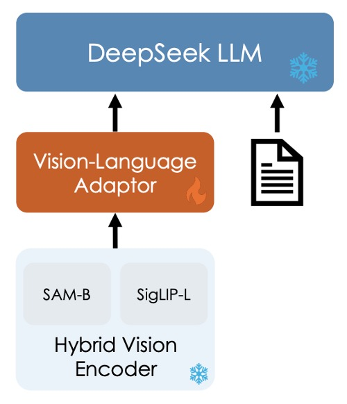

## 多模態訓練配方

[**DeepSeek-VL: Towards Real-World Vision-Language Understanding**](https://arxiv.org/abs/2403.05525)

---

這篇是多模態的論文。

在 DeepSeek LLM 發表後兩個月，DeepSeek 團隊接著發表了他們在多模態領域的研究成果。

## 定義問題

現有多模態模型多採用低解析度輸入（如 336×336 或 448×448），導致在處理 OCR 任務或微小物體辨識等複雜場景時，表現不佳。此外，開源模型與閉源模型之間仍存在明顯的性能落差。

過去沒做好的事情，就是未來最充足的動機。

作者在論文中以圖像問答為例，簡要展示了多模態模型的典型應用場景。

<figure style={{"width": "90%"}}>

</figure>

## 解決問題

作者在這篇論文中以三個維度來拆解多模態模型的訓練問題。

### 訓練資料

本研究將資料集劃分為兩大類：

- **預訓練資料**：主要用於提升模型跨模態基礎理解能力，分為不同來源與類型，並在訓練初期階段進行預熱與共同預訓練。
- **監督式微調資料**：規模較小，主要用於教導模型完成具體下游任務，屬於訓練後期的有監督微調。

首先是 **預訓練資料**，其組成內容如下表：

<figure style={{"width": "70%"}}>

</figure>

- **交錯式影像－文本資料**：透過 MMC4、Wiki、Wikihow 與 Epub 教科書等公開資料，讓模型能夠在上下文中學習多模態輸入。
- **影像說明資料**：來自高品質的 Capsfusion、TaiSu 與 Detailed Caption 資料集，提升模型對影像內容的語意描述能力。
- **表格與圖表資料**：包含 Chart2text、Geo170K、Unichart、Ureader、M-paper、ScienceQA、ScreenQA、SciGraphQA-295K、Paper2figure100k、Widget Captioning、Screen2words 及 Refexp 等多個來源，讓模型具備一般表格與圖表影像的理解能力。
- **Web Code 資料**：利用 UI Inverse Rendering 技術（參考 HuggingFaceM4 與 MATCHA 方法），處理約 1.46 百萬個 Jupyter notebook，經過過濾後挑選出 1.1 百萬具代表性實例（每個例子至少含有 5 行程式碼），構成約 2 百萬對影像與程式碼的配對資料。
- **文件 OCR 資料**：為應對文件層級的光學字符辨識，整合兩大來源：
  1. **arXiv 文章**：從 1.4 百萬篇 arXiv 論文中提取源碼與 PDF，再利用 Nougat 工具轉換為影像－文本配對。
  2. **電子書與教學資料**：處理 86 萬英文及 18 萬中文電子書，搭配數以百萬計的中小學考題，並用 HTML 渲染工具轉換為配對格式。
- **場景文字 OCR 資料**：用於增強模型在複雜環境中辨識整合至影像中的文字能力。
- **純文字語料庫**：用來維持模型在語言任務上的專業能力，與 DeepSeek-LLM 使用相同語料。

---

接著是**監督式微調資料**，這裡聚焦於模型在具體任務上的表現，來源涵蓋多模態與語言資料：

<figure style={{"width": "70%"}}>

</figure>

- **公開共享的 GPT-4V 資料集**：包括 ShareGPT4V、LAION-GPTV、LVIS-Instruct4V、textOCR-GPT4V、LLaVA1.6-GPT4V 與 IconQA。
- **部分表格與圖表資料**：從預訓練資料中提取 Ureader、ScreenQA、Geo170K 與 ScienceQA 等來源。
- **UI Code 資料**：來自 Screen-to-code 任務，協助模型從圖形介面或視覺圖表中重建程式碼。
- **內部高品質多模態 SFT 資料**：部分資料以中文呈現，並依據真實應用情境精心設計，涵蓋認知、轉換、分析、推理、評估與安全等多個類別，此分類同時用於選取每個測試影像的代表性提示以及建立平衡的評估資料集。
- **純文字 SFT 資料**：與 DeepSeek-LLM 所使用的文字資料保持一致，作為聯合視覺與語言 SFT 資料的一部分。

### 模型架構

<figure style={{"width": "50%"}}>

</figure>

:::tip
先別管圖片中的冰塊和火焰，這是下一段會講的內容。
:::

整個模型架構還算簡單，由三個模組構成：

1.  **混合視覺編碼器 (Hybrid Vision Encoder)**

    參考上圖，主要元件有兩個：

    - **SigLIP-L 視覺編碼器：** 接受低解析度輸入（384×384），專注於提取高層語意資訊。
    - **SAM-B 視覺編碼器：** 為視覺專用自監督編碼器，基於 ViTDet，可接受高解析度輸入（1024×1024），擅長捕捉低層細節資訊。

    這樣設計的原因是考量到圖像中的細節與語意資訊，需要在不同解析度下進行提取。

    兩個模型的串接流程如下：

    - 高解析度影像經 SAM-B 編碼後產生一個 `64×64×256` 的特徵圖。
    - 此特徵圖首先被 VL Adaptor 插值至 `96×96×256`，接著經由兩層 stride 為 2 的卷積層，產生尺寸為 `24×24×1024` 的特徵圖，並重塑為 `576×1024`。
    - 與 SigLIP-L 輸出的 `576×1024` 特徵圖進行串接，最終形成 576 個視覺 tokens，每個 token 維度為 2048。
    - 經過 GeLU 激活後，再通過一個嵌入層以與語言模型建立連結。

    ***

    :::tip
    圖像中的所有資訊，都濃縮在這 576 個 token 內。

    其中一半是高階語意資訊，一半是低層細節。
    :::

2.  **視覺－語言接轉器 (Vision-Language Adaptor)**

    這裡採用兩層混合型 MLP。初步使用獨立單層 MLP 分別處理高解析度與低解析度特徵，之後將兩者沿維度串接，經由另一層 MLP 轉換至語言模型的輸入空間。

    :::info
    講個題外話，這個部分可以看出來這篇論文選擇的技術線。

    為了要橋接視覺和語言，我們比較常見的技術線有幾種，之前我們大部分都有看過：

    1.  **對比學習方法**：例如 CLIP、ALIGN 等，這些架構通常會將視覺與語言特徵映射到同一個空間，並透過對比學習來訓練模型。

        - [**[21.03] CLIP: 打碎次元的屏障**](../../multimodality/2103-clip/index.md)

        ***

    2.  **融合式方法**：例如 Flamingo、BLIP 等，這些架構引入跨模態交叉注意力來融合特徵。

        - [**[22.01] BLIP: 合成文本技術**](../../multimodality/2201-blip/index.md)
        - [**[22.04] Flamingo: 圖文並茂**](../../multimodality/2204-flamingo/index.md)

        ***

    3.  **Adapter-based 方法**：就是本篇論文 DeepSeek-VL 採用的方式，這個架構會在視覺與語言特徵之間插入一個轉換器，來橋接兩者。確切來說，就是把視覺特徵「翻譯」成語言特徵，然後按照語言模型的方式進行後續的訓練。

        ***

    4.  **遮罩式方法**：例如 BEiT-3，利用遮罩任務進行自監督學習，通過預測遮罩部分來學習圖像和文本的聯合表示。

            - [**[22.08] BEiT-3: 英雄所見略同**](../../multimodality/2208-beit-v3/index.md)

        :::

3.  **語言模型 (Language Model)**

    這個部分就回到之前看過的 DeepSeek LLM 了，其設計參考 LLaMA 架構，採用 Pre-Norm 結構與 RMSNorm。

    在 Feed-Forward Network (FFN) 部分，激活函數採用 SwiGLU，語言模型採用 Rotary Embedding 作為位置編碼，並與 DeepSeek-LLM 使用相同的 tokenizer。

    模型分為 DeepSeek-VL-1B（基於約 5000 億個文本 tokens 的預訓練）與 DeepSeek-VL-7B（基於約 2 兆 tokens 預訓練）。

### 訓練流程

<figure style={{"width": "90%"}}>

</figure>

整體訓練流程分為三個階段，如上圖所示：

1. **Stage 1: 訓練視覺－語言接轉器**

   為了建立視覺特徵與語言特徵在嵌入空間中的對應關係，使 LLM 能理解影像中所呈現的實體，在第一階段僅訓練接轉器參數，並凍結視覺編碼器與語言模型。

   使用的數據包含 125 萬張來自 ShareGPT4V 的影像－文本 caption，以及 250 萬 Document OCR 渲染配對。

   實驗發現，僅透過擴大數據規模並無明顯效益，反而可能導致性能下降，因此進入下一階段時將解凍 LLM。

2. **Stage 2: 聯合視覺－語言預訓練**

   在第二階段會將 DeepSeek LLM 的部分解凍，加入訓練。

   這裡的挑戰是如何在多模態數據訓練的同時，不影響語言模型的表現。根據實驗結果，作者發現直接用多模態數據訓練雖可提升多模態性能，但卻會嚴重衰退語言模型的語言表現。

   最後，作者選擇語言與多模態數據的訓練比例約為 7:3。另外，為了解決 1.3B 模型中因容量不足及缺乏 SFT 數據導致的訓練不穩定，採用 Multi-choice PPL 方法：將問題與所有答案一起輸入，計算每個選項的 perplexity，選擇 perplexity 最低者作為最終答案；並在預訓練中引入少量 SFT 數據以提升模型的指令遵循能力。

3. **Stage 3: 有監督微調**

   最後一個階段會把所以模型解凍，並進行有監督的微調。

   在這一個步驟中，作者對對預訓練模型進行指令調整，進一步強化模型的對話與互動能力，最終形成 DeepSeek-VL-Chat 模型。

   訓練時會使用多模態數據與純文字對話數據的混合，確保模型在各類對話場景下皆能展現全面性能。

## 討論

論文有不少圖表，我們這裡看一下 Human Evaluation 的評估結果，如果你對其他部分有興趣，可以參考原文。

<figure style={{"width": "90%"}}>

</figure>

上圖中綠色部分代表 DeepSeek-VL-7B 的表現，灰色的部分是 GPT4V。

評估資料集共包含 100 個問題，這些問題按照七個類別進行劃分。這七個類別與內部有監督微調（SFT）數據所使用的分類法一致，確保所測試的任務具備普遍性並涵蓋大部分多模態模型的應用場景。

為了保證資料集的全面性和代表性，研究團隊從免費授權的圖片社群以及研究人員自行拍攝的照片中收集了相似的影像素材，並根據既有報告中描述的任務類別與任務要求，設計了相應的提示（prompt）。這樣的資料收集和提示制定過程，使得人工評估的資料集能夠充分反映真實世界中的多模態應用情境。

在評估中，DeepSeek-VL-7B 與 InternLM-XComposer2-VL、CogVLM 以及 GPT-4V 進行了對比。從結果中可以看出，GPT-4V 在大多數維度上表現卓越，而所有開源模型在邏輯推理上仍遠遜於 GPT-4V，這也反映出在 LLM 規模上進行擴展的必要性。

DeepSeek-VL-7B 在整體表現上達到接近 GPT-4V 的水準，特別是在「辨識」、「轉換」以及「常識推理」這三個任務上表現突出。

另外，作者進行了一個額外的對比評估，利用 GPT-4V 作為評審來比較 DeepSeek-VL 與其他模型的回答品質。

具體做法是，對於 99 個人工評估的測試樣本，先將問題及兩個模型的回答展示給 GPT-4V，再由 GPT-4V 判斷哪個回答較好，或是判定兩者平手。

結果顯示如下圖：

<figure style={{"width": "90%"}}>

</figure>

GPT-4V 在大部分情況下傾向於給 DeepSeek-VL 的回答更高的評價。

DeepSeek-VL 在超過 60% 的案例中被認為優於其他開源多模態模型（例如 Fuyu-8B、CogVLM-17B 與 InternLM-XComposer2-VL）。與其他專有模型相比，DeepSeek-VL 也展現了相當優異的性能，表現上與 GPT-4V 相當。

### 消融實驗

1. **模組容量與資料規模**

   

   <figure style={{"width": "90%"}}>
   
   </figure>
   

   作者在訓練第一階段（即 projector warmup 階段）中，透過擴大訓練資料集規模，再進行有監督微調，檢驗是否能提升投影器的效能。

   從上表可以看出，增加訓練資料量並未改善階段 1 的性能。這暗示著 projector 的容量存在固有限制，無法捕捉多模態任務所需的大量知識，單純增加數據量並不會突破這一瓶頸。

2. **分階段訓練的重要性**

   

   <figure style={{"width": "90%"}}>
   
   </figure>
   

   作者比較不同訓練階段組合對最終模型性能的影響，如上表：

   - 組合「Stage 1 + Stage 2 + Stage 3」
   - 組合「Stage 1 + Stage 3」
   - 組合「Stage 2 + Stage 3」

   結合所有三個階段（Stage 1、Stage 2 與 Stage 3）的結果明顯優於僅組合 Stage 1 與 Stage 3，顯示出多模態預訓練（Stage 2）的重要性。

   另外，即使只用 Stage 2 與 Stage 3，其效果仍略低於全階段組合，說明視覺－語言接轉器預熱階段（Stage 1）也對最終效果具有正向貢獻。

---

除此之外，作者在論文中也討論到關於模態分組與預熱策略的重要性，用按模態分組的訓練策略，有效解決了混合批次中因各模態處理速度不同導致的效率瓶頸；同時，從純語言數據開始逐步融入多模態數據（模態預熱）能夠防止初期語言能力急速下降，這兩點在實踐中具有很大的應用價值。

這個部分的表格比較細瑣，這裡就不一一列出了，有興趣的讀者可以參考原文。

## 結論

作者在這篇論文中提出了一套多模態模型的訓練配方，最後我們再複習一下：

1. **使用兩個視覺編碼器，負責不同解析度的輸出資訊。**
2. **使用 Adapter-based 方法，將視覺特徵轉換成語言特徵。**
3. **使用三階段的「預訓練－微調」策略，確保模型在多模態任務上的表現。**

之前我們也提過，預訓練方法有很多種，另外一個可以節省運算量的技術是 MoE（Mixture of Experts），作者也提到未來計劃將 DeepSeek-VL 擴展到更大規模，並引入 MoE 技術，以進一步提升模型的效率與效能。

我們就拭目以待吧。
