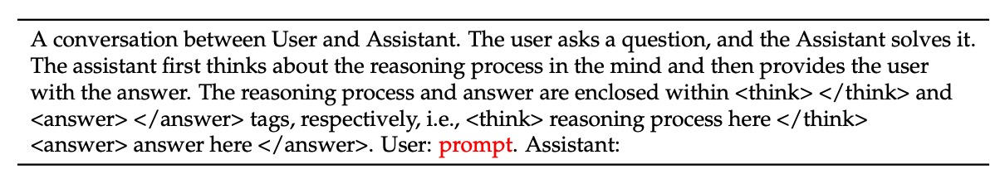
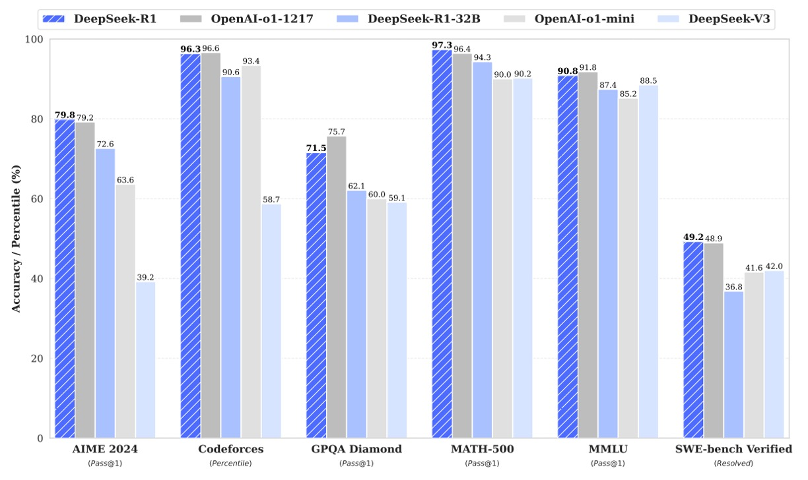
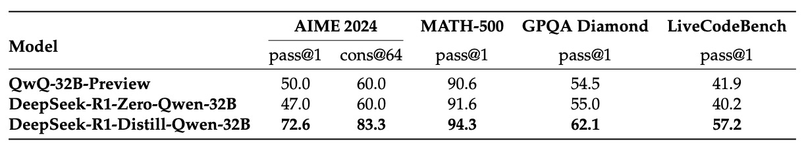

## 強化學習下的頓悟

[**DeepSeek-R1: Incentivizing Reasoning Capability in LLMs via Reinforcement Learning**](https://arxiv.org/abs/2501.12948)

---

我們就是為了要讀這篇論文，才先回過頭去看完前三代的 DeepSeek 架構。

每篇論文都跟磚頭一樣厚，現在回想起來，覺得還真不容易。

## 定義問題

OpenAI 的 o1 系列在前一陣子引起了一陣討論，他們率先引入了在推理階段延長推理鏈條（Chain-of-Thought）的方法，大幅提升了模型在複雜推理任務中的表現。

過去也有其他研究嘗試過利用「過程獎勵模型」、「強化學習」以及「搜尋算法（如蒙地卡羅樹搜尋、Beam Search）」來改善模型推理能力，但都無法達到與 o1 系列模型相當的綜合理論推理表現。

難道就這樣算了？

那可不行！研究人員的倔脾氣可不是浪得虛名的。

DeepSeek 研究團隊在這篇論文中首次嘗試使用「單純的強化學習」來驅動語言模型的推理能力，完全不依賴監督數據。就這樣，作者使用 DeepSeek-V3-Base 作為基礎模型，經過數千次的 RL 步驟之後，打造了第一版模型，稱為 DeepSeek-R1-Zero。

所以問題解決了嗎？

還沒。

故事從 DeepSeek-R1-Zero 之後才算正式開始。

## 解決問題

### DeepSeek-R1-Zero

首先，拿 DeepSeek-V3-Base 作為基礎模型，略過監督式微調的階段，直接拿強化學習算法 Train 上一波。

為了降低 RL 的訓練成本，本文採用了 GRPO 方法，此方法不使用與策略模型同規模的 critic 模型，而是根據一組分數來估計基線。

:::info
GRPO 算法，原文是 Group Relative Policy Optimization，這篇也是 DeepSeek 之前提出來的論文，有空我們也可以去看看：

- [**[24.02] DeepSeekMath: Pushing the Limits of Mathematical Reasoning in Open Language Models**](https://arxiv.org/abs/2402.03300)
  :::

在 GRPO 算法中，我們希望模型能夠自己「學會」如何產生更好的回答，它的核心流程可以分為以下幾個步驟：

- **1. 從舊模型中產生多個答案**

  - **對每個問題 $q$**： 我們利用舊策略 $\pi_{\theta_{\text{old}}}$ 產生一組答案

    $$
    \{o_1, o_2, \dots, o_G\}
    $$

    這裡 $G$ 是答案的數量。

    ***

- **2. 評估答案優劣：計算「優勢」 $A_i$**

  為了衡量答案的好壞，每個答案 $o_i$ 都會獲得一個獎勵 $r_i$。

  為了比較哪個答案表現更好，作者定義優勢 $A_i$ 為：

  $$
  A_i = \frac{r_i - \text{mean}(\{r_1, r_2, \dots, r_G\})}{\text{std}(\{r_1, r_2, \dots, r_G\})}
  $$

  這個公式告訴我們：一個答案比平均表現高出多少（用標準差來標準化）。

- **3. 優化新模型：最大化目標函數**

  我們希望新模型 $\pi_\theta$ 學會更傾向於生成高分答案。

  為此，作者設計了一個目標函數：

  $$
  \begin{aligned}
  J_{GRPO}(\theta) = \; & E\Bigg[\, q \sim P(Q),\, \{o_i\}_{i=1}^{G} \sim \pi_{\theta_{\text{old}}}(O|q) \Bigg] \\
  & \quad \cdot \frac{1}{G} \sum_{i=1}^{G} \Bigg[ \min\Bigg( \frac{\pi_\theta(o_i|q)}{\pi_{\theta_{\text{old}}}(o_i|q)}\, A_i,\; \\
  & \qquad\qquad\quad clip\Bigg(\frac{\pi_\theta(o_i|q)}{\pi_{\theta_{\text{old}}}(o_i|q)},\, 1-\epsilon,\, 1+\epsilon\Bigg)\, A_i \Bigg) \\
  & \qquad\qquad\quad - \beta\, D_{KL}\big(\pi_\theta \,\|\, \pi_{ref}\big) \Bigg].
  \end{aligned}
  $$

  看到這一串式子，讓人下意識地想要滑走，但是別怕，我們逐一看看：

  - **機率比率**
    $\frac{\pi_\theta(o_i|q)}{\pi_{\theta_{\text{old}}}(o_i|q)}$ 表示新模型生成答案 $o_i$ 的機率相對於舊模型的變化情況。

  - **乘上優勢 $A_i$**
    如果答案比平均好（$A_i$ 高），那麼希望新模型增加生成這個答案的機率。

  - **clip 操作**
    為了避免機率比率改變過大，我們對其進行限制，使其保持在 $[1-\epsilon,\, 1+\epsilon]$ 範圍內，其中 $\epsilon$ 是一個超參數，這就像是給模型變動設定一個「安全帶」。

  - **KL 散度懲罰**
    $\beta D_{KL}\big(\pi_\theta||\pi_{ref}\big)$ 是一項懲罰項，用來衡量新模型與參考模型 $\pi_{ref}$ 之間的差異，防止模型變得太過偏離原本穩定的策略。

    KL 散度的計算方式為：

    $$
    D_{KL}\big(\pi_\theta||\pi_{ref}\big) = \frac{\pi_{ref}(o_i|q)}{\pi_\theta(o_i|q)} - \log\frac{\pi_{ref}(o_i|q)}{\pi_\theta(o_i|q)} - 1
    $$

    ***

還行吧，其實沒這麼難對不對？

模型透過最大化 $J_{GRPO}(\theta)$ 來調整自己的參數。這意味著新模型會更傾向於產生那些獲得較高獎勵（高 $A_i$）的答案，同時保持變化的穩定性。

獎勵是強化學習的訓練訊號，決定了優化方向。

研究團隊在本文中採用基於規則的獎勵系統，主要包含兩種獎勵：

- **準確性獎勵**：評估回答是否正確。例如在數學題中，要求模型以特定格式（例如框住答案）給出最終答案，從而能夠進行規則化驗證；對於 LeetCode 題目，則可利用編譯器與預定測試案例進行檢測。
- **格式獎勵**：要求模型將其思考過程放置於 `<think>` 與 `</think>` 標籤中，以確保輸出符合預設格式。

:::info
本文沒有採用基於神經網路的結果或過程獎勵模型，原因在於在大規模 RL 過程中容易出現「獎勵駭客」問題，且重新訓練獎勵模型會增加額外資源需求並使整個流程複雜化。

:::tip
獎勵駭客（Reward Hacking）指的是在強化學習過程中，代理人（agent）利用獎勵函數中未預期的漏洞或弱點，找到一些能迅速提高獎勵值的策略，但這些策略卻未必符合設計者真正的目標。
:::

在訓練 DeepSeek-R1-Zero 時，作者設計了一個簡單明瞭的模板，指導基礎模型首先生成推理過程，再給出最終答案，如下表：

<div align="center">
<figure style={{"width": "90%"}}>

</figure>
</div>

這種設計僅限制輸出結構，避免加入內容層面的偏見（如強制要求反思性推理或特定解題策略），以便觀察模型在 RL 過程中的自然演進。

下圖為訓練過程，可以看到 DeepSeek-R1-Zero 在 AIME 2024 基準測試中的平均 pass@1 分數由初始的 15.6% 穩步提升至 71.0%，與 OpenAI-o1-0912 模型相當。如果進一步利用多數投票機制（紅線），性能更進一步提高至 86.7%。

<div align="center">
<figure style={{"width": "90%"}}>

</figure>
</div>

隨著訓練進行，模型的思考時間不斷延長，如下圖。

這表明模型在測試階段可生成數百至數千個推理 token，進而自發地發展出反思與探索其他解題方法等高級行為，均為模型在 RL 環境中自主進化的結果。

<div align="center">
<figure style={{"width": "90%"}}>

</figure>
</div>

在訓練過程中，模型於某中間版本出現了「Aha 時刻」，即開始學會重新分配更多思考時間並重新檢視初始解題策略。這不僅顯示出模型推理能力的顯著提升，也讓作者驚嘆於 RL 在無需顯性教導下激發出高階解題策略的潛力。

作者在論文中展示了一個「Aha 時刻」的例子：

<div align="center">
<figure style={{"width": "90%"}}>

</figure>
</div>

我們可以從中了解幾個重點：

1. **題目與初步推導：**

   表格中給出了一個數學問題，例如「若 $a > 1$，則方程 $\sqrt{a - \sqrt{a + x}} = x$ 的實數解之和為何？」。

   模型首先開始進行推導，利用平方的方法來消去根號，並嘗試將方程轉換成多項式形式。

2. **中途的疑問與反思：**

   在推導過程中，模型突然停下來，說

   - 「Wait, wait. Wait. That’s an aha moment I can flag here.」

   這代表它發現了某個步驟可能有問題或不夠合理，於是決定回頭檢查、重新評估這個推導過程。這種突然的「靈光一現」正是所謂的 Aha Moment。

3. **Aha Moment 的意義：**
   - **自我反思：** 模型能夠主動標記出自己的疑慮，像人類在解題時突然領悟到錯誤或需要修正的部分。
   - **演化學習：** 這樣的行為顯示了模型在強化學習過程中不僅僅是生硬地執行預設規則，而是能夠逐步學會如何調整策略、改進推理過程。
   - **人性化表現：** 模型使用了類似人類的語氣來描述這個「Aha Moment」，讓人感受到它似乎在思考、反省，這是強化學習中自演進能力的一個美麗展現。

模型的思考過程與自我檢查，向我們證明了在大規模強化學習中，模型能夠逐步學會如何從錯誤中反思與修正，進而提升解題能力，這正是強化學習在推理任務中展現出的強大潛力與靈活性。

:::tip
到這邊，這個模型還是不能用。

儘管 DeepSeek-R1-Zero 在推理能力上取得顯著成效，但仍存在輸出可讀性差、語言混用等問題。為了改善這些缺點，後續研究引入了以人性化冷啟動資料輔助的 R1 模型。
:::

### DeepSeek-R1

為了克服 DeepSeek-R1-Zero 在可讀性與語言混用等問題，研究團隊進一步引入了以人性化冷啟動資料輔助的 DeepSeek-R1 模型。

這部分的核心在於透過一個精心設計的多階段訓練管線，使模型不僅在推理能力上保持強大表現，同時也能生成結構清晰、易於理解的答案。

DeepSeek-R1 的訓練過程分為四個階段，我們依序來看：

- **冷啟動**

  與 DeepSeek-R1-Zero 不同，直接從基礎模型進入 RL 可能會遇到初期不穩定的問題。

  為此，研究團隊先蒐集少量高品質的長鏈式思考（CoT）資料，對 DeepSeek-V3-Base 進行微調，讓它成為穩定的 RL 初始值。

  :::tip
  高品質的長鏈式思考資料，一般來說，都會去找當下公認最強的模型來產。
  :::

  **資料收集方式包括：**

  - **Few-shot 提示：** 利用長 CoT 範例示範如何解題，讓模型模仿生成詳細推理過程。
  - **直接提示生成：** 透過設計反思與驗證的提示，促使模型產生更具條理的回答。
  - **擷取優質輸出：** 從 DeepSeek-R1-Zero 中挑選出語言較為通順、易讀的答案。
  - **人工後處理：** 最後經由人工作業精煉，剔除不合格或混亂的輸出。

  為了確保資料的可讀性，作者定義了一個固定輸出格式：

  ```
  |special_token|<reasoning_process>|special_token|<summary>
  ```

  其中，`<reasoning_process>` 為詳細的推理過程，`<summary>` 為對整個推理過程的概括。這樣的格式既能保留完整推理內容，又能方便使用者快速抓住重點。

  ***

- **推理導向的 RL**

  在冷啟動資料的幫助下，先讓模型在穩定狀態下開始 RL 訓練，此階段主要目標是進一步強化模型在數學、編程、科學與邏輯等推理任務上的能力。具體步驟如下：

  - **開始大規模 RL 訓練：**
    將微調後的 DeepSeek-V3-Base 作為基礎，利用與 DeepSeek-R1-Zero 相同的 RL 方法（例如 GRPO 算法）持續訓練。

  - **處理語言混用問題：**
    發現當 RL 提示涉及多語言時，模型容易出現語言混合現象。為了解決此問題，作者引入了一個「語言一致性獎勵」，其計算方式基於 CoT 中目標語言詞彙的比例。

    :::tip
    這個部分會略微影響部分推理準確度，但整體輸出變得更符合人類閱讀習慣。
    :::

  - **最終獎勵設計：**
    將推理準確性獎勵與語言一致性獎勵直接相加，作為模型更新的最終訓練信號。這樣，新模型在提升推理能力的同時，也更注重輸出的結構與易讀性。

---

- **拒絕抽樣與監督微調**

  當推理導向的 RL 訓練達到收斂後，研究團隊進一步利用該模型生成更多高品質的監督數據，進行第二輪的微調，以提升模型在通用任務上的表現。

  **數據生成分為兩大類：**

  - **推理數據：**

    - 利用拒絕抽樣方法，從 RL 訓練中產生的答案中挑選出正確且具代表性的推理過程。
    - 為保證品質，作者會過濾掉語言混用、段落過長或包含程式碼區塊的輸出。
    - 最終收集大約 600,000 筆推理相關樣本。

  - **非推理數據：**
    - 包含寫作、事實問答、自我認知與翻譯等任務，這部分數據來自於 DeepSeek-V3 的監督資料。
    - 對於某些任務，作者甚至讓模型先產生潛在的 CoT，再生成最終回答；而對於簡單的查詢則不生成 CoT。
    - 這部分大約有 200,000 筆樣本。

  將這兩部分數據合併後，共約 800,000 筆樣本，用來對 DeepSeek-V3-Base 進行兩個 epoch 的監督微調，從而使模型在推理與通用任務上均得到提升。

  :::info
  拒絕抽樣（Rejection Sampling）是一種統計抽樣方法，其基本原理是在生成候選樣本之後，根據事先定義的標準或評估指標，篩選並拋棄那些不符合要求的樣本，只保留符合條件的部分。

  這種方法可以用來從一個複雜或難以直接抽樣的分布中，獲取具有較高品質或符合特定條件的樣本。
  :::

---

- **全場景強化學習**

  為了使模型更貼近使用者需求，研究團隊進行了第二階段的 RL 訓練，針對所有場景（不僅是推理任務）進行優化，提升模型的有用性（helpfulness）與安全性（harmlessness）。

  對於推理數據的部分，繼續沿用前述基於規則的獎勵方法，以確保數學、編程、邏輯等任務的推理準確性。而一般數據的部分則是採用獎勵模型捕捉人類偏好，重點在最終摘要上，確保回答既有用又符合安全標準。

  這樣一來，模型在生成回答時既能保持優秀推理，又能兼顧人性化和風險管控。

  透過這一階段的訓練，模型最終得以在多種任務與場景下達到均衡且優異的表現。

## 討論

### 評估結果

<div align="center">
<figure style={{"width": "90%"}}>

</figure>
</div>

<div align="center">
<figure style={{"width": "90%"}}>

</figure>
</div>

上表是 DeepSeek-R1 在多項基準測試中的評估結果，根據圖表分領域來說明：

- **英文知識與推理任務**

  - **MMLU、MMLU-Redux 與 MMLU-Pro**
    這三個指標主要用於評估模型在學術和通識問答方面的知識水平：

    - **MMLU (Pass@1)：** 表示模型第一個回答正確的比例，DeepSeek-R1 得分 90.8，高於部分對手。
    - **MMLU-Redux (EM)：** 以精確匹配（Exact Match）計分，DeepSeek-R1 得分 92.9（若參考其他數據），顯示出其在精準回答方面具有優勢。
    - **MMLU-Pro (EM)：** 專注於專業領域問題，DeepSeek-R1 得分 84.0，比 DeepSeek-V3 有明顯提升，這主要歸功於大規模 RL 在 STEM 題目上取得的進步。

  - **DROP (3-shot F1) 與 IF-Eval (Prompt Strict)**

    - **DROP**：測試模型在閱讀理解與數值推理上的能力，DeepSeek-R1 在該項目中達到 92.2 的 F1 分數。
    - **IF-Eval**：評估模型對格式要求的遵從性，DeepSeek-R1 雖略低於其他部分模型（83.3），但整體表現依然出色。

  - **GPQA Diamond 與 SimpleQA**

    - **GPQA Diamond (Pass@1)：** 用來評估模型在複雜知識問答上的表現，DeepSeek-R1 得分 71.5。
    - **SimpleQA (Correct)：** 測試模型在簡單事實性問答上的正確率，其中 DeepSeek-R1 表現為 30.1；不過文中指出在處理事實問答時，DeepSeek-R1 比 DeepSeek-V3 有明顯提升，但在中文 SimpleQA 上表現略遜，這部分與安全 RL 策略有關。

  - **FRAMES、AlpacaEval2.0 與 ArenaHard**
    這些指標主要考察模型對長文本、開放領域問答及寫作任務的能力：
    - **FRAMES (Acc.)：** DeepSeek-R1 得分 82.5，顯示其在長上下文問答任務上的強大文檔分析能力。
    - **AlpacaEval2.0 (LC-winrate)** 與 **ArenaHard (GPT-4-1106)：** 分別用於評估模型在寫作和開放域問答方面的表現，DeepSeek-R1 在這兩項分別取得 87.6% 與 92.3% 的勝率，突顯了其通用性與實用性。

---

- **程式碼生成任務**

  - **LiveCodeBench (Pass@1-COT) 與 Codeforces**
    這部分評估模型在程式碼生成與算法推理上的表現：

    - **LiveCodeBench：** DeepSeek-R1 得分 65.9，代表它在利用連鎖思考（Chain-of-Thought）來生成程式碼時的優秀表現。
    - **Codeforces (Percentile 與 Rating)：** DeepSeek-R1 在 Codeforces 比賽中的表現也十分突出，其 Rating 高達 2029，位居頂尖水平，這意味著在解決競賽型編程問題上，DeepSeek-R1 能與其他頂尖模型一較高下。

  - **其他工程相關指標**
    - **SWE Verified (Resolved)：** 與工程任務相關，DeepSeek-R1 得分 49.2，與部分對手相近。
    - **Aider-Polyglot (Acc.)：** 評估多語言編程任務，DeepSeek-R1 得分 53.3，略遜於某些模型，但整體趨勢顯示推理為核心的模型在此類任務中具有優勢。

---

- **數學任務**

  - **AIME 2024、MATH-500 與 CNMO 2024**
    這些基準專注於數學推理與問題解答：
    - **AIME 2024 (Pass@1)：** DeepSeek-R1 的表現達到 79.8，與 OpenAI-o1-1217 相當，表明其在數學競賽題目上的推理能力非常強。
    - **MATH-500 (Pass@1)：** DeepSeek-R1 得分 97.3，這是非常高的成績，顯示其在解決複雜數學問題上具有明顯優勢。
    - **CNMO 2024 (Pass@1)：** DeepSeek-R1 得分 78.8，這也表明其在中文數學推理方面表現優異。

---

- **中文任務**

  - **CLUEWSC、C-Eval 與 C-SimpleQA**
    在中文任務上，DeepSeek-R1 也展現出不俗的能力：
    - **CLUEWSC (EM)：** DeepSeek-R1 得分 92.8，表明其在中文語境中的理解與推理能力很強。
    - **C-Eval (EM)：** 得分 91.8，再次印證其在中文語言評測中的競爭力。
    - **C-SimpleQA (Correct)：** DeepSeek-R1 得分 63.7，但文中指出這項指標上其表現不如 DeepSeek-V3，主要原因是安全 RL 策略導致部分查詢被拒絕；若取消安全 RL，其正確率可超過 70%。

---

DeepSeek-R1 在 MMLU、MMLU-Pro 與 GPQA Diamond 等教育導向的知識評測上表現出色，特別是在 STEM 領域題目中，透過大規模 RL 的訓練大幅提升了準確性。

在 FRAMES、AlpacaEval2.0 以及 ArenaHard 上的表現顯示，DeepSeek-R1 能夠處理長文檔、生成清晰摘要，且在寫作任務中表現優異，這些改進歸功於最後階段的監督微調和 RL 訓練中加入了指令跟隨數據。

DeepSeek-R1 在數學推理方面與 OpenAI-o1-1217 平起平坐，在程式碼生成及算法競賽中也展現出領先優勢。但在工程應用類程式碼任務（如 Aider）上，仍有提升空間，未來版本有望透過更多相關 RL 數據進一步改進。

模型生成的摘要平均長度分別為 ArenaHard 上 689 tokens 和 AlpacaEval2.0 上 2,218 字符，這表明 DeepSeek-R1 在 GPT-based 評測中避免了長度偏差，進一步體現了其穩健性與多領域適應性。

整體來看，DeepSeek-R1 透過大規模強化學習和精心設計的多階段訓練流程，在多個基準上都取得了令人印象深刻的表現，展示了其在知識問答、數學推理、程式碼生成及中文語言處理等多方面的強大實力。這些結果不僅證明了大規模 RL 對模型推理能力的顯著提升，也為未來在不同應用場景下構建更強大、通用的語言模型提供了有力支持。

### 蒸餾和強化學習的比較

<div align="center">
<figure style={{"width": "90%"}}>

</figure>
</div>

這裡有個議題，假設兩個情境：

1. 將大型模型的推理模式蒸餾到小型模型中。
2. 在小型模型上直接進行大規模 RL。

檢視同樣的小型模型，實驗結果顯示如上表，其中對 Qwen-32B-Base 模型進行超過 10K 步的 RL 訓練，得到 DeepSeek-R1-Zero-Qwen-32B。另外一個是從 DeepSeek-R1 蒸餾而得的 DeepSeek-R1-Distill-Qwen-32B。

其蒸餾版本的結果在所有基準上都遠優於進行 RL 的版本。

這裡作者得出兩個結論：

1. **蒸餾效果卓越**：將強大模型的推理模式蒸餾到小型模型中，不僅能大幅提升表現，且所需計算資源遠低於直接在小模型上進行大規模 RL。
2. **RL 的限制**：雖然大規模 RL 有助於突破智能邊界，但若僅依賴小模型進行 RL，不僅計算資源要求高，且表現也可能不如蒸餾方法。因此，未來若要超越現有智能水平，仍需要更強大的基礎模型及大規模 RL 訓練。

### 失敗的嘗試

在發展 DeepSeek-R1 的早期階段，研究團隊也嘗試了其他方法，但最終未能達到預期效果。

這部分主要涵蓋兩種方法：

- **過程獎勵模型 (Process Reward Model, PRM)**： PRM 理論上可引導模型在解決推理問題時採取更好的策略，但在實際應用中面臨以下三大挑戰：

  - **細粒度步驟定義困難**：在一般推理任務中，如何明確定義每一細小步驟極具挑戰性。
  - **中間步驟正確性判斷**：自動化標註容易達不到理想效果，而人工標註又難以擴展。
  - **獎勵駭客問題**：引入基於模型的 PRM 可能導致獎勵駭客，且重新訓練獎勵模型需要額外資源並增加整個訓練流程的複雜度。

  儘管 PRM 在重新排序頂部 N 個輸出或輔助導引搜尋上有一定效用，但其計算開銷與應用難度使得其優勢受限。

- **蒙地卡羅樹搜尋 (Monte Carlo Tree Search, MCTS)**

  受 AlphaGo 與 AlphaZero 的啟發，研究團隊嘗試利用 MCTS 來改善測試時的計算規模與探索能力。方法是將答案拆分成更小的部分，並提示模型生成對應每個推理步驟的標籤，再利用預訓練的價值模型進行引導。然而，此方法面臨兩大挑戰：

  - **搜索空間巨大**：相較於棋類遊戲，Token 生成的搜索空間呈指數增長，即使設置節點延伸上限，模型也容易陷入局部最優解。
  - **價值模型訓練困難**：價值模型對每一步搜尋的品質有決定性影響，但訓練一個精細的價值模型本身就非常困難，進而影響整個搜尋過程的迭代改進。

  因此，儘管 MCTS 能在推理階段透過預訓練的價值模型改善效能，但透過自我搜尋來持續提升模型表現仍是一大挑戰。

## 結論

DeepSeek-R1 結合了冷啟動資料與反覆迭代的強化學習微調，使其最終在多項任務中的表現與 OpenAI-o1-1217 相當，充分體現了大規模強化學習在推理能力提升方面的潛力。

目前 DeepSeek-R1 在測試中仍存在一些已知的缺點，作者也在論文最後一段明確指出：

- **通用能力**：R1 在部分任務上（如函數調用、多輪對話、複雜角色扮演與 JSON 輸出）仍略遜於 V3。
- **語言混用問題**：R1 主要針對中英文進行優化，當遇到其他語言查詢時，可能出現語言混用的情況。
- **提示工程**：R1 對提示較為敏感，尤其是在 few-shot 提示下表現易受影響。作者建議在零樣本設定（zero-shot）下，直接描述問題並明確指定輸出格式，以取得最佳效果。
- **軟體工程任務**：由於此類任務的評估時間較長，進而影響 RL 訓練的效率，R1 在此領域尚未顯示出明顯優勢。

整體而言，雖然開源模型與閉源模型仍存在差距，但 DeepSeek-R1 的進展已大幅拉近彼此的距離，為未來開源模型的發展開啟更多可能。

或許，下一個突破，不會再只屬於某個實驗室或公司，而是來自整個開源社群的集體努力。
