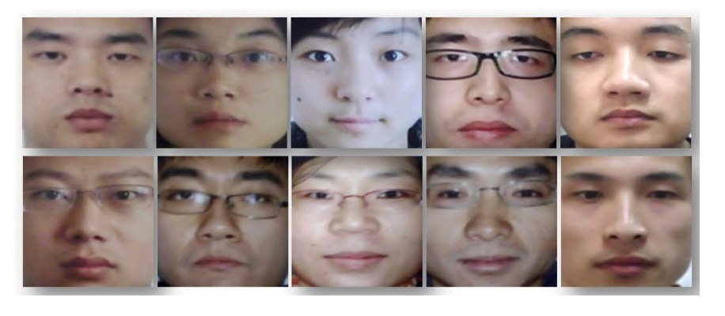
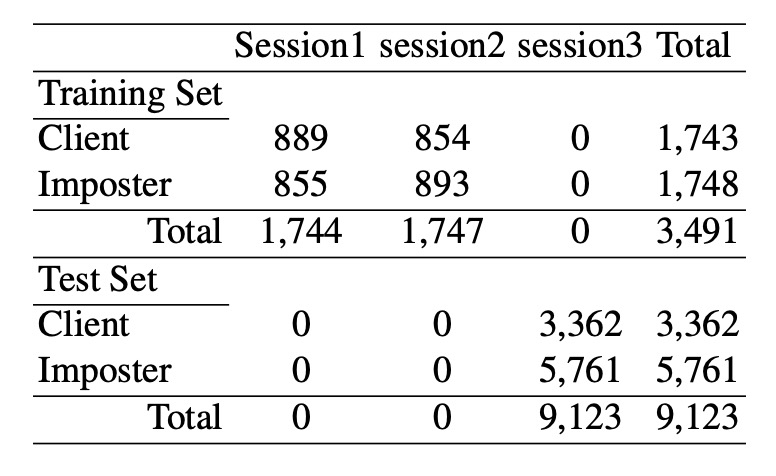
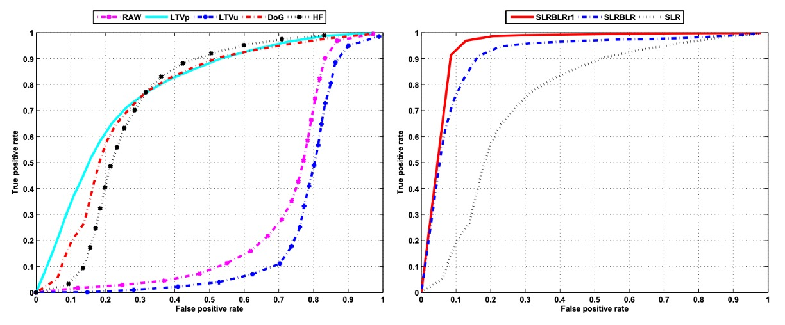
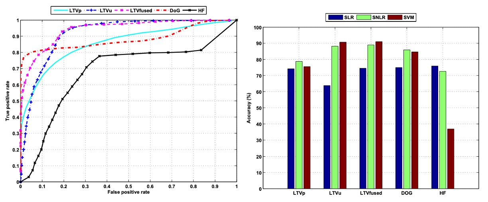

## 沈默的反射光

[**Face Liveness Detection from A Single Image with Sparse Low Rank Bilinear Discriminative Model**](https://parnec.nuaa.edu.cn/_upload/article/files/4d/43/8a227f2c46bda4c20da97715f010/db1eef47-b25f-4af9-88d4-a8afeccda889.pdf)

---

這次我們要來深度走訪活體辨識的技術脈絡。

在一開始，我們選了幾篇論文作為該領域發展前期的重點。

## 定義問題

活體辨識的議題早在 2010 年前就已經有很多研究，在當時的方法使用臉部運動（如眨眼、微小臉部變化）或皮膚質感、深度資訊等特徵來辨識活體。

但，只要對方知道你是採用何種算法，就可以被針對性的破解。像是臉部運動的偵測可以被短片播放，照片晃動或雙照片仿真的方式欺騙。

那如果引入 3D 相機或是熱成像儀呢？

那就更沒用了。

我們出門可以隨身帶手機，但絕不會吃飽撐著帶個熱成像儀出門，只為了不知道在什麼時候用它來證明自己是活體。

**因此本篇論文的作者提出要透過「一張影像」就認出對方是否為活人，不假其他外力。**

舉例來說，參考下圖，哪幾張是拍攝人臉照片（翻拍）？哪幾張是拍攝真實的人臉？

<figure style={{"width": "90%"}}>

</figure>

答案是：從右邊數來第一個 Column 是真的，其他都是照片翻拍。

什麼！你說你肉眼根本看不出來？

說得對，這就是問題。

## 解決問題

在當時，最流行的影像特徵擷取方法是主成分分析（PCA），但作者發現，透過 PCA 所得到的活體與冒充影像的特徵分佈存在大量重疊，無法有效區分兩者。

:::tip
PCA 的概念是抽取影像中最具代表性的特徵，所以我們可以想想在人臉圖像中最明顯的特徵是什麼？對，就是人臉本身。

但這也正是問題所在。PCA 所提取的特徵往往聚焦在人臉的整體結構，而非細部的反射與照明差異，因此無法有效區分活體與冒充影像。
:::

為了解決這個問題，作者改採「Lambertian 反射模型」作為分析基礎，期望從光照與表面交互的角度來尋找判別依據，並且將這個問題視為一個「二元分類」的問題，簡單來說，就是將影像分為「活體」或「冒充」兩類。

Lambertian 反射模型是一種描述表面如何散射入射光的數學模型，假設表面為理想的漫反射體。這代表表面會將光線均勻地向所有方向散射，且觀察亮度與觀察角度無關。

這種特性來自於 Lambert 的餘弦定律，其基本公式為：

$$
I(x,y) = f_c(x,y) \, \rho(x,y) \, A_{\text{light}} \cos\theta
$$

其中：

- $I(x,y)$：影像中位置 $(x,y)$ 的亮度；
- $f_c(x,y)$：相機的光響應因子，通常視為常數；
- $\rho(x,y)$：反射係數，代表表面的漫反射特性；
- $A_{\text{light}}$：光源強度；
- $\cos\theta$：光線與表面法向量之夾角的餘弦值，可寫作 $n \cdot s$。

根據此模型，當光線與表面法向夾角越小（$\cos\theta$ 趨近 1），反射強度越高；反之，夾角越大（$\cos\theta$ 趨近 0），反射強度就越低。這種光照反射的變化，對於描述如人體皮膚、紙張等非鏡面反射物體而言非常貼切。

進一步地，作者將此模型應用於活體偵測的場景，針對在相同照明條件下取得的兩張影像：

- 活體影像 $I_t(x,y)$
- 冒充影像 $I_f(x,y)$

根據 Lambertian 模型，兩者皆可表示為：

$$
I(x,y) = f_c(x,y) \rho(x,y) A_{\text{light}} \cos\theta
$$

假設 $f_c(x,y)$ 為常數，則：

$$
I_t(x,y) = \rho_t(x,y) A_{\text{light}} (n_t \cdot s)
$$

$$
I_f(x,y) = \rho_f(x,y) A_{\text{light}} (n_f \cdot s)
$$

進一步拆解為：

$$
I_t(x,y) = \rho_t(x,y) \mu_t(x,y)
$$

$$
I_f(x,y) = \rho_f(x,y) \mu_f(x,y)
$$

其中 $\mu(x,y) = A_{\text{light}} (n \cdot s)$，將影像拆解為反射成分 $\rho(x,y)$ 與照明成分 $\mu(x,y)$，突顯了兩者在活體與冒充之間的區分潛力。

為了估計照明成分 $\mu$，作者採用 Logarithmic Total Variation (LTV) 平滑方法：

$$
\mu = \arg \min \| \nabla \mu \|_1 + \lambda | I - \mu |
$$

其中 $\lambda$ 預設為 0.5。

接著，運用 Land’s Retinex 公式計算反射成分：

$$
\log(\rho(x,y)) = \log(I(x,y)+1) - \log(\mu(x,y)+1)
$$

這樣的分解讓我們觀察到：活體影像的 $\mu$ 含有更多的表面法向資訊，而照片影像的 $\mu$ 相對平滑，說明其光照與結構細節較為單一。這是因為冒充影像經歷相機拍攝與列印過程後，影像品質與細節皆有所損失。

為了強化這些差異，作者進一步使用 DoG 濾波器（差分高斯）提取影像中的高-中頻區域變異：

- 內部高斯標準差 $\sigma_0$ 為 0.5
- 外部高斯標準差 $\sigma_1$ 為 1.0

經過 DoG 處理後，活體影像的高頻成分（尤其水平方向）更為明顯，而冒充影像的中頻部分則顯得失真與模糊。

此外，在相同照明條件下，照明成分比值 $\mu_f/\mu_t$ 主要受表面法向 $n_f$ 與 $n_t$ 所影響，這意味著可以透過「真實用戶的參考影像」來協助辨識冒充攻擊。

針對不同照明條件，作者提出以下處理策略：

- 使用奇異值分解（SVD）從訓練資料中學得 $K$ 個常見光照方向，構成光照矩陣 $S \in \mathbb{R}^{3\times K}$；
- 將任意照明影像 $\mu$ 投影到該光照空間，求得重構係數 $v$，以此作為分類器的輸入特徵。

但因 LTV 分解有可能將部分紋理細節滲入 $\mu$，導致其分布變得非線性，為避免誤差累積，作者選擇直接從潛在樣本學習分類器，而非進行進一步手工特徵設計。

分類器設計方面：

- **稀疏邏輯斯迴歸：** 將標準邏輯斯迴歸加入 $\ell_1$-正則化，控制高維樣本下的過擬合問題。
- **稀疏低秩雙線性邏輯斯迴歸：** 直接操作二維影像結構，學習低秩投影矩陣 $W = LR$，在 $L$ 與 $R$ 上施加 $\ell_{2,1}$-正則化，使部分列向量歸零，達成稀疏與低秩性，透過交替坐標下降法優化，直至收斂。

最終，再透過核映射 $\phi$ 將原始樣本轉換到高維特徵空間，並套用上述稀疏分類模型進行活體偵測。

此方法為一種非參數機率模型，雖然參數數量隨樣本增加而上升，但透過 $\ell_1$ 正則化能有效控制其複雜度，且整體計算效能優於其他如 pSVM、RVM、IVM 等常見模型。

:::info
「非參數機率模型」（non-parametric probabilistic model）是一類不對模型的參數數量進行固定假設的機器學習方法。

這並不代表這些模型「沒有參數」，而是指模型的複雜度（如參數數量）會隨著資料量的增加而自動調整，而非事先決定一個固定的結構或大小。
:::

<figure style={{"width": "90%"}}>

</figure>

公式看了這麼多，作者也貼心地用一張範例圖像來說明整個模型架構。

上圖展示了針對「真實使用者影像」（上排）與「冒充影像」（下排）所推導出的潛在樣本，透過不同影像處理與頻譜分析技術，提取有助於區分兩者的關鍵特徵。

我們逐一說明每個欄位所代表的意義：

- **Column 1**：這是原始影像，上排是真實使用者影像，下排為冒充影像（照片翻拍）。
- **Column 2**：這是 LTV 估計的照明影像 (µ Image)，顯示經 LTV 方法估計出的照明分布。真實影像中，µ 通常含有更多曲面與法向變化資訊；而冒充影像則顯得平滑，缺乏立體感。
- **Column 3**：這是 LTV 估計的反射影像 (ρ Image)，捕捉物體本身的材質與紋理，與光照變化無關。真實人臉與冒充影像的反射圖，在細節與紋理上常有顯著差異。
- **Column 4**：這是原始影像的傅立葉頻譜，中心化的頻譜揭示全域空間頻率分佈，可反映出影像的細節與紋理豐富度。
- **Column 5**：這是使用 DoG 過濾後影像的中心化傅立葉頻譜，強調高-中頻資訊，突顯因立體結構與材質差異而產生的空間細節，為分類提供關鍵依據。

## 訓練與驗證資料集

<figure style={{"width": "60%"}}>

</figure>

<figure style={{"width": "90%"}}>

</figure>

利用普通廉價網路攝影機於三次不同拍攝會議中採集資料，每次間隔約兩週，環境與光照條件各異。共 15 位受試者參與，每次皆捕捉活體影像（500 張、20fps）及相對應的照片影像。

照片影像先用高畫質相機拍攝，再以不同尺寸與印刷方式（相紙與 A4 彩色列印）製作，模擬各類攻擊情境。訓練集來自前兩次拍攝（活體與冒充影像分別約 1743 與 1748 張），測試集來自第三次拍攝（分別 3362 張活體與 5761 張冒充影像），且部分受試者僅出現在測試集中。

所有影像經過人臉偵測、眼部定位、幾何標準化、裁切至 64×64 像素及轉換成灰階圖，詳細資料配置如下表：

<figure style={{"width": "60%"}}>

</figure>

## 討論

### SLR 性能評估

<figure style={{"width": "90%"}}>

</figure>

為驗證前述特徵與模型在實際應用中的效能，作者首先使用稀疏線性邏輯斯迴歸（SLR）對不同影像特徵進行辨識實驗。上圖左側展示了各特徵類型在辨識任務中的表現，每條線對應一種特徵輸入，結果如下：

- **RAW（原始灰階影像）：** 效能表現最差，顯示直接使用原始像素值作為輸入無法有效分辨活體與冒充影像。
- **LTVu（由 LTV 分解所得之照明影像）：** 同樣表現不佳。雖然包含光照資訊，但其非線性特性不利於線性分類器進行有效判別。
- **LTVp（由 LTV 分解所得之反射影像）：** 表現明顯提升，AUC 約 0.78，顯示反射特徵能更有效捕捉物體材質與紋理差異。
- **DoG（差分高斯過濾影像）：** 亦展現不錯的效果，AUC 約 0.75。中頻特徵的強調能提升影像在特徵空間中的可分性。
- **HF（高頻成分的一部分）：** 表現相對較差，AUC 僅約 0.69，說明高頻成分雖能提取細節，但也容易受噪聲與失真影響，導致穩定性不足。

綜上所述，LTVp 與 DoG 特徵在活體與冒充影像的辨識上皆優於 RAW 與 LTVu，進一步佐證了反射與中頻特徵在該任務中的判別潛力。相比之下，僅取高頻資訊雖能捕捉部分邊緣特徵，但由於其不穩定性，使得整體效能仍落後於 LTVp 與 DoG。因此，後續實驗不再採用原始影像作為輸入特徵。

進一步地，作者分析了在使用相同特徵（此處為 DoG 過濾影像）下，不同稀疏線性分類模型的效能差異，如圖右所示：

- **標準稀疏邏輯斯迴歸（SLR）：** 在 DoG 影像上得到 AUC 約 0.75，作為基準。
- **稀疏低秩雙線性邏輯斯迴歸（SLRBLR）：** 引入影像空間結構與低秩假設後，AUC 明顯提升至約 0.92。
- **SLRBLR 的特例 SLRBLRr1（rank=1）：** 更進一步限制投影矩陣的秩為 1，AUC 高達 0.95，顯示極低秩的投影仍能保留最關鍵的區辨資訊，且效果最佳。

這些結果顯示，將傳統的 SLR 擴展為雙線性形式，並結合稀疏與低秩正則化，可以有效挖掘影像中潛藏的空間結構，大幅提升分類能力。特別是 SLRBLRr1，透過極簡化的低秩投影矩陣，反而能更聚焦於最具代表性的變異方向，展現強大的辨識能力。

從特徵設計的角度來看，反射特徵（LTVp）與中頻特徵（DoG）能顯著提升樣本間的區辨度；從分類模型的角度看，**低秩雙線性模型的引入**進一步拓展了線性分類器的表現上限。

藉由這樣的設計，模型效能從 AUC 0.75 躍升至最高 0.95，證明該方法在活體辨識任務中具有強大的實用潛力。

### 分類器性能評估

<figure style={{"width": "90%"}}>

</figure>

為進一步提升辨識效能，作者將原本的線性分類模型擴展為**非線性稀疏邏輯斯迴歸（SNLR）**，上圖左側即為其在不同輸入特徵下的偵測效能。透過引入非線性決策邊界，整體偵測能力有了顯著提升。

以 LTV 分解所獲得的照明成分（LTVu）為例，在傳統線性分類器中其 AUC 僅約 0.22，幾乎不具辨識能力；但經 SNLR 處理後，AUC 大幅提升至 0.92，充分說明該特徵具有潛在的分類價值，只是需要更具表現力的非線性模型來發掘。

此外，當反射成分（LTVp）與照明成分（LTVu）結合作為輸入時，分類性能進一步提升，AUC 達到 0.94，顯示這兩種特徵在資訊上具有互補性，結合後能加強模型的判別能力。

在所有特徵中，DoG 過濾後的影像在 ROC 曲線上的表現最為亮眼，其曲線呈現快速上升趨勢，表示模型在維持極低假陽性率的情況下，依然能達成高真正率，這對於實際應用場景（如人臉驗證系統）尤其重要。

---

上圖右側進一步比較了三種分類器模型在不同特徵輸入下的**整體分類準確率**：包含稀疏線性邏輯斯迴歸（SLR）、稀疏非線性邏輯斯迴歸（SNLR）與機率型支持向量機（SVM）。分類結果基於 9,123 張測試影像，透過適當閾值設定，計算其正確分類的比例。

結果顯示，**DoG 特徵在各模型中皆展現穩定且優異的表現**。其能有效去除高頻雜訊與低頻干擾，保留中頻的結構資訊，對活體與冒充影像的區分效果尤其顯著。相比之下，僅使用高頻特徵（HF）則因容易受到噪聲與邊緣偽影影響，分類準確率相對較低。

傳統傅立葉頻譜分析雖能提取全域頻率資訊，但其分類準確率約為 76.7%，比 DoG 特徵低約 10%，顯示其穩定性與區辨能力均較不足。而 LTV 分解所獲得的反射（LTVp）與照明（LTVu）影像，經與非線性模型結合後，也展現出良好的輔助效果，進一步提升整體系統辨識性能。

綜合以上分析，不論是在特徵提取或模型設計層面，**DoG 特徵與非線性稀疏分類器的結合**都為活體偵測任務提供了顯著效能提升，展現極高的實用潛力與拓展空間。

## 結論

本論文透過物理反射模型對影像中固有的表面特性進行解析，強調從影像中萃取本質資訊以區分真人與照片的重要性，並為後續多模態融合與跨域學習方法建立了堅實的理論基礎。

在技術實作層面，作者提出一種「非侵入、即時、且無需額外硬體設備」的活體檢測方法，不僅具備實用性，也提供了在現有系統中可直接部署的解決方案。

雖然當今活體偵測技術在性能與穩健性方面已大幅超越早期方法，但該論文所提出的影像分解策略與特徵學習觀點，仍被視為理解與優化活體檢測系統的重要依據。其核心思想在當代多模態融合、跨光照條件適應等前沿議題中，依然持續發揮著深遠的影響與啟發作用。
