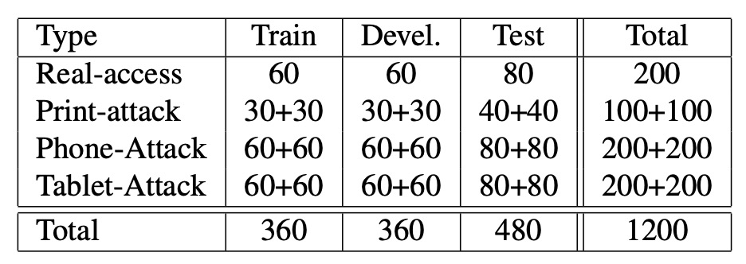

## 輕快的微紋理

[**On the Effectiveness of Local Binary Patterns in Face Anti-spoofing**](https://infoscience.epfl.ch/server/api/core/bitstreams/70fcdacd-de76-46e2-8b91-e338039bd09b/content)

---

這裡我們可以先定義出幾個重要的名詞概念：

1. **主動活體**：使用者按照指定的動作或指令進行操作，例如眨眼、轉頭等，這些動作是由系統主動要求的。然後系統會檢測這些動作是否符合預期，以確認使用者的身份。
2. **被動活體**：使用者在不知情的情況下進行自然動作，例如自然地看著鏡頭或微笑。系統會自動檢測這些動作，以確認使用者的身份。

簡單來說，被動活體的技術訴求在於不需要使用者主動配合，而是透過自然的行為來進行身份驗證。這樣的技術可以提高使用者的便利性，並且減少使用者在身份驗證過程中的負擔。

講好聽點是減少負擔，但仔細一想，你會發現「主動活體」的技術非常容易被攻擊者利用。舉例來說，攻擊者可以透過錄製使用者的動作，然後將這些錄影播放給驗證系統，從而繞過身分驗證。

:::tip
**難道不能選擇幾個動作進行隨機排列組合嗎？**

可以，但是使用者會隨著動作增加而感到不悅。

每個對於使用者的要求，都會降低整體使用體驗，最後技術部門會被行銷部門要求降低使用者的負擔，這樣就會回到原本的問題上。
:::

## 定義問題

作者認為，過去文獻在建構攻擊場景與資料集時仍有許多簡化假設，無法完全反映真實應用中的多樣性與複雜度。因此，他嘗試提出更具實用價值的改進方向。

在這篇論文中定義了幾個重要的攻擊方式：

1. **Print Attack**：攻擊者使用列印照片欺騙系統。
2. **Mobile Attack**：攻擊者使用手機螢幕播放照片或影片。
3. **Highdef Attack**：攻擊者使用高解析度螢幕播放照片或影片。

下圖中，最左邊的欄位是真實的使用者，第二欄是 Print Attack，第三欄是 Mobile Attack，第四欄是 Highdef Attack。

<figure style={{"width": "90%"}}>

</figure>

為了更真實地模擬這些攻擊情境，作者建立了一套新的公開資料集 REPLAY-ATTACK，並在文獻所提出的多尺度 LBP 方法上，重新思考了特徵提取的設計：

- **採用了一種簡化版的 Local Binary Patterns（LBP）變體，聚焦在影像紋理的關鍵資訊上，提升偵測效率。**

這個方向主要受到以下研究的啟發：

- [**[11.10] Face spoofing detection from single images using micro-texture analysis**](https://ieeexplore.ieee.org/document/6117510)

為了方便後續比對，作者將其簡稱為文獻 [7]，與本論文進行對照。

作者認為與文獻 [7] 相比，他在以下幾個方面作出了具體改進：

- **攻擊場景與數據更貼近真實應用**：文獻 [7] 僅使用 NUAA 資料集，且僅包含靜態圖像的印刷照片攻擊。這對於模擬現實世界的攻擊方式仍過於單一。
- **簡化特徵設計，提升效率與實作性**：雖然文獻 [7] 的多尺度 LBP 特徵在分類效果上表現良好，但其 833 維的高維特徵向量也帶來不小的計算負擔。

:::tip
那個年代還不流行幫自己的論文方法取名字，因此常會看到某某文獻的某某方法的這種寫法。要不就是非常冗長，要不就是極端簡略，總之都很難辨識就對了。
:::

## 解決問題

<figure style={{"width": "90%"}}>

</figure>

上圖展示了整個基於 LBP 的防假冒演算法流程圖。

輸入端首先接收原始影像。利用人臉檢測技術找出影像中的臉部區域，並將該區域縮放至固定尺寸，如 64×64 像素，這個步驟確保後續的特徵提取在統一尺度上進行。

接著特徵提取採用兩種不同的策略：

1. **Option 1**：對整張影像計算 LBP 特徵，生成一個 59 維的直方圖，這個直方圖即為該影像的紋理特徵向量。
2. **Option 2**：將影像劃分為 3×3 的區塊，對每個區塊獨立計算 LBP 特徵，然後將所有區塊的直方圖串接起來，形成一個 531 維的特徵向量。

最後將這些特徵向量輸入到分類器中，進行二元分類，並判定真假。

後面我們來看一下每個步驟的細節。

### Local Binary Patterns

對於一幅灰階影像 $I(x,y)$ 中的任一像素，其 LBP 算子以 3×3 鄰域作為基礎。

令中央像素值為 $I(x,y)$，而其周圍 8 個鄰域像素分別為 $\{I(x_p,y_p)\}_{p=0}^{7}$。

對每個鄰域像素，我們定義比較函數：

$$
s(z)=
\begin{cases}
1, & \text{if } z \geq 0, \\
0, & \text{if } z < 0.
\end{cases}
$$

因此，針對中央像素的 LBP 值計算公式為：

$$
LBP(x,y) = \sum_{p=0}^{7} s\big(I(x_p,y_p) - I(x,y)\big) \cdot 2^p.
$$

這個式子將 8 個比較結果（每個結果為 0 或 1）轉換成一個 8 位元的二進制數，對應的數值範圍為 $0$ 到 $2^8-1 = 255$。

### Uniform LBP

在論文中，將 Uniform LBP 記為 $LBP^{u2}$。

在眾多可能的 8 位元二進制模式中，有些模式被認為是「uniform」，即在循環（circular）檢查中，從 0 到 1 或從 1 到 0 的轉換次數最多不超過 2 次。

形式上，對於一個二進制序列 $b_0b_1\ldots b_{P-1}$（這裡 $P=8$），若其轉換次數 $U$ 滿足

$$
U(b_0,\ldots,b_{P-1}) \leq 2,
$$

則該模式稱為 uniform。

非 uniform 模式通常被合併為單一類別。這樣做可以顯著降低直方圖的維度，對於 3×3 鄰域而言，經常得到的 uniform 模式總數為 59 個，故整體特徵向量維度為 59。

### 特徵向量的生成

- **(1) Per-Image 特徵**

  - **全圖直方圖**：對整個臉部區域（通常先將臉部邊界框歸一化至 64×64 像素）中每個像素計算 LBP$^{u2}_{3\times3}$ 值，然後統計每個 uniform 模式出現的次數，形成一個 59 維的直方圖。經過歸一化後，該直方圖即作為該影像的紋理特徵向量。

- **(2) Per-Block 特徵**

  - **區塊直方圖**：將歸一化後的臉部影像劃分成 $3\times3$ 的區塊，每個區塊內分別計算一個 59 維的 LBP 直方圖。最後將所有 9 個直方圖串接起來，形成一個 $59\times9 = 531$ 維的特徵向量。這種方式可以更細緻地捕捉影像中局部區域（如額頭、臉頰等）的紋理差異。

:::tip
看到這邊，你應該有找到一點卷積網路的感覺了。只是這時候還是用手動的方式來做特徵提取，而且為了避免維度爆炸，還會採用特殊的手法來降低維度。
:::

### LBP 的延伸變體

除了基本的 LBP$^{u2}_{3\times3}$ 之外，本文還實驗了其他變體，主要包括：

- **tLBP（Transitional LBP）**：其運作方式是循環比較中央像素相鄰的兩個鄰域像素，形成二值模式。這種方法強調相鄰像素之間的過渡特性。
- **dLBP（Direction-coded LBP）**：dLBP 針對經過中央像素的四個基本方向進行強度變化的編碼，每個方向用兩個位元表示，從而捕捉更多方向性資訊。
- **mLBP（Modified LBP）**：mLBP 類似於 Modified Census Transform (MCT) 的概念，不直接將中央像素與各鄰域像素比較，而是將鄰域像素與 3×3 區域的平均值進行比較，且捨棄了中央像素與平均值的比較結果。這樣可以減少中央像素可能帶來的噪音影響。

### 分類器

由於通過 LBP 算子獲得的特徵向量本質上是一個歸一化後的直方圖，因此初步的分類器通常採用 $\chi^2$ 直方圖比較方法。具體做法是：

- 在訓練階段，對所有真實存取影像計算直方圖並平均，得到一個參考直方圖；
- 對於待測影像，計算其 LBP 直方圖，然後用 $\chi^2$ 距離度量與參考直方圖之間的相似性，進而得到一個分類分數。

此外，文章也探討了更複雜的分類器（如 Linear Discriminant Analysis 與 Support Vector Machine），但基本的 LBP 特徵與 $\chi^2$ 分析已能有效捕捉真實與假冒影像之間的紋理差異。

:::info
$\chi^2$ 直方圖比較方法是一種用來衡量兩個直方圖之間差異的統計距離，主要用於比較圖像特徵的分布情況。

假設有兩個直方圖 $H$ 與 $G$，其每個 bin 的值分別為 $H_i$ 與 $G_i$（其中 $i=1,2,\ldots,N$），則 $\chi^2$ 距離可以定義為：

$$
\chi^2(H, G) = \sum_{i=1}^{N} \frac{(H_i - G_i)^2}{H_i + G_i + \epsilon},
$$

這裡 $\epsilon$ 為一個極小值，用來避免除以零的問題。

在應用中，較小的 $\chi^2$ 距離表示兩個直方圖的分布越相似。當我們用 LBP 提取圖像的紋理特徵後，得到的特徵向量實際上就是一個直方圖，這時就可以利用 $\chi^2$ 直方圖比較來測量待測圖像與參考直方圖（例如，平均所有真實存取圖像的直方圖）的相似性，以判斷該圖像是否為真實存取或假冒攻擊。
:::

## 資料集概述

本篇論文中提出了一個名為 **REPLAY-ATTACK** 的公開資料集，專門用於研究人臉辨識系統的防偽技術。以下是資料集的主要配置：

- **資料集名稱**：REPLAY-ATTACK
- **資料集大小**：包含 50 位受試者，共收錄 1,200 段影片（每位受試者拍攝 24 段影片）。
- **影片長度與格式**：每段影片長 15 秒，解析度為 320×240（QVGA），幀率為 25 幀/秒。
- **錄製場景**：影片分別在兩種靜態場景下拍攝：
  1. **Controlled 條件**：背景為均勻場景，光源為螢光燈照明；
  2. **Adverse 條件**：背景不均勻，由自然日光照明。
- **拍攝設備**：使用 Apple 13 吋 MacBook 筆電錄製影片，拍攝時受試者坐在鏡頭前方。
- **攻擊方式**：資料集設計了三種常見的假冒攻擊手法：
  1. **Print 攻擊**：使用雷射印表機（Triumph-Adler DCC 2520）將高解析度照片印在 A4 紙上；
  2. **Mobile 攻擊**：以 iPhone 3GS 拍攝照片／影片並於裝置螢幕上播放；
  3. **Highdef 攻擊**：以 Canon PowerShot SX150 IS 拍攝高解析度內容，並於 iPad 螢幕（1024×768）上播放。
- **攻擊呈現模式**：每種攻擊皆有兩種實作方式：
  1. **Hand-based**：操作者手持裝置進行攻擊，畫面會有輕微晃動，有時可誤導眨眼檢測器；
  2. **Fixed-support**：裝置置於固定支架，無晃動。
- **影片分類**：資料集依照受試者隨機分成三個子集：訓練集、訓練集與測試集，身份之間不重疊。攻擊影片同樣依據攻擊方式細分（手持／固定）。
- **訓練建議**：建議使用訓練集與訓練集進行模型訓練與參數調整，測試集僅用於最終評估。
- **額外資料**：另提供 100 段錄製於相同光照條件下的「註冊影片」，用於訓練基礎人臉辨識模型，以評估攻擊品質。
- **資料集公開性**：資料集與源碼均向公眾免費開放，並提供完整的協定與使用建議。
- **資料集網址**：[**REPLAY-ATTACK**](https://www.idiap.ch/en/dataset/replayattack)

---

<figure style={{"width": "80%"}}>

</figure>

上表顯示了 REPLAY-ATTACK 資料集在不同子集中的影片數量分布情況。

## 實驗評估方法

:::tip
這個評估方式到現在依然是相當常見的做法，可別跳過了！
:::

檢測系統可能會產生兩種錯誤：

- **False Rejection Rate (FRR)**：真實存取被誤拒的比例。（合法被誤判為攻擊）
- **False Acceptance Rate (FAR)**：攻擊樣本被誤接受的比例。（攻擊者被誤判為合法）

這兩種錯誤的綜合指標稱為 **Half Total Error Rate (HTER)**，計算公式為：

$$
\text{HTER} = \frac{\text{FAR} + \text{FRR}}{2}
$$

由於 FAR 與 FRR 都受閾值影響，因此常用 ROC 曲線來展示不同下的表現，並以 EER（等錯誤率，即 FAR 與 FRR 相等的點）作為發展集上選取閾值的依據，再在測試集上報告 HTER。

- **HTER 分數愈低表示分類器對真假臉部存取的辨識越準確。**

在實驗中，作者使用了三個資料集進行評估：REPLAY-ATTACK、NUAA 與 CASIA-FASD。

由於 NUAA 與 CASIA-FASD 資料集缺乏獨立的發展集，因此採用 5 折交叉驗證，並報告平均 HTER。

## 討論

### 不同 LBP 特徵的比較

<figure style={{"width": "80%"}}>

</figure>

上表展示了利用 $\chi^2$ 直方圖比較法作為分類器，對不同 LBP 特徵變體進行分類時，在 REPLAY-ATTACK 資料集上所得到的 HTER 結果。

- **LBP$^{u2}_{3\times3}$**：這是常用的「uniform LBP」，利用 3×3 鄰域計算 LBP 值，僅保留轉換次數不超過 2 的模式，最終生成一個 59 維的直方圖。
- **mLBP（modified LBP）**：在計算時，除了進行二值比較外，還會先計算 3×3 鄰域內像素強度的平均值，再與各鄰域像素進行比較（中央像素與平均值的比較則捨棄），從而得到稍微改進的紋理描述。

其他延伸的 LBP 變體（如 tLBP、dLBP）也可能在實驗中進行了評估，但上表的重點在於對比 mLBP 與傳統的 LBP$^{u2}_{3\times3}$ 的效果。

儘管 mLBP 在區分真實存取與假冒攻擊上具有稍微優越的效果，但考量到計算成本與方法的普及性，LBP$^u2_{3\times3}$ 還是被選為後續比較的主要特徵。這也說明了在防偽任務中，方法不僅需要達到高精度，同時也需要考慮運算效率與實現複雜度。

### 不同資料集的比較

<figure style={{"width": "90%"}}>

</figure>

- **∗（星號）**：表示該行結果是使用 Bob 工具箱重現文獻 [7] 的方法，包含特徵擷取與分類。
- **‡（雙十字）**：表示引用自文獻 [7] 中報告的原始數值，該結果使用 Matlab 實現 LBP 特徵，並以 LibSVM 進行分類。
- **§（段落符號）**：表示使用文獻 [7] 原作者提供的特徵，並以 Bob 工具箱進行分類所得之結果。

  :::info
  雖然前面講過一次了，不過為了避免你忘記，這裡再複習一次。

  文獻 [7] 請參考這篇論文：[**[11.10] Face spoofing detection from single images using micro-texture analysis**](https://ieeexplore.ieee.org/document/6117510)
  :::

---

為了比較不同方法在各種資料集上的效能，作者在三個公開資料集上進行了實驗，並使用 LBP 特徵計算各自的 HTER 作為指標。這些結果均為 5 折交叉驗證的平均值。

在特徵提取策略上，**REPLAY-ATTACK 使用的是全圖特徵，而 NUAA 與 CASIA-FASD 則採用區塊特徵**。

結果顯示，針對不同資料集，特徵的選擇對分類表現有顯著影響：

- 在 **REPLAY-ATTACK** 資料集中，全圖特徵取得較佳效果，可能是由於其影像品質高、拍攝環境穩定，使得整體紋理分布具代表性。
- 相對地，在 **NUAA** 與 **CASIA-FASD** 資料集中，區塊特徵表現更佳，這可能歸因於這兩者的影像品質較低、環境較為複雜，局部紋理差異較明顯。

此外，表格中也凸顯了 NUAA 資料集上分類器的**過擬合現象**：在訓練／發展集上的表現良好，但測試集結果則顯著下降。

:::tip
這突顯了在設計防偽資料集時，必須嚴格區分訓練、發展與測試集，以確保模型的泛化能力。
:::

從模型設計角度來看，雖然文獻 [7] 所使用的 833 維擴展特徵向量能帶來約 1.3% 的精度提升，但其代價是大量的支持向量。例如使用 59 維特徵時 SVM 的支持向量已高達 25,717 個，顯示在效能與資源消耗上需謹慎權衡。

:::info
**小知識：**

作者對文獻 [7] 的結果進行了復現時發現數據有問題！

在 NUAA 資料集上，作者復現方法所得 HTER 為 13.17%，與原文中的 2.5% 差距甚大。

經深入比較後發現，部分差異可能來自於 LBP 特徵實作的差異：原作者以 Matlab 實現特徵時，約有 4% 的編碼在雙線性插值處理上出現異常，進而影響結果。

當使用該原始特徵並改以 Bob 工具箱進行分類時，HTER 降至 4.23%，雖更接近原報告值，但仍存在差距，可能與交叉驗證策略不一致有關。
:::

## 結論

在深度學習尚未成為主流的年代，作者就已明確指出：即使人臉辨識模型表現再好，若缺乏有效的防偽檢測，就無法真正保證系統的可信度。這個觀點放到今天依然成立，而「Face Anti-Spoofing」也已成為生物辨識系統中不可或缺的核心模組之一。

接著，REPLAY-ATTACK 資料集是當時少數針對影片攻擊、涵蓋多種假冒類型的公開資源。不只包含 Print、Mobile、Highdef 三種攻擊，還考慮了不同設備與錄製條件，並設計了完整的訓練與測試協定。這為後續眾多 FAS 研究建立了基準線，也促成了後來資料集標準化的趨勢。

雖然從今天的角度看，LBP 特徵在表現上已無法與 CNN、Transformer 等深度模型競爭，但其「計算效率高、可重現性強」的特點，在資源受限場景中仍具實用價值，也為整個領域奠定了發展方向。
