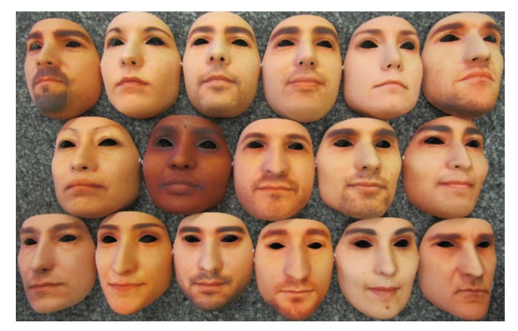

## 真實的假面

[**Spoofing Face Recognition with 3D Masks**](https://infoscience.epfl.ch/server/api/core/bitstreams/1694cd6d-ff27-4323-8993-c76232d5aa14/content)

---

還記得我們之前看過了什麼惡意攻擊？

- **Print Attack**：攻擊者將目標用戶的照片列印出來，然後將其用來突破人臉辨識系統的安全防護。
- **Replay Attack**：攻擊者錄製目標用戶的影片，然後將其重播以欺騙人臉辨識系統。

你說這解析度太低？好說，找一台 4K 螢幕來播放就行了。

## 定義問題

在我們都還著眼於這些 2D 攻擊的時候，3D 攻擊已經來了。

這篇論文的作者指出：隨著 3D 重建和列印技術的進步，過去研究對於攻擊型態還停留在 2D 攻擊的假設上，這種假設不再成立。

因為我們可以輕易地從 2D 照片重建出 3D 模型，然後列印出來，這樣就能夠製作出一個與目標用戶的面部結構極為相似的面具。

這個面具可以輕易製造出：

1. **景深效果**：可以突破景深檢測系統。
2. **臉部表情**：可以突破主動式活體檢測系統。

它既不是印刷，也不是錄影回放。它可以直接突破基於所有 2D 攻擊的防禦系統。

哎呀！完蛋了。

## 解決問題

針對 3D 面具攻擊的挑戰，作者提出一個直接的解決方案：

- **先建立一套具代表性的 3D 面具攻擊資料集，然後基於這些資料來訓練新一代防禦系統**。

這樣的策略從資料實作出發，有助於釐清真實場景中的攻擊樣態與辨識模型的弱點。

### Morpho 資料集

Morpho 是由 MORPHO 公司在 TABULA RASA 計畫中收集的私有資料集。雖然無法公開取得，但它仍是少數包含高精度 3D 面具攻擊樣本的資料集之一，對早期的 FAS 研究有指標性意義。

資料集中共收錄：

- 207 個真實訪問樣本
- 199 個 3D 面具攻擊樣本
- 同時提供 2D 彩色影像與 3D 臉部模型

這些面具是針對 16 位特定用戶製作，先使用結構光 3D 掃描器建構臉部模型，再透過 3D 列印技術製成灰階材質、外型逼真的面具。錄製過程中每位用戶拍攝 9 至 15 次，總共包含 20 位受試者資料，並在每幀中標註兩個眼角與鼻尖座標。

**特色與限制如下：**

- 面具具備極高形狀精度，是真實臉部的準確複製
- 所有樣本均於單一拍攝場次完成，避免環境變異
- 錄製對象須配合靜止，增加攻擊者取得掃描資料的難度
- 資料集為私有資源，無法作為公開研究基準

資料集樣本如下圖，最左側為目標用戶的灰階臉部影像，中間為深度圖，最右側為 3D 面具的灰階影像。這些樣本均來自於 Morpho 資料集。

<figure style={{"width": "60%"}}>

</figure>

### 3D Mask Attack Database (3DMAD)

在傳統上，製作方式需仰賴 3D 掃描器，**需近距離並取得使用者配合**，在真實攻擊場景中不易實現。雖然掃描精度提升，但在沒有授權的情況下取得「高品質 3D 臉部資料」仍非常困難。因此在早期的研究中，3D 面具攻擊的普及性受到限制。

然而近年來，**3D 列印與臉部建模技術的商業化服務快速發展**，降低了面具製作的技術門檻與取得難度。我們只需要取得使用者的 2D 臉部照片（如網路社群大頭照）且幾乎無感知風險，更具實務威脅。

為了模擬這種**低成本、高可取得性**的攻擊模式，作者選用了一家名為 **[ThatsMyFace.com](https://www.thatsmyface.com/)** 的第三方服務進行面具製作。

製作步驟如下：

- **影像蒐集：** 每位受試者需提供 **一張正面照** 與 **兩張側面照**（左側與右側），共三張高品質的 2D 臉部影像。這些影像將成為 3D 臉部重建的輸入來源。
- **模型重建與面具列印：** 上傳至 ThatsMyFace 之後，平台會自動將這三張照片重建成 3D 臉部模型。用戶可於網站上預覽模型，確認外觀後下單訂製。

  作者為每位使用者製作了兩種面具：

  - **可穿戴全尺寸面具**：硬樹脂材質、有眼孔與鼻孔，模擬實際攻擊。

      

      <figure style={{"width": "80%"}}>
      
      </figure>
      

  - **紙藝組裝面具**：較低成本，僅用於展示與未來參考。

      

      <figure style={{"width": "70%"}}>
      
      </figure>
      

在資料集中，每位用戶的上傳影像（正面與側面照）、紙藝面具檔案、列印用 STL 模型檔，也一併收錄於資料集中，以供未來研究用途。

---

完成 3D 面具後，作者設計了一套嚴謹的資料錄製流程，以模擬真實訪問與攻擊行為，並蒐集可供模型訓練的彩色與深度影像。

整體錄製工作由 Microsoft Kinect for Xbox 360 完成，該裝置可同步擷取 RGB 與深度影像，對於偵測與分析 3D 面具攻擊具有重要價值。

Kinect 的特色如下：

- **每秒 30 幀**：同步擷取 RGB 與深度畫面
- **影像解析度**：
  - 彩色影像：640 × 480 像素，24 位元（3 × 8 bits）
  - 深度影像：640 × 480 像素，11 位元（1 × 11 bits）
- **支援手動標註**：可針對彩色影像進行眼睛位置的人工標記

這樣的設計使研究人員得以從多模態視角分析攻擊樣本，不僅有利於開發更穩健的防禦演算法，也能比較 2D 與 3D 模型在不同場景下的辨識能力。

---

為了模擬不同情境下的真實行為，3DMAD 的錄製工作安排了三個不同的拍攝會話。這種設計考慮到時間、角色與攻擊變因的影響，能有效建立資料的多樣性。

每位使用者參與的錄製安排如下：

- **會話一、會話二**（真實訪問）：

  - 間隔兩週拍攝，以反映生物辨識中「時間差異」的挑戰
  - 每場錄製 5 段影片，每段長度 10 秒
  - 使用者直視攝影機，正常臉部互動

- **會話三**（面具攻擊）：

  - 由**單一攻擊者**佩戴先前製作好的 3D 面具進行模擬攻擊
  - 每個面具錄製 5 段影片，模擬不同攻擊動作與角度

- **總體規模**：
  - 17 位使用者 × 3 個會話 × 5 段影片 = **共 255 段影片**
  - 每段影片為 10 秒、共 300 幀，總計約 **76,500 幀** RGB 與深度資料

實際拍攝樣本如下圖範例，從左到右分別對應了上述的三個會話：

<figure style={{"width": "90%"}}>

</figure>

---

為確保後續模型訓練的品質與一致性，作者針對資料標註與拍攝環境做了高度控制：

- **眼睛位置標註**：

  - 每段影片中，每隔 60 幀人工標註一次眼睛位置
  - 其餘幀數透過線性插值自動補齊，達成每幀皆有標註座標

- **拍攝環境設計**：
  - 使用者正面面對攝影機
  - 背景統一（無干擾圖樣）
  - 照明充足，避免臉部陰影或過曝

此環境設定能最大化去除背景與光線干擾，聚焦於辨識面具與真臉的差異。

## 討論

:::tip
請先記得這兩個指標的定義，不然後面圖表會看不懂哦！
:::

為了系統性評估人臉辨識系統在面具攻擊下的脆弱性，作者在本研究中提出了多項基準實驗，並以 **Equal Error Rate（EER）** 與 **Spoofing False Acceptance Rate（SFAR）** 作為兩項主要評估指標：

- **EER** 表示系統在驗證任務中，錯誤接受與錯誤拒絕發生機率相等時的閾值錯誤率，「越低」表示驗證系統越準確。
- **SFAR** 則是專門針對偽造攻擊設計的指標，用以量化「攻擊樣本通過驗證閾值」的比率，反映系統在面具攻擊下的抗偽能力，「越低」表示系統越安全。

### 3D 面具攻擊安全性分析

:::info
**在本論文中，參考文獻 [22] 指的是：**

- [**[13.03] On the vulnerability of face recognition systems to spoofing mask attacks**](https://ieeexplore.ieee.org/abstract/document/6638076)
  :::

上表呈現了三組演算法（LBP-2D、LBP-2.5D、TPS-3D）在不同資料集與預處理策略下的驗證錯誤率（EER）與面具攻擊成功率（SFAR），共分為四個設定：

- (1): 文獻 [22] 中所報告的結果（限 Morpho 資料集，未提供 SFAR）
- (2): 採用文獻 [22] 提供的預處理影像，並以作者實作的演算法測試（Morpho）
- (3): 作者自建預處理流程與演算法的完整重建實驗（Morpho）
- (4): 使用自定義預處理與演算法，在 3DMAD 資料集上測試（包括驗證與攻擊）

---

表中數據顯示，作者在 (2) 中成功重現了文獻 [22] 的 EER 結果，差異極小，顯示演算法實作與設定一致，具備良好的可重現性與參考價值。

在 2D 模式下，即便更換了預處理方式（從 (2) 到 (3)），EER 表現並未顯著變化，顯示裁切與幾何標準化流程一致。然而，SFAR 卻有明顯上升，代表面具邊緣是否出現在影像中，對於攻擊成功率具有顯著影響。

在 2.5D 與 3D 模式中，若省略如文獻 [22] 中的平滑與補洞處理，會導致 EER 與 SFAR 同時惡化。這說明預處理品質會嚴重影響模型的穩定性與抗攻擊能力。

橫向比較不同資料集的結果顯示：在相同演算法下，3DMAD 的整體表現不如 Morpho，推測原因包括：

- Kinect 所取得的深度品質不如 Morpho 採用的雷射掃描器；
- 3DMAD 的面具來自 2D 圖像重建，形狀精度較低，影響 spoofing 效果。

---

作者進一步針對 3DMAD 中的 17 個面具逐一分析，並比較四種演算法（LBP、TPS、ISV、ICP）在 2D / 2.5D / 3D 三種模式下的 EER 與 SFAR，結果如下圖所示：

<figure style={{"width": "90%"}}>

</figure>

分析顯示，不同面具間的 SFAR 差異極大，從 0% 到 98.4% 不等，這些落差主要來自：

- 面具製作的形狀準確度
- 臉部紋理的真實性與還原度

這說明單一平均值難以反映整體攻擊風險，逐面具分析才是評估 spoofing 能力的必要方式。

作者進一步觀察也發現，同一面具在不同模式下的攻擊表現差異顯著，例如：

- Mask #11 在 ISV-2D 模式下的 SFAR 高達 96.68%，但在 2.5D 僅為 7.52%。

這顯示：

- 紋理資訊強的面具可能在 2D 模式下具高攻擊性。
- 但若 3D 結構不足，則難以在 2.5D 或 3D 模式中發動有效攻擊。

同樣地，相同面具與模式下，不同演算法對攻擊的敏感程度也可能差異極大，例如：

- Mask #17 使用 ISV-2D 時的 SFAR 為 76.32%，但換成 LBP-2D 後僅剩 4.44%。

這說明演算法本身的特性（如判別力、泛化能力）會直接影響其對面具攻擊的抵抗效果。

---

這些觀察凸顯出一個關鍵事實：

> **人臉辨識的驗證準確度（EER）與抗攻擊能力（SFAR）之間存在非線性關係，甚至可能呈現反比。**

特別是在 ISV 與 ICP 等高性能模型中，這種現象更為明顯。

其背後原因推測可能是因為高性能模型具備強大的泛化能力，能容忍真實用戶的多種外觀變異（如表情、角度、光線等）。然而，這種泛化性也會讓模型「不小心將外觀近似的面具辨識為真用戶」，反而降低了安全性。

這點在實務中極為重要，提醒我們在設計辨識系統時，不能僅追求低 EER，還必須同步評估 SFAR，確保系統對偽造攻擊具備抵抗能力。否則，即便系統在測試集上表現優異，實際部署時仍可能暴露於高風險環境中。

:::tip
除了這個討論章節之外，論文中還有一些基於當時演算法的成效分析。

不過這些分析對於現代的深度學習模型來說，參考價值不大，因此這裡就不贅述了。
:::

## 結論

3DMAD 是較早系統性探討「3D 面具對人臉辨識系統構成威脅」的工作之一。

作者透過 Morpho 與 3DMAD 兩組資料集，設計了多種驗證與防偽實驗，並分析不同模態（2D / 2.5D / 3D）、特徵（LBP variants）與分類器（SVM, LDA, $\chi^2$）的效能差異。

整體而言，該研究在資料建構、實驗設計與指標評估上皆具有完整性，對當時尚未普及的 3D spoofing 領域具有參考價值。特別是對於面具製作精度與模型穩定性之間關係的分析，具有啟發意義。

然而，從 2025 年的視角回顧，本研究也存在一些明顯的限制：

- 評估主要基於封閉式資料集，缺乏對跨資料與未知攻擊的泛化測試。
- 模型訓練依賴已知攻擊樣本，與實際應用中難以預知攻擊類型的情境有所落差。
- 在資料分布變動下，部分結果表現不穩，顯示模型對面具多樣性的適應性仍有限。

儘管如此，該研究在方法設計與分析觀點上仍具參考價值，為後續 3D 面具攻擊防禦研究奠定了初步基礎。隨著深度學習與感測技術的持續發展，這類議題仍值得進一步探索與拓展。
