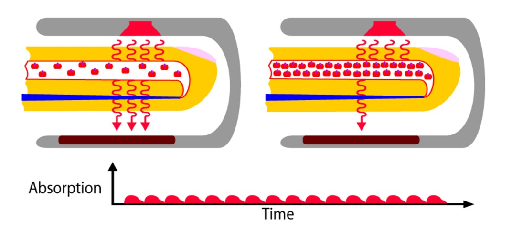
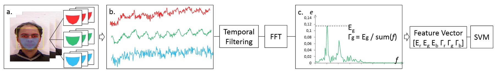
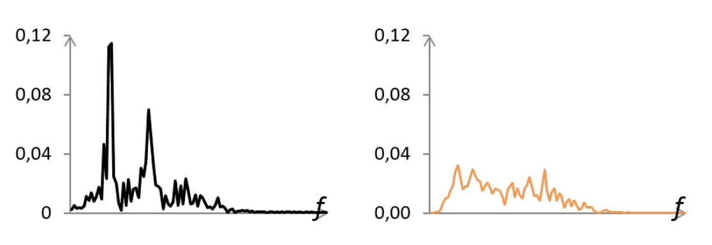
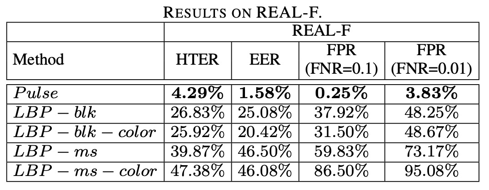
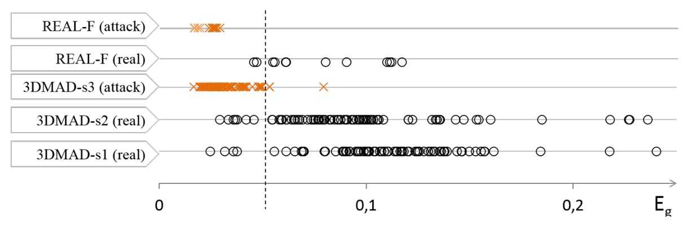
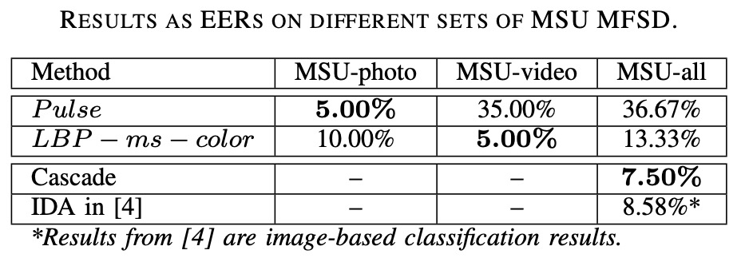

## 生命的光斑

[**Generalized face anti-spoofing by detecting pulse from face videos**](https://projet.liris.cnrs.fr/imagine/pub/proceedings/ICPR-2016/media/files/1223.pdf)

---

雖然心跳訊號（rPPG）在更早之前就已經有許多研究，但多數是針對生理監測的應用。

這篇 2016 年的工作，首度讓「心跳訊號」登上 Face Anti-Spoofing 的舞台。

它不解析紋理和表面，而是追尋一種更根本的存在證據：**生命的節拍是否真實發生。**

## 定義問題

<figure style={{"width": "80%"}}>

</figure>

**Photoplethysmography（PPG）**，如上圖，是一種非接觸式的生理訊號擷取技術，它不依賴針頭或感測器，而是靠光。或更精確地說，是靠光與血液之間的互動。

當光線照射在裸露的皮膚上（如耳垂、手腕、臉頰），表層血管中的血紅素會隨心跳節律改變密度，進而吸收不同量的光。這些變化無法被肉眼察覺，卻能在光的反射強度中留下微弱的線索。PPG 正是透過擷取這些亮度變化，間接測量出心跳的存在。

這種技術最初應用於紅外線感測與生命徵象監測領域。近年來，研究者才發現：**只用一般的 RGB 相機，也能從臉部影像中還原出相同的脈搏訊號（rPPG）**。

每一次心跳，都會讓臉色發生極其細微的變化，儘管這個訊號不會被人眼察覺，但只要 ROI 選得準、雜訊濾得好，頻域中的訊號就會自行浮現。

FAS 長年依賴「可見差異」：紋理瑕疵、色彩失真、深度破綻、微表情遲滯等，這些基於外觀的策略，面對照片與影片攻擊時曾立下赫赫戰功。但隨著 3D 面具的材質與細節越來越逼真，這條防線開始出現裂縫：

- **外觀差異逐漸消失**：矽膠模具、3D 列印與彩色塗層的成熟，讓假臉幾可亂真，傳統 LBP 與紋理模型不再可靠。
- **場景與設備的變異**：不同相機與壓縮條件會扭曲畫面頻率結構，導致模型在真實應用中難以泛化。
- **攻擊形式持續演化**：當硬體門檻降低，新的攻擊手段也不斷湧現，從螢幕回放到全臉面具，每一次改變都是一次防線崩潰的可能。

這讓問題逐漸浮現：

> **當一張臉的所有外觀都能被模仿，我們是否還能在影像中辨識出「活著」？**

這篇論文選擇跳過所有視覺線索，改而追問一個更根本的訊號：**這張臉，有沒有心跳？**

但這條路並不輕鬆。

rPPG 訊號微弱、脆弱，容易被環境光變動、頭部晃動與編碼雜訊所吞沒。

模型想要看見它，得先穿越一層又一層干擾，才找到那一道屬於活人的脈動。

## 解決問題

從臉的影像中擷取心跳，聽起來很像是科幻小說，但這是確實存在的技術。

但在這篇研究中，它被拆解為一套有跡可循的訊號處理流程。

整體架構分成簡單的三個部分：ROI 擷取、訊號轉換、分類判斷。

### 臉部偵測與 ROI 追蹤

首先，模型的輸入是一段包含 $n$ 幀的臉部影片。

作者在這裡不選擇使用整張臉，也不選擇眼睛的部份。而是聚焦於下半臉區域（雙頰、鼻、嘴、下巴），避開額頭與眼睛，以減少髮絲與眼鏡的遮蔽風險。

具體流程如下：

- 使用 **Viola-Jones** 偵測器擷取第一幀的臉框；
- 應用 **DRMF** 模型標註 66 個臉部關鍵點；
- 擇取其中 9 點組成 ROI，固定選在穩定裸膚區；
- 透過 **KLT 光流追蹤**技術，在每一幀中對 ROI 動態更新座標；
- 在每一幀計算 ROI 內像素的 RGB 平均值，構成三條原始時間序列訊號 $r_{\text{raw}}, g_{\text{raw}}, b_{\text{raw}}$。

其中，以紅色通道為例，其原始訊號為：

$$
r_{\text{raw}} = [r_1, r_2, \dots, r_n]
$$

這三條訊號就是尚未清理的「心跳樣本」，其中可能藏有節拍，也可能全是雜訊。

### 濾波處理與頻域轉換

為了從雜訊中提取節奏，作者設計了三階段的訊號清理流程：

- **趨勢消除（detrending）**：使用 _smoothness priors_ 消除慢變與非穩態趨勢；
- **移動平均（moving average）**：平滑鄰近幀值，抑制突波雜訊；
- **帶通濾波（bandpass filtering）**：以 Hamming window 為基底的 FIR 濾波器，保留 0.7Hz 到 4.0Hz 頻率區間，這裡對應於 42 至 240 bpm 的常見心率範圍。

完成濾波後，將三條訊號送入 **快速傅立葉轉換（FFT）**，轉換為頻域表示：

<figure style={{"width": "80%"}}>

</figure>

如上圖所示， **真實人臉**的 PSD（功率譜密度）中，會出現一個主頻峰（對應心跳），有時也伴隨次諧波；而 **攻擊樣本**（面具／照片）則多為分散雜訊峰，能量低且不集中。

### 特徵設計

為了將 PSD 轉化為分類輸入，作者定義了兩個特徵：

- **$E$**：在心跳頻率區間內（0.7 ~ 4.0 Hz）的最大功率值；
- **$\Gamma$**：主峰能量與總能量的比值，用來衡量頻譜集中度：

$$
\Gamma = \frac{E}{\sum_{f \in [0.7, 4]} e(f)}
$$

每個通道計算 $E$ 與 $\Gamma$，組成 6 維向量：

$$
\left[ E_r, E_g, E_b, \Gamma_r, \Gamma_g, \Gamma_b \right]
$$

### 分類器設計

最終分類採用 **支援向量機（SVM）**，以兩類分類形式訓練模型：真實人臉與攻擊樣本。

SVM 能有效處理小樣本、低維特徵的分類問題，與本研究「精煉特徵設計」的理念相符。

## 討論

一組只有六維的生理訊號特徵，在不同攻擊場景下，能走多遠？

作者選擇了三種不同類型的攻擊進行測試，對應三個公開或自建的資料集：

- **3DMAD**：經典的 3D 面具攻擊資料集；
- **REAL-F**：包含更高品質面具的新資料集（作者自建）；
- **MFSD**：包含照片與影片重播攻擊的行動裝置資料集。

### 3DMAD 資料集

3DMAD 是最早出現、也是目前唯一公開的 3D 面具攻擊資料集之一。

它共收錄 17 位受測者、255 段影片，分為三個 session：

- `s1` 與 `s2`：真實人臉，不同日期各錄五段；
- `s3`：攻擊樣本，使用 **ThatsMyFace** 所製作的 3D 面具，由第三人配戴模仿原受測者。

為確保樣本獨立性，實驗採用 leave-one-subject-out 設計（LOOCV）：每次留下 1 人測試，其餘 16 人分為訓練與訓練集，輪替共 17 次。

特徵與分類設定如下：

- **Pulse 特徵**：每段影片取前 10 秒，萃取 6 維向量 $[E_r, E_g, E_b, \Gamma_r, \Gamma_g, \Gamma_b]$；
- **分類器**：固定使用 linear SVM，$C = 1000$，無調參；
- **Baseline 對照**：採用四種經典 LBP 設定，包括：

  - `LBP-blk`（灰階區塊直方圖，531 維）
  - `LBP-blk-color`（RGB 區塊直方圖，1593 維）
  - `LBP-ms`（多尺度灰階直方圖，479 維）
  - `LBP-ms-color`（多尺度 RGB，1437 維）

最終評估指標使用 **HTER（Half Total Error Rate）**，其計算公式如下：

$$
\text{HTER} = \frac{\text{FPR}(\tau^*) + \text{FNR}(\tau^*)}{2}
$$

其中 $\tau^*$ 為使用訓練集計算出來的最佳閾值。

實驗結果如下表：

<figure style={{"width": "60%"}}>

</figure>

**Pulse 特徵在 3DMAD 上取得 HTER < 8%**，表現穩定，顯示即使僅用簡單特徵與線性分類器，也足以對抗 3D 面具攻擊。

然而，四組 **LBP 對照組在此資料集上皆為 0% 錯誤率**，看似完勝；但這背後其實藏著一個工程現實：

> **這組資料集中訓練與測試皆使用同一批面具，且面具有明顯列印紋理。**

也就是說，LBP 確實辨識得出「這塊皮膚有沒有顆粒紋路」，但它並不知道那是不是「活著」的皮膚。

### REAL-F 資料集

<figure style={{"width": "50%"}}>

<figcaption> 左圖為 3DMAD 的 3D 面具，右圖為 REAL-F 的高品質模擬面具</figcaption>
</figure>

如果 3DMAD 是訓練場，REAL-F 則更接近戰場。

REAL-F 面具經過細膩加工的高品質模擬皮膚，無論材質、紋理、色澤，皆逼近人臉外觀的極限。由於尚無其他可用的高品質 3D 面具資料集，作者自行購買兩個 REAL-F 面具並錄製對照資料，建構一組小型測試集：

- **資料組成**：

  - 12 段真實樣本（來自 2 位受測者）；
  - 12 段攻擊樣本（由第三人配戴面具模仿）；
  - 所有影片長度均為 10 秒，解析度為 1280 × 760，FPS 為 30。

- **訓練資料**：

  - 從 3DMAD 中隨機抽選 8 位作為訓練集，另 8 位作為訓練集；
  - 將 REAL-F 全部作為**未見過的測試資料**，進行 100 次隨機分組測試。

- **評估指標**：

  - 平均報告三項指標：**EER**、**HTER**、以及在 FNR = 0.1 與 FNR = 0.01 時的 FPR。

實驗結果如下表：

<figure style={{"width": "70%"}}>

</figure>

我們可以看到所有 **LBP 特徵組合在 REAL-F 中表現大幅下滑**，EER 明顯上升；即使是表現最好的 `LBP-blk-color`，在 FNR = 0.01 時仍有接近一半攻擊樣本被誤判為真實；

反觀 **Pulse 特徵雖未達滿分，卻展現明確的跨面具穩定性**，在多次實驗中維持低錯誤率。

這個結果說明了一件事：

> **外觀模型會記住面具的長相，但生理訊號不會。**

LBP 這類依賴紋理的方法，有兩個明確的弱點：

1. 面對皮膚紋理過於逼真的假臉時，無法提取辨識性差異；
2. 訓練資料一旦固定，模型難以對新面具類型泛化。

相對地，**脈搏訊號具有清楚的語意定義（是否具備真實脈動）**，
不需要假設面具類型，也不受紋理相似性影響。只要該面具是非透明、無脈動，它終究會露出馬腳。

作者進一步分析了錯誤案例，並將 3DMAD 與 REAL-F 所有樣本的 $E_g$ 分佈視覺化如下：

<figure style={{"width": "80%"}}>

<figcaption>Pulse 特徵中 \(E_g\) 的分佈。橘色為面具攻擊，多集中在低值區域</figcaption>
</figure>

可以看到：

- 多數攻擊樣本（橘色叉號）的 $E_g$ 值極低，對應的是 PSD 無主頻的雜訊模式；
- 真實樣本的 $E_g$ 值普遍偏高，但變異較大，與膚色、臉部尺寸、光源條件密切相關；
- 主要的誤判案例集中在一位膚色較深、臉部面積較小的受測者，這些條件會削弱 rPPG 訊號或提高雜訊強度。

從這裡我們可以看出來這個方法的極限在於：當臉太暗或畫面解析度太低時，rPPG 訊號會被環境雜訊淹沒，導致無法正確辨識。

### 照片與影片攻擊

在真實世界中，最容易取得的攻擊手段是**一張照片與一支手機**。

本實驗選用 MSU MFSD 資料集，包含 35 位受測者、共 280 段影片，涵蓋兩種典型攻擊：

- **照片攻擊**（print attack）：使用高畫質紙本照片；
- **影片攻擊**（video replay）：用 iPad 或 iPhone 重播臉部錄像；
- 每位受測者包含 2 段真實樣本、2 段照片攻擊、4 段影片攻擊；
- 錄影裝置為 MacBook Air 與 Nexus 5 之前鏡頭，解析度為 640×480 與 720×480。

為探討模型在不同攻擊類型下的表現，作者將資料集分為三組：

| 測試組別  | 實際樣本 | 攻擊樣本 | 說明         |
| --------- | -------- | -------- | ------------ |
| MSU-photo | 70       | 70       | 紙本照片攻擊 |
| MSU-video | 70       | 140      | 影片重播攻擊 |
| MSU-all   | 140      | 210      | 全部攻擊樣本 |

- 使用 15 位受測者作為訓練，20 位為測試；
- Pulse 特徵與前段相同，每段影片擷取 6 維特徵向量；
- 為對比基準，僅選擇性能最穩定的 `LBP-ms-color` 作為紋理特徵代表。

實驗結果如下表：

<figure style={{"width": "80%"}}>

<figcaption>Pulse 與 LBP 特徵在不同攻擊場景下的 EER 表現</figcaption>
</figure>

- Pulse 特徵在照片攻擊（print attack）中表現最佳，EER 僅約 **5%**；
- 在影片攻擊中則完全失敗，因為播放的是**真人錄影，脈搏訊號依然存在**；
- LBP 特徵則剛好相反，在影片攻擊中展現穩定辨識力，照片攻擊則相對較弱。

這印證了 Pulse 特徵的一項限制：

> **它只能區分「有無脈搏」，無法區分脈搏是「現場的」還是「預錄的」。**

影片重播保留了脈搏訊號，因此對 Pulse 來說與真臉幾乎等價；
但照片是靜態物體，沒有生理律動，對 Pulse 來說就是乾淨的假象。

## 結論

這篇論文不只是提出了一套新方法，而是翻開了 FAS 技術圖譜中的一整個分支。

當年，rPPG 還是生理監測領域的小眾技術，從未被視為對抗欺騙攻擊的主力。但這篇論文給了它一個明確的位置：**不再仰賴臉的外觀，而是去辨識「活著」這件事本身。**

這個觀念，在當時可說是相當激進的。

畢竟在當時的主流觀點中，「臉」的定義還停留在紋理、光影與深度，極少人關注畫面背後的生理訊號。這篇論文卻試圖把那股微弱的節拍帶上舞台，並且證明：六維的心跳特徵，在跨資料泛化上勝過千維的紋理描述子。

可惜，這個方法並不完美，甚至可以說是破綻百出：

- 它在影片攻擊前幾乎束手無策；
- 它對於光源、畫質與膚色高度敏感；

最重要的是：**它無法透過資料增強或大模型堆疊來解決問題**，這在深度學習的時代簡直難以容忍！

但也正因為如此，它揭示了另一種設計方向的可能性：

> **比起擴大模型，有時反而是切換維度，才能突破現有方法的盲點。**

從這篇論文之後，rPPG 系列方法開始發展出多種變體：CFrPPG、MCCFrPPG、MSTCT 等，有人改進訊號穩定性，有人結合頻域判別，有人嘗試與紅外線訊號融合。FAS 技術歷經多次風格輪替，但「**活體訊號**」仍是對抗高擬真攻擊最難被取代的線索之一。

即使我們現在已經不再使用 rPPG 來做 FAS，但它的精神仍會每個開發者心中佔有一席之地。
