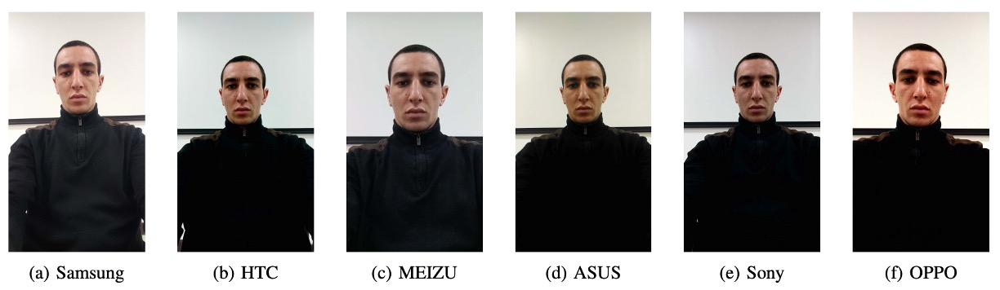
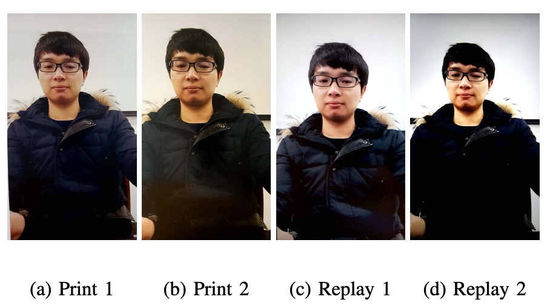

## 四道關卡

[**OULU-NPU: A Mobile Face Presentation Attack Database with Real-World Variations**](https://ieeexplore.ieee.org/document/7961798)

---

人臉辨識系統是第一線面對使用者的生物辨識系統。

現在這個年代隨處可見，通常你的手機上就會有一個 FaceID。

## 定義問題

但是人臉辨識系統非常脆弱。

過去的研究發現，只要你從社群網站上下載一張目標照片，在當時六個主流系統（Face Unlock、Facelock Pro、Visidon…）都可以被一張照片輕鬆破解。甚至連那種眼睛眨一眨、頭轉一轉的活體驗證設計，也能透過影片拍攝來突破防線。

雖然目前市面上有經有好幾個公開資料集可以讓 PAD 方法做 benchmark 測試，但這些資料集的評估方式有點「太理想化」。大家都是在訓練集與測試集條件一模一樣的情境下評比，結果當然是各種漂亮的數據，但只要一換到真實世界，就立刻破功，慘不忍睹。

而且這些資料集的拍攝條件也不符合手機使用場景，因為他們多用靜止的 webcam 或 DSLR，相機畫質不是太高就是太低，根本不像大部分的人手上那支日常自拍的手機。

作者認為應該要有一個新的資料集，來解決這個「泛化能力失真」的問題。

:::tip
PAD 是 Presentation Attack Detection 的縮寫。

Presentation Attack 的意思是使用者向生物辨識資料擷取子系統所發起的干擾性請求，可能具有以下目的：

- 冒充另一個目標身份（Impersonation Attack）
- 隱藏自身身份（Obfuscation Attack）

以上情形皆被歸類為 Presentation Attack (PA)。
:::

## 解決問題

這篇論文就是為了要解決資料集的問題。

作者為了解決「資料集過於理想化、無法泛化到手機實務場景」這個問題，在這份資料集設計上明確聚焦在三個變異來源（covariates）：

1. **未知環境條件**（光照與背景）
2. **不同攝影設備**
3. **攻擊工具 PAI（print 與 replay 類型）**

---

作者蒐集了 55 位受試者（15 女 40 男）在三個不同場景下進行錄影，資料量達 5940 段影片。

這三個場景光線與背景各異，模擬使用者在日常中「各種光照場景」的手機使用情境：

- **Session 1**：開放辦公室，窗在背後，開燈，有自然光。
- **Session 2**：會議室，只有室內燈，無自然光。
- **Session 3**：小型辦公室，窗在正前方，有室內燈與自然光。

如下圖所示：

<figure style={{"width": "70%"}}>

</figure>

每位受試者每回合都會錄兩段影片（註冊 + 認證），使用他們手持的手機進行自拍。整段錄影控制在 5 秒內，模擬真實的解鎖流程。

這次錄影使用的是 6 款前鏡頭畫質「還算不錯」的手機：

- Samsung Galaxy S6 edge（5MP）
- HTC Desire EYE（13MP）
- MEIZU X5（5MP）
- ASUS Zenfone Selfie（13MP）
- Sony XPERIA C5 Ultra Dual（13MP）
- OPPO N3（16MP 可旋轉鏡頭）

所有影片均以 Full HD（1920×1080）錄製，用的是統一版本的相機 app。雖然幾支手機標榜同樣是 13MP，但錄出來的影片畫質差異仍然顯著（沒錯，我們都知道規格單不能信太多）。

各種手機的拍攝的畫質如下圖：

<figure style={{"width": "90%"}}>

</figure>

---

攻擊樣本必須夠難才有意義，因此作者用後鏡頭拍下受試者的高解析靜態照與影片，再分別印出或播放，來製造下列兩種攻擊：

- **Print 攻擊**：A3 光面紙，兩種印表機（Canon C6011 & PIXMA iX6550）
- **Replay 攻擊**：播放在兩種螢幕（19 吋 Dell UltraSharp + MacBook Retina）

攻擊形式如下圖所示：

<figure style={{"width": "80%"}}>

</figure>

錄影時也講究：

- Print 攻擊由人手持照片，但製造輕微晃動，逼近真實動作；
- Replay 攻擊則是全程固定架設，盡量不露出螢幕邊框，避免作弊特徵。

這樣做出來的假影片，對演算法來說就是惡夢級對手，不能再像以前那樣靠背景或邊框偷分。

---

最後，作者設計了四種有系統的 protocol，來分別測試泛化能力：

1. **Protocol I – 測環境泛化能力**： 測試在不同光線與背景下是否還能判斷真假臉。
2. **Protocol II – 測攻擊工具泛化能力**： 訓練用的是某一台印表機或顯示器，測試時換一個全新的。看看模型會不會當場壞掉。
3. **Protocol III – 測設備泛化能力（Leave-One-Camera-Out）**： 每回合留一支手機不給模型看，讓它猜看看新的手機拍出來的影片真假是否能正確區分。
4. **Protocol IV – 三難並一，地獄級挑戰**：環境、攻擊工具、設備通通換掉，模擬真實世界一切變動條件，全部一次挑戰。

所有 Protocol 都把 55 位受試者分成訓練、驗證、測試三組（20/15/20 人），確保模型沒機會偷看測試資料。

資料集的具體配置如下表：

<figure style={{"width": "90%"}}>

</figure>

## 討論

作者用一個基準模型來測試四種 protocol，目的是看看目前主流的 PAD 方法到底能不能在真實世界中活下來。

這裡的指標選用的是 ISO/IEC 30107-3 裡頭的三個常見的指標：

- **APCER**：攻擊樣本被誤判為 bonafide 的比率。
- **BPCER**：真實樣本被誤判為攻擊的比率。
- **ACER**：APCER 與 BPCER 的平均值

  $$
  \text{ACER} = \frac{\text{APCER} + \text{BPCER}}{2}
  $$

模型的部分，作者使用 LBP 作為 baseline，但這裡使用的輸入不是用灰階圖，而是直接從 HSV 與 YCbCr 色彩空間中提特徵。

流程如下：

1. 偵測臉部 → 裁切 → 正規化成 64×64 小圖。
2. 用 $LBP^{u2}_{(8,1)}$ 對每個色彩 channel 擷取紋理特徵。
3. 丟進 Softmax 分類器做訓練與預測。

接下來就來看看這個 baseline 方法，在每種情境下的泛化能力。

:::tip
**為什麼不用 RGB？**

作者認為 RGB 不夠穩定，而 HSV 和 YCbCr 這兩個空間比較能保留區域亮度差異與色彩特性，對辨識真假臉更靈敏。
:::

### Protocol I：光線變化的影響

:::tip
看圖表的最後一欄 ACER，數字愈小愈好，之後的圖表也都是這樣看。
:::

這是最簡單的 protocol。

首先是使用 Session 3 的資料來訓練模型，然後還是用 Session 3 的資料來測試：

> **得到 ACER 2.7%，效果非常棒。**

接著，改成先用 Session 1 和 2 訓練，然後測試 Session 3 的資料：

> **ACER 的表現從 2.7% 飆升到 13.5%**。

這代表光線一換，整個辨識準度就崩了。

這是因為 LBP 紋理本來就對亮度很敏感，一改燈光角度、強度或背景色調，就讓模型瞬間認不得你是誰。

### Protocol II：攻擊工具變化的影響

第二回合，作者使用 Printer 1 + Display 1 訓練模型，然後用 Printer 2 + Display 2 做測試。

這次的結果如下：

- 沒變攻擊工具時，ACER 只有 **7.2%**
- 一換工具，ACER 變成 **14.2%**

尤其是 Print 攻擊最難抓，因為印表機換了整個色彩紋理都不同。相較之下，模型還能稍微應付 Replay 攻擊（從 7.2% 到 9.2%），但 Print 攻擊一換，表現瞬間掉到谷底。

### Protocol III：拍攝設備變化的影響

第三回合，這次輪到我們常聽到的 **LOCO Protocol（Leave-One-Camera-Out）**。

也就是每一回合都用 5 支手機訓練，然後測試第六支手機的辨識能力。

實驗結果顯示出平均 ACER 偏高，各輪差異也大。

換句話說：

> **換一台手機，就像換了一個世界。**

影像色彩、清晰度、鏡頭特性都有差，這對「色彩紋理」的模型來說是個大挑戰。

### Protocol IV：地獄模式三合一

第四回合，也是最困難的關卡：**光線 + 攻擊工具 + 攝影設備** 全部變！

結果顯示模型全部炸裂。

前面幾關看起來還有點希望，這關一出手就被打回原形，某些手機甚至直接認不出臉。

這也再次印證，單一變項下的泛化不等於真實世界的泛化。

## 結論

在這篇論文中，作者針對三大變異來源（環境、設備、攻擊方式）進行 protocol 結構化測試，從此之後，我們才真正開始有工具能評估「泛化能力」這件事。

這份資料集雖然在攻擊類型上仍屬初階（只有 print 和 replay），但它開啟了 FAS 社群對「domain shift」、「cross-scenario robustness」的真正重視，也影響了後續一連串大型資料集的評估設計思路。

作者在論文中的最後一句話：

> We invite the research community to consider this new database.

對今天的我們來說早已不只是邀請，而是經典教材級的必經之路。
