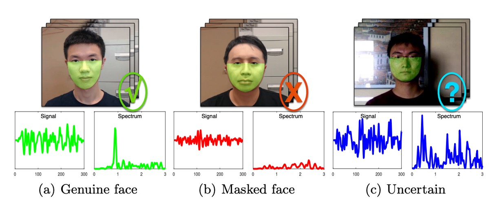
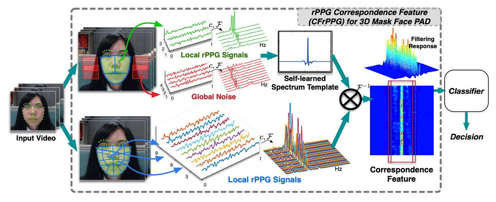

## 心跳的殘響

[**Remote Photoplethysmography Correspondence Feature for 3D Mask Face Presentation Attack Detection**](https://openaccess.thecvf.com/content_ECCV_2018/papers/Siqi_Liu_Remote_Photoplethysmography_Correspondence_ECCV_2018_paper.pdf)

---

rPPG，本質上是從 PPG（Photoplethysmography）演化而來的非接觸式心跳量測技術。

它不需貼附感測器，只需透過 RGB 相機，便能在自然光源下觀測皮膚因心跳所引發的色彩變化，並從中還原生理訊號。

在 FAS 的任務中，這樣的機制為我們提供了一條繞過影像外觀、直接觀察生命跡象的途徑。

理論上，只要能從影像中提取出穩定的 rPPG 訊號，便能有效區分真臉與 3D 面具，甚至連螢幕播放、紙本攻擊等都能被偵測出來。

## 定義問題

在現實情境中，rPPG 訊號往往不那麼純粹。

下圖呈現了三種常見的 rPPG 訊號模式，分別對應於理想條件下的真臉、受干擾的真臉，以及具周期性雜訊的面具。

<figure style={{"width": "90%"}}>

</figure>

- **第一種（左）：理想情境。**
  真臉的 rPPG 訊號在頻域中呈現出明顯的主頻，代表心跳節奏，背景雜訊明顯偏弱。這正是我們期望模型能擷取到的活體證據。

- **第二種（中）：訊號衰減。**
  在低光源、遠距拍攝或臉部區塊解析度不足的情況下，即便是真實人臉，頻譜中也可能只留下模糊的主峰，甚至被雜訊淹沒。這會導致模型誤將真臉判為攻擊樣本。

- **第三種（右）：雜訊增幅。**
  當面具受到外部穩定震動（如手持設備晃動、環境光源閃爍）影響時，也可能在頻域中產生類似的主峰。模型若僅依據最大頻譜強度進行判斷，便可能產生誤判。

這三種模式說明了一個殘酷的事實：

> **rPPG 訊號是脆弱的，而最大頻譜強度並不足以作為唯一的活體依據。**

傳統的頻譜峰值方法，將模型焦點集中在最強訊號上，但卻忽略了整體頻譜的結構與一致性。心跳訊號理應穩定地潛伏在皮膚的微色變中，等待被提取、放大、解析。

但問題在於：**真正的臉部微動只是其中之一，更多時候，雜訊才是主旋律。**

rPPG 方法的一個核心假設是：「心跳的主頻會在頻譜中形成明顯波峰」。

因此，多數現有方法（如 CHROM、POS）便以該主頻對應的頻譜強度為活體特徵。

然而，一旦環境中出現鏡頭晃動、亮度閃爍、或臉部位移，即便是面具也能展現出顯著的周期訊號。而在低解析度或低光源條件下，真實的臉部訊號反而可能被環境背景所掩蓋，使頻譜主峰消失無蹤。

儘管傳統的互相關（cross-correlation）操作雖能增強共享頻率，卻無法分辨「共享的是心跳，還是同步的背景雜訊」。

於是，我們不得不問：

> **如果雜訊與訊號共振於同一頻率，我們究竟該相信哪一個？**

## 解決問題

<figure style={{"width": "90%"}}>

</figure>

現有的 rPPG 方法，通常將「頻譜峰值」視為心跳強度指標。

這雖然在理想情境下行得通，但前面分析已指出，一旦雜訊與真實訊號同頻共振，僅靠強度就會誤判。CFrPPG（rPPG Correspondence Feature）正是為了解決這個脆弱假設而提出的新方法。

### 頻譜模板的學習

CFrPPG 的核心構想是：

- **若一張臉是真實的，那麼它的各個區域應該會在相同的頻率上展現一致的心跳訊號。**

為了捕捉這種「區域間的一致性」，作者設計了一個可學習的**頻譜模板** $w$，這個模板不直接來自單一訊號，而是由整張臉的多個局部 rPPG 頻譜共同推得。

我們首先將臉部劃分為多個區塊，並從每個區塊擷取 rPPG 訊號，進行 cross-correlation 預處理後，轉換至頻域，得到 $\{s_1, s_2, \dots, s_N\}$。

這些頻譜代表各區域在不同頻率上的能量分佈，但其中混雜了雜訊與變異。因此，我們希望學習出一個模板 $w$，能夠強化「一致的心跳頻率」，同時忽略雜訊帶來的多樣性。

這個目標可以透過下式達成：

$$
\min_w \sum_{i=1}^N \| S_i w - y \|_2^2 + \lambda \| w \|_2^2
$$

其中，$S_i$ 是由 $s_i$ 延展形成的循環矩陣，$y$ 是一個在心跳頻率處有尖峰的一維高斯函數，用來引導模板學會「在哪些頻率上要強烈響應」。

這樣的設計讓我們能將「所有區域中一致的頻率成分」整合進單一濾波器 $w$ 中。

為了加速計算，作者利用循環矩陣在頻域可對角化的特性，將上述優化問題轉換為頻域中的元素級運算：

$$
\hat{w} = \frac{\sum_{i=1}^N \hat{s}_i^{*} \odot \hat{y}}{\sum_{i=1}^N \hat{s}_i^{*} \odot \hat{s}_i + \lambda}
$$

這裡 $\hat{s}_i$ 是第 $i$ 區域的頻譜經 DFT 處理後的形式，$^*$ 表示共軛轉置，$\odot$ 為對應元素乘法。這表示我們不再處理龐大的矩陣乘法，而是在頻域中用簡單的加法與除法完成濾波器的學習。

這一步驟就像在眾多含有雜訊的觀測中，學會一個「理想心跳旋律」的樣本，之後我們便可用這個模板來比對每段訊號，看它們是否都有出現同一個節拍。

### 建立對應特徵

一旦學會了頻譜模板 $w$，接下來的任務就是檢查：

- **臉部每個區域的 rPPG 訊號，是否「響應」這個模板。**

我們先把每個區域的頻譜 $s_i$ 轉換到頻域 $\hat{s}_i$，然後與模板 $\hat{w}$ 做元素級乘法（在頻域中對應於時域的卷積）：

$$
\hat{r}_i = \hat{s}_i \odot \hat{w}
$$

這樣我們就得到一個響應序列 $\hat{r}_i$，它的峰值位置與形狀能夠告訴我們，該區域是否「與模板共鳴」。也就是說，如果一段訊號真的含有與模板相似的心跳頻率，它的卷積結果會在對應頻率產生一個尖銳而明顯的峰值。

為了具體量化這種共鳴程度，作者採用了 **Peak-to-Sidelobe Ratio (PSR)**，這是一種常見的濾波器響應尖銳度指標：

$$
\text{PSR}_i = (\text{peak}_{\hat{r}_i} - \mu_{\hat{r}_i})\sigma_{\hat{r}_i}
$$

其中：

- $\text{peak}_{\hat{r}_i}$ 是響應序列的最大值
- $\mu_{\hat{r}_i}$、$\sigma_{\hat{r}_i}$ 分別為非主峰區域的平均值與標準差

換句話說，PSR 越高，表示響應越尖銳、越集中，也越可能代表真正的心跳訊號；而雜訊或不連貫的訊號，則會產生平坦、模糊、甚至多峰的響應，導致 PSR 較低。

最後，我們將所有區域的 PSR 值串接起來，形成一個多維的活體特徵向量：

$$
x = [\text{PSR}_1, \text{PSR}_2, \dots, \text{PSR}_N]
$$

這個向量即為最終的 CFrPPG 表示，它不再依賴單一頻率強度，而是從**全臉各區域與模板間的對應關係**中，判斷這張臉是否具備一致、真實的心跳節奏。

這種從「整體一致性」出發的設計，讓模型更能抵抗局部雜訊與錯誤訊號的干擾。

### 背景雜訊的抑制

在現實應用中，rPPG 訊號極易受到全域性干擾的污染，例如鏡頭微幅晃動、手持拍攝所產生的震動，或是室內照明的閃爍頻率。這些干擾通常具備兩個特性：**全臉同步**、**具有穩定週期**，在頻域中與心跳訊號難以區分，容易導致模型產生錯誤響應。

這意味著，即便是一張沒有任何生理訊號的面具，只要背景噪訊夠穩定，也可能在頻域中製造出似是而非的心跳痕跡。

為了解決這個問題，CFrPPG 在學習頻譜模板的過程中，額外引入了**背景區域的 rPPG 頻譜**作為負樣本。這些區域位於臉部邊緣之外，使用與臉部相同的方法萃取出 rPPG 訊號，但理論上**不應該出現任何來自血液流動的生理節奏**。

這些背景頻譜被視為「不該產生響應」的例子，並以懲罰項的形式加入模板訓練的目標函數中，設計如下：

$$
\min_w \sum_{i=1}^M \| S_i^t w - y \|^2_2 + \lambda \|w\|^2_2 + \gamma \sum_{k=1}^K \| S_k^n w \|^2_2
$$

其中：

- $S_i^t$：來自臉部區塊的 rPPG 頻譜，用來捕捉心跳一致性
- $S_k^n$：來自背景的頻譜，用來抑制全域性干擾
- $y$：目標響應（一維高斯），期望在心跳頻率上產生尖銳響應
- $\gamma$：控制懲罰強度的係數，平衡心跳學習與背景抑制

這樣一來，所學得的模板 $w$ 將同時滿足兩個條件：

- 對真實的心跳頻率產生強烈且集中響應
- 對背景常見的週期性雜訊維持極低響應

這樣設計的意思是我們不直接將背景頻率「排除掉」，而是讓模型在訓練時就主動學會忽略那些總是出現在錯誤地方的周期模式。

換句話說，我們不只問模型「你在哪裡看到心跳」，還反問它「你在哪裡**不應該**看到心跳」。

如此一來，即使實際部署的環境中存在不可避免的同步晃動或背景光源變化，CFrPPG 也能更有韌性地聚焦於**屬於人臉、屬於生理的節奏**，而非影像裝置所帶來的共頻假象。

## 討論

### 和其他方法的比較

<figure style={{"width": "90%"}}>

</figure>

如上表所示，在 3DMAD 資料集下，所有方法的整體表現皆偏高，反映出此資料集拍攝於受控光源環境，且所使用的 Thatsmyface 面具在材質與真實人臉之間仍具明顯差異。外觀型方法（特別是 MS-LBP）因此能在該場景下取得最佳結果。

不過，與其他 rPPG 方法（如 LrPPG、GrPPG）相比，CFrPPG 在 AUC 與 HTER 等指標上仍略為領先，顯示出其對臉部心跳特徵一致性的建模，具有更高辨識穩定性。值得注意的是，即便在這種「對外觀方法最友善」的設定下，深度特徵（CNN）表現仍略顯不足，凸顯其在樣貌資料移轉上的局限。

此外，本次實驗採用隨機 subject index 的 leave-one-out cross-validation（LOOCV）設計，進行 20 輪、每輪包含 17 次測試的完整交叉驗證，以降低資料切分的偶然性。CFrPPG 在多輪評估下持續維持穩定表現，也顯示其架構具備跨樣本的一致性特質。

### 跨資料集測試

<figure style={{"width": "90%"}}>

</figure>

作者進一步設計了跨資料集實驗，用以評估模型在面對未知環境時的泛化能力。

具體而言，實驗分為兩個方向：

- **3DMAD → HKBU-MARsV2**：在乾淨、受控的資料集上訓練，再到實際場景測試
- **HKBU-MARsV2 → 3DMAD**：在高雜訊、非受控條件中訓練，測試於標準環境

每個設定皆執行 20 輪隨機分組測試，避免受測者配置偏誤。

從結果來看，**CFrPPG 在兩組實驗中都取得明顯優於其他方法的表現**，並且展現出比原本在單一資料集測試中更大的領先幅度，這表示：

> **CFrPPG 不僅能在熟悉環境中穩定辨識，在跨資料集轉換下仍可維持辨識能力。**

這項能力的關鍵，在於它**不是單純記住了某一類訊號的強度分佈**，而是學會了「一張臉上多區域共享的心跳頻率模式」。這樣的頻譜一致性在不同攝影條件與面具類型之下仍然成立，因此其特徵在跨資料集上具備更好的對齊能力。

相對來說，基於外觀的方法（如 MS-LBP、CNN）在此類實驗中表現大幅下滑，顯示出這些方法「對特定視覺表徵過度擬合的弱點」。

## 結論

rPPG 曾短暫被寄予厚望，作為非接觸式活體辨識的希望之一。

那段時間，研究者試圖從影像中讀出微光變化、恢復血流節奏，彷彿只要足夠精細，就能看見生理的真相。但現實很快就給了答案：

> **光源太難控、雜訊太難清、頻域特徵太脆弱。**

rPPG 就是一種難以工程化的浪漫。

CFrPPG 試圖讓這條注定短命的技術，在當時能走得更穩一點、更聰明一點。它用模板匹配、頻譜對應、雜訊建模，試圖對抗環境的不確定。它將「單點峰值」升級為「多區域一致性」，再補上一個背景抑制，證明了在雜訊環境裡，穩定的特徵往往來自協同，而非極值。

從 FAS 的視角來看，rPPG 像是一條在熱度陡升、又迅速淡出的支線；CFrPPG 則正好站在這條支線的盡頭，替那段技術躁動寫下一段體面收束。

我們雖然不再從影像中找尋心跳，但在這個已被遺忘的支線裡，我們曾聽見過它的聲音。
