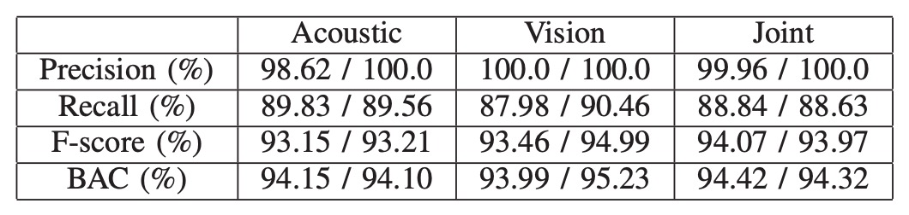

## 聲波裡的臉

[**Multi-Modal Face Authentication using Deep Visual and Acoustic Features**](https://par.nsf.gov/servlets/purl/10095811)

---

這篇論文中，作者沒有幫自己的方法取個簡潔的名字，所以我們擷取 Visual 和 Acoustic 的特色，就叫它 **VA-FAS** 吧。

## 定義問題

智慧型手機早已把「看臉」寫進日常開機序曲。

為防止照片騙過鏡頭，主流方案在影像流中捕捉眨眼、嘴型、頭部微動等時間線索；或是偵測影像中的異常的空間線索等，來判斷使用者是否為真。

看起來好像沒有問題，但實際上，如果攻擊者使用高解析度影片，這些時間和空間的線索就會變得不堪一擊。

當單純的 RGB 線索撐不起安全邊界，產業走向了第二條路：在鏡頭旁塞進更多感測器。

像 iPhone 的 Face ID 利用近紅外線結構光重建 3D 幾何，確實把攻擊門檻拉高；部分旗艦 Android 手機也開始附加 ToF 或雙目模組。

但這套「硬體補強」策略，可能會碰到三個困難點：

- **成本**：專用模組抬高 BOM，難以下放到中階／低階裝置。
- **空間**：前鏡頭區域寸土寸金，多一顆感測器就少一分螢幕。
- **生態綁定**：感測器規格與演算法深度耦合，跨平台複製困難。

回到大多數手機仍僅配備單一前鏡頭與麥克風的世界，RGB 活體的漏洞依舊敞開。

我們還需要第三條路：**在不新增硬體的前提下，為臉部辨識注入立體感**。

於是，作者把目光轉向了聲波：

> **那些一直存在、卻從未被正眼看待的反射訊號。**

聲音能否為二維影像補上一層深度？影像與聲波的結合，又是否真的能堵住影片攻擊的缺口？

## 解決問題

<figure style={{"width": "90%"}}>

</figure>

作者提出**聲學與視覺融合的臉部認證系統**，無需新增硬體，即可提升手機上的活體驗證強度。

整體系統可分為三個模組：

1. 聲波特徵擷取
2. 影像特徵擷取
3. 多模態特徵融合與分類

聲學與影像特徵分別經過 CNN 擷取，串接為聯合向量後，由 One-Class SVM 判斷結果。

整體架構非常簡單，我們來看看每個模組的細節。

### 聲波特徵擷取

作者選擇使用手機內建的「聽筒喇叭 + 上方麥克風」作為聲波通訊對，這套配置廣泛存在於各型手機中，與前鏡頭共置，能降低聲波與影像感測之間的對位誤差。

所發送的聲波為 **16–22 kHz 線性升頻 chirp**，屬於近乎不可聽範圍。其屬於 **FMCW（Frequency-Modulated Continuous Wave）** 類型，能透過頻率差估算反射路徑長度。

為提升訊號品質，系統進行以下設計：

- 使用短脈衝以避免揚聲器自我干擾；
- 施加 Hanning window 以柔化訊號邊緣，提升時頻穩定性。

聲波處理流程如下：

錄得訊號先通過 Butterworth band-pass filter（16–22 kHz）去除背景雜訊。

處理後的波形可觀察到：

<figure style={{"width": "60%"}}>

</figure>

- **直達徑**：直接從喇叭送至麥克風，通常為最高幅值；
- **臉部回波**：經額頭、鼻樑、臉頰等反射回來的主體信號；
- **雜訊與干擾反射**：來自桌面、衣領等處，需被排除。

分段策略如下：

- 利用峰值偵測法定位直達徑；
- 再以交叉相關（cross-correlation）配合註冊階段的模板訊號，鎖定主回波區段。

若多個相似波峰造成定位不穩，則引入前鏡頭估測的臉距資訊縮小搜尋範圍：例如雙眼間距在影像中變寬，表示臉部靠近，則可下修預期回波位置。

最終擷取的區段會額外延伸左右各 10 個採樣點，以保留約 7 公分深度範圍。

而回波訊號需要再經過一次 **FMCW 距離轉換**，如下示意圖：

<figure style={{"width": "60%"}}>

</figure>

FMCW 技術將時間延遲轉換為頻率偏移，反射距離由下式決定：

$$
d = \frac{c \cdot \Delta f \cdot T}{2B}
$$

其中：

- $d$：距離；
- $c$：音速；
- $\Delta f$：接收與發射訊號的頻率差；
- $T$：chirp 時長；
- $B$：頻寬（6 kHz）。

經「訊號混頻」後取得的頻率差，會轉換成一組時頻圖（spectrogram）。

我們把時頻圖送入一個預訓練的 CNN（基於 EchoPrint 架構）進行推論，並去除最後分類層，以 128 維向量形式輸出，即可代表了一張臉在聲波空間中的結構回聲圖譜。

### 影像特徵擷取

<figure style={{"width": "80%"}}>

</figure>

完成聲波特徵擷取後，接下來是影像特徵擷取，包含四個步驟：

1. **臉部偵測**：利用 HOG + 預訓練模型，偵測臉框與五官；
2. **仿射轉換**：將五官座標對齊至標準模板。
3. **裁切並縮放**：取得定長輸入圖；
4. **資料增強**：包括亮度正規化與角度修正。

特徵抽取的部分則是採用精簡版 OpenFace（源自 FaceNet 的 nn4），搭配 **classification loss + triplet loss** 訓練，最後輸出 128 維影像特徵向量。

### 特徵拼接

兩個特徵向量簡單拼接，構成最終 256 維聯合特徵：

$$
\mathbf{z} = [\mathbf{a} \,\|\, \mathbf{v}] \in \mathbb{R}^{256}
$$

分類器採用 One-Class SVM，僅用註冊樣本建立一個高維邊界，將他人視為異常資料。這樣做的優點是不需蒐集攻擊樣本，計算輕量，適合部署於邊緣裝置。

最終系統如下圖所示，只需將臉對準紅框，系統便會同步播放 chirp 並擷取影像，於 300 毫秒內完成判定。

<figure style={{"width": "80%"}}>

</figure>

## 討論

### 資料與實驗設計

- **受測者**：10 位志願者（不含於聲波模型訓練集中）；
- **聲波樣本**：每人約 2 分鐘錄音，共收集 13,806 筆；
- **影像樣本**：每人 20 張臉部照片，並以鄰近影像補差對齊數量；
- **攻擊樣本**：5 種假臉類型，包括：

  - 紙本照片、螢幕顯示、紙盒表面、牆貼與雕像

資料皆取自**非受控環境**，涵蓋多種光源與背景雜訊，以測試系統實用性。

模型效能以四項指標衡量：

$$
\text{Precision} = \frac{TP}{TP + FP}, \quad
\text{Recall} = \frac{TP}{TP + FN}
$$

$$
\text{F1} = \frac{2PR}{P + R}, \quad
\text{BAC} = \frac{1}{2} \left( \frac{TP}{TP + FN} + \frac{TN}{TN + FP} \right)
$$

其中：

- **Precision 高** → 表示誤放行少；
- **Recall 高** → 表示真用戶不易被拒；
- **F1 與 BAC** 用來綜合評估整體表現。

資料以 8:2 比例切分訓測集。
模型採用 **One-Class SVM**，每位使用者僅用自身樣本訓練，再以「其他人 + 攻擊樣本」作為負樣本測試；每組模態（聲波、影像、聯合）皆重複相同流程，以確保比較公平。

### 雙模態驗證效能

<figure style={{"width": "80%"}}>

</figure>

基於雙模態的架構，實驗結果如上表，左邊數值為平均，右邊為中位數。

在所有測試中，**聯合特徵（acoustic + visual）始終展現出比單一模態更穩定的驗證表現**。

這主要歸功於視覺模組使用了經 triplet loss 訓練的深度嵌入特徵，能有效拉開同類與異類之間的分佈界線。這種視覺辨識強度在遇到照片或影片等圖像攻擊時仍可能迅速失效。此時，聲波特徵便能補足視覺的盲點，讓聯合模態成為唯一能抵擋攻擊的選項。

在所有測試中，甚至包括一組同卵雙胞胎樣本，聯合模態模型亦成功區分兩人，未產生誤判。雖然目前僅測試單一雙胞胎樣本，結果仍具有初步指標性，即便生理外觀極度相似，聲波反射的細微差異依舊可被模型捕捉。

### 背景雜訊影響

聲波模組的實用性，取決於它是否能在真實環境中穩定運作。為此，作者在嘈雜實驗室與人聲交談的教室環境下，重複進行資料收集與辨識測試。

結果顯示，在這些常見背景雜訊條件下，模型辨識效能並無明顯下降。這代表系統所設計的 chirp 頻段（16–22kHz）與濾波機制，足以避開語音與環境噪訊的干擾，具備實際應用的穩定性。

## 結論

這篇論文屬於很早期開始思考「聲波作為活體線索」的實作探索之一，並且在當時的硬體條件下，提出了一個可行的解決方案。

它所提出的，不是一個單點創意，而是一整套可部署、可評估的系統：從 chirp 設計、回波分段，到 CNN 特徵擷取與雙模態拼接，再到手機端的實作策略與延遲控制，最後以實測場景對抗靜態照片與動態影片。

沒有過度依賴新硬體，也沒有預設更理想的資料條件。只有工程現實，以及對資源極限下的一種反問：

> **如果手機只有麥克風、喇叭與前鏡頭，我們還剩下多少空間可以防守？**

對於當時的硬體條件、演算法設計與攻擊型態而言，這樣的系統已經能有效區分真人與假臉、活體與播放。

本研究給出的回答是：**夠用**。
