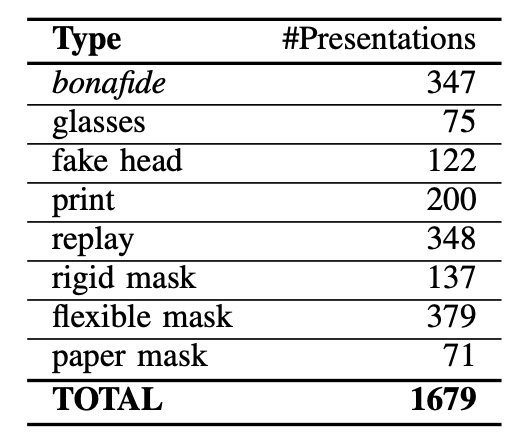
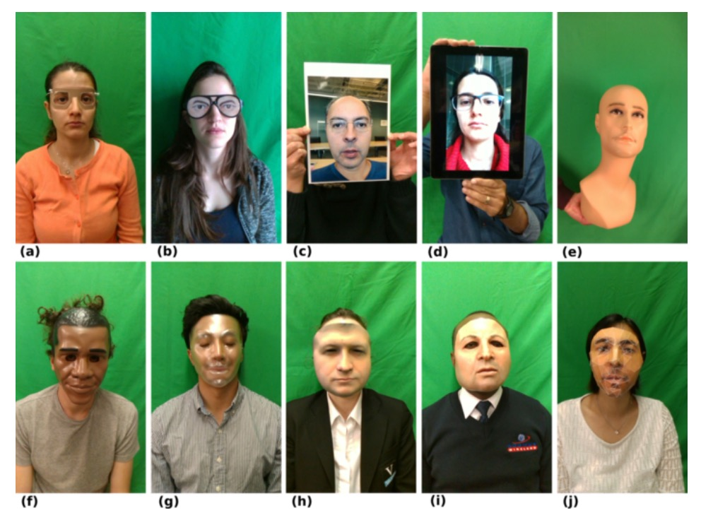
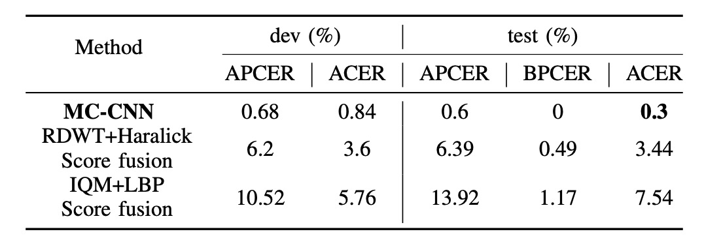

## 看不見的臉

[**Biometric Face Presentation Attack Detection with Multi-Channel Convolutional Neural Network**](https://arxiv.org/abs/1909.08848)

---

在一個領域的發展過程中，總會有新的名詞被定義出來，這些名詞不僅是對於技術的描述，也會影響到後續研究的方向。

這篇論文中，把仿冒攻擊稱為 Presentation Attack (PA)，這個名詞的定義是：

> **使用者向生物辨識資料擷取子系統所發起的干擾性請求，可能具有以下目的：**
>
> 1. **冒充另一個目標身份（Impersonation Attack）**
> 2. **隱藏自身身份（Obfuscation Attack）**
>
> **以上情形皆被歸類為 Presentation Attack (PA)。**

## 定義問題

卷積神經網路（CNN）進入 FAS（Face Anti-Spoofing）領域之後，傳統那些仰賴手工特徵的做法很快就被取代了。不過，即使換成了 CNN，很多方法依然只用 RGB 影像來做判斷，也就是一般可見光下拍攝的臉部照片。

問題是仿冒手段早就不只停留在「Print」這種層級了。現在連矽膠面具、3D 模型都變得愈來愈精緻，光靠 RGB 能抓到的資訊真的不夠用。

所以，有些研究開始引入深度資訊來幫忙，像是用 TOF、結構光或是雙鏡頭做出立體視覺，去偵測臉部距離和輪廓變化。

既然都要引入更多維度來解決問題了，為什麼不做得徹底一點呢？

> **除了 RGB 影像，我們還能找到的資訊像是深度、熱度等，不勝枚舉。**

這篇論文就是從這個角度出發，作者不只用了彩色和深度，還加入了近紅外線（NIR）和熱成像（Thermal），想要把更多「看不見的臉部線索」納入模型裡。

但這也遇到一個很現實的問題：資料集跟不上。大部分開放的資料集都只有 RGB，少數有深度資料的，數量也不夠大，根本不利於訓練穩定的模型，更不用說做泛化測試了。

所以這篇論文的另一個重點，就是他們提出了一個新的資料集：

> **WMCA（Wide Multi-Channel Presentation Attack）**。

裡面不只收錄了各種 2D、3D 仿冒手段（像是紙面具、矽膠面具、剛性材質、透明遮罩…），還提供了四種通道的同步資料：RGB、深度、NIR 和熱影像。

讓模型看到更多維度的資訊，就意味著攻擊者更難同時騙過系統。

## 解決問題

### 模型架構

<figure style={{"width": "90%"}}>

</figure>

在模型設計上，作者提出了一個多通道卷積神經網路架構（Multi-Channel CNN, MC-CNN），目標是讓模型能夠整合來自不同感測通道的資訊，提升對仿冒攻擊的辨識能力。

在 FAS 領域，資料集不足始終是個問題。因此大部分的研究都不會從頭訓練一個 CNN，而是會選擇用預訓練的網路來做遷移學習（Transfer Learning）。

這篇論文也不例外，他們的做法是選擇使用預訓練好的人臉辨識模型作為 backbone，這邊選的是參數比較輕量的 [**LightCNN**](https://arxiv.org/abs/1511.02683)，用來萃取每個通道的臉部特徵。

在進入網路之前，每個通道的影像都會先經過一套對齊與標準化處理。人臉偵測是用 MTCNN，特徵點偵測則用 SDM，接著會把眼睛和嘴巴對齊到統一座標，並統一調整成 128×128 的灰階影像。

RGB 通道會作為基準，其他像是深度、近紅外、熱影像等非 RGB 通道，則會依照 RGB 的特徵點結果做同步對齊，確保多通道輸入在空間與時間上的一致性。非 RGB 影像還會經過 MAD 標準化轉成 8-bit 格式，方便後續輸入模型。

每個通道都會各自經過一個共享架構的 LightCNN，用來提取對應的臉部特徵。這些特徵的維度都是 256，最後會把四個通道的特徵向量做串接（concatenation），得到一個整合後的表示，再丟到兩層全連接層做分類：

- 第一層全連接層有 10 個節點
- 第二層是 sigmoid 輸出（1 節點），對應於是否為仿冒攻擊

整體訓練是用二元交叉熵（Binary Cross Entropy, BCE）作為損失函數：

$$
L = −(y log(p) + (1 − y) log(1 − p))
$$

其中 $y$ 是真實標籤（1 為 `REAL`，0 為 `SPOOF`），$p$ 是模型預測的機率。

### WMCA 資料集

:::tip
如果你也想製作自己的資料集，這一段的設計細節會給你很多啟發。

更多內容可以參考：[**IDIAP/data**](https://www.idiap.ch/en/scientific-research/data/wmca)
:::

為了驗證多通道模型在防偽任務上的實際效能，作者額外建立了一套全新的資料集，稱為：

- **WMCA（Wide Multi-Channel Presentation Attack）**。

這套資料集的設計非常到位，不僅補足現有 PAD 資料集在通道數量上的不足，也進一步涵蓋了豐富且具挑戰性的攻擊手段。

資料集共收錄來自 **72 位受測者** 的影片資料，針對每個人皆拍攝了 bonafide（真實樣本）與多種 presentation attack（仿冒攻擊）情境，每段影片長度約為 10 秒。錄製過程透過多感測器同步擷取，共累積約 **5.1 TB** 的未壓縮資料量，為少見的高規格 FAS 資料集之一。

<figure style={{"width": "60%"}}>

</figure>

WMCA 使用兩組感測器進行同步拍攝，涵蓋了不同光譜與深度資訊，設備如上圖所示，其中：

- **(b) Seek Thermal Compact PRO**：提供熱影像通道（Thermal）
- **(c) Intel RealSense SR300**：提供 RGB、深度與近紅外（NIR）通道

這些感測器以模組化方式安裝於同一組光學機構架上，維持拍攝視角與距離一致。RGB 通道以 30fps 錄製，熱影像為 15fps，每段影片各通道約儲存 **300 張影格**（熱影像為 150 張），資料皆為未壓縮格式，便於後續高品質分析，資料成像的成品如下圖所示：

<figure style={{"width": "80%"}}>

</figure>

為確保多通道資料的空間與時間一致性，作者自製一組具有熱對比特性的棋盤格標定板，並透過高功率照明進行同步拍攝，搭配特製軟體自動擷取對應點進行校正。

資料蒐集歷時五個月，橫跨七個不同拍攝階段，每階段在光線、背景、裝置設定上皆有所變化，模擬真實世界的多樣場景，包括：

- **照明**：日光、LED 側光、辦公室燈具等
- **背景**：統一背景 vs 複雜背景
- **配戴眼鏡**：bonafide 部分特別拍攝「有眼鏡」與「無眼鏡」兩版本
- **面具與假人頭**：拍攝前以熱風吹過，加強熱通道中的偽裝擬真度

所有參與者均面對鏡頭以中性表情錄製，並維持距離約 40 公分，由操作人員統一控制拍攝流程，保證每筆資料的一致性與可比較性。

### 七種攻擊類型

<figure style={{"width": "50%"}}>

</figure>

WMCA 詳細的攻擊樣本數量如上表，其中涵蓋了 **1332 組仿冒攻擊資料**，共分為七大類型，每一類都具備不同層次的挑戰性：

1. **眼鏡類（Glasses）**：搞笑假眼眼鏡、紙質眼鏡等（屬於部分遮蔽攻擊）
2. **假人頭（Fake Head）**：各種模型頭顱，有些會加熱模擬體溫
3. **照片攻擊（Print）**：使用高解析噴墨印表機或辦公室雷射印表機輸出臉部照片
4. **重播攻擊（Replay）**：利用 iPad 或手機播放預錄臉部影片
5. **硬面具（Rigid Mask）**：仿真度高的硬質面具、裝飾性塑膠面具
6. **柔性面具（Flexible Mask）**：自製矽膠面具，擬真人臉特徵
7. **紙面具（Paper Mask）**：根據真實身份打造的紙質面具

這些攻擊類型涵蓋從最簡單的 2D 攻擊到高仿真 3D 攻擊，搭配多光譜資料，大幅提升了這個資料集在訓練與測試模型泛化能力時的實用價值。

<figure style={{"width": "80%"}}>

</figure>

### 評估協定與實驗設定

WMCA 支援兩種實驗協定，對應「已知攻擊」與「未知攻擊」兩種場景：

- **grandtest protocol**：模擬攻擊類型為已知的情境，資料被劃分為 train / dev / eval 三組，每組受測者不重複，但所有攻擊類型均分布於三組中。

- **unseen attack protocol（LOO）**：針對泛化能力設計的更嚴格測試。總共定義了七組 leave-one-out（LOO）協定，每次都移除一種攻擊類型作為「未知攻擊」，只在測試集出現。例如：「LOO fakehead」協定中，假人頭攻擊在訓練與驗證集中都不會出現，僅在測試階段評估模型辨識能力。

每段影片會取出 50 張影格（平均抽樣），對應每個時間點的四通道影像組成一個訓練樣本，並視為獨立樣本進行訓練與推論。

### 評估指標

效能評估採用 [ISO/IEC 30107-3] 定義的三個標準指標：

- **APCER**（攻擊樣本被誤判為真實）
- **BPCER**（真實樣本被誤判為攻擊）
- **ACER**（上述兩者的平均值）

此外也會繪製 ROC 曲線來輔助比較各方法的整體判別能力。

:::tip
之前看論文會看到其他類似的指標，像是：

- **False Rejection Rate (FRR)**：真實存取被誤拒的比例。（合法被誤判為攻擊）
- **False Acceptance Rate (FAR)**：攻擊樣本被誤接受的比例。（攻擊者被誤判為合法）

這兩種錯誤的綜合指標稱為 **Half Total Error Rate (HTER)**，計算公式為：

$$
\text{HTER} = \frac{\text{FAR} + \text{FRR}}{2}
$$

---

概念上是一樣的，只是隨著時間推薦，研究者會給予更完善的定義與標準化的名稱，讓大家在討論時不會有誤解。

:::

## 討論

### Baseline 系統在 grandtest 表現

<figure style={{"width": "90%"}}>

</figure>

上圖為 baseline 系統在 grandtest 協定下的表現，所使用的閾值皆基於 dev set 中 BPCER = 1% 設定。我們從表格中可觀察出幾個重點：

- 單通道中，以 **Infrared 通道搭配 RDWT-Haralick 特徵** 表現最佳，顯示 IR 資訊對於活體辨識具高度區辨力。
- **FASNet 雖僅使用 RGB 通道，但其結構設計與 ImageNet 預訓權重使其表現優於 IQM-LBP 系列**，顯示深度學習架構在單通道下也能優化特徵學習。
- 雖然 **透過 score-level fusion 結合多通道結果可進一步提升辨識效果**，但提升幅度有限（ACER 約仍維持在數 %），顯示傳統方法難以有效整合跨通道特徵，尚不足以應用於高安全場域。

### MC-CNN vs 最佳 baseline（grandtest）

<figure style={{"width": "70%"}}>

</figure>

上圖比較 MC-CNN 與最佳 baseline 系統在 dev 與 test set 上的最終效能：

- **MC-CNN 在 test set 上達到 ACER = 0.3%，大幅優於 baseline（通常高於 2%）**

模型透過多通道聯合表示學習，有效融合來自 RGB、Depth、IR、Thermal 等不同通道的互補資訊。此結果突顯出僅靠 score fusion 效果有限，設計具聯合嵌入能力的多通道架構才是關鍵。

### Unseen 攻擊場景下的辨識表現

<figure style={{"width": "90%"}}>

</figure>

為評估模型在未知攻擊下的泛化能力，作者設計了 WMCA 中的七組 LOO 協定，每組排除一種攻擊於訓練與驗證集，僅在測試集出現：

在大多數 unseen 攻擊中，MC-CNN 均優於傳統 baseline，展現良好跨攻擊類型的泛化能力。例如，在排除 silicone 或 replay 攻擊後，系統仍能有效辨識未見攻擊（ACER 明顯低於 baseline）。

然而，glasses 攻擊在 baseline 與 MC-CNN 系統中皆表現不佳，主要原因在於其外觀特徵與 bonafide 配戴眼鏡者相似度極高，尤其在 depth 與 thermal 通道中區別性低，造成模型誤判為真實樣本。

## 結論

這篇論文的缺點非常明顯，因為在實際應用場景中，我們大多數時候只能取得 RGB 影像，多通道感測設備的硬體成本與同步需求，讓這套方法難以直接落地。

然而，從資料集的角度來看，這篇論文定義了有別於單一分類準則的「unseen attack」評估設定，這點在今日 open-set / anomaly detection 討論愈來愈多時，仍具有參考價值。此外，作者所提出的問題（如 partial attack 難以偵測、不同攻擊類型的模糊邊界），至今仍是研究者面對的重要挑戰。

最後，「多通道」這個概念或許可以更進一步擴展為「多模態」：

> **不僅僅是不同光譜或深度維度的圖像輸入，而是結合語音、行為、上下文資訊等異質感知源，發展出真正跨感知領域的防禦系統。**

從這個角度來說，這篇論文雖非多模態 AI 的先驅，但它提供了早期聯合感測融合的實作雛型，對後續發展仍具有啟發性。
