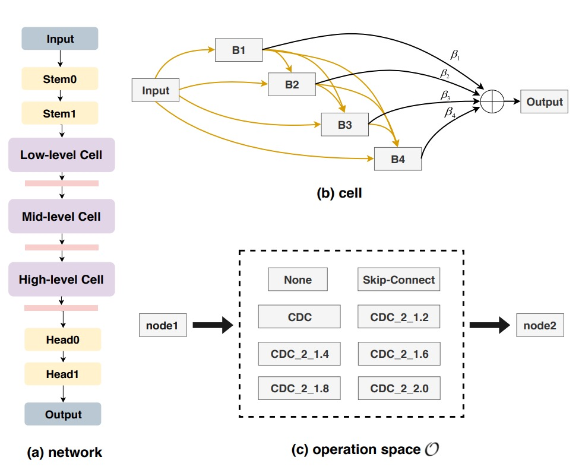
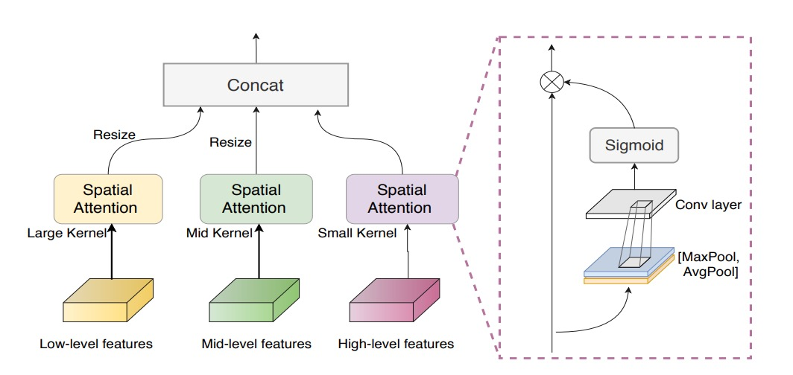
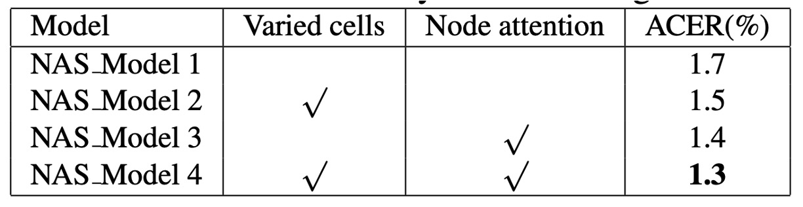
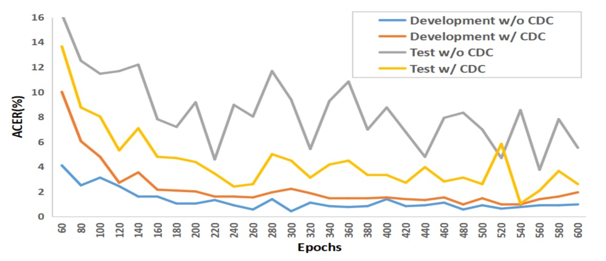

## 真與假的錯落之間

[**Searching Central Difference Convolutional Networks for Face Anti-Spoofing**](https://arxiv.org/abs/2003.04092)

---

人們以為只要模型夠深、資料夠多，系統就能自然分辨出「真實」與「仿冒」。

但我們或許錯過了更基礎的問題。

這次我們來看一篇非常有名的經典論文：CDCN。

## 定義問題

在人臉辨識成為通行標準的時代，活體偵測（Face Anti-Spoofing, FAS）逐漸轉變為身份驗證流程中的關鍵哨點。攻擊手法從高解析列印、影片翻播，到仿真的 3D 面具等，層出不窮。

面對這樣的對手，技術社群曾寄望於手工特徵的細膩：LBP、DoG、HOG、SIFT 等局部描述子，曾經捕捉過畫面裡那些人眼難辨的暗紋、干擾與印刷殘影。

可惜，這些方法對場景變化敏感、抗擾性低，無法與現代應用的需求匹配。

於是我們走向了深度學習，交由卷積神經網路（CNN）判別真與假的邊界。

但 CNN 的優勢，也正是它的盲點。

深層結構擅長抽象語意，卻對低階細節逐漸遺忘，特別是那些只有在特定光線與角度下才能顯現的晶格紋理、摩爾紋或反光邊緣之類。當環境稍有偏移、攝影裝置不同，這些模型不僅無法泛化，甚至可能將背景紋理或螢幕邊框誤認為活體特徵。

為了增補深層語意的缺口，有人開始嘗試引入深度圖作為輔助監督訊號，企圖讓模型學會更細緻的空間感知。但這些架構大多仍由專家手工設計，基於分類任務的骨幹（如 ResNet、VGG、DenseNet）原本就不是為 FAS 而生，泛化能力終究有限。

問題回到了一個根本點：如果卷積本身對細節不敏感，其他再高層的設計也難以彌補其視覺基底的失真。

> **那麼卷積本身，會不會就是那扇未曾開啟的門？**

## 解決問題

在開始之前，先來複習一下卷積的運算方式。

我們知道，標準的 2D 卷積可寫為：

$$
y(p_0) = \sum_{p_n \in R} w(p_n)\cdot x(p_0 + p_n)
$$

其中，$p_0$ 為輸出特徵圖的位置，$R$ 為感受野（例如 3×3）。

這種「局部加權求和」的思路，已經成為視覺任務的基石，卻在面對攻擊時，顯得不太夠用。因為那些極其細微的假象痕跡，往往不是存在於像素強度本身，而是隱匿在像素之間的落差裡。

### Central Difference Convolution (CDC)

<div align="center">
<figure style={{"width": "80%"}}>

</figure>
</div>

受到 LBP 的啟發，作者嘗試將「中心差分」導入捲積運算，令每次計算都包含「變化量」：

$$
y(p_0) = \sum_{p_n \in R} w(p_n)\cdot \bigl(x(p_0 + p_n) - x(p_0)\bigr)
$$

對比傳統卷積，這種做法的重點不再是「值多大」，而是「和中心差多少」。

就像在偵測任何細紋或突起時，我們更關心的或許是「邊緣」，而非「整體亮度」。

:::tip
就是邊緣檢測的意思。
:::

但純粹的中心差分有時失去了圖像本身的絕對資訊。

於是作者進一步提出一個混合形式：

$$
y(p_0) =
\theta \sum_{p_n \in R} w(p_n)\cdot \bigl(x(p_0 + p_n) - x(p_0)\bigr)
\;+\; (1 - \theta) \sum_{p_n \in R} w(p_n)\cdot x(p_0 + p_n)
$$

其中 $\theta\in[0,1]$ 為平衡係數：

- 當 $\theta=0$ 時，即退回原本的卷積操作；
- 當 $\theta=1$ 時，則是完全專注於差異量。

作者將這一混合式操作命名為 **CDC**（Central Difference Convolution），用來同時保留「強度」與「差分」的兩種訊息源。

為了方便實作，最終還可整理成下列形式：

$$
y(p_0) =
\sum_{p_n \in R} w(p_n) \cdot x(p_0 + p_n)
\;-\;\theta \cdot x(p_0) \sum_{p_n \in R} w(p_n)
$$

如此一來，在常見的深度學習框架 (PyTorch, TensorFlow) 裏，只需幾行程式碼即可將 CDC 無痛接入網路中，而不會增加額外的參數。

以下我們簡單實作一個 CDC 的卷積層，大概就是這樣：

```python
class Conv2dCD(nn.Module):

    def __init__(self, *, theta=0.7, bias=False, **conv_kwargs):
        super().__init__()
        self.theta = theta
        self.conv = nn.Conv2d(bias=bias, **conv_kwargs)

    def forward(self, x):
        out = self.conv(x) # 常規卷積

        if self.theta == 0:
            return out

        # 中心差分項

        # (C_out, C_in, 1, 1)
        k_sum = self.conv.weight.sum(dim=(2, 3), keepdim=True)
        out_diff = F.conv2d(x, k_sum, bias=None,
                            stride=self.conv.stride,
                            padding=0,
                            groups=self.conv.groups)

        return out - self.theta * out_diff
```

### CDC Networks

過去研究大多都會嘗試以「深度圖」作為輔助監督訊號，透過像素級的對比來強化活體判斷。

作者也參考這條思路，搭建了一個以 **DepthNet** 為雛形的網路骨幹，並將所有卷積替換為 CDC，形成 **Central Difference Convolutional Networks (CDCN)**。

- **網路輸入/輸出**：

  - 輸入：單幀 RGB 臉部圖像 (3×256×256)。
  - 輸出：預測的灰階深度圖 (32×32)。

- **特徵融合**：將低階、中階與高階特徵做級聯式整合，提升對臉部紋理與空間結構的捕捉能力。
- **超參數**：實驗中預設 $\theta=0.7$，側重於差分訊號，也保留一定程度的原始強度資訊。

損失函數的部分，為了更精細地監督偽裝痕跡，作者引入兩種損失：

1. **MSE 損失 $L_\text{MSE}$**：衡量預測深度圖與真實深度之間的平均平方誤差。
2. **對比深度損失 $L_\text{CDL}$**：輔助捕捉更細微的深度差異，讓模型能區分臉部邊緣的真實凹凸與印刷造成的假紋。

總體損失如下：

$$
L_{\text{overall}} = L_{\text{MSE}} + L_{\text{CDL}}.
$$

### CDCN++


然而，CDCN 的整體結構仍是由人工配置，未必達到任務最佳。

作者因此結合 **Neural Architecture Search (NAS)**，自動探尋最適合 FAS 的框架，最後形成一個進階版：**CDCN++**，如上圖所示。

以往的 NAS 通常用於影像分類或檢測，而這裡作者將它引入 **深度監督的 FAS 任務**。透過雙層優化 (bi-level optimization)，在訓練集與驗證集中來回微調權重與架構參數，如下圖所示：

<div align="center">
<figure style={{"width": "80%"}}>

</figure>
</div>

整個搜尋空間被拆成多個 cell，每個 cell 皆可包含 skip-connect、CDC 或 none 等候選操作，並引入 **node attention** 策略以自動判斷中間節點的重要性。

最終，系統會輸出一個最適合 FAS 的骨幹結構。

### Multiscale Attention Fusion Module

<div align="center">
<figure style={{"width": "80%"}}>

</figure>
</div>

即使擁有了 NAS 搜尋的骨幹，低階、中階、高階特徵之間若只是單純串接，仍可能忽略哪些空間區域更值得關注。

為了解決這個問題，作者導入 **多尺度注意力融合模組 (MAFM)**：

$$
F'_i = F_i \;\odot\; \Bigl[\sigma\Bigl(C_i\bigl(\bigl[\mathrm{A}(F_i),\,\mathrm{M}(F_i)\bigr]\bigr)\Bigr)\Bigr]
,\quad i \in \{\text{low},\,\text{mid},\,\text{high}\},
$$

其中 $\odot$ 表示 Hadamard 乘法（元素對應相乘），$\mathrm{A}$ 與 $\mathrm{M}$ 分別代表對輸入特徵圖的平均池化與最大池化，$\sigma$ 為 sigmoid 函數，而 $C_i$ 則為卷積操作。

最終，CDCN++ 結合了 **「差分卷積」＋「NAS 搜尋骨幹」＋「多尺度注意力融合」**，並以深度監督為驅動，達到了高精度與高泛化力兼備的效果。

## 討論

作者在六個公開資料庫上進行評估，包括高解析度（OULU-NPU、SiW）與低解析度（CASIA-MFSD、Replay-Attack、MSU-MFSD），並搭配 SiW-M 進行未知攻擊型態的交叉測試。

根據資料庫與場景的不同，採用 ACER、HTER、AUC 與 EER 等指標來衡量模型辨識效能，以及在未知環境中的泛化能力。

在訓練階段，作者以 PyTorch 為主，Adam 為優化器，預先生成的臉部深度圖（利用 PRNet）作為監督訊號。模型輸出為單幀臉部的深度預測，再取其平均值做最終分類分數。除非特別說明，所有實驗均維持 $\theta=0.7$ 作為 CDC 的預設配置。

### CDC 參數的影響

<div align="center">
<figure style={{"width": "80%"}}>

</figure>
</div>

1. **$\theta$ 的重要性**

   如上圖 (a) 所示，$\theta$ 與模型效能呈非線性關係，當 $\theta > 0.3$ 時，CDCN 在 OULU-NPU Protocol-1 上的 ACER 即顯著優於 $\theta=0$（即純卷積，ACER = 3.8%）。

   在 $\theta=0.7$ 時表現最佳，ACER 僅 1.0%。由此可知，**適度加權的中心差分** 有助於模型提取細微紋理，減少在不同光照與裝置條件下的特徵偏移。

2. **與其他卷積運算的比較**

   圖 (b) 中進一步顯示，本研究提出的 CDC 顯著優於常見的 Local Binary Convolution 與 Gabor Convolution 等做法。LBConv 雖亦能帶來一定成效，但仍不及 CDC，顯示「梯度資訊 + 強度資訊」的混合形式更加適配人臉偵測中的高敏感度需求。

### NAS 與 MAFM 的貢獻

<div align="center">
<figure style={{"width": "70%"}}>

</figure>
</div>

根據實驗結果，在 NAS 訓練階段，若同時啟用 varied cells 及 node attention，能明顯提高搜尋品質。

作者解釋，這是因為 FAS 任務需要在多層級（low, mid, high）各自學習到最適合的細節提取與語意融合，因此讓每層 cell 有自主設計空間，並在輸出端透過 node attention 選擇最具判別力的節點，更符合人類視覺系統的層次加工特性。

將搜尋得到的骨幹直接多層級融合，已優於未使用 NAS 的基線，但還是存在可以優化的空間，如下表所示：

<div align="center">
<figure style={{"width": "70%"}}>

</figure>
</div>

進一步加入 MAFM 時，ACER 還能再下降 0.5%，顯示在空間域中施加差異化注意力，特別是使用適當 kernel 大小（如 7×7, 3×3），可顯著提升對臉部區域「何處該多看一眼」的判別能力。

### OULU-NPU 的表現

<div align="center">
<figure style={{"width": "70%"}}>

</figure>
</div>

OULU-NPU 的結果如上表，CDCN++ 在四個 Protocol 中皆取得最低的 ACER（最低 0.2%，最高 5.0%），並且同樣在 SiW 的三個 Protocol 上表現拔群。

相較於需要多幀動態特徵的先進方法（如 STASN、Auxiliary），CDCN++ 只需單幀資料即可達到或超越最佳水準，更具即時部署的潛力。

### 跨資料集的泛化能力

<div align="center">
<figure style={{"width": "70%"}}>

</figure>
</div>

本研究在面對陌生攻擊型態（SiW-M 共 13 種攻擊）以及跨資料庫的情境下，CDC 架構依舊展現了優秀的泛化能力。

在 CASIA-MFSD → Replay-Attack（CR）中，CDCN++ 的 HTER 僅 6.5%，較過去最先進方法降低了約 11%。此結果印證了「局部梯度差分」對應付未知環境、未知偽裝時的穩定性。

### 分析與可視化

<div align="center">
<figure style={{"width": "80%"}}>

</figure>
</div>

上圖為作者在 OULU-NPU Protocol-1 中的實驗結果。

原始的卷積操作很容易在開發集上過擬合，但在測試集上表現不佳；而 CDC 模型的開發集曲線與測試集曲線幾乎平行，展現出對不同光照、環境轉換的抗干擾能力。

<div align="center">
<figure style={{"width": "80%"}}>

</figure>
</div>

作者進一步利用 t-SNE 可視化 CDC 前後的特徵分佈。相較之下，CDC 能讓真人與假臉的表示更明顯群聚，反映其能更有效「分離」臉部真偽。

至於多尺度注意力模組 MAFM 的熱力圖則揭示，低階特徵更廣義關注輪廓與亮度區域，高階特徵則聚焦於臉部關鍵細節（如鼻翼、眼周），兩者互補大幅增強了最終辨識力。

## 結論

這篇論文的核心假設，是一種極具象徵性的手工解耦：

> **假象，應該會在局部梯度中留下異常。**

這既是一種設計上的簡化，也是一種直覺上的觀察。

如果真實的臉是連續的、細膩的、有立體深度的，那麼被重製的偽裝，無論如何總會在邊緣、紋理、反射處，出現某種「差」。

CDC 所做的，不過是將這樣的差異提取出來，用一種可控、可解釋的方式，嵌入卷積操作本身。從這個角度看，**它是對 spoof trace 的人工定義式特徵解耦**，比起後來自動分離潛變因的架構來得原始，但也更具方法論意識：不是強化辨識，而是拆解語法。

這種「先解耦，再辨識」的技術態度，後來在風格轉換、特徵分離、跨域泛化中被不斷重複，只是形式變了，語言變了，初衷被包裝成更漂亮的術語。

而 CDC，就是那個試圖去描摹「差異形狀」的早期工具之一。
